# レポート ページのサイズを変更する (チュートリアル)
[前の記事とビデオ](power-bi-report-display-settings.md)では、Power BI レポートでページ表示を制御するための **[表示]** と **[ページ サイズ]** という 2 つの異なる方法について説明しました。 ページ表示とページ サイズは Power BI サービスと Power BI Desktop の両方で使うことができ、見た目と機能はほとんど同じですが、このチュートリアルでは Power BI サービスを使います。

### 前提条件
- Power BI サービス   
- [小売りの分析のサンプル レポート](sample-retail-analysis.md)

## まずページの [表示] の設定を変更する

1. 読み取りビューまたは編集ビューでレポートを開き、**[New Stores]** のレポート タブを選びます。 既定では、このレポート ページは **[ページに合わせる]** の設定を使って表示されます。  この場合、\[Fit to Page] \(ページに合わせる) ではレポート ページがスクロールバーなしで表示されますが、一部の詳細やタイトルは小さすぎて読めない場合があります。

   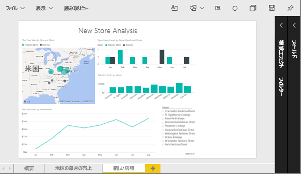
2. キャンバス上で視覚化が選択されていないことを確認します。 **[表示]** を選択して、各表示オプションを確認します。

    * 読み取りビューでは次のように表示されます。

     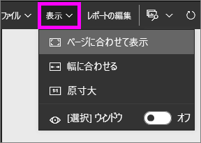
    * 編集ビューでは次のように表示されます。

    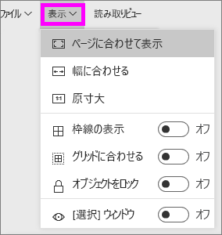

1. **[実際のサイズ]** 設定を使用して、ページの外観を確認してみましょう。

   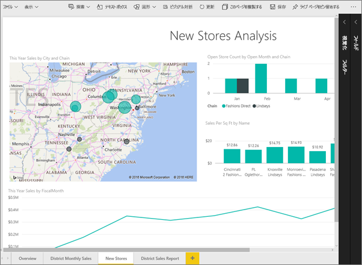

   ダッシュボードのスクロール バーが二重になっていて、改善が必要です。
2. **[幅に合わせる]**に切り替えます。

   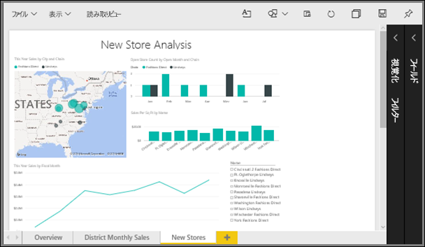

   スクロールバーは表示されていますが、詳細は読みやすくなっており、外観は改善されています。

## レポート ページの既定のビューを変更する
レポートの "*作成者*" は、レポート ページの既定の表示を変更することができます。 レポートを他のユーザーと共有すると、レポート ページは作成者が設定した表示を使って開きます。 レポートの "*利用者*" は表示を変更できますが、レポートを終了するときにその変更を保存することはできません。

1. レポートの **[New Stores]** ページで、**[実際のサイズ]** ビューに切り替えます。

   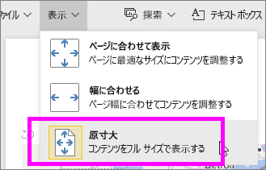

2. **[District Monthly Sales]** レポート ページで、[表示] を **[幅に合わせる]** に設定します。

3. **[概要]** レポート ページは、既定の [表示] 設定のままにします。

4. この状態で、**[ファイル] > [保存]** を選んでレポートを保存します。 このレポートを次に開いたとき、ページは新しい [表示] 設定を使って表示されます。 確認してみましょう。

   
3. 上部ナビゲーション バーで現在のワークスペースの名前を選び、そのワークスペースに戻ります。  

   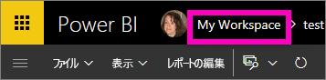
4. **[レポート]** タブを選び、同じレポート (小売りの分析のサンプル) を選びます。

    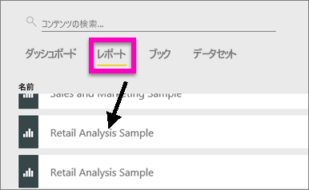
5. レポートの各ページを開いて、新しい設定を確認します。

   

## 次は*ページ サイズ*設定を変更する
ページ サイズの設定は[編集ビュー](service-interact-with-a-report-in-editing-view.md)でのみ使用できるので、ページ サイズの設定を変更するには、レポートに対する編集 ("*作成者*") アクセス許可が必要です。 いずれかの[サンプル](sample-datasets.md)に接続している場合は、そのレポートの "*作成者*" アクセス許可を持っています。

1. [小売りの分析のサンプル](sample-retail-analysis.md)の \[District Monthly Sales] \(地域の毎月の売上) ページを編集ビューで開きます。
2. キャンバス上で視覚化が選択されていないことを確認します。  **[視覚化]** ウィンドウで、ペイント ローラー アイコン  を選びます。
3. **[ページ サイズ]** &gt; **[タイプ]** の順に選択して、ページ サイズのオプションを表示します。

   
4. **[レター]**を選択します。  キャンバス上で、816 x 1056 ピクセル (レター サイズ) 内に収まるコンテンツだけがキャンバスの白い部分に残ります。

   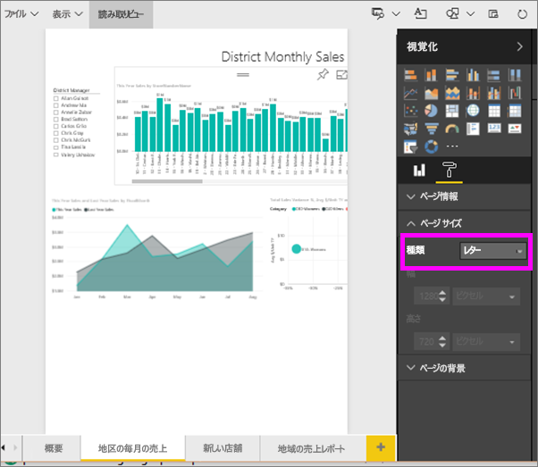
5. **[ページ サイズ]** で **[16:9]** の比率を選びます。

   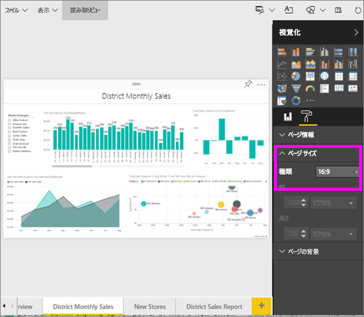

   レポート ページは、横 16 : 縦 9 の比率を使用して表示されます。 使用される実際のピクセルのサイズを確認するには、灰色表示の [幅] フィールドと [高さ] フィールド (1280x720) を調べます。 レポート キャンバスの周囲には空の領域がかなりあります。これは、前に **[表示]** を [幅に合わせる] に設定したためです。
7. **[ページ サイズ]** のオプションをさらにいろいろ試してみてください。

## ページの [表示] と [ページ サイズ] をともに使用する
ページの [表示] と [ページ サイズ] をともに使って、同僚と共有したとき、または別のアプリケーションに埋め込んだときに、適切に表示されるレポートを作成します。

この演習では、幅 500 ピクセル、高さ 750 ピクセルの領域があるアプリケーションに表示されるレポート ページを作成します。

前の手順で見たように、現在のレポート ページは幅 1280 ピクセル、高さ 720 ピクセルで表示されます。 すべてのビジュアルをその領域に合わせるには、サイズ変更と再配置を何度も実行する必要があります。

1. ビジュアルが現在のキャンバス領域の半分より少ない領域に収まるように、ビジュアルのサイズ変更と移動を行います。

    
2. **[ページ サイズ]** &gt; **[カスタム]** を選択します。
3. [幅] を 500、[高さ] を 750 に設定します。

    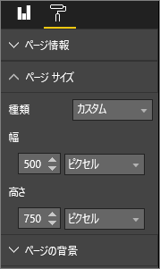
4. 表示が最良の状態になるように、レポート ページを調整します。 **[表示] > [実際のサイズ]** と **[表示] > [ページに合わせる]** を切り替えて調整します。

    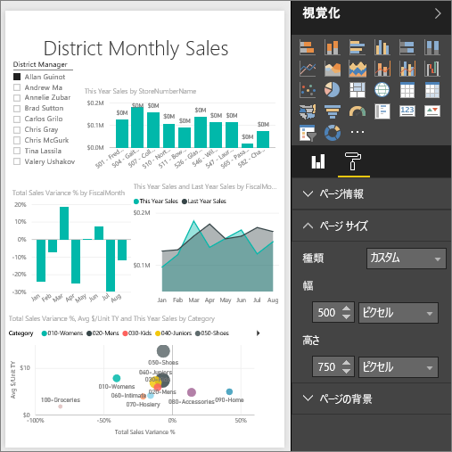

## 次の手順
[Cortana 用レポートの作成](service-cortana-answer-cards.md)

「[Power BI レポートのページ表示設定](power-bi-report-display-settings.md)」に戻る

他にわからないことがある場合は、 [Power BI コミュニティを利用してください](http://community.powerbi.com/)。
