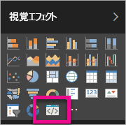

# Power BI カスタム ビジュアルのトラブルシューティング

## デバッグ

**Pbiviz コマンドが見つかりません (または類似のエラー)**

ターミナルのコマンド ラインで `pbiviz` を実行すると、ヘルプ画面が表示されるはずです。 ヘルプ画面が表示されない場合、コマンドは正しくインストールされていません。 バージョン 4.0 以降の NodeJS がインストールされていることを確認します。

**[視覚化] タブで "ビジュアルのデバッグ" が見つかりません**

"ビジュアルのデバッグ" は、[**視覚化**] タブ内でプロンプト アイコンのように表示されます。

表示されない場合は、Power BI の設定内で有効にされていることを確認してください。

> [!NOTE]
> ビジュアルのデバッグ機能は、現時点では、Power BI サービスでのみ使用可能で、Power BI Desktop とモバイル アプリでは使用できません。 パッケージ化したビジュアルはあらゆる場所で機能します。

**ビジュアル サーバーに接続できません**

ビジュアル プロジェクトのルートから、ターミナルのコマンド ラインで `pbiviz start` コマンドを使用してビジュアル サーバーを実行します。 サーバーが動作していない場合、SSL 証明書が正しくインストールされていない可能性があります。

ご質問、ご意見、問題がございましたら、カスタム ビジュアルのサポート チームまでお気軽にお問い合わせください。アドレスは  *pbicvsupport@microsoft.com*  です。

## 次の手順

詳細については、[Power BI カスタム ビジュアルに関してよく寄せられる質問](power-bi-custom-visuals-faq.md#organizational-custom-visuals)のページにアクセスしてください。
