# Power BI でのカスタム ビジュアル

Power BI レポートを作成または編集するときには、さまざまな種類のビジュアルを使用できます。 このようなビジュアルは **[視覚化]** ウィンドウに表示されます。 Power BI Desktop をダウンロードしたり、Power BI サービス (app.powerbi.com) を開いたりすると、このビジュアルのセットが "事前にパッケージ化" されます。

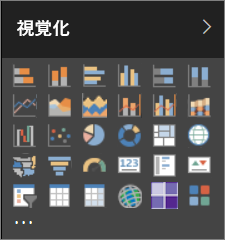

ただし、このビジュアルのセットに制限されるわけではなく、省略記号を選択すると、別のレポート ビジュアルのソース (*カスタム ビジュアル*) が表示されます。

カスタム ビジュアルは開発者がカスタム ビジュアル SDK を利用して作成します。ビジネス ユーザーにとって、そのビジネスに最適な形式でデータが表示されるようにするのがその目的です。 作成後、レポート作成者はカスタム ビジュアル ファイルを自分のレポートにインポートし、他の Power BI ビジュアルと同様に利用できます。 カスタム ビジュアルは Power BI で最も重要視されており、フィルター処理、強調表示、編集、共有などの操作が可能になっています。

カスタム ビジュアルの展開チャネルには 3 つの形式があります。
* カスタム ビジュアル ファイル
* 組織のビジュアル
* Marketplace ビジュアル

## カスタム ビジュアル ファイル

カスタム ビジュアルはパッケージであり、特定の目的を果たすデータをレンダリングするためのコードが含まれています。 カスタム ビジュアルは誰でも作成し、単一の `.pbiviz` ファイルとしてパッケージ化できます。このファイルは Power BI レポートにインポートできます。

> [!WARNING]
> カスタム ビジュアルには、セキュリティやプライバシー上のリスクを伴うコードが含まれている可能性があります。レポートにインポートする前に、カスタム ビジュアルの作成者とソースが信頼できることを確認してください。

## 組織のビジュアル

Power BI 管理者はカスタム ビジュアルを組織に展開できるので、管理者が組織内での使用を認めたカスタム ビジュアルをレポート作成者が簡単に見つけて、使用することができます。 管理者は組織内で展開するカスタム ビジュアルを選択できます。また、ビジュアルの管理 (バージョン更新、無効化/有効化など) が簡単になります。 レポート作成者にとっては、組織に特有のビジュアルを簡単に見つけることができます。また、ビジュアルの更新がシームレスにサポートされます。

組織のカスタム ビジュアルについては、[詳細](power-bi-custom-visuals-organization.md)ページをご覧ください。

## Marketplace ビジュアル

コミュニティのメンバーと Microsoft はカスタム ビジュアルを公共の利益のために提供しており、[AppSource](https://appsource.microsoft.com/en-us/marketplace/apps?product=power-bi-visuals) マーケットプレースに公開しています。 このようなビジュアルはダウンロードして、Power BI レポートに追加することができます。 このようなカスタム ビジュアルはすべて、Microsoft が機能と品質をテストし、承認しています。

AppSource とは 簡単に言えば、Microsoft のソフトウェアのアプリ、アドイン、拡張機能を検索できる場所です。 [AppSource](https://appsource.microsoft.com/en-us/) は、Office 365、Azure、Dynamics 365、Cortana、Power BI などの製品の何百万人もの Office 365 ユーザーを、これまでより効率よく、より洞察的で美しい仕事をするのに役立つソリューションに結び付けます。

### 認定済みビジュアル

Power BI 認定済みビジュアルは品質に関する厳格な追加テストに合格したマーケットプレース ビジュアルであり、[電子メール サブスクリプション](https://docs.microsoft.com/power-bi/service-report-subscribe)や [PowerPoint へのエクスポート](https://docs.microsoft.com/power-bi/service-publish-to-powerpoint)などの追加のシナリオに対応しています。
認定済みカスタム ビジュアルの一覧の表示またはカスタム ビジュアルの申請については、「[Certified custom visuals](https://docs.microsoft.com/power-bi/power-bi-custom-visuals-certified)」 (認定済みカスタム ビジュアル) をご覧ください。

独自の視覚エフェクトを作成して AppSource に追加することに興味がある Web 開発者の方は、 「[開発者ツールの概要](https://docs.microsoft.com/power-bi/service-custom-visuals-getting-started-with-developer-tools)」を参照し、[AppSource にカスタム ビジュアルを公開する](https://appsource.microsoft.com/en-us/marketplace/apps?product=power-bi-visuals)方法を学習してください。

### カスタム ビジュアルをファイルからインポートする

1. [視覚化] ウィンドウの下部にある省略記号を選択します。

    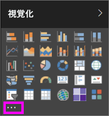

2. ドロップダウンで **[ファイルからインポートする]** を選択します。

    

3. [ファイルを開く] メニューで、インポートする `.pbiviz` ファイルを選び、[開く] を選択します。 カスタム ビジュアルのアイコンが [視覚化] ウィンドウの下部に追加され、レポートで使用できるようになりました。

    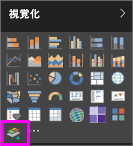

### 組織のビジュアルをインポートする

1. [視覚化] ウィンドウの下部にある省略記号を選択します。

    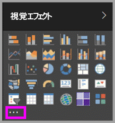

2. ドロップダウンで [Marketplace からインポートする] を選択します。

    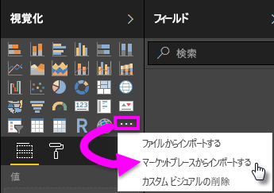

3. 一番上のタブ メニューから **[自分の所属組織]** を選択します。

    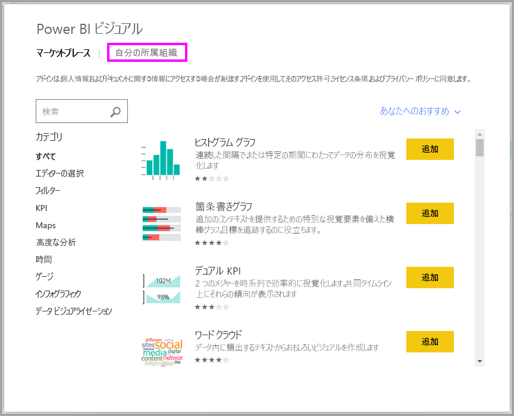

4. 一覧をスクロールして、インポートするビジュアルを探します。
    
    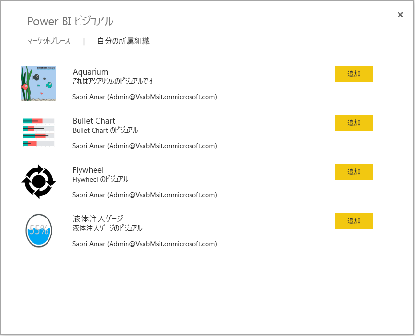

5. **[追加]** を選択して、カスタム ビジュアルをインポートします。 カスタム ビジュアルのアイコンが [視覚化] ウィンドウの下部に追加され、レポートで使用できるようになりました。

    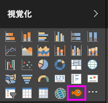

## Microsoft AppSource からカスタム ビジュアルをダウンロードまたはインポートする

カスタム ビジュアルをダウンロードおよびインポートする場合、Power BI と AppSource Web サイトの 2 つのオプションを使用できます。

### Power BI からカスタム ビジュアルをインポートする

1. [視覚化] ウィンドウの下部にある省略記号を選択します。

    

2. ドロップダウンで **[Marketplace からインポートする]** を選択します。

    

3. 一覧をスクロールして、インポートするビジュアルを探します。

    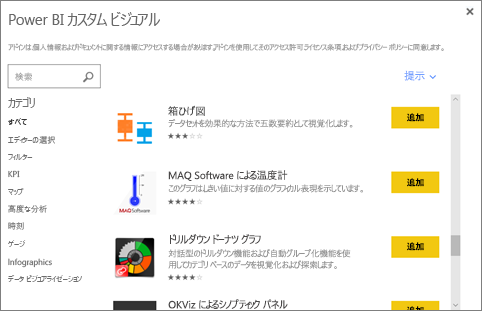

4. 各ビジュアルの詳細を確認するには、ビジュアルを強調表示して選択します。

    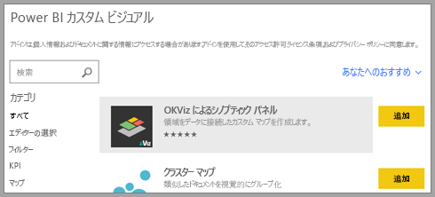

5. 詳細ページでは、スクリーンショット、ビデオ、詳細な説明、その他を見ることができます。

    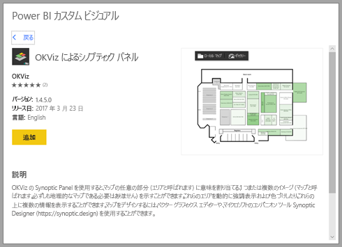

6. レビューを表示するには最下部までスクロールします。

    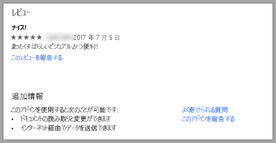

7. [追加] を選択して、カスタム ビジュアルをインポートします。 カスタム ビジュアルのアイコンが [視覚化] ウィンドウの下部に追加され、レポートで使用できるようになりました。

    

### Microsoft AppSource からカスタム ビジュアルをダウンロードおよびインポートする

1. [Microsoft AppSource](https://appsource.microsoft.com) から、**[アプリ]** のタブを選択します。 

    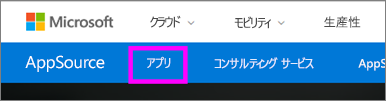

2. このタブから[アプリの結果ページ](https://appsource.microsoft.com/en-us/marketplace/apps)に移動し、*[Power BI apps]* を含めた各カテゴリの上位アプリを確認できます。 今はカスタム ビジュアルを検索しているので、左側のナビゲーション リストから **[Power BI visuals]** を選択して結果を絞り込みます。

    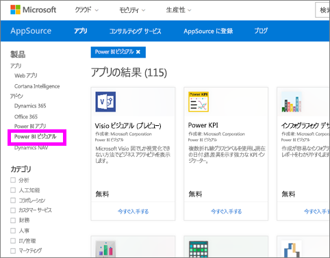

3. AppSource に、各カスタム ビジュアルのタイルが表示されます。  各タイルにはカスタム ビジュアルのスナップショットが含まれ、簡単な説明と、ダウンロードのリンクがあります。 詳細を表示するには、タイルを選択します。

    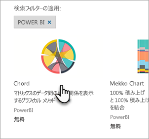

4. 詳細ページでは、スクリーンショット、ビデオ、詳細な説明、その他を見ることができます。 **[今すぐ入手する]** を選択し、利用規約に同意して、カスタム ビジュアルをダウンロードします。

    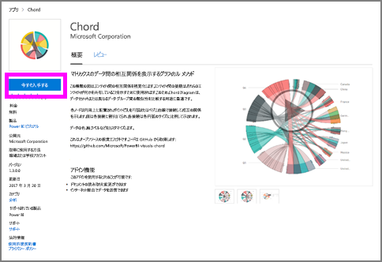

5. カスタム ビジュアルをダウンロードするリンクを選択します。

    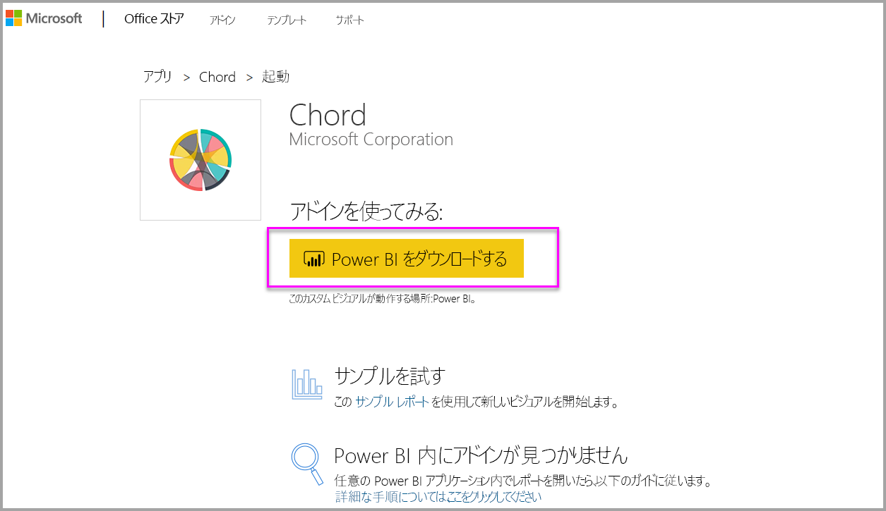

    ダウンロードのページには、Power BI Desktop と Power BI サービスにカスタム ビジュアルをインポートする方法についての説明もあります。

    カスタム ビジュアルが含まれ、その機能を見ることができる、サンプル レポートをダウンロードすることもできます。

    

6. '.pbiviz' ファイルを保存し、Power BI を開きます。

7. レポートに '.pbiviz' ファイルをインポートします (上の「[カスタム ビジュアルをファイルからインポートする](#import-a-custom-visuals-from-a-file)」セクション参照)。

## 考慮事項とトラブルシューティング

- カスタム ビジュアルをインポートすると、特定のレポートに追加されます。 ビジュアルを別のレポートで使用する場合は、そのレポートにもインポートする必要があります。 カスタム ビジュアルを含むレポートを **[名前を付けて保存]** オプションで保存すると、カスタム ビジュアルのコピーが新しいレポートと共に保存されます。

- **[視覚化]** ウィンドウが表示されない場合、レポートを編集するアクセス許可がないことを意味します。  カスタム ビジュアルは編集できるレポートにのみ追加でき、共有されているレポートには追加できません。

他にわからないことがある場合は、 [Power BI コミュニティを利用してください](http://community.powerbi.com/)。
