# レポート フィルター ウィンドウの使用方法
この記事は、レポート フィルター ウィンドウについて詳しく説明します。 [Power BI サービスの編集ビューと読み取りビュー](service-reading-view-and-editing-view.md)および [Power BI Desktop のレポート ビュー](desktop-report-view.md)にウィンドウが表示されます。

Power BI でデータをフィルター処理するには、さまざまな方法があります。最初に「[フィルター処理と強調表示](power-bi-reports-filters-and-highlighting.md)」をお読みになることをおすすめします。

## レポート フィルター ウィンドウの操作
Power BI Desktop では、レポートはレポート ビューで開かれます。 Power BI サービスでは、レポートは[編集ビューまたは読み取りビュー](service-reading-view-and-editing-view.md)で開くことができます。 編集ビュー、および Desktop のレポート ビューでは、レポート所有者は[レポートにフィルターを追加](power-bi-report-add-filter.md)できます。そのフィルターはレポートと共に保存されます。 読み取りビューでレポートを表示するユーザーは、フィルターを編集できますが、新しいフィルターをレポートに追加することはできません。

Power BI サービスでは、フィルター ウィンドウで行う変更がすべてレポートで保持され、その変更はモバイル バージョンのレポートに反映されます。 フィルター ウィンドウを作成者の既定値にリセットするには、上部のメニューバーから **[既定値にリセット]** を選択します。     

## フィルター ウィンドウを開く
レポートを開くと、レポート キャンバスの右側にフィルター ウィンドウが表示されます。 ウィンドウが表示されない場合は、右上隅にある矢印を選択すると開きます。 Power BI サービスの読み取りビューの場合、右側に表示されるのはフィルター ウィンドウのみです。

この例で選択したビジュアルには 6 個のフィルターがあります。 レポート ページにもフィルターが適用されていて、**[ページ レベル フィルター]** という見出しの下に表示されています。 [ドリルスルー フィルター](power-bi-report-add-filter.md)が 1 つあり、レポート全体にも "**FiscalYear** is 2013 or 2014" というフィルターがあります。

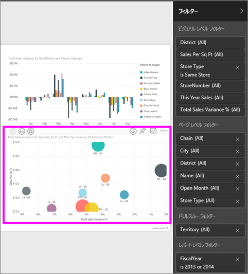

いくつかのフィルターの横に **[All]** と表示されているのは、すべての値がフィルターに含まれることを意味します。  たとえば、次のスクリーンショットの **[Chain(All)]** は、このレポート ページにすべてのストア チェーンに関するデータが含まれることを示します。  一方、レポート レベル フィルターの **[FiscalYear is 2013 or 2014]** は、レポートに 2013 年および 2014 年の会計年度のデータのみが含まれることを示します。

このレポートを表示するユーザーは、だれでもこれらのフィルターを操作できます。

* フィルターの詳細を表示するには、フィルターの横にある矢印の上にカーソルを置いて選択します。
  
   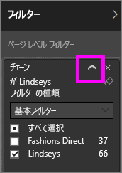
* フィルターを変更します。たとえば、**[Lindseys]** を **[Fashions Direct]** に変更します。
  
     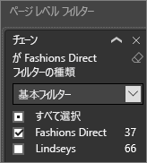

* 上部のメニューバーから **[既定値にリセット]** を選択して、フィルターを元の状態にリセットします。    
    
    
* フィルター名の横の **[x]** を選択してフィルターを削除します。
  
  フィルターを削除すると一覧に表示されなくなりますが、レポートからデータが削除されることはありません。  たとえば、**FiscalYear is 2013 or 2014** フィルターを削除すると、会計年度のデータはレポートにまだ残っていますが、2013 年と 2014 年だけ表示されるようにフィルター処理されることはなくなります。データに含まれるすべての会計年度が表示されます。  ただし、フィルターを削除すると、一覧から削除されるので再び変更することはできません。 もっとよい方法は、消しゴム アイコン  を選択してフィルターをクリアすることです。
  
  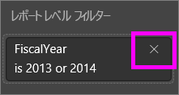

## 編集ビューでのフィルター
レポートを Desktop または Power BI サービスの編集ビューで開くと、レポート キャンバス右側の**視覚化ウィンドウ**の下半分にフィルター ウィンドウが表示されます。 ウィンドウが表示されない場合は、右上隅にある矢印を選択すると開きます。

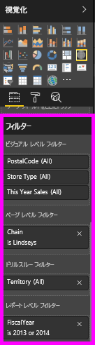  

キャンバスでビジュアルが選択されていない場合、[フィルター] ウィンドウには、レポート ページ全体またはレポート全体に適用されるフィルターと、ドリルスルー フィルター (設定されている場合) のみが表示されます。 次の例では、ビジュアルが選択されておらず、ページ レベル フィルターまたはドリルスルー フィルターはありませんが、レポート レベル フィルターはあります。  

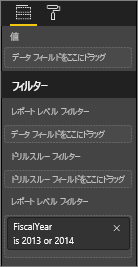  

キャンバスでビジュアルが選択されている場合、そのビジュアルのみに適用されるフィルターも表示されます。   

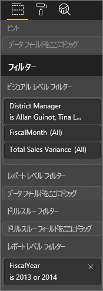

特定のフィルターのオプションを表示するには、フィルター名の横にある下矢印を選択します。  次の例では、レポート レベル フィルターが 2013 年および 2014年に設定されています。 これは、**基本的なフィルター処理**の例です。  高度なオプションを表示するには、**[高度なフィルター処理]** を選択します。

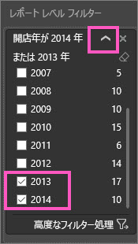

## フィルターのクリア
 フィルター モードが詳細であっても基本であっても、消しゴム アイコン  を選択するとフィルターがクリアされます。 

## フィルターの追加
* Desktop、および Power BI サービスの編集ビューでビジュアル、ページ、ドリルスルー、またはレポートにフィルターを追加するには、フィールド ウィンドウからフィールドを選択し、適切なフィルター (**[Drag fields here]\(フィールドをここにドラッグ\)** と表示されています) にドラッグします。 フィルターとしてフィールドを追加した後は、[基本フィルター] および [高度なフィルター処理] のコントロール (後述) を使用して微調整します。

- **新しいフィールドをビジュアル レベル フィルター領域にドラッグしてもビジュアルにフィールドは追加されません**が、この新しいフィールドでビジュアルをフィルター処理できます。 次の例では、**Chain** が新しいフィルターとしてビジュアルに追加されます。 フィルターとして **Chain** を追加しただけでは、基本フィルターまたは高度なフィルターのコントロールを使用するまでビジュアルは変化しないことに注意してください。

    

* 視覚化の作成に使われているフィールドはすべて、フィルターとしても使うことができます。 最初に、ビジュアルを選んでアクティブにします。 ビジュアルで使用されているフィールドが、視覚化ウィンドウと、[フィルター] ウィンドウの **[ビジュアル レベル フィルター]** の見出しの下に一覧表示されます。
  
   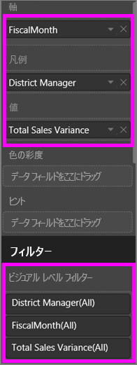  
  
   [基本フィルター] および [高度なフィルター処理] のコントロール (後述) を使用して、フィールドを微調整します。

## フィルターの種類: テキスト フィールド フィルター
### 一覧モード
チェックボックスをクリックすると、値の選択と選択解除を切り替えられます。 **[すべて]** チェックボックスを使用すると、すべてのチェックボックスの状態をオンまたはオフに切り替えられます。 チェックボックスは、そのフィールドの使用可能なすべての値を表します。  フィルターを調整すると、選択内容を反映して説明文が更新されます。 

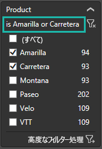

説明文が 「is Amarilla or Carretera」(Amarilla または Carretera です) に変わっています。

### 詳細モード
**[詳細なフィルタリング]** を選択して、詳細モードに切り替えます。 ドロップダウン コントロールとテキスト ボックスを使用して、含めるフィールドを識別します。 **[AND]** および **[OR]** を選択すると、複雑なフィルター式を作成できます。 必要な値を設定したら、 **[フィルターの適用]** ボタンを選択します。  

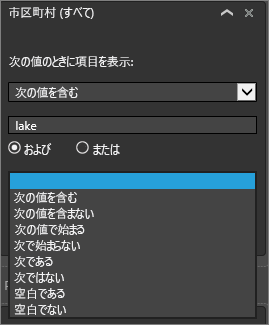

## フィルターの種類: 数値フィールド フィルター
### 一覧モード
値が有限の場合は、フィールド名を選択すると、一覧が表示されます。  チェックボックスの使用方法については、上記の「**テキスト フィールド フィルター**」の「**一覧モード**」を参照してください。   

### 詳細モード
値が無限である場合、または範囲を表している場合は、フィールド名を選択すると、詳細フィルター モードが開きます。 ドロップダウンおよびテキスト ボックスを使用して、表示する値の範囲を指定します。 

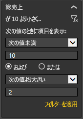

**[AND]** および **[OR]** を選択すると、複雑なフィルター式を作成できます。 必要な値を設定したら、 **[フィルターの適用]** ボタンを選択します。

## フィルターの種類: 日付と時刻
### 一覧モード
値が有限の場合は、フィールド名を選択すると、一覧が表示されます。  チェックボックスの使用方法については、上記の「**テキスト フィールド フィルター**」の「**一覧モード**」を参照してください。   

### 詳細モード
フィールドの値が日付または時刻を表している場合は、日付/時刻フィルターを使用するときに、開始/終了時刻を指定できます。  

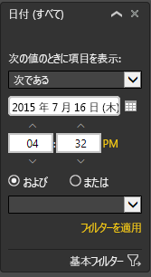

## 次の手順
[レポート内のフィルターと強調表示](power-bi-reports-filters-and-highlighting.md)  
[レポートの読み取りビューでのフィルターとの対話と強調表示](service-reading-view-and-editing-view.md)  
[レポートの編集ビューでのフィルターの作成](power-bi-report-add-filter.md)  
[レポートのビジュアル相互間のクロスフィルター処理とクロス強調表示を変更する方法](service-reports-visual-interactions.md)

[Power BI のレポート](service-reports.md)で詳細を確認する  
[Power BI - 基本的な概念](service-basic-concepts.md)

他にわからないことがある場合は、 [Power BI コミュニティを利用してください](http://community.powerbi.com/)。

