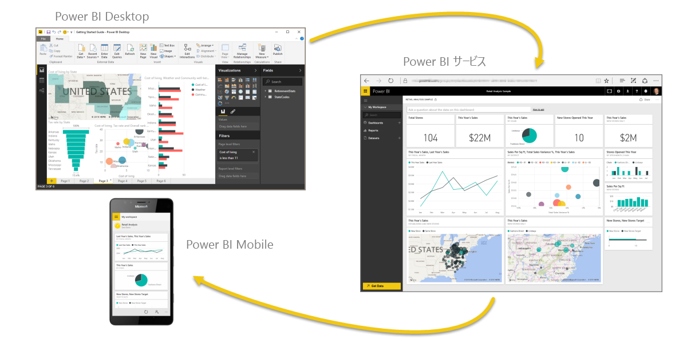

# Power BI とは?
**Power BI** はソフトウェア サービス、アプリ、コネクタのコレクションで、これらを組み合わせることで、関連性のないデータ ソースから、まとまりがあり、実体験的な対話型洞察を得ることができます。 Excel スプレッドシートや、クラウド ベースとオンプレミスのハイブリッド データ ウェアハウスのコレクションなど、さまざまなデータを使えます。 **Power BI** を使うと、データ ソースへの接続、重要事項の視覚化と検出、他のユーザーとの共有を、簡単に実行できます。

**Power BI** はシンプルで高速です。つまり、Excel スプレッドシートやローカル データベースから洞察をすばやく作成できます。 同時に、**Power BI** は堅牢なエンタープライス クラスなので、広範なモデリング、リアルタイム分析、およびカスタム開発の準備もできています。 そのため、これは個人用のレポートおよび視覚化ツールとして使えます。 また、グループ プロジェクトや部門、会社全体の分析および意思決定用エンジンとしても使えます。

## Power BI の構成要素
Power BI は、**Power BI Desktop** と呼ばれる Windows デスクトップ アプリケーション、**Power BI サービス**と呼ばれるオンラインの SaaS ("*サービスとしてのソフトウェア*") サービス、および Windows、iOS、Android デバイス用の Power BI **モバイル アプリ**で構成されています。

この 3 つの要素 – **Power BI Desktop**、**サービス**、**モバイル アプリ** – は、ユーザー (またはそのロール) に対して最も効果的な方法で、ビジネス上の分析情報を作成、共有、使用できるように設計されています。

4 番目の要素である **Power BI Report Server** を使うと、Power BI Desktop で Power BI レポートを作成した後、それをオンプレミスのレポート サーバーに発行できます。 [Power BI レポート サーバー](#on-premises-reporting-with-power-bi-report-server)の詳細をお読みください。

## Power BI とロールの対応
Power BI の使用方法は、プロジェクトまたはチームにおけるユーザーのロールによって異なる場合があります。 ロールが異なれば Power BI の使用方法も異なる可能性がありますが、何も問題はありません。

たとえば、ご自分では **Power BI サービス**を主に使うかもしれません。 しかし、大量の計算を行ってビジネス レポートを作成する同僚は、レポートを作成し、そのレポートをあなたが確認できる Power BI サービスに発行するために、**Power BI Desktop** を重点的に使うかもしれません。 営業担当の別の同僚は、売上ノルマの達成状況の観察や、新しい潜在顧客の詳細を確認するために、Power BI のスマートフォン アプリを主に使うかもしれません。

開発者であれば、Power BI API を使用してデータをデータセットにプッシュしたり、ダッシュボードとレポートをカスタム アプリケーションに埋め込んだりする可能性があります。 新しいビジュアルのアイデアがあれば、 それを自分で作成して、他のユーザーと共有できます。  

また、作業の目的や、特定のプロジェクトにおけるご自分のロールに応じて、**Power BI** の各要素をさまざまなタイミングで使い分ける場合もあります。

ご自分のチームのために顧客エンゲージメントの統計に関するレポートを作成する場合は、おそらく **Power BI Desktop** を使います。 また、おそらくサービスのリアルタイム ダッシュボードで在庫や製造の進行状況も確認します。 Power BI の使用方法は、Power BI のどの機能またはサービスがご自分の状況に対して最適なツールとなるかに基づいています。 Power BI の各部分を利用できることが、その柔軟性と魅力の理由です。

ご自身のロールに関連するドキュメントについては、次をご覧ください。
- [***デザイナー***](desktop-what-is-desktop.md)向け Power BI
- [***利用者***](consumer/end-user-consumer.md)向け Power BI
- [***開発者***](developer/what-can-you-do.md)向け Power BI
- [***管理者***](service-admin-administering-power-bi-in-your-organization.md)向け Power BI

## Power BI のワークフロー
Power BI での一般的な作業の流れは、データ ソースに接続し、**Power BI Desktop** でレポートを作成することから始まります。 次に、そのレポートを **Power BI Desktop** から **Power BI サービス**に発行し、それを共有して**サービス**と**モバイル デバイス**のエンド ユーザーがレポートを表示して操作できるようにします。
このワークフローは一般的で、Power BI の 3 つの主な要素がお互いを補完するしくみを示しています。

こちらに詳細な [Power BI Desktop と Power BI サービスの比較](service-service-vs-desktop.md)があります。

でも、クラウドに移行する準備が整っていないため、企業のファイアウォールの背後にレポートを保持する場合はどうすればよいでしょうか。  読み続けてください。

## Power BI Report Server によるオンプレミスでのレポート作成
Power BI レポート サーバーが提供するすぐに使用できるツールとサービスを使用して、Power BI レポート、モバイル レポート、およびページ分割されたレポートをオンプレミスで作成、展開、管理します。

Power BI Report Server は、ファイアウォールの背後に展開するソリューションであり、適切なユーザーにさまざまな方法でレポートを配信します。レポートは、Web ブラウザーでもモバイル デバイスでも表示でき、電子メールとして送信することもできます。 Power BI Report Server は、クラウドの Power BI に対応するため、準備ができたらクラウドに移行することができます。 

[Power BI レポート サーバー](report-server/get-started.md)の詳細をお読みください。

## 次の手順
[サインインし、データを取得し、Power BI サービスについて学習する](service-the-new-power-bi-experience.md)   
[チュートリアル:Power BI サービスの概要](service-get-started.md)
[クイック スタート:Power BI Desktop でデータに接続する](desktop-quickstart-connect-to-data.md)