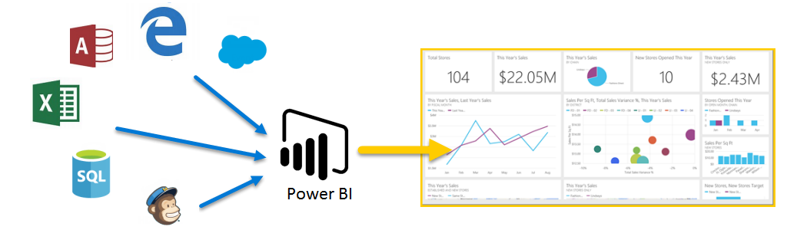
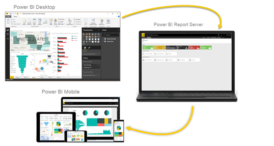

# Power BI とは?
**Power BI** はソフトウェア サービス、アプリ、コネクタのコレクションで、これらを組み合わせることで、関連性のないデータ ソースから、まとまりがあり、実体験的な対話型洞察を得ることができます。 シンプルな Excel スプレッドシートのデータでも、クラウド ベースとオンプレミス ハイブリッド データ ウェアハウスのコレクションのデータでも、**Power BI** は、そのデータ ソースに簡単に接続し、重要事項を視覚化 (検出) して、それを必要に応じて他のユーザーと共有することができます。

**Power BI** はシンプルで高速です。つまり、Excel スプレッドシートやローカル データベースから洞察をすばやく作成できます。 同時に、**Power BI** は堅牢なエンタープライス クラスなので、広範なモデリング、リアルタイム分析、およびカスタム開発の準備もできています。 したがって、個人用レポート、視覚化ツールだけでなく、グループ プロジェクト、部門、または会社全体の背後にある分析および意思決定エンジンとしても使用できます。

## Power BI の構成要素
Power BI は、**Power BI Desktop** と呼ばれる Windows デスクトップ アプリケーション、**Power BI サービス**と呼ばれるオンライン SaaS (*サービスとしてのソフトウェア*) サービス、および Windows の電話やタブレット、iOS デバイス、Android デバイスで使用できる Power BI Mobile **アプリ**で構成されています。

この 3 つの要素、**Desktop**、**サービス**、**Mobile** は、ユーザーがビジネスの洞察を、作成、共有、および使用できるように設計されており、ユーザー (ロール) に最も効率的に提供されます。

## Power BI とロールの対応
Power BI の使用方法は、プロジェクトまたはチームにおけるユーザーのロールによって異なる場合があります。 ロールが異なれば Power BI の使用方法も異なる可能性があります。それでも、問題ありません。

たとえば、あなたが主に使用するのは **Power BI サービス**ですが、大量の演算を行い、ビジネス レポートを作成する同僚は **Power BI Desktop** を頻繁に使用している場合があります (この同僚は Desktop レポートを、あなたが確認できるように Power BI サービスに発行します)。 営業担当の同僚が、主に Power BI 電話アプリを使って、売上ノルマの達成状況の監視や、新しいセールス リード詳細の確認を行っていることもあります。

開発者であれば、Power BI API を使用してデータをデータセットにプッシュしたり、ダッシュボードとレポートをカスタム アプリケーションに埋め込んだりする可能性があります。 新しいビジュアルのアイデアがあれば、 それを自分で作成して、他のユーザーと共有できます。  

**Power BI** の要素を使用するタイミングも、特定のプロジェクトまたは作業の目的やロールによって違う可能性があります。

サービスのリアルタイム ダッシュボードで在庫や製造の進行状況を確認しながら、**Power BI Desktop** を使用して、顧客契約統計に関するレポートを自分のチーム用に作成してもよいでしょう。 Power BI の使用方法は、Power BI のどの機能またはサービスが、ご自身の状況に最適なツールとして使用できるかに基づきますが、Power BI の各要素を使用することはできます。だから Power BI は柔軟で、かつ魅力的なのです。

## Power BI のワークフロー
Power BI での一般的な作業の流れは、データ ソースに接続し、**Power BI Desktop** でレポートを作成することから始まります。 そのレポートを **Desktop** から **Power BI サービス**に発行して、**サービス**と**モバイル**のユーザーがレポートを "*使用*" (表示と操作) できるように共有します。 場合によっては、自分と同じアクセス許可 ("*作成者*" 権限) を同僚に与えて、同僚も**サービス**を使用して、レポートの編集、ダッシュボードの作成、および作業の共有を実行できるようにします。

常にこのようになるわけではありませんが、これは一般的な作業の流れの 1 つであり、Power BI の 3 つの主要な要素がどのように互いを補完するかを示しています。

でも、クラウドに移行する準備が整っていないため、企業のファイアウォールの背後にレポートを保持する場合はどうすればよいでしょうか。  読み続けてください。

## Power BI Report Server によるオンプレミスでのレポート作成
Power BI レポート サーバーが提供するすぐに使用できるツールとサービスを使用して、Power BI レポート、モバイル レポート、およびページ分割されたレポートをオンプレミスで作成、展開、管理します。

Power BI Report Server は、ファイアウォールの背後に展開するソリューションであり、適切なユーザーにさまざまな方法でレポートを配信します。レポートは、Web ブラウザーでもモバイル デバイスでも表示でき、電子メールとして送信することもできます。 Power BI Report Server は、クラウドの Power BI に対応するため、準備ができたらクラウドに移行することができます。 

## 次の手順
[サインインし、データを取得し、Power BI サービスについて学習する](service-the-new-power-bi-experience.md)
