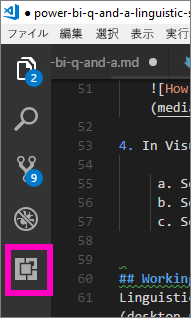
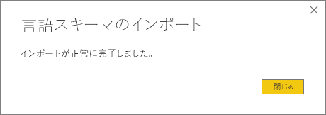

# <a name="language-modeling-and-the-linguistic-schema"></a>言語モデリングと言語スキーマ 
データに関する質問に、一般的な語句と自然言語を使用するのは効果的です。 データが回答になる場合にはさらに効果的です。Power BI の Q&A ではこれが可能です。 Power BI の Q&A に質問すると、Q&A は質問にできるだけ正しく回答します。 

しかし、Q&A との対話でいっそうよい回答を得られる方法がいくつかあります。その 1 つは言語スキーマを編集することです。 

会社のデータからすべてを開始します。  データ モデルが良いほど、ユーザーは適切な回答をより簡単に得られます。 モデルを向上させるための 1 つの方法は、データセット内の用語およびテーブルと列名の間のリレーションシップを定義および分類する言語スキーマを追加することです。 言語スキーマの管理は Power BI Desktop で行います。 

## <a name="what-is-a-linguistic-schema"></a>言語スキーマとは
言語スキーマは、品詞、シノニム、そのデータセットに関連する言い回しなど、データセット内のオブジェクトに関して Q&A が理解する必要のある用語や表現を記述したものです。 データセットをインポートしたりデータセットに接続したりすると、Power BI はデータセットの構造に基づいて言語スキーマを作成します。 Q&A に質問すると、Q&A はデータ内で一致とリレーションシップを検索し、質問の意図を明らかにします。 たとえば、名詞、動詞、形容詞、言い回し、その他の要素を検索します。 そして、動詞の目的語である列など、リレーションシップを検索します。 

おそらく品詞はよくご存知かと思いますが (そうでない場合は、以下を参照してください)、言い回しという用語は初めて聞くかもしれません。  言い回しとは、言葉の間のリレーションシップの話し方 (または "表現") です。 たとえば、顧客と製品の間のリレーションシップを記述するには、"顧客が製品を購入する" などと表現できます。 または、顧客と年齢の間のリレーションシップを記述するには、"年齢は顧客が生まれてからの年数" などと表現できます。 または、顧客と電話番号の間のリレーションシップを記述するには、"顧客は電話番号を持っている" などと表現できます。

これらの言い回しの形態とサイズはさまざまです。 一部は、データ モデル内のリレーションシップと直接対応しています。 一部は、それを含むテーブルと列を関連付けます。 一部は、複雑なリレーションシップで複数のテーブルと列を関連付けます。 いずれの場合も、言い回しは日常的な用語を使って物事の関連方法を記述します。

言語スキーマは YAML 形式で保存されます。 この形式は、非常に一般的な JSON 形式に関連しますが、より柔軟でわかりやすい構文を提供します。 言語スキーマは、Power BI Desktop で編集、エクスポート、インポートすることができます。

## <a name="prerequisites"></a>前提条件
- [Q&A のデータ モデルの向上](desktop-qna-in-reports.md)に関する記事をまだ呼んでいない場合は、最初にお読みください。 データ モデルの設計と向上に関するさまざまなヒントとシノニムの追加に関する重要なセクションが含まれます。  

- Q&A には 2 つの面があります。  1 番目は準備つまり "モデリング" に関する面です。  2 番目はデータの質問と探索つまり "消費" に関する面です。 会社によっては、データ モデラーまたは IT 管理者と呼ばれる従業員が、データセットの組み立て、データ モデルの作成、Power BI へのデータセットの発行を行っています。  他の従業員は、データをオンラインで "消費" します。  これらの役割が分かれていない会社もあります。 

    このトピックの対象者はデータ モデラーです。 つまり、データセットを取得し、最適な Q&A の結果を提供できるように最適化する人です。 

- [.yaml ファイルと .pbix ファイルのサンプル](https://go.microsoft.com/fwlink/?linkid=871858)    
- YAML ファイル エディター、お勧めは [Visual Studio Code](https://code.visualstudio.com/) です


### <a name="set-up-an-editor-for-yaml-files"></a>YAML ファイル用にエディターを設定する
言語スキーマの YAML ファイルを編集するには、Visual Studio Code を使うことをお勧めします。 Visual Studio Code は YAML ファイルを既定でサポートしており、特に Power BI 言語スキーマ形式を検証するように拡張できます。
1. [Visual Studio Code](https://code.visualstudio.com/) をインストールします。    

2. 前に保存した [YAML ファイル](https://go.microsoft.com/fwlink/?linkid=871858) (SummerOlympics.lsdl.yaml) のサンプル言語スキーマを選びます。    
4. **Visual Studio Code** を選び、**[常にこのアプリを使って .yaml ファイルを開く]** を選びます。

    

4. Visual Studio Code で、YAML Support by Red Hat 拡張機能をインストールします。    
    a. **[拡張機能]** タブ (左側の最後のタブ) を選ぶか、Ctrl + Shift + X キーを押します。    
        
    b. "yaml" を検索して、一覧の **YAML Support by Red Hat** を選びます。    
    c. **[インストール] > [再読み込み]** を選びます。


## <a name="working-with-linguistic-schemas"></a>言語スキーマの操作
言語スキーマは、Power BI Desktop の[リレーションシップ ビュー](desktop-relationship-view.md)で編集、インポート、エクスポートすることができます。 言語スキーマを編集する方法の 1 つは、[**[シノニム]** ウィンドウにシノニムを追加する](desktop-qna-in-reports.md)ことです。 YAML ファイルを開く必要はありません。

![[シノニム] ウィンドウ](media/power-bi-q-and-a-linguistic-schema/power-bi-synonyms-pane.png)


 言語スキーマを編集するもう 1 つの方法は、YAML ファイルをエクスポートして直接編集することです。  言語スキーマの YAML ファイルを編集するときは、テーブルの列に異なる文法要素としてタグを付け、同僚が質問の表現に使う可能性がある単語を定義します。 たとえば、動詞の主語と目的語である列を指定し、モデルのテーブル、列、メジャーの参照に使うことができる代わりの単語を追加します。 


言語スキーマを編集するには、先に Desktop から言語スキーマを開く (エクスポートする) 必要があります。 同じ場所に YAML ファイルを保存して戻すことは、インポートと見なされます。  ただし、代わりに他の YAML ファイルをインポートすることもできます。  たとえば、似たデータセットがあり、品詞の追加、リレーションシップの識別、言い回しの作成、シノニムの作成など、多くの作業を既に行っているような場合です。 

Q&A は、このすべての情報と、データ モデラーがよりよい応答、オート コンプリート、質問の概要を提供するために行った機能拡張を併せて使います。


## <a name="edit-a-linguistic-schema"></a>言語スキーマを編集する
Desktop から言語スキーマを初めてエクスポートすると、ファイル内のコンテンツのほとんどまたはすべては、Q&A エンジンによって自動的に生成されます。 これらの生成されたエンティティ、単語 (シノニム)、リレーションシップ、言い回しは、**State: Generated** タグで示され、主に情報提供を目的としてファイルに含まれますが、これを基にして独自の変更を行うと便利です。 

> [!NOTE]
> このチュートリアルに含まれる YAML ファイルのサンプルは、このチュートリアルのために特に準備されたものなので、**State: Generated** タグまたは **State: Deleted** タグは含まれません。 これらのタグを見るには、未編集の .pbix ファイルをリレーションシップ ビューで開き、言語スキーマをエクスポートしてください。


Power BI Desktop に言語スキーマ ファイルをインポートすると、**State: Generated** としてマークされているものはすべて実際には無視されるので (および再生成後)、生成されたコンテンツを変更したい場合は、対応する **State: Generated** タグの削除も行ってください。 同様に、生成されたコンテンツを削除する場合は、言語スキーマ ファイルをインポートするときに再生成されないように、**State: Generated** タグを **State: Deleted** に変更する必要があります。

1. Power BI Desktop の "*リレーションシップ ビュー*" でデータセットを開きます。 
2. **[モデリング]** タブを選び、**[言語スキーマのエクスポート]** を選びます。
3. Visual Code (または別のエディター) を選びます。
4. 編集を行い、YAML ファイルを保存します。
5. Desktop から、**リレーションシップ ビュー > [モデリング] タブ > [言語スキーマ] > [言語スキーマのインポート]** の順に選びます。
6. 編集済みの YAML ファイルを保存した場所に移動して、それを選びます。 成功メッセージが表示されると、言語スキーマの YAML ファイルが正常にインポートされたことがわかります。

    

### <a name="add-phrasings-to-the-linguistic-schema"></a>言語スキーマに言い回しを追加する
言い回しとは、言葉の間のリレーションシップの話し方 (または "表現") です。 たとえば、顧客と製品の間のリレーションシップを記述するには、"顧客が製品を購入する" などと表現できます。 または、顧客と年齢の間のリレーションシップを記述するには、"年齢は顧客が生まれてからの年数" などと表現できます。 または、運動選手とメダル間のリレーションシップを記述するには、単に "運動選手がメダルを獲得する" などと表現できます

これらの言い回しの形態とサイズはさまざまです。 一部は、セマンティック モデル内のリレーションシップと直接対応しています。 一部は、それを含むテーブルと列を関連付けます。 一部は、複雑なリレーションシップで複数のテーブルと列を関連付けます。 いずれの場合も、言い回しは日常的な用語を使って物事の関連方法を記述します。

## <a name="where-do-phrasings-come-from"></a>言い回しの基になるもの
モデルの構造と、列名に基づく推定を基にして、多くの単純な言い回しが言語スキーマに自動的に追加されます。 例:
- ほとんどの列は、それが含まれているテーブルに、"products have descriptions" (製品は説明を持っている) のような簡単な言い回しによって関連付けられます。
- モデルのリレーションシップにより、"orders have products" (注文は製品を持っている) と "products have orders" (製品は注文を持っている) のような、双方向のリレーションシップに対する既定の言い回しが作成されます。
- モデルの一部のリレーションシップに対しては、列の名前を基にして、"orders are shipped to cities" (注文は市に出荷される) のような、さらに複雑な既定の言い回しが作成されます。

ただし、ユーザーは Q&A が推測できないさまざまな表現を使います。 そのため、独自の言い回しを手動で追加することがあります。


## <a name="why-should-i-add-phrasings"></a>言い回しを追加する必要がある理由
言い回しを追加する最初の理由は、新しい用語を定義することです。 たとえば、"list the oldest customers" (最も高齢の顧客のリストを作成する) と要求できるためには、最初に "old" (高齢) の意味を Q&A に教える必要があります。 そのためには、"ages indicate how old customers are" (年齢は顧客が生まれてからの年数) のような言い回しを追加します。

言い回しを追加する 2 つ目の理由は、あいまいさの解決です。 基本的なキーワード検索は、単語が複数の意味を持つ場合にのみそれを行います。 たとえば、"flights to Chicago" (シカゴへのフライト) は "flights from Chicago" (シカゴからのフライト) とはまったく異なる意味ですが、"flights are from departure cities" (フライトは出発都市から) と "flights are to arrival cities" (フライトは到着都市まで) という言い回しを追加しない限り、Q&A はどちらの意味かわかりません。 同様に、"cars that John sold to Mary" (John が Mary に売った自動車) と "cars that John bought from Mary" (John が Mary から買った自動車) の違いは、"customers buy cars from employees" (顧客は従業員から自動車を買う) および "employees sell customers cars" (従業員は顧客に自動車を売る) という言い回しを追加した場合にのみ理解されます。

言い回しを追加する最後の理由は、言い換えを向上させるためです。 Q&A が "Show the customers and their products" (顧客とその製品を表示する) と繰り返すのではなく、質問の理解に応じて、"Show the customers and the products they bought" (顧客と顧客が買った製品を表示する) または "Show the customers and the products they reviewed" (顧客と顧客がレビューした製品を表示する) と表示される方が明確になります。 独自の言い回しを追加すると、言い換えがより明示的で明確になります。


## <a name="what-kinds-of-phrasings-are-there"></a>言い回しの種類
さまざまな種類の言い回しを理解するには、最初に非常に基本的ないくつかの文法用語を思い出す必要があります。
- "*名詞*" は、人物、場所、または物です。 
    - 例: 自動車、子供、マーティ、流動的コンデンサー
- "*動詞*" は、アクションまたは状態です。 
    - 例: 生まれる、爆発する、貪る、取り出す
- "*形容詞*" は、名詞を変更する説明的な単語です。 
    - 例: 強力な、魅力的な、金色の、盗まれた
- "*前置詞*" は、名詞の前にあって、名詞をその前にある名詞、動詞、形容詞に関連付けるために使われる単語です 
    - 例: の、に、の近く、から
-  "*属性*" は、何かの品質または機能です。
-  "*名前*" は、人、動物、場所、物が認識または参照される単語または単語のセットです。   


## <a name="attribute-phrasings"></a>属性の言い回し
属性の言い回しは、ある物が別の物の属性に働きかけるときに使われる、Q&A でよく使われるものです。 単純でわかりやすく、より微妙で詳細な言い回しが定義されていない場合に、面倒な作業のほとんどを実行します。 属性の言い回しは、基本的な動詞 "have" (持つ) ("products have categories" (製品はカテゴリを持つ) や "host countries have host cities" (ホスト国はホスト市を持つ)) を使って記述され、自動的に、前置詞 "of" および "for" ("categories of products" (製品のカテゴリ)、"orders for products" (製品の注文)) と所有格 ("John’s orders" (John の注文)) を使って質問できるようにします。 属性の言い回しは次のような質問で使われます。
- Which customers have orders? (どのお客様が注文を持っていますか?)
- List host cities by country ascending (国の昇順にホスト市を一覧表示する)
- Show orders that have chai (チャイを含む注文を表示する)
- List customers with orders (注文のある顧客を一覧表示する)
- What is the category of each product? (各製品のカテゴリは何ですか?)
- Count Robert King's orders (Robert King の注文をカウントする)    

モデルに必要な属性の言い回しの大部分は、テーブル/列の包含構造およびモデルのリレーションシップに基づいて自動的に生成されるので、通常は、モデラーが自分で作成する必要はありません。
言語スキーマ内での属性の言い回しの表現の例を次に示します。

```json
product_has_category:
  Binding: {Table: Products}
  Phrasings:
  - Attribute: {Subject: product, Object: product.category}
```
 
## <a name="name-phrasings"></a>名前の言い回し
名前の言い回しは、運動選手名や顧客名など、データ モデルに名前付きオブジェクトを含むテーブルがある場合に便利です。 たとえば、"product names are names of products" (製品名は製品の名前である) という言い回しは、製品名を質問で使用できるようにするために不可欠です。 名前の言い回しによって動詞としての "named" (という名前の) も有効になりますが (例:"List customers named John Smith" (John Smith という名前の顧客を一覧表示する))、最も重要なのは、他の言い回しと組み合わせて使うと、特定のテーブル行を参照するために名前値を使用できることです。 たとえば、"Customers that bought chai" (チャイを買った客) では、Q&A には、値 "chai" が製品名列の単なる値ではなく製品テーブルの行全体を参照していることがわかります。 名前の言い回しは次のような質問で使われます。    
- Which employees are named Robert King (どの従業員が Robert King という名前ですか)
- Who is named Ernst Handel (誰が Ernst Handel という名前ですか)
- Fernand De Montigny's sports (Fernand De Montigny のスポーツ)
- Count of athletes named Mary (Mary という名前の運動選手の数)
- What did Robert King buy? (Robert King は何を買いましたか?)

モデルの名前列の名前付け規則がわかりやすければ (例:"PrdNm" ではなく "Name" や "ProductName")、モデルに必要な名前の言い回しの多くは自動的に生成されるので、通常、自分で作成する必要はありません。

言語スキーマ内での名前の言い回しの表現の例を次に示します。

```json
employee_has_name:
  Binding: {Table: Employees}
  Phrasings:
  - Name:
      Subject: employee
      Name: employee.name
```

 
## <a name="adjective-phrasings"></a>形容詞の言い回し
形容詞の言い回しは、モデル内の物事を記述するために使われる新しい形容詞を定義します。 たとえば、"happy customers are customers where rating > 6" (幸せな客はレーティングが 6 より大きい客) という言い回しは、"list the happy customers in Des Moines" (Des Moines の幸せな客を一覧表示する) といった質問のために必要です。 形容詞の言い回しには、さまざまな状況で使用するための複数の形式があります。

"*単純な形容詞の言い回し*" は、条件に基づいて新しい形容詞を定義します (例: "discontinued products are products where status = D" (中止される製品はステータスが D の製品である))。 単純な形容詞の言い回しは次のような質問で使われます。
- Which products are discontinued? (どの製品が中止されますか?)
- List the discontinued products (中止された製品を一覧表示する)
- List the gold medalists (金メダリストを一覧表示する)
- Products that are backordered (入荷待ちの製品)

次に示すのは、言語スキーマ内での単純な形容詞の言い回しの表現の例です (product_is_discontinued)。

```json
Binding: {Table: Products}
  Conditions:
  - Target: product.discontinued
    Operator: Equals
    Value: true
  Phrasings:
  - Adjective:
      Subject: product
      Adjectives: [discontinued]
```

"*測定の形容詞の言い回し*" は、形容詞の適用範囲を示す数値に基づいて新しい形容詞を定義します (例: "lengths indicate how long rivers are" (長さは川の長さを示す)、"small countryregions have small land areas" (小さい国土領域は土地の面積が小さい))。 測定の形容詞の言い回しは次のような質問で使われます。
- List the long rivers (長い川を一覧表示する)
- Which rivers are the longest? (どの川が最も長いですか?)
- List the smallest countryregions that won gold in basketball (バスケットで金を取った最小の国を一覧表示する)
- How long is the Rio Grande? (Rio Grande はどのくらいの長さですか?)

次に示すのは、言語スキーマ内での測定の形容詞の言い回しの表現の例です (river_has_length)。

 ```json
Binding: {Table: Rivers}
  Phrasings:
  - Adjective:
      Subject: river
      Adjectives: [long]
      Antonyms: [short]
      Measurement: river.length
```

"*動的な形容詞の言い回し*" は、モデル内の列の値に基づいて新しい形容詞のセットを定義します (例: "colors describe products" (色は製品を説明する)、"events have event genders" (イベントにはイベント ジェンダーがある))。 動的な形容詞の言い回しは次のような質問で使われます。
- List the red products (赤い製品を一覧表示する)
- Which products are green? (どの商品が緑ですか?)
- Show skating events for females (女性向けのスケート イベントを表示する)
- Count issues that are active (アクティブな問題をカウントする)

次に示すのは、言語スキーマ内での動的な形容詞の言い回しの表現の例です (product_has_color)。
```json
Binding: {Table: Products}
  Phrasings:
  - DynamicAdjective:
      Subject: product
      Adjective: product.color
```

 
## <a name="noun-phrasings"></a>名詞の言い回し
名詞の言い回しは、モデル内の物事のサブセットを記述する新しい名詞を定義します。 多くの場合、何らかの種類のモデル固有の測定または条件が含まれます。 たとえば、Olympics モデルでは、チャンピオンとメダリスト、球技と水上競技、チームと個人、選手の年齢カテゴリ (10 代、大人、高齢) などを区別する言い回しを追加する必要があります。映画データベースの場合は、"count the flops by year" (年別の失敗作の数) のようなことを質問できるように、"flops are movies where net profit < 0" (失敗作は純利益が 0 未満の映画である) といった名詞の言い回しを追加する必要があります。 名詞の言い回しには、さまざまな状況で使用するための 2 つの形式があります。

"*単純な名詞の言い回し*" は、条件に基づいて新しい名詞を定義します (例: "contractors are employees where full time = false" (契約社員はフルタイムが false の従業員である)、"champion is athlete where count of medals >5" (チャンピオンはメダルの数が 5 より多い選手である))。 単純な名詞の言い回しは次のような質問で使われます。

- Which employees are contractors? (どの従業員が契約社員ですか?)
- Count the contractors in Portland (Portland の契約社員をカウントする)
- How many champions in 2016 (2016 年のチャンピオンの数)

次に示すのは、言語スキーマ内での単純な名詞の言い回しの表現の例です (employee_is_contractor)。

```json
Binding: {Table: Employees}
  Conditions:
  - Target: employee.full_time
    Operator: Equals
    Value: false
  Phrasings:
  - Noun:
      Subject: employee
      Nouns: [contractor]
```

"*動的な名詞の言い回し*" は、モデル内の列の値に基づいて新しい名詞のセットを定義します (例: "jobs define subsets of employees" (ジョブは従業員のサブセットを定義する))。 動的な名詞の言い回しは次のような質問で使われます。

- List the cashiers in Chicago (シカゴのレジ係を一覧表示する)
- Which employees are baristas? (どの従業員がバリスタですか?)
- List the referees in 1992 (1992 年のレフェリーを一覧表示する)

次に示すのは、言語スキーマ内での動的な名詞の言い回しの表現の例です (employee_has_job)。

 ```json
Binding: {Table: Employees}
  Phrasings:
  - DynamicNoun:
      Subject: employee
      Noun: employee.job
```

## <a name="preposition-phrasings"></a>前置詞の言い回し
前置詞の言い回しは、モデル内の物事が前置詞によってどのように関連付けられるかを記述するために使われます。 たとえば、"cities are in countries" (市は国の中にある) という言い回しは、"count the cities in Washington" (Washington の市をカウントする) といった質問の理解を向上させます。 一部の前置詞の言い回しは、列が地理的なエンティティとして認識されると自動的に作成されます。 前置詞の言い回しは次のような質問で使われます。

- Count the customers in New York (New York の客をカウントする)
- List the books about linguistics (言語学に関する書籍を一覧表示する)
- Which city is John Galt in? (John Galt はどの市にいますか?)
- How many books are by Stephen Pinker? (Stephen Pinker が書いた本の数)
 
次に示すのは、言語スキーマ内での前置詞の言い回しの表現の例です (customers_are_in_cities)。

 ```json
Binding: {Table: Customers}
  Phrasings:
  - Preposition:
      Subject: customer
      Prepositions: [in]
      Object: customer.city
```

 
## <a name="verb-phrasings"></a>動詞の言い回し
動詞の言い回しは、モデル内の物事が動詞によってどのように関連付けられるかを記述するために使われます。 たとえば、"customers buy products" (客は商品を買う) という言い回しは、"who bought cheese" (誰がチーズを買ったいましたか?) や "what did John buy" (John は何を買いましたか?) といった質問の理解を向上させます。 動詞の言い回しはすべての言い回しの種類の中で最も柔軟であり、多くの場合、"employees sell customers products" (従業員は客に商品を売る) のように、3 つ以上の物事を相互に関連させます。 動詞の言い回しは次のような質問で使われます。

- Who sold what to whom? (誰が何を誰に売りましたか?)
- Which employee sold chai to John? (どの従業員が John にチャイを売りましたか?)
- How many customers were sold chai by Mary? (Mary は何人の客にチャイを売りましたか?)
- List the products that Mary sold to John (Mary が John に売った商品を一覧表示する)
- Which discontinued products were sold to Chicago customers by Boston employees? (どの中止された商品が Boston の従業員によって Chicago の客に売られましたか?)

動詞の言い回しは前置詞句を含むことにより、柔軟性を高めることができます (例: "athletes win medals at competitions" (選手は試合でメダルを獲得する)、"customers are given refunds for products" (顧客は商品の払い戻しを受ける))。 前置詞句を含む動詞の言い回しは次のような質問で使われます。

- How many athletes won a gold medal at the Visa Championships? (何人の選手が Visa Championships でメダルを獲得しましたか?)
- Which customers were given a refund for cheese? (どの客がチーズの払い戻しを受けましたか?)
- At which competition did Danell Leyva win a bronze medal? (どの試合で Danell Leyva は銅メダルを獲得しましたか?)

一部の動詞の言い回しは、列が動詞と前置詞の両方を含むものと認識されると自動的に作成されます。

次に示すのは、言語スキーマ内での動詞の言い回しの表現の例です (customers_buy_products_from_salespeople)。

```json
Binding: {Table: Orders}
  Phrasings:
  - Verb:
      Subject: customer
      Verbs: [buy, purchase]
      Object: product
      PrepositionalPhrases:
      - Prepositions: [from]
        Object: salesperson
```

## <a name="relationships-with-multiple-phrasings"></a>複数の言い回しを含むリレーションシップ
1 つのリレーションシップが複数の方法で記述されることがよくあります。 この場合、1 つのリレーションシップが複数の言い回しを持つことができます。 テーブル エンティティと列エンティティの間のリレーションシップに属性の言い回しと別の言い回しの両方があるのはよくあることです。 たとえば、顧客と顧客名の間のリレーションシップでは、属性の言い回し (例: "customers have names" (顧客は名前を持つ)) と名前の言い回し (例: "customer names are the names of customers" (顧客名は顧客の名前である)) の両方を使って、両方の種類の質問をできるようにします。

次に示すのは、言語スキーマ内で 2 つの言い回しを含むリレーションシップの表現の例です (customer_has_name)。

  ```json
Binding: {Table: Customers}
  Phrasings:
    - Attribute: {Subject: customer, Object: customer.name}
    - Name:
        Subject: customer
        Object: customer.name
```

もう 1 つの例は、"customers buy products from employees" (客は従業員から商品を買う) リレーションシップに対して代替の言い回し "employees sell customers products" (従業員は客に商品を売る) を追加する場合です。 "employees sell products **to customers**" (従業員は客に対して商品を売る) や "products are sold to customers **by employees**" (商品は従業員によって客に販売される) のようなバリーションを追加する必要はないことに注意してください。主語および間接目的語のバリエーション "by" (によって) や "to" (に対して) は、Q&A によって自動的に推論されます。

## <a name="considerations-and-troubleshooting"></a>考慮事項とトラブルシューティング
変更した .lsdl.yaml ファイルが言語スキーマ形式に準拠していない場合は、問題を示す次のような検証の波線が表示されます。 

    


他にわからないことがある場合は、 [Power BI コミュニティを利用してください](http://community.powerbi.com/)。
