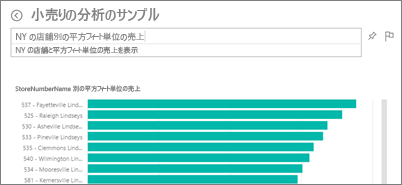
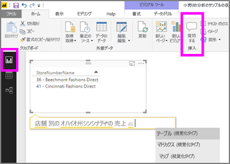

# Power BI サービスおよび Power BI Desktop での Q&A
## Q&A とは
自然言語を使用して質問するのが、データから回答を得る最も速い方法である場合があります。 たとえば、「昨年の総売り上げはいくらですか」という質問です。  Q&A を使用すると、直感的な自然言語の機能を使ってデータを調査し、チャートやグラフの形式で質問に対する回答を受け取ることができます。 Q&A は、検索エンジンとは異なります。Q&A は Power BI 内のデータに関する結果だけを提供します。

Q&A を使うときは、まず始めにこの記事をお読みください。 Power BI サービス (ダッシュボードとレポート)、Power BI Desktop (レポート)、Power BI Embedded、Power BI モバイルでの Q&A の詳しい使い方については、後で示すリンクから該当するものを選んでください。  

質問をすることは、始まりにすぎません。  質問の検索条件を限定あるいは拡大したり、信頼に値する新しい情報を明らかにしたり、詳しい情報に的を絞ったり、ズームアウトしてより広い視野を得たりして、データの調査を楽しんでください。 分析や発見を行うことによって喜びを得ることができます。

エクスペリエンスはまったくの対話型で、しかも高速です。 メモリ内の記憶域を使用するため、ほぼ瞬時に応答します。

##  "*利用者*" 向け Q&A
同僚から共有されたダッシュボードを使っている場合、Q&A の質問ボックスは、Power BI サービス (app.powerbi.com) ではダッシュボード上、Power BI モバイルではダッシュボードの下部、Power BI Embedded では視覚エフェクトの上にあります。 所有者から編集アクセス許可を与えられていない場合、利用者は Q&A を使ってデータを探すことはできますが、Q&A で作成された視覚エフェクトを保存することはできません。

## "*作成者*" 向け Q&A
Power BI レポートの "*作成者*" の場合、またはデータセットへの編集アクセス許可を持っている場合は、Power BI サービスのダッシュボード、および Power BI サービスと Power BI Desktop の各レポート ページに、Q&A 質問ボックスが表示されます。 Q&A を使って作成した視覚エフェクトは、ダッシュおよびレポートに保存できます。

Q&A を使ってデータを探索するだけでなく、作成者とデータセットの所有者は、[データセットを修正](service-prepare-data-for-q-and-a.md)し、[おすすめの質問](service-q-and-a-create-featured-questions.md)を追加し、オンプレミスのライブ接続データセットに対する [Q&A を有効または無効にする](service-q-and-a-direct-query.md)ことにより、利用者に使いやすい Q&A エクスペリエンスを提供することができます。 [Embedded のシナリオ](developer/qanda.md)では、開発者は**対話型**と**結果のみ**の 2 つのモードのどちらかを選ぶことができます。

## Q&A は、回答する方法をどのように知るのでしょうか。
### Q&A はどのデータセットを使用しますか。
Q&A は、データに固有の質問に回答する方法をどのように知るのでしょうか。 これは、基になるデータセット内のテーブル、列、計算フィールドの名前に依存します。 そのため自分 (またはデータセットの所有者) が物事を何と呼ぶかが重要です。

たとえば、「売上」という名前の Excel のテーブルがあり、「製品」、「月」、「販売単位」、「総売上高」、「利益」というタイトルの列があるとします。 これらのエンティティのいずれかに関する質問ができます。  "*売上*を表示する"、"*月別*の*利益*合計"、"*販売単位*を基準とした*製品*の並べ替え" などの質問を入力できます。

Q&A は、データセットがどのようにまとめられているかに基づいて質問に回答します。 Salesforce のデータではどのように機能するでしょうか。 salesforce.com のアカウントに接続すると、Power BI は自動的にダッシュボードを生成します。  Q&A で質問を開始する前に、ダッシュボードの視覚化に表示されたデータと、Q&A のドロップダウンに表示されたデータをご覧ください。

* 視覚エフェクトの軸のラベルと値に "売上"、"アカウント"、"月"、"営業案件" が含まれている場合は、"どの*アカウント*の*営業案件*が一番多いか"、または "月別の*売上*を棒グラフとして表示する" などの質問を自信を持って行えます。
* ドロップダウンに「販売員」、「状態」、「年」が含まれている場合は、「 *2013* 年に *フロリダ* で最も *売上* が低かった *販売員*はだれか」といった質問を自信を持って行えます。

Google Analytics に Web サイトのパフォーマンス データがある場合は、Web ページの利用に費やした時間、固有のページのアクセス数、ユーザーの契約率に関する Q&A を行えます。 あるいは、人口統計データのクエリを実行している場合は、年齢および場所ごとの世帯収入に関する質問をする場合があります。

### Q&A はどの視覚化を使用しますか。
Q&A は、表示されているデータに基づいて最適な視覚化を選びます。 基になるデータセットにあるデータは、特定の種類またはカテゴリとして定義されることがあります。Q&A はこれを利用して表示方法が分かります。 たとえば、データが日付型として定義されている場合は、折れ線グラフで表示される可能性が高くなります。 市区町村として分類されているデータは、マップとして表示される可能性が高くなります。

また、Q&A に独自の質問を追加して、使用する視覚化を Q&A で指定することもできます。 しかし、Q&A が常に要求した種類の視覚化でデータを表示できるとは限らないことにご注意ください。

Q & A が認識できるキーワードについては、「[Power BI Q&A で質問するためのヒント](service-q-and-a-tips.md)」を参照してください。

## Power BI Q&A に関する詳しい情報
[概要: Power BI のダッシュボードとレポートで Q&A を使う方法](power-bi-tutorial-q-and-a.md): Q&A を使う詳しい手順と、Q&A の全機能の概要。

[Microsoft Power BI モバイル アプリ](mobile-apps-ios-qna.md): iPad、iPhone、iPod Touch デバイスの iOS の場合。

[Microsoft Power BI Embedded](developer/qanda.md): アプリケーションに Q&A を組み込みます。

[Q&A で質問するためのヒント](service-q-and-a-tips.md): 最適な結果を得るための Q&A との対話方法を説明します。

[おすすめの質問をデータセットに追加する](service-q-and-a-create-featured-questions.md)ページと Q&A では、おすすめの質問を同僚に提案します。

[オンプレミスのデータセットの Q&A を有効にする](service-q-and-a-direct-query.md): データセットに接続するためにゲートウェイが必要な場合は、Power BI の設定を使って Q&A を有効または無効にします。

[チュートリアル: Power BI サービスの小売売上高サンプルで Q&A を使う](power-bi-visualization-introduction-to-q-and-a.md): 現実的な業界のチュートリアルで Q&A を使います。

[Q&A でご使用のデータをうまく動作させる](service-prepare-data-for-q-and-a.md): データセットとデータ モデルを作成するユーザーには、  このトピックが役立ちます。

他にわからないことがある場合は、 [Power BI コミュニティを利用してください](http://community.powerbi.com/)。
