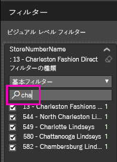
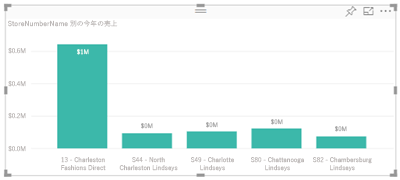
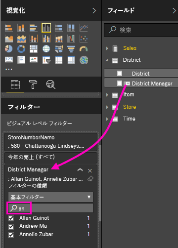
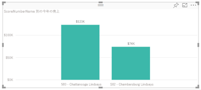

# レポートへのフィルターの追加 (編集ビュー)

この記事では、Power BI でレポートにページ フィルター、視覚エフェクト フィルター、レポート フィルター、ドリルスルー フィルターを追加する方法を説明します。 この記事の例は、Power BI サービスのものです。 Power BI Desktop でも手順はほとんど同じです。

**ご存知でしたか?** Power BI には新しいフィルター エクスペリエンスがあります (現在プレビュー段階)。 詳細については、[Power BI レポートの新しいフィルター エクスペリエンス](power-bi-report-filter-preview.md)に関する記事をご覧ください。

## 編集ビューまたは読み取りビューでのフィルター
レポートの操作は、読み取りビューと編集ビューの 2 種類のビューで行うことができます。 使用できるフィルター処理機能は、どのビューを使用しているかによって異なります。 詳しくは、「[Power BI レポートのフィルターと強調表示について](power-bi-reports-filters-and-highlighting.md)」をご覧ください。

この記事では、レポートの**編集ビュー**でフィルターを作成する方法について説明します。  読み取りビューでのフィルターについて詳しくは、[レポートの読み取りビューのフィルターとの対話](consumer/end-user-reading-view.md)に関する記事をご覧ください。

## [フィルター] ウィンドウでのフィルターの種類
Desktop と Power BI サービスのどちらを使用しているかに関係なく、フィルター ウィンドウはレポート キャンバスの右側に表示されます。 フィルター ウィンドウが表示されない場合は、右上隅にある ">" アイコンを選択して展開してください。

フィルターには、**ページ フィルター**、**ビジュアル フィルター**、**ドリルスルー フィルター**、**レポート フィルター**の 4 つの種類があります。

フィルターは "*永続的*" であるため、ユーザーがレポートから離れても、Power BI によってフィルター、スライサー、ユーザーが行ったその他のデータ ビューの変更は保持されます。 そのため、レポートに戻ったとき、前回終了したところから再開できます。 フィルターの変更を残さない場合は、上部のメニュー バーから **[既定値にリセット]** を選択します。

## ビジュアルにフィルターを追加する
2 つの方法で、特定のビジュアルにフィルター ("ビジュアル フィルター" とも呼ばれます) を追加できます。 

* 視覚エフェクトによって既に使われているフィールドにフィルターを追加します。
* 視覚エフェクトによってまだ使われていないフィールドを識別し、そのフィールドを**ビジュアル レベル フィルター** バケットに直接追加します。

ところで、この手順では小売りの分析サンプルを使用するので、よろしければダウンロードして同じように操作してみてください。 [小売りの分析のサンプル](sample-retail-analysis.md)はこちらからダウンロードできます。

### ビジュアルでフィールドをフィルター処理する

1. [編集ビューでレポート](service-the-report-editor-take-a-tour.md)を開きます。
   
   
2. 視覚化およびフィルター ウィンドウとフィールド ウィンドウがまだ開いていない場合は開きます。
   
   
3. ビジュアルを選んでアクティブにします。 ビジュアルで使用されているすべてのフィールドが **[フィールド]** ウィンドウに表示され、**[フィルター]** ウィンドウの **[ビジュアル レベル フィルター]** の見出しにも一覧表示されます。
   
   
4. この時点で、視覚化によって既に使われているフィールドにフィルターを追加します。 
   
    **[ビジュアル レベル フィルター]** 領域まで下にスクロールし、矢印を選んでフィルター処理するフィールドを展開します。 この例では **StoreNumberName** をフィルター処理します。
     
     
    
    フィルター処理コントロールとして**基本**、**高度**、または**上位 N** を設定します。 この例では、基本フィルターで **cha** を検索し、これら 5 つのストアを選択します。
     
     
   
    ビジュアルに新しいフィルターが反映されます。 レポートをフィルターとともに保存すると、レポート閲覧者は、フィルター処理されたビジュアルが最初に表示され、読み取りビューでフィルターと対話して、値を選んだりクリアしたりすることができます。
     
    

### ビジュアルに含まれていないフィールドでフィルター処理する

次に、新しいフィールドをビジュアル レベル フィルターとして視覚エフェクトに追加します。
   
1. [フィールド] ウィンドウで新しいビジュアル レベル フィルターとして追加するフィールドを選び、**[ビジュアル レベル フィルター]** 領域までドラッグします。  この例では、**District Manager** を **[ビジュアル レベル フィルター]** バケットにドラッグし、「**an**」を検索して、それらの 3 人のマネージャーを選択します。 
     
    

    **District Manager** は視覚エフェクト自体に追加されるのでは "*ない*" ことに注意してください。 視覚化はまだ **[StoreNumberName]** を軸とし、**[This Year Sales (今年の売上)]** を値として構成されています。  
     
    

    また、視覚エフェクト自体は、指定した店舗でのこれらのマネージャーの今年の売上だけを表示するようにフィルター処理されます。
     
    

    レポートをフィルターとともに保存すると、レポート閲覧者は読み取りビューで **District Manager** フィルターを操作して、値を選んだりクリアしたりすることができます。

## ページ全体にフィルターを追加する

ページ全体にフィルター (ページ ビュー フィルター) を追加することもできます
1. [編集ビューでレポート](service-the-report-editor-take-a-tour.md)を開きます。
2. 視覚化およびフィルター ウィンドウとフィールド ウィンドウがまだ開いていない場合は開きます。
3. [フィールド] ウィンドウで新しいページ レベル フィルターとして追加するフィールドを選び、**[ページ レベル フィルター]** 領域までドラッグします。  
4. フィルターを適用する値を選び、フィルター処理コントロールとして**基本**または**高度**を設定します。
   
   ページ上にある、このフィルターの影響を受けるすべての視覚化が、変更を反映するように再描画されます。 
   
   

    レポートをフィルターとともに保存すると、レポート閲覧者が読み取りビューでフィルターと対話でき、値を選んだりクリアしたりすることができます。

## ドリルスルー フィルターを追加する
Power BI サービスと Power BI Desktop のドリルスルーでは、サプライヤー、顧客、メーカーなど、特定のエンティティに注目した "*ドリルスルー先*" レポート ページを作成できます。 ユーザーは、他のレポート ページでそのエンティティのデータ ポイントを右クリックして、フォーカスされたページにドリルスルーできます。

### ドリルスルー フィルターを作成する
最初に、お客様の収益性のサンプルを編集ビューで開きます。 Executive ビジネス領域に注目したページを作成します。   

1. レポートに新しいページを追加し、「**Team Executive**」という名前を付けます。 このページが "*ドリルスルー先*" になります。
2. チーム エグゼクティブ ビジネス分野の主要指標を追跡するための視覚化を追加します。    
3. [ドリル スルー フィルター] ウェルに **[Executive] > [Executive Name]** を追加します。    
   
    
   
    レポート ページに戻る矢印が追加されることに注意してください。  戻る矢印を選ぶと、"*ドリルスルー元*" のレポート ページ (ドリルスルーを選んだときのページ) に戻ります。 戻る矢印は、読み取りビューでのみ機能します。
   
     

### ドリルスルー フィルターを使う
ドリルスルー フィルターのしくみを見てみましょう。

1. **[Team Scorecard]** レポート ページから始めます。    
2. Andrew Ma が自分のデータだけにフィルター処理された [Team Executive] レポート ページを見たいものとします。  左上の面グラフで任意の緑のデータ ポイントを右クリックして、[ドリルスルー] メニュー オプションを開きます。
   
    
3. **[ドリルスルー] > [Team Executive]** を選んで、**[Team Executive]** という名前のレポート ページにドリルスルーします。 このページは、右クリックしたデータ ポイント (この場合は Andrew Ma) に関する情報を表示するようにフィルター処理されています。 ドリルスルー フィルターにあるフィールドのみが、ドリルスルー レポート ページに渡されます。  
   
    

## レポート全体へのフィルターの追加 (レポート フィルター)
1. [編集ビューでレポート](service-the-report-editor-take-a-tour.md)を開きます。
2. 視覚化およびフィルター ウィンドウとフィールド ウィンドウがまだ開いていない場合は開きます。
3. [フィールド] ウィンドウで新しいレポート レベル フィルターとして追加するフィールドを選び、**[レポート レベル フィルター]** 領域までドラッグします。  
4. フィルターする値を選択します。

    アクティブ ページおよびレポート内のすべてのページ上のビジュアルに、新しいフィルターが反映されます。 レポートをフィルターとともに保存すると、レポート閲覧者が読み取りビューでフィルターと対話でき、値を選んだりクリアしたりすることができます。

1. 戻る矢印を選んで、前のレポート ページに戻ります。

## 考慮事項とトラブルシューティング

- ビジュアル レベル フィルターとページ レベル フィルターが異なる結果を返すことがあります。  たとえば、ビジュアル レベル フィルターを追加すると、Power BI は集計結果をフィルター処理します。  既定の集計は合計ですが、[集計の種類を変更](service-aggregates.md)することもできます。  

    その後、ページ レベル フィルターを追加すると、Power BI は集計せずにフィルター処理します。  集計しない理由は、それぞれが異なる集計の種類を利用するビジュアルが、多数ページに含まれている可能性があるためです。  そのため、フィルターは各データ行に適用されます。

- [フィールド] ウィンドウが表示されない場合は、レポートが[編集ビュー](service-interact-with-a-report-in-editing-view.md)になっていることを確認してください。    
- フィルターに多くの変更を加えた後で、レポート作成者の初期設定に戻す場合、一番上のメニュー バーから **[既定値にリセット]** を選択します。

## 次の手順
[レポート フィルター ウィンドウの使用方法](consumer/end-user-report-filter.md)

[レポート内のフィルターと強調表示](power-bi-reports-filters-and-highlighting.md)

[レポートの読み取りビューでのフィルターとの対話と強調表示](consumer/end-user-reading-view.md)

[レポートのビジュアル相互間のクロスフィルター処理とクロス強調表示を変更する方法](consumer/end-user-interactions.md)

他にわからないことがある場合は、 [Power BI コミュニティを利用してください](http://community.powerbi.com/)。

