# Power BI レポートへのフィルターの追加 (編集ビュー)
> [!TIP]
> 最初に「[Power BI レポートのフィルターと強調表示について](power-bi-reports-filters-and-highlighting.md)」を読むことをお勧めします。
> 
> 

## 編集ビューと読み取りビューでのレポート フィルターの違い
レポートとの対話には 2 つのモードがあります。[読み取りビュー](service-reading-view-and-editing-view.md)と[編集ビュー](service-interact-with-a-report-in-editing-view.md)です。  使用できるフィルター処理機能は、どのモードを使用しているかによって異なります。

* 編集ビューでは、レポート フィルター、ページ フィルター、ビジュアル フィルターを追加できます。 レポートを保存すると、フィルターが一緒に保存されます。 読み取りビューでレポートを表示しているユーザーは、追加したフィルターと対話できますが、変更を保存することはできません。
* 読み取りビューでは、レポートに既に存在しているレポート フィルター、ページ フィルター、ビジュアル フィルターと対話できますが、フィルターの変更を保存することはできません。

> [!NOTE]
> この記事では、レポートの**編集ビュー**でフィルターを作成する方法について説明します。  読み取りビューでのフィルターについて詳しくは、「[Power BI の読み取りビューでレポートと対話する](service-reading-view-and-editing-view.md)」をご覧ください。
> 
> 

## ビジュアル フィルター、ページ フィルター、ドリルスルー フィルター、レポート フィルター
**ページ フィルター**は、レポート ページ上のすべてのビジュアルに適用されます。 **ビジュアル フィルター**は、レポート ページ上の単一のビジュアルに適用されます。 そして、 **レポート フィルター** は、レポート内のすべてのページに適用されます。

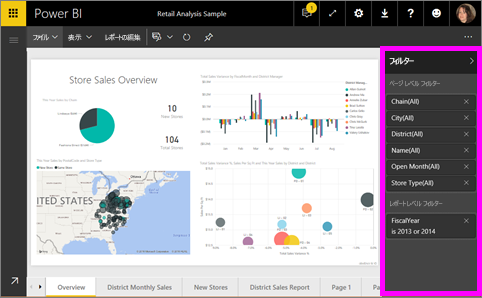

## 特定の視覚化へのフィルター (ビジュアル フィルター) の追加
これを行うには、次の 2 つの方法があります。 

* 1 つは、視覚化によって既に使われているフィールドにフィルターを追加する方法です。
* もう 1 つは、視覚化によってまだ使われていないフィールドを識別し、そのフィールドを**ビジュアル レベル フィルター** バケットに直接追加する方法です。

### 視覚化の既存フィールドのフィルター処理
1. [編集ビューでレポート](service-reading-view-and-editing-view.md)を開きます。
   
   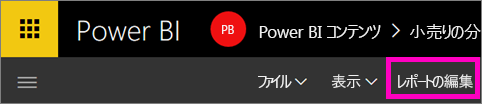
2. 視覚化およびフィルター ウィンドウとフィールド ウィンドウがまだ開いていない場合は開きます。
   
   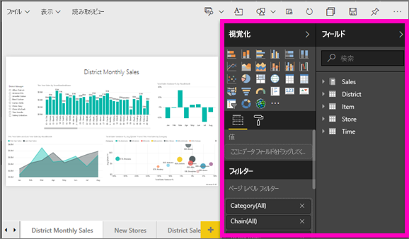
3. ビジュアルを選んでアクティブにします。 ビジュアルで使用されているすべてのフィールドが **[フィールド]** ウィンドウで識別され、**[フィルター]** ウィンドウの **[ビジュアル レベル フィルター]** 見出しの下にリストされます。
   
   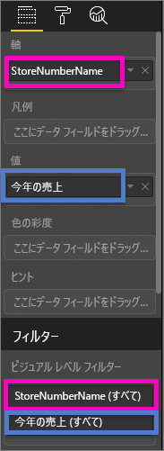
4. この時点で、視覚化によって既に使われているフィールドにフィルターを追加します。 
   
   * **[ビジュアル レベル フィルター]** 領域まで下にスクロールし、矢印を選んでフィルター処理するフィールドを展開します。 この例では **StoreNumberName** をフィルター処理します。
     
      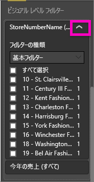 
   * フィルター処理コントロールとして **[基本]**、**[詳細]**、または **[上位 N]** を設定します (「[レポート フィルターの使用方法](power-bi-how-to-report-filter.md)」をご覧ください)。 この例では、基本フィルター処理を選択し、10、11、15、18 の数字の横にチェックマークを付けます。
     
      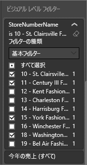 
   * ビジュアルに新しいフィルターが反映されます。 レポートをフィルターとともに保存すると、レポート閲覧者が読み取りビューでフィルターと対話でき、値を選んだりクリアしたりすることができます。
     
      
5. 次に、まったく新しいフィールドをビジュアル レベル フィルターとして視覚化に追加しましょう。
   
   * [フィールド] ウィンドウで新しいビジュアル レベル フィルターとして追加するフィールドを選び、**[ビジュアル レベル フィルター]** 領域までドラッグします。  この例では、**[District Manager (地区マネージャー)]** を **[ビジュアル レベル フィルター]** バケットにドラッグし、Andrew Ma だけを選択します。 
     
      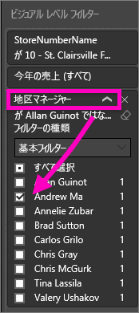
   * **[District Manager (地区マネージャー)]** は、視覚化自体に追加されるのでは*ありません*。 視覚化はまだ **[StoreNumberName]** を軸とし、**[This Year Sales (今年の売上)]** を値として構成されています。  
     
      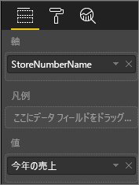
   * また、視覚化自体は、指定した店舗での Andrew の今年の売上だけを表示するようにフィルター処理されます。
     
     

## ページ全体へのフィルター (ページ ビュー フィルター) の追加
1. [編集ビューでレポート](service-reading-view-and-editing-view.md)を開きます。
2. 視覚化およびフィルター ウィンドウとフィールド ウィンドウがまだ開いていない場合は開きます。
3. [フィールド] ウィンドウで新しいページ レベル フィルターとして追加するフィールドを選び、**[ページ レベル フィルター]** 領域までドラッグします。  
4. フィルターを適用する値を選び、フィルター処理コントロールとして **[基本]** または **[詳細]** を設定します (「[レポート フィルターの使用方法](power-bi-how-to-report-filter.md)」をご覧ください)。
   
   ページでこのフィルターの影響を受けるすべての視覚化が、変更を反映するように再描画されます。 
   
   

レポートをフィルターとともに保存すると、レポート閲覧者が読み取りビューでフィルターと対話でき、値を選んだりクリアしたりすることができます。

## ドリルスルー フィルターを追加する
Power BI サービスと Power BI Desktop のドリルスルーでは、サプライヤー、顧客、メーカーなど、特定のエンティティに注目した "*ドリルスルー先*" レポート ページを作成できます。 ユーザーは、他のレポート ページでそのエンティティのデータ ポイントを右クリックして、フォーカスされたページにドリルスルーできます。

### ドリルスルー フィルターを作成する
最初に、お客様の収益性のサンプルを編集ビューで開きます。 Executive ビジネス領域に注目したページを作成します。   

1. レポートに新しいページを追加し、「**Team Executive**」という名前を付けます。 これが "*ドリルスルー先*" ページになります。
2. チーム エグゼクティブ ビジネス分野の主要指標を追跡するための視覚化を追加します。    
3. [ドリル スルー フィルター] ウェルに **[Executive] > [Executive Name]** を追加します。    
   
    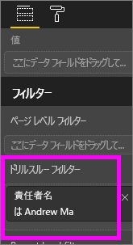
   
    レポート ページに戻る矢印が追加されることに注意してください。  戻る矢印を選ぶと、"*ドリルスルー元*" のレポート ページ (ドリルスルーを選んだときのページ) に戻ります。 戻る矢印は、読み取りビューでのみ機能します。
   
     

### ドリルスルー フィルターを使う
ドリルスルー フィルターのしくみを見てみましょう。

1. **[Team Scorecard]** レポート ページから始めます。    
2. Andrew Ma が自分のデータだけにフィルター処理された [Team Executive] レポート ページを見たいものとします。  左上の面グラフで任意の緑のデータ ポイントを右クリックして、[ドリルスルー] メニュー オプションを開きます。
   
    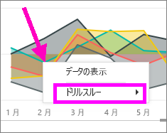
3. **[ドリルスルー] > [Team Executive]** を選んで、**[Team Executive]** という名前のレポート ページにドリルスルーします。 このページは、右クリックしたデータ ポイント (この場合は Andrew Ma) に関する情報を表示するようにフィルター処理されています。 ドリルスルー フィルターにあるフィールドのみが、ドリルスルー レポート ページに渡されます。  
   
    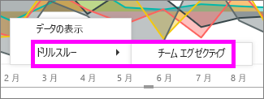

## レポート全体へのフィルターの追加 (レポート フィルター)
1. [編集ビューでレポート](service-reading-view-and-editing-view.md)を開きます。
2. 視覚化およびフィルター ウィンドウとフィールド ウィンドウがまだ開いていない場合は開きます。
3. [フィールド] ウィンドウで新しいレポート レベル フィルターとして追加するフィールドを選び、**[レポート レベル フィルター]** 領域までドラッグします。  
4. フィルターを適用する値を選びます (「[レポート フィルターの使用方法](power-bi-how-to-report-filter.md)」をご覧ください)。

アクティブ ページおよびレポート内のすべてのページ上のビジュアルに、新しいフィルターが反映されます。 レポートをフィルターとともに保存すると、レポート閲覧者が読み取りビューでフィルターと対話でき、値を選んだりクリアしたりすることができます。

1. 戻る矢印を選んで、前のレポート ページに戻ります。

## トラブルシューティング
### ビジュアル レベル フィルターとページ レベル フィルターが異なる結果を返す場合があるのはなぜですか。
ビジュアル レベル フィルターを追加すると、Power BI は集計結果をフィルター処理します。  既定の集計は合計ですが、[集計の種類を変更](service-aggregates.md)することもできます。  

ページ レベル フィルターを追加すると、Power BI は集計せずにフィルター処理します。  これは、ページには、それぞれさまざまな集計の種類を利用できるさまざまなビジュアルが適用されている可能性があるためです。  そのため、フィルターは各データ行に適用されます。

[フィールド] ウィンドウが表示されない場合は、レポートが[編集ビュー](service-interact-with-a-report-in-editing-view.md)になっていることを確認してください。

## 次の手順
 [レポート フィルターの使用方法](power-bi-how-to-report-filter.md)

  [レポート内のフィルターと強調表示](power-bi-reports-filters-and-highlighting.md)

[レポートの読み取りビューでのフィルターとの対話と強調表示](service-reading-view-and-editing-view.md)

[レポートのビジュアル相互間のクロスフィルター処理とクロス強調表示を変更する方法](service-reports-visual-interactions.md)

他にわからないことがある場合は、 [Power BI コミュニティを利用してください](http://community.powerbi.com/)。

