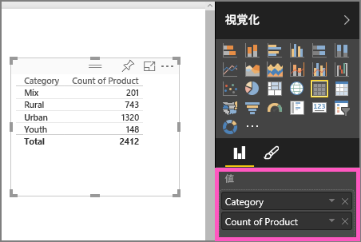
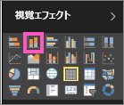

# パート I、Power BI レポートへの視覚化の追加 (チュートリアル)
この記事では、レポートで視覚化を作成する方法を簡単に説明します。  より高度な内容を調べるには、「[パート II](power-bi-report-add-visualizations-ii.md)」をご覧ください。 Amanda がレポート キャンバスでのビジュアルの作成、編集、書式設定についてさまざまな方法を示します。 このデモの後に、[売上およびマーケティングのサンプル](sample-datasets.md)を使用して、レポートを作成してみてください。

<iframe width="560" height="315" src="https://www.youtube.com/embed/IkJda4O7oGs" frameborder="0" allowfullscreen></iframe>

## レポートを開き、新しいページを追加します。
1. [レポートを編集表示で](service-reading-view-and-editing-view.md)開きます。 このチュートリアルでは、[売上およびマーケティングのサンプル](sample-datasets.md)を使います。
2. フィールド ウィンドウが表示されない場合は、矢印アイコンを選んで開きます。 
   
   
3. [空白ページをレポートに追加](power-bi-report-add-page.md)します。

## 視覚化をレポートに追加する
1. 視覚化を作成するため、 **[フィールド]** ウィンドウでフィールドを選びます。  
   
   **数値フィールドから始める** ([Sales] > [Sales $] など): Power BI によって単一列を含む縦棒グラフが作成されます。
   
   
   
   **カテゴリ フィールドから始める** ([Name] や [Product] など): Power BI によってテーブルが作成され、そのフィールドが **[値]** ウェルに追加されます。
   
   
   
   **地理フィールドから始める** ([Geo] > [City] など): Power BI と Bing 地図によって、マップの視覚化が作成されます。
   
   
2. 視覚化を作成し、その種類を変更します。 **[Product] > [Count of Product]** および **[Product] > [Category]** を選び、それらを **[値]** ウェルに追加します。
   
   
3. 視覚化を縦棒グラフに変更するため、縦棒グラフ アイコンを選びます。
   
   
4. レポート内に視覚化を作成するときには、[視覚化をダッシュボードにピン留め](service-dashboard-pin-tile-from-report.md)します。 視覚化をピン留めするには、ピン アイコン  を選びます。
   
   
5. これで次のことができるようになりました。
   
   [パート 2: Power BI レポートへの視覚化の追加](power-bi-report-add-visualizations-ii.md)に進む
   
   レポート内の[視覚化を操作する](service-reading-view-and-editing-view.md)
   
   [視覚化に対しその他の操作を実行する](power-bi-report-visualizations.md)
   
   [レポートを保存する](service-report-save.md)

## 次の手順
「[Power BI での視覚化](power-bi-report-visualizations.md)」をご覧ください。

[Power BI のレポート](service-reports.md)

他にわからないことがある場合は、 [Power BI コミュニティを利用してください](http://community.powerbi.com/)。

