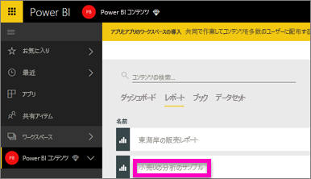
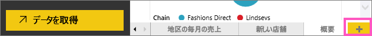
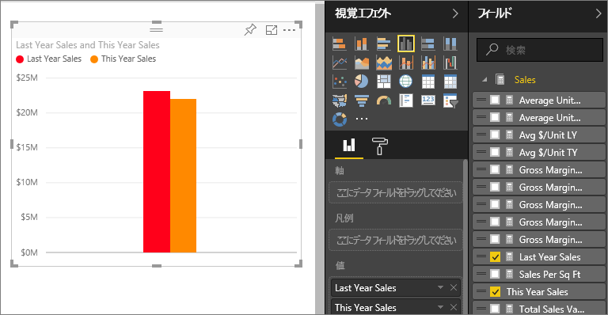
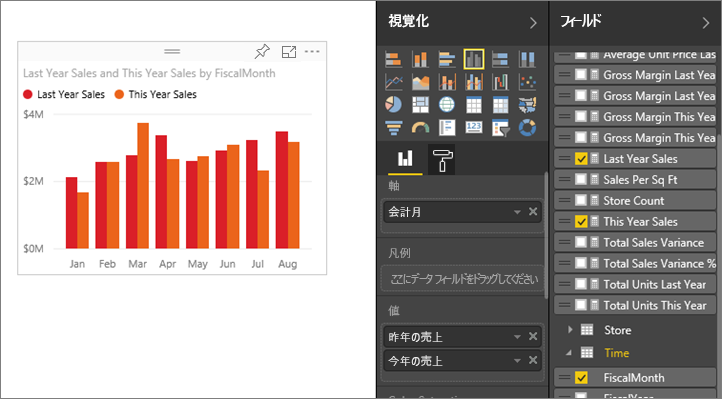
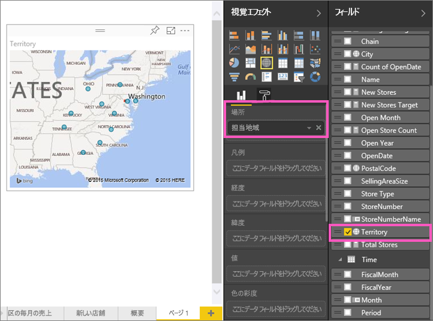
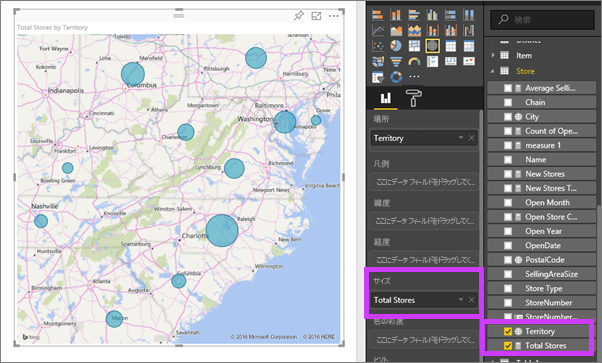
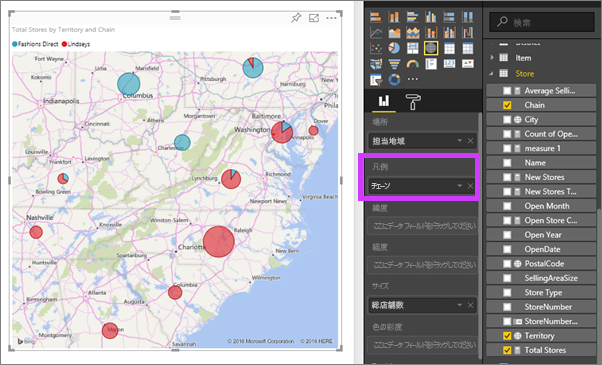

# パート 2、Power BI レポートへの視覚化の追加 (チュートリアル)
[パート 1](power-bi-report-add-visualizations-ii.md) では、フィールド名の横にあるチェックボックスを選んで、基本的な視覚化を作成しました。  パート 2 では、ドラッグ アンド ドロップを使用し、 **[フィールド]** ウィンドウと **[視覚化]** をウィンドウを最大限活用して、視覚化を作成および変更する方法について説明します。

### 前提条件
- [パート 1](power-bi-report-add-visualizations-ii.md)
- Power BI サービス - 視覚エフェクトは、Power BI サービスまたは Power BI Desktop を使ってレポートに追加できます。 このチュートリアルでは Power BI サービスを使用します。 
- 小売の分析のサンプル

## 視覚化の新規作成
このチュートリアルでは、小売りの分析のデータセットを詳しく調べ、いくつかの主要な視覚化を作成します。

### レポートを開き、新しい空白のページを追加します。
1. 小売りの分析サンプルを保存したワークスペースを開きます。 **[小売の分析のサンプル]** を選び、読み取りビューでレポートを開きます。
   
   
2. **[レポートの編集]** を選び、編集ビューでレポートを開きます。
   
   
3. [新しいページを追加](power-bi-report-add-page.md)するため、キャンバスの下部にある黄色の正符号アイコンを選びます。
   
   

### この年と前年の売上比較を示す視覚化を追加します。
1. **[セールス]** テーブルで **[This Year Sales]** (今年の売上) > **[値]**、**[Last Year Sales]** (前年の売上) を選びます。 Power BI によって縦棒グラフが作成されます。  興味深い内容であるため、詳しく分析していきましょう。 月別の売上はどのような状況でしょうか?  
   
   
2. 時間テーブルから、**[月]** を **[軸]** 領域までドラッグします。  
   
3. [視覚化を面グラフに変更](power-bi-report-change-visualization-type.md)します。  選択できる視覚化には多くの種類があります。どの種類を使ったらよいか調べるには、[それぞれの種類についての説明、ベスト プラクティスのヒント、チュートリアル](power-bi-visualization-types-for-reports-and-q-and-a.md)をご覧ください。 [視覚化] ウィンドウで面グラフ アイコンを選びます。
4. 視覚化を月別に並べ替えるには、省略記号を選び、**[Sort by Month]\(月別に並べ替え\)** を選びます。
5. [視覚化のサイズを変更](power-bi-visualization-move-and-resize.md)するため、視覚化を選び、輪郭の円の 1 つをグラブしてドラッグします。 幅を広げればスクロール バーが不要になり、小さくすれば別の視覚化を追加する領域を確保できます。
   
   
6. [レポートを保存](service-report-save.md)します。

### 場所別の売上を示すマップ視覚化を追加
1. **[Store]\(店舗\)** テーブルで **[Territory]** を選びます。 Power BI は [担当地域] が場所であることを認識するため、マップの視覚化を作成します。  
   
2. **[Total Stores]** (総店舗数) を [サイズ] 領域までドラッグします。  
   
3. 凡例を追加します。  店舗名別にデータを確認するには、 **[Chain]** (チェーン) を [凡例] 領域までドラッグします。  
   

## 次の手順
* フィールド ウィンドウについて詳しくは、「[レポート エディター...紹介を見る](service-the-report-editor-take-a-tour.md)」をご覧ください。   
* 視覚化のフィルター処理と強調表示の方法については、「[Power BI レポートのフィルターと強調表示](power-bi-reports-filters-and-highlighting.md)」をご覧ください。  
* 「[Power BI での視覚化](power-bi-report-visualizations.md)」をご覧ください。  
* 他にわからないことがある場合は、 [Power BI コミュニティを利用してください](http://community.powerbi.com/)。

