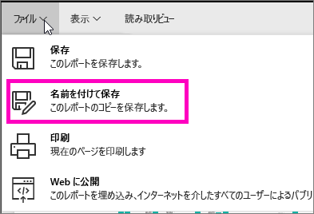

# 既存のレポートから新しいレポートを作成する (レポートのコピー)
既にデータセットに接続し、再利用または変更したいビジュアルを使ったレポートがあるとします。  そのような場合は、そのレポートをコピーし、新しいレポートの基礎として使用できます。  その方法は次のとおりです。

1. [レポートを開く](service-report-open.md)。
2. **[ファイル]** メニューの **[名前を付けて保存]** を選択します。
   
   
3. 新しいレポートの名前を入力し、 **[保存]** を選択します。
   
   
   
   新しいレポートが Power BI の現在のワークスペースに保存されると、成功を示すメッセージが表示されます。
   
   
4. ワークスペースの **[レポート]** タブを開き、新しいレポートを選んで開きます。 必要に応じて、不要なビジュアルの削除、他のビジュアルの変更、新しいビジュアルの追加を行います。
   
   
5. 新しいレポートを更新したり、編集したりしてみてください。

## 次の手順:
[視覚化の新規作成](power-bi-report-add-visualizations-ii.md)

不要な[視覚化の削除](service-delete.md)

[Power BI Desktop を使用してレポートを作成する](desktop-report-view.md)
