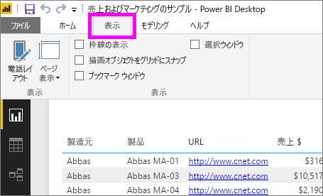
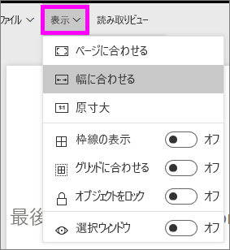
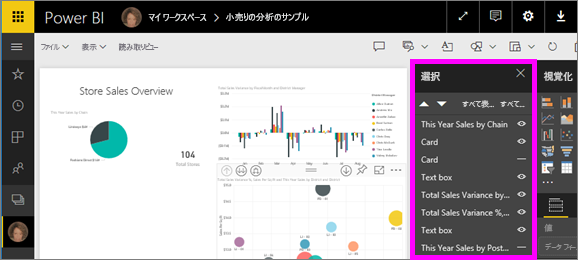
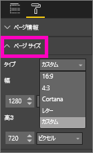

# Power BI レポートのページ表示設定
レポートのレイアウトをピクセル パーフェクトに保つことは重要です。 しかし場合によっては、自身や同僚が縦横比やサイズの異なる画面でレポートを表示しなければならないことがあります。 

既定の表示レイアウトは **[ページに合わせる]** で、既定の表示サイズは **[16:9]** です。 異なる縦横比にロックしたり、別の方法でレポートの表示を調整したりするには、***[ページ表示]*** 設定と ***[ページ サイズ]*** 設定の 2 つを利用できます。

<iframe width="560" height="315" src="https://www.youtube.com/embed/5tg-OXzxe2g" frameborder="0" allowfullscreen></iframe>

## Power BI サービスおよび Power BI Desktop でのページ ビュー設定の場所
ページ ビュー設定は Power BI サービスと Power BI Desktop の両方で使うことができますが、インターフェイスは若干異なります。 次の 2 つのセクションでは、各 Power BI ツールでのビュー設定の場所について説明します。

### Power BI Desktop の場合
レポート ビューで、**[表示]** タブを選んで [ページ表示] 設定と [電話レイアウト] 設定を開きます。

  

### Power BI サービス (app.powerbi.com) の場合
Power BI サービスでは、レポートを開き、左上のメニュー バーから **[表示]** を選びます。

[ページ表示] 設定は、[読み取りビューと編集ビュー](service-reading-view-and-editing-view.md)の両方で使用できます。 編集ビューでは、レポート所有者が個々のレポート ページにページ表示設定を割り当てることができ、それらの設定はレポートとともに保存されます。 同僚が読み取りビューでそのレポートを開くと、所有者の設定を使用してレポート ページが表示されます。  読み取りビューでは、同僚は "*一部*" のページ表示設定を変更できますが、レポートを終了するときに変更は保存されません。

##    ページ表示の設定
*[ページ表示]* 設定の最初のセットは、ブラウザー ウィンドウを基準とした相対的なレポート ページの表示を制御します。  次の中から選びます。

* **ページに合わせる** (既定値): ページに合わせて最適なサイズに内容が拡大/縮小されます。
* **幅に合わせる**: ページの幅に収まるように内容が拡大/縮小されます。
* **原寸大**: フル サイズで内容が表示されます。

*[ページ表示]* 設定の 2 番目のセットは、レポート キャンバス上のオブジェクトの位置を制御します

* **グリッド線の表示**: レポート キャンバスにオブジェクトを配置するときに役立つグリッド線を表示します
* **グリッドに合わせる**: **[グリッド線の表示]** と併用して、レポート キャンバス上のオブジェクトを正確に配置して整列させます 
* **オブジェクトをロック**: 移動したりサイズが変わったりしないように、キャンバス上のすべてのオブジェクトをロックします
* **選択ウィンドウ**: [選択] ウィンドウにはキャンバス上のすべてのオブジェクトが一覧表示され、オブジェクトの表示/非表示を決定できます

    

## ページ サイズ設定

"*ページ サイズ*" の設定は、編集ビューでのみ利用できます。 Power BI サービス (app.powerbi.com) の場合は、レポートを[編集ビュー](service-reading-view-and-editing-view.md)で開けることを意味します。 これらの設定は、レポート キャンバスの表示比率と実際のサイズ (ピクセル単位) を制御します。   

* 4:3 の縦横比
* 16:9 の縦横比 (既定値)
* Cortana
* 文字
* カスタム (ピクセル単位の高さと幅)

## 次の手順
[Power BI レポートでの [ページ表示] 設定と [ページ サイズ] 設定の使用方法](power-bi-change-report-display-settings.md)を習得します。

[Power BI のレポート](service-reports.md)についての詳細を参照する

[Power BI - 基本的な概念](service-basic-concepts.md)

他にわからないことがある場合は、 [Power BI コミュニティを利用してください](http://community.powerbi.com/)。

