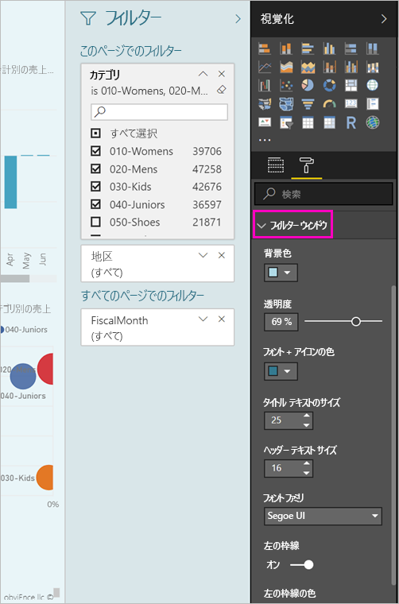
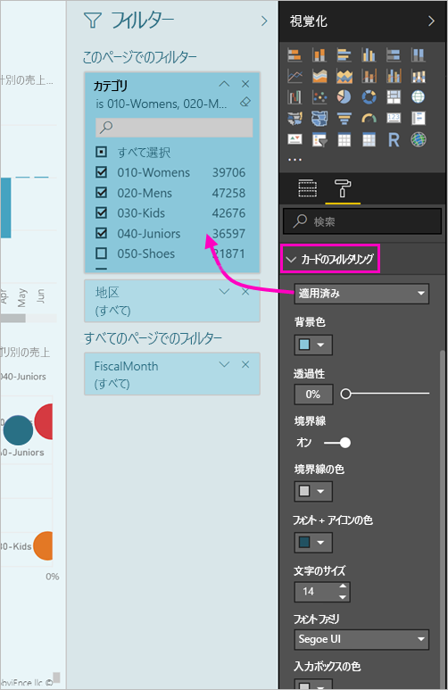

# <a name="the-new-filter-experience-in-power-bi-reports-preview"></a>Power BI レポートの新しいフィルター エクスペリエンス (プレビュー)

Power BI でのフィルターは、新機能と新しいデザインがあります。 新しいフィルター エクスペリエンスに参加するときに、レポートの残りの部分のように、フィルター ウィンドウが書式設定できます。 ロックし、フィルターの非表示もできます。 レポートを設計するときに、[視覚化] ウィンドウですべての以前のフィルター ウィンドウは表示されなくなります。 編集および 1 つのフィルター ペインで書式設定、すべてのフィルター操作を行います。 


> [!NOTE]
> 新しいフィルター エクスペリエンスがプレビュー段階にあります。 新しいビルドにより、既に設定してある書式設定がオーバーライドされる可能性があります。

レポート デザイナーでは、次新しい 1 つのフィルター ウィンドウで行うことができますに示します。

- 追加し、フィルターを適用するフィールドを削除します。 
- フィルターの状態を変更します。
- フォーマットし、レポートの一部を感じるように、フィルター ペインをカスタマイズします。
- コンシューマーがレポートを開くときに、フィルター ウィンドウは既定で開いているのか、折りたたまれているのかを定義する。
- フィルター ウィンドウの全体または表示するレポート コンシューマーはしたくない特定のフィルターを非表示にします。
- 制御し、表示、新しいフィルター ウィンドウの [開く]、折りたたまれた状態にもブックマークを設定します。
- コンシューマーに編集させたくないフィルターをロックする。

新しいフィルター エクスペリエンスで、レポート コンシューマーはフィルターまたはスライサーがビジュアルに影響を与えるすべての読み取り専用の一覧を表示するビジュアル上移動もできます。


## <a name="turn-on-the-new-filter-experience"></a>新しいフィルター エクスペリエンスを有効にする 

Power BI Desktop で新しいエクスペリエンスを有効にします。 そうすると、そこか Power BI サービス (https://app.powerbi.com) 内でフィルターを変更できるようになります。 この新しいフィルター エクスペリエンスはプレビュー段階のため、最初に Power BI Desktop で有効にする必要があります。 Power BI サービスでレポートを作成して開始する場合は、新しいフィルターを設定できません。

### <a name="turn-on-new-filters-for-all-new-reports"></a>新しいレポートすべてに対して新しいフィルターを有効にする

1. Power BI Desktop で、 **[ファイル]**  >  **[オプションと設定]**  >  **[オプション]**  >  **[プレビュー機能]** の順に選択し、 **[新しいフィルター エクスペリエンス]** チェックボックスをオンにします。 
2. Power BI Desktop を再起動して、すべての新しいレポートに新しいフィルター エクスペリエンスがあることを確認します。

Power BI Desktop を再起動すると、作成するすべての新しいレポートに対してこれが既定で有効になります。  

### <a name="turn-on-new-filters-for-an-existing-report"></a>既存のレポートに対して新しいフィルターを有効にする

既存のレポートに対して新しいフィルターを有効にすることもできます。

1. Power BI Desktop の既存のレポート内で、 **[ファイル]**  >  **[オプションと設定]**  >  **[オプション]** を選択します。
2. 左側のナビゲーション バーで **現在ファイル**を選択します**設定がレポート**します。
3. **エクスペリエンスをフィルタ リング**を選択します **、更新されたフィルター ペインを有効にして、このレポートのビジュアルのヘッダーにフィルターを表示する**します。

## <a name="view-filters-for-a-visual-in-reading-mode"></a>閲覧モードでビジュアルのフィルターを表示する

閲覧モードでは、ビジュアルのフィルター アイコンにカーソルを合わせると、そのビジュアルに影響を与えているすべてのフィルターやスライサーなどを含むポップアップが表示されます。 ポップアップの書式設定すると、フィルター ペインの書式設定と同じです。 


このビューに表示されるフィルターの種類は次のとおりです。 
- 基本フィルター
- スライサー
- クロス強調表示 
- クロス フィルター処理
- 高度なフィルター
- 上位 N のフィルター
- 相対日付フィルター
- 同期スライサー
- 含める/除外するフィルター
- URL を使って渡されるフィルター

## <a name="build-the-new-filters-pane"></a>新しいフィルター ウィンドウを作成します。

新しいフィルター ウィンドウを有効にした後は、既定では、現在のレポートの設定に基づいて書式設定、レポートのページの右側に表示します。 含めるには、新しいウィンドウで既存のフィルターを更新してのに、どのフィルターを構成するのにには、新しいフィルター ペインを使用します。 どのようなレポート コンシューマーが表示されます、レポートを発行するときに、新しいフィルター ウィンドウを示しています。 

1. 既定では、レポート コンシューマーは、フィルター ウィンドウを参照してくださいことができます。 確認することをしない場合、目のアイコンが横に選択**フィルター**します。

    

2. 新しいフィルター ウィンドウの作成を始めるとしてビジュアルでは、ページで、新しいフィルター ウィンドウに関心のあるフィールドをドラッグまたはレポート レベル フィルター。

レポート キャンバスにビジュアルを追加するときに Power BI は自動的に、ビジュアル内の各フィールドのフィルター ウィンドウにフィルターを追加します。 

## <a name="lock-or-hide-filters"></a>フィルターのロックまたは非表示

個別のフィルター カードをロックしたり非表示にしたりすることができます。 フィルターをロックすると、レポートのコンシューマーはそれを表示できますが、変更はできません。 これを非表示にすると、表示もされなくなります。 フィルター カードの非表示は、null 値や予期しない値を除外する、データのクリーンアップ用フィルターを非表示にする必要がある場合に、特に便利です。 

- 新しい [フィルター] ウィンドウでオンまたはオフ、**ロック フィルター**または**非表示にするフィルター**フィルター カード内のアイコン。

   

新しいフィルター ウィンドウのオンとオフをこれらの設定を有効にすると、レポートに変更が反映を参照してください。 非表示のフィルターは、ビジュアルのフィルター ポップアップに表示されません。

新しいフィルター ペインの状態レポートにブックマークを使用したフローを構成することもできます。 ウィンドウを開いた状態、閉じた状態、および表示の状態は、すべてブックマーク可能です。
 
## <a name="format-the-new-filters-pane"></a>新しいフィルター ウィンドウを書式設定する

この新しいエクスペリエンスの大きな部分は、レポートのルック アンド フィールを一致するように、フィルター ウィンドウをフォーマットすることができます。 レポートのページごとに異なる方法でフィルター ウィンドウの書式を設定することができます。 書式設定できる要素は次のとおりです。 

- 背景色
- 背景の透明度
- 枠線のオン/オフ
- 境界線の色
- タイトルとヘッダーのフォント、色、およびテキストのサイズ

また、フィルター カードに対しても、それが適用されている (何かに設定されている) か、または使用可能 (オフ) かに応じて、これらの要素を書式設定することができます。 

- 背景色
- 背景の透明度
- 境界線: オンまたはオフ
- 境界線の色
- フォント、色、テキスト サイズ
- 入力ボックスの色

### <a name="format-the-filters-pane-and-cards"></a>[フィルター] ウィンドウおよびカードの書式設定します。

1. レポート内で、レポート自体か背景 ("*壁紙*") をクリックしてから、 **[視覚化]** ウィンドウ内で **[書式]** を選択します。 
    レポート ページ、壁紙ともフィルター ウィンドウとフィルター カードの書式設定オプションが表示されます。

        

1. **[フィルター ウィンドウ]** を展開して背景、アイコン、左の境界線の色を設定し、レポート ページを補完します。

    

1. **[フィルター カード]** を展開して、色と境界線の **[使用可能]** と **[適用済み]** を設定します。 カードのさまざまな色を使用可能にして適用すれば、どのフィルターが適用されているか明確になります。 
  
    

## <a name="theming-for-filter-pane"></a>フィルター ペインのテーマ
今すぐテーマ ファイルを使用して、フィルター ペインの既定の設定を変更できます。 開始するためのサンプル テーマ スニペットを次に示します。

 
```
"outspacePane": [{ 

"backgroundColor": {"solid": {"color": "#0000ff"}}, 

"foregroundColor": {"solid": {"color": "#00ff00"}}, 

"transparency": 50, 

"titleSize": 35, 

"headerSize": 8, 

"fontFamily": "Georgia", 

"border": true, 

"borderColor": {"solid": {"color": "#ff0000"}} 

}], 

"filterCard": [ 

{ 

"$id": "Applied", 

"transparency": 0, 

"backgroundColor": {"solid": {"color": "#ff0000"}}, 

"foregroundColor": {"solid": {"color": "#45f442"}}, 

"textSize": 30, 

"fontFamily": "Arial", 

"border": true, 

"borderColor": {"solid": {"color": "#ffffff"}}, 

"inputBoxColor": {"solid": {"color": "#C8C8C8"}} 

}, 

{ 

"$id": "Available", 

"transparency": 40, 

"backgroundColor": {"solid": {"color": "#00ff00"}}, 

"foregroundColor": {"solid": {"color": "#ffffff"}}, 

"textSize": 10, 

"fontFamily": "Times New Roman", 

"border": true, 

"borderColor": {"solid": {"color": "#123456"}}, 

"inputBoxColor": {"solid": {"color": "#777777"}} 

}] 
```

## <a name="sort-the-filter-pane"></a>並べ替え、フィルター ペイン

カスタムの並べ替え機能は、新しいフィルター ウィンドウのエクスペリエンスの一部です。 レポートの作成者は、ドラッグし、彼らの希望する順序で並べ替えるフィルターを削除します。


既定の並べ替え順序は、フィルターのアルファベット順です。 カスタムの並べ替えモードを開始するには、だけの新しい位置に任意のフィルターをドラッグします。 フィルター - たとえば、ビジュアル レベル、ページ レベル、またはレポート レベル フィルターに適用されるレベル内でのみ並べ替えることができます。

## <a name="filters-pane-scaling"></a>ウィンドウ スケーリングをフィルター処理します。

新しいフィルター ウィンドウはそのため、レポート ページのレポート ページとビジュアルがスケーリングでき、相互の割合のウィンドウを維持をフィルターします。

## <a name="improved-filters-pane-accessibility"></a>フィルター ペインのアクセシビリティの機能の向上

新しいフィルター ウィンドウのキーボード ナビゲーションが向上しました。 [フィルター] ウィンドウのすべての部分をタブし、コンテキスト メニューを開き、キーボードまたは Shift + F10 でコンテキスト キーを使用できます。


## <a name="rename-filters"></a>フィルターの名前を変更します。
フィルター ウィンドウを編集するときは、タイトルを編集することをダブルクリックすることができます。 名前変更は、エンドユーザーの方が簡単にフィルターのカードを更新する場合に便利です。 フィルターのカードの名前を変更に注意してくださいは*いない*フィールドの一覧でフィールドの表示名を変更します。 フィルターのカードで使用される表示名を変更するだけです。


## <a name="restrict-changes-to-filter-type"></a>フィルターの種類への変更を制限します。

Filtering ユーザーは、フィルターの種類を変更できる場合を制御するオプションがある、レポートの設定のセクションが発生します。


## <a name="next-steps"></a>次の手順

新しいフィルター エクスペリエンスをお試しください。 この機能により、および方法を続けられる、改善するために、フィードバックを提供、 [Power BI Ideas サイト](https://ideas.powerbi.com/forums/265200-power-bi)します。 

- [レポート フィルターの使用方法](consumer/end-user-report-filter.md)
- [レポート内のフィルターと強調表示](power-bi-reports-filters-and-highlighting.md)

他にわからないことがある場合は、 [Power BI コミュニティを利用してください](http://community.powerbi.com/)。

