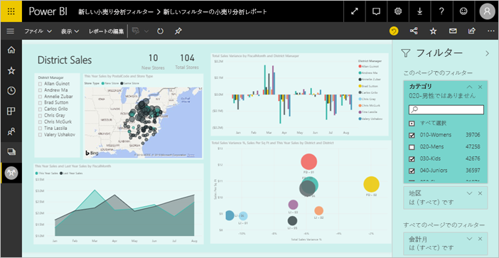
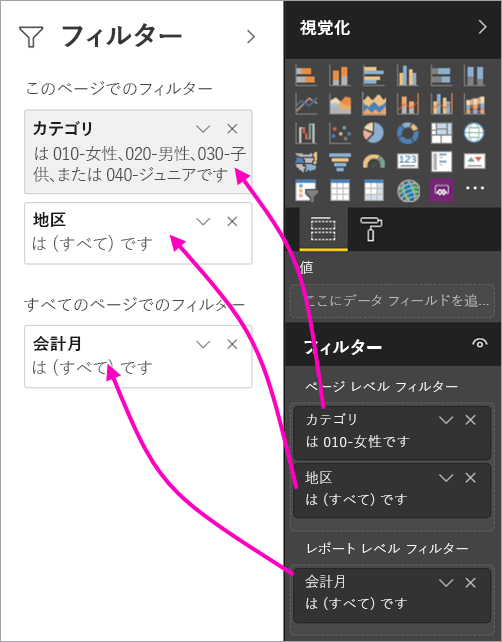
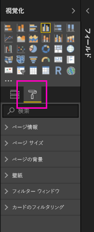
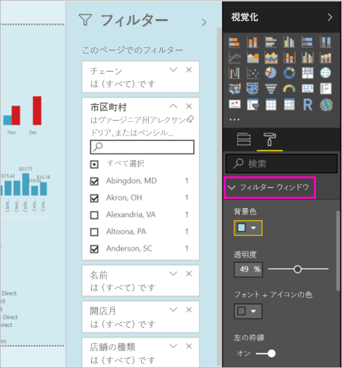
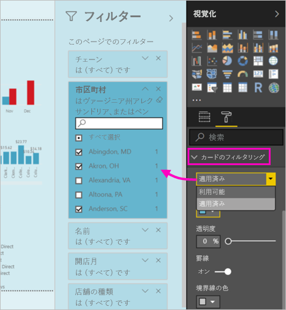
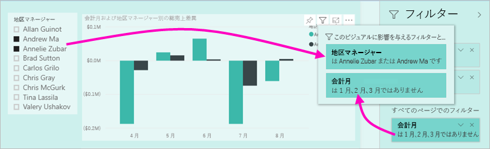

# Power BI レポートの新しいフィルター エクスペリエンス (プレビュー)

この記事では、新しいフィルター エクスペリエンスについて詳しく説明します。Power BI のフィルターに、新しい機能と新しいデザインが追加されます。 Power BI Desktop または Power BI サービスでレポートを設計するときに、フィルター ウィンドウをレポート全体に見えるように作成し、それと連携させることができます。 新しいエクスペリエンスでは、古いフィルター ウィンドウがフィルターの編集ウィンドウのように機能し、新しいフィルター ウィンドウだけが自分のレポートのコンシューマーに表示されます。 
 

レポート デザイナーが新しいフィルターを使って実行できることは次のとおりです。

- フィルターの読み取り専用ビューをビジュアル ヘッダーに表示して、特定のビジュアルに影響を与えているフィルターまたはスライスをコンシューマーが正確に把握できるようにする。
- レポートの一部と感じられるようにフィルター ウィンドウを書式設定およびカスタマイズする。
- コンシューマーがレポートを開くときに、フィルター ウィンドウは既定で開いているのか、折りたたまれているのかを定義する。
- フィルター ウィンドウ全体、またはレポートのコンシューマーに表示させたくない特定のフィルターを非表示にする。
- 新しいフィルター ウィンドウの表示、開く、折りたたむなどの状態を制御し、ブックマークする。
- コンシューマーに編集させたくないフィルターをロックする。

## 新しいフィルター エクスペリエンスを有効にする 

Power BI Desktop で新しいエクスペリエンスを有効にします。 そうすると、そこか Power BI サービス (https://app.powerbi.com) 内でフィルターを変更できるようになります。 この新しいフィルター エクスペリエンスはプレビュー段階のため、最初に Power BI Desktop で有効にする必要があります。 

### 新しいレポートすべてに対して新しいフィルターを有効にする

1. **[ファイル]** > **[オプションと設定]** > **[オプション]** > **[プレビュー機能]** の順に選択し、**[新しいフィルター エクスペリエンス]** チェックボックスをオンにします。 
2. Power BI Desktop を再起動して、すべての新しいレポートに新しいフィルター エクスペリエンスがあることを確認します。

Power BI Desktop を再起動すると、作成するすべての新しいレポートに対してこれが既定で有効になります。  

### 既存のレポートに対して新しいフィルターを有効にする

既存のレポートに対して新しいフィルターを有効にすることもできます。

1. 既存のレポート内で、**[ファイル]** > **[オプションと設定]** > **[オプション]** を選択します。
2. **[レポートの設定]** の下で、**[このレポートに関して、更新されたフィルター ウィンドウを有効にし、ビジュアル ヘッダーにフィルターを表示する]** を選択します。

## 新しいフィルター ウィンドウを構築する

新しいフィルター ウィンドウを有効にすると、レポート ページの右側に表示されます。これは既定で、現在のレポートの設定に基づいて書式設定されます。 古いフィルター ウィンドウはフィルターの編集ウィンドウとして機能するようになります。 新しいフィルター ウィンドウには、公開したレポートがレポートのコンシューマーにどのように表示されるかが示されます。 新しいウィンドウで既存のフィルターを更新できますが、どのフィルターを含めるか構成する場合は古いフィルター ウィンドウを使用します。

1. 最初に、フィルター ウィンドウがレポートのコンシューマーに表示されるかどうかを決定します。 表示させたい場合は、目のアイコン  を選択します (フィルターの横)。

2. 新しいフィルター ウィンドウの構築を始めるには、目的のフィールドを、ビジュアル、ページ、レポートいずれかのレベルのフィルターとして、フィルターの編集ウィンドウにドラッグします。 これらが新しいフィルター ウィンドウに表示されます。

    

レポート キャンバスに新しいビジュアルを追加すると、Power BI によってビジュアル内の各フィールドにフィルターが自動的に追加されます。 Power BI では、これらの自動フィルターは読み取り専用のフィルター ウィンドウには追加されません。 自分で目のアイコンを選択して、明示的にそれらを追加する必要があります。

 
## フィルターのロックまたは非表示

個別のフィルター カードをロックしたり非表示にしたりすることができます。 フィルターをロックすると、レポートのコンシューマーはそれを表示できますが、変更はできません。 これを非表示にすると、表示もされなくなります。 フィルター カードの非表示は、null 値や予期しない値を除外する、データのクリーンアップ用フィルターを非表示にする必要がある場合に、特に便利です。 

- フィルターの編集ウィンドウで、フィルター カード内にある **[フィルターをロックします]** または **[フィルターの非表示]** アイコンを選択または選択解除します。

   

フィルターの編集ウィンドウでこれらの設定のオンとオフを切り替えると、新しいフィルター ウィンドウ内で変更が反映されるのを確認できます。 非表示のフィルターは、ビジュアルのフィルター ポップアップに表示されません。

また、フィルター ウィンドウの状態を構成して、レポートのブックマークで満たすことも可能です。 ウィンドウを開いた状態、閉じた状態、および表示の状態は、すべてブックマーク可能です。
 
## 新しいフィルター ウィンドウを書式設定する

この新しいエクスペリエンスの大きな割合を占めるのは、レポートのルック アンド フィールと一致するようにフィルター ウィンドウを書式設定できるようになったことです。 レポート内のページごとに異なる方法でフィルター ウィンドウを書式設定できます。 書式設定できる要素は次のとおりです。 

- 背景色
- 背景の透明度
- フィルター ウィンドウの境界線のオンまたはオフ
- フィルター ウィンドウの境界線の色

また、フィルター カードに対しても、それが適用されている (何かに設定されている) か、または使用可能 (オフ) かに応じて、これらの要素を書式設定することができます。 

- 背景色
- 背景の透明度
- 境界線: オンまたはオフ
- 境界線の色

### フィルター ウィンドウとカードの書式を設定する

1. レポート内で、レポート自体か背景 ("*壁紙*") をクリックしてから、**[視覚化]** ウィンドウ内で **[書式]** を選択します。 
    レポート ページや壁紙、またフィルター ウィンドウやフィルター カードを書式設定するためのオプションが表示されます。

        

1. **[フィルター ウィンドウ]** を展開して背景、フォント、アイコン、左の境界線の色を設定し、レポート ページを補完します。

    

1. **[フィルター カード]** を展開して、色と境界線の **[使用可能]** と **[適用済み]** を設定します。 カードのさまざまな色を使用可能にして適用すれば、どのフィルターが適用されているか明確になります。 
  
    

## 閲覧モードでビジュアルのフィルターを表示する

閲覧モードでは、ビジュアルにカーソルを合わせると、そのビジュアルに影響を与えているすべてのフィルターやスライサーなどを含むポップアップを表示させることができます。 ポップアップの書式設定はフィルター ウィンドウの書式設定と同じです。 

このビューに表示されるフィルターの種類は次のとおりです。 
- 基本フィルター
- スライサー
- クロス強調表示 
- クロス フィルター処理
- 高度なフィルター
- 上位 N のフィルター
- 相対日付フィルター
- 同期スライサー
- 含める/除外するフィルター
- URL を使って渡されるフィルター

## 近日公開予定

今後数か月の間に、次の機能強化を組み込む予定です。
- フィルター カードの順序を変更する機能
- レポートの作成者に向けた単一フィルター ウィンドウのエクスペリエンス 
- その他の書式設定オプション

新しいフィルター エクスペリエンスをお試しください。 この機能のフィードバックや、このエクスペリエンスの改善を続けていくための方法についてのご意見をお待ちしております。 

## 次の手順
[レポート フィルターの使用方法](consumer/end-user-report-filter.md)

[レポート内のフィルターと強調表示](power-bi-reports-filters-and-highlighting.md)

[レポートの読み取りビューでのフィルターとの対話と強調表示](consumer/end-user-reading-view.md)

[レポートのビジュアル相互間のクロスフィルター処理とクロス強調表示を変更する方法](consumer/end-user-interactions.md)

他にわからないことがある場合は、 [Power BI コミュニティを利用してください](http://community.powerbi.com/)。

