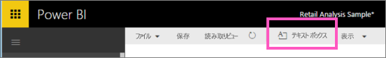
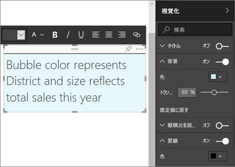
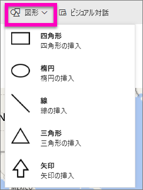
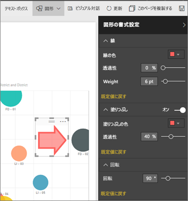

# Power BI レポートの静的コンテンツ
Power BI サービスと Power BI Desktop を使用すると、レポートにテキスト ボックスや図形を追加できます。 どちらの場合もレポートの編集アクセス許可が必要です。 Power BI サービスでレポートが自分と共有されている場合、編集アクセス許可はありません。 

Will が Power BI Desktop を使用して[静的な画像をレポートに追加](guided-learning/visualizations.yml#step-11)する様子をご覧ください。視聴後は下記の手順に従い、ご自身で Power BI サービスをお試しください。
> 
> <iframe width="560" height="315" src="https://www.youtube.com/embed/_3q6VEBhGew" frameborder="0" allowfullscreen></iframe>
> 

## レポートにテキスト ボックスを追加する
1. レポートを編集ビューで開きます。

2. レポート キャンバス内の任意の空白の位置にカーソルを置いて、**[テキスト ボックス]** を選びます。
   
   
2. テキスト ボックスにテキストを入力し、必要に応じて、フォント、色、テキストの配置を書式設定します。 
   
   
3. テキスト ボックスを配置するには、上部にある灰色の領域を選んでドラッグします。 また、テキスト ボックスのサイズを変更するには、アウトライン ハンドルのいずれかを選んでドラッグします。 
   
   

4. テキスト ボックスを選択したまま、[視覚化] ウィンドウでさらに書式設定を追加します。 この例では背景や罫線を書式設定しました。 サイズと位置を厳密に指定したテキスト ボックスを作成することもできます。  

   

5. テキスト ボックスを閉じるには、レポート キャンバス上の任意の空白領域を選びます。 

5. テキスト ボックスをダッシュボードにピン留めするには、ピン アイコン  を選びます。 

## レポートに図形を追加する
1. レポート キャンバス内の任意の位置にカーソルを置いて、**[図形]** を選びます。
   
   
2. ドロップダウン リストで、レポート キャンバスに追加する図形を選択します。 合計売上の分散が最も高いバブルに注意を向ける矢印を追加してみましょう。 
   
   **[図形の書式設定]** ウィンドウで、図形をカスタマイズします。 この例では、90° 回転された暗い赤い境界線付きの赤い矢印を作成しました。
   
   
3. 図形を配置するには、上部にある灰色の領域を選んでドラッグします。 また、図形のサイズを変更するには、アウトライン ハンドルのいずれかを選んでドラッグします。 テキスト ボックスと同様に、サイズと位置を厳密に指定した図形を作成することもできます。

> **注**: 図形をダッシュボードにピン留めすることはできませんが、[ライブ ページをピン留め](service-dashboard-pin-live-tile-from-report.md)するときに図形をビジュアルの 1 つにすることはできます。 
> 
> 

### 次の手順
[テキスト ボックスへのハイパーリンクの追加](service-add-hyperlink-to-text-box.md)

[Power BI - 基本的な概念](service-basic-concepts.md)

他にわからないことがある場合は、 [Power BI コミュニティを利用してください](http://community.powerbi.com/)。
