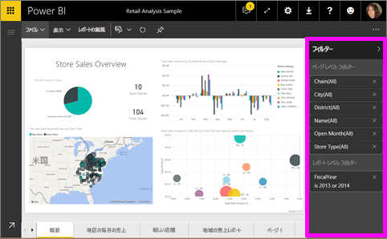
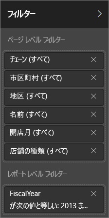
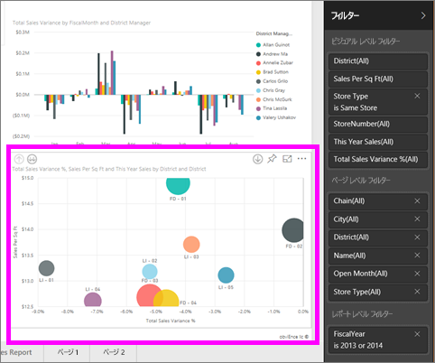
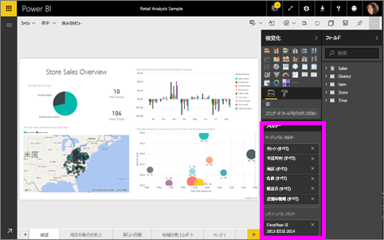

# Power BI レポートのフィルターと強調表示について
 この記事では、Power BI サービスでのフィルター処理と強調表示の概要を示します。 操作は Power BI Desktop の場合とほぼ同じです。 ***フィルター処理***を実行すると、絞り込んだデータ以外のすべてのデータが削除されます。 "***強調表示***" はフィルター処理ではありません。 データが削除されることはなく、表示されるデータのサブセットが強調表示され、強調表示対象外のデータは淡色表示になります。

Power BI ではさまざまな方法でレポートをフィルター処理および強調表示できます。 すべての情報をまとめて説明すると混乱するので、以下のセクションに分けて説明します。

* フィルターと強調表示の概要 (この記事)
* レポートの[編集ビューでフィルターを作成して使用する](power-bi-report-add-filter.md)方法。 レポートの編集アクセス許可がある場合、レポートでフィルターを作成、変更、削除できます。
* レポートの読み取りビューにおいて、[共有されているレポートでフィルターと強調表示を使用する](consumer/end-user-reading-view.md)方法。 できることには限りがありますが、それでもさまざまなフィルター処理と強調表示のオプションを使用できます。  
* [編集ビューで使用できるフィルターと強調表示のコントロール](consumer/end-user-report-filter.md)の詳細なツアー。フィルターの種類の詳細 (例: 日付と時刻、数値、テキスト) や、基本オプションと詳細オプションの違いなどです。
* フィルターと強調表示の既定の動作を理解した後は、[ページの視覚エフェクトが相互にフィルターおよび強調表示する方法を変更する](consumer/end-user-interactions.md)方法を学習してください

## フィルター ウィンドウの概要

**[フィルター]** ウィンドウで、またはレポート自体で直接[スライサーを使って選択する](visuals/power-bi-visualization-slicers.md)ことにより、フィルターを適用することができます。 フィルター ウィンドウには、レポートで使用されているテーブルとフィールド、および適用されているフィルター (ある場合) が表示されます。 

フィルターには次の 4 つの種類があります。

- **ページ フィルター**は、レポート ページ上のすべてのビジュアルに適用されます。     
- **ビジュアル フィルター**は、レポート ページ上の単一のビジュアルに適用されます。 レポート キャンバスでビジュアルを選択した場合は、ビジュアル レベル フィルターだけが表示されます。    
- **レポート フィルター**は、レポート内のすべてのページに適用されます。    
- **ドリルスルー フィルター**は、レポート内の単一のエンティティーに適用されます。    

読み取りビューまたは編集ビューで、ページ フィルター、ビジュアル フィルター、レポート フィルターを使用して検索を行い、目的の値を探して選択できます。 

フィルターに**すべて**と表示されている場合は、フィールドのすべての値がフィルターに含まれることを意味します。  たとえば、次のスクリーンショットの **[Chain(All)]\(Chain は (すべて) です\)** は、このレポート ページにすべてのストア チェーンに関するデータが含まれることを意味します。  一方、レポート レベル フィルターの **[FiscalYear is 2013 or 2014]\(FiscalYear が 2013 または 2014 である\)** は、レポートに 2013 年および 2014 年の会計年度のデータのみが含まれることを示します。

## 読み取りビューまたは編集ビューでのフィルター
レポートとの対話には、[読み取りビュー](consumer/end-user-reading-view.md)と編集ビューの 2 つのモードがあります。 使用できるフィルター処理機能は、どのモードを使用しているかによって異なります。

* 編集ビューでは、レポート、ページ、ドリルスルー、ビジュアルの各フィルターを追加できます。 モバイル アプリで開く場合でも、レポートを保存すると、フィルターはレポートと共に保存されます。 読み取りビューでレポートを表示しているユーザーは、追加したフィルターと対話できますが、新しいフィルターを追加することはできません。
* 読み取りビューでは、レポートに既に存在するすべてのフィルターと対話して、行った選択の内容を保存することができます。 新しいフィルターを追加することはできません。

### 読み取りビューでのフィルター
読み取りビューでしかレポートにアクセスできない場合、フィルター ウィンドウは次のようになります。

レポートのこのページには、6 個のページ レベル フィルターと 1 個のレポート レベル フィルターがあります。

各ビジュアルではビジュアル内のすべてのフィールドにフィルターを設定でき、レポート作成者はさらに追加できます。 次の図では、バブル チャートに 6 個のフィルターがあります。

読み取りビューでは、既存のフィルターを変更することによってデータを調べます。 モバイル アプリでレポートを開く場合でも、加えた変更の内容はレポートと共に保存されます。 方法については、「[レポート フィルター ウィンドウの使用方法](consumer/end-user-report-filter.md)」をご覧ください

レポートの終了時に、フィルターが保存されます。 フィルター処理を取り消し、レポート作成者が設定したフィルター処理、スライス、ドリル、並べ替えに戻すには、一番上のメニュー バーから **[既定値にリセット]** を選択します。

### 編集ビューでのフィルター
レポートに対する所有者権限を持つユーザーが編集ビューでレポートを開くと、**フィルター**は使用可能な複数の編集ウィンドウの 1 つとして表示されます。

読み取りビューと同じように、レポートのこのページには、6 個のページ レベル フィルターと 1 個のレポート レベル フィルターがあります。 また、バブル チャートを選択すると、6 個のビジュアル レベル フィルターが適用されていることがわかります。

編集ビューでは、フィルターと強調表示に関してさらに多くのことができます。 まず第一に、新しいフィルターを追加できます。 その方法と他の機能については、「[レポートにフィルターを追加する](power-bi-report-add-filter.md)」をご覧ください。

## アドホックの強調表示
レポート キャンバスでフィールドを選択すると、ページの他のビジュアルが強調表示されます。 同じビジュアルの空いている領域を選択すると、フィルターおよび強調表示が解除されます。 この種の強調表示では、データの影響を簡単に調べることができます。 この種のクロス強調表示を微調整する場合は、「[Power BI レポートでの視覚化の相互作用](consumer/end-user-interactions.md)」をご覧ください。

## 次の手順
[レポートへのフィルターの追加 (編集ビュー)](power-bi-report-add-filter.md)

[レポート フィルターの使用方法](consumer/end-user-report-filter.md)

[レポートのビジュアル相互間のクロスフィルター処理とクロス強調表示を変更する方法](consumer/end-user-interactions.md)

他にわからないことがある場合は、 [Power BI コミュニティを利用してください](http://community.powerbi.com/)。

