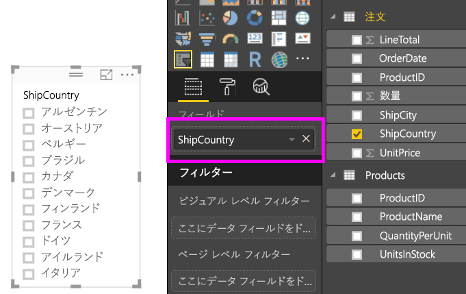
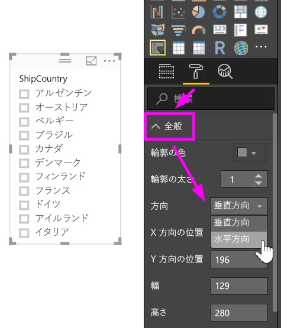
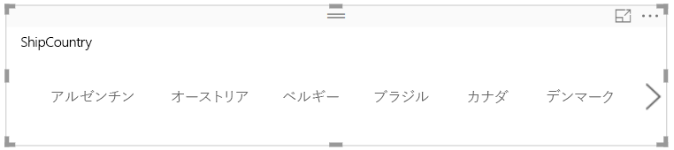
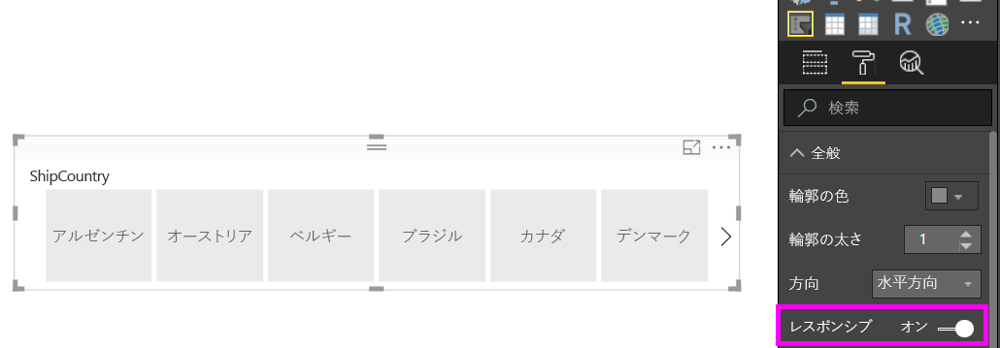
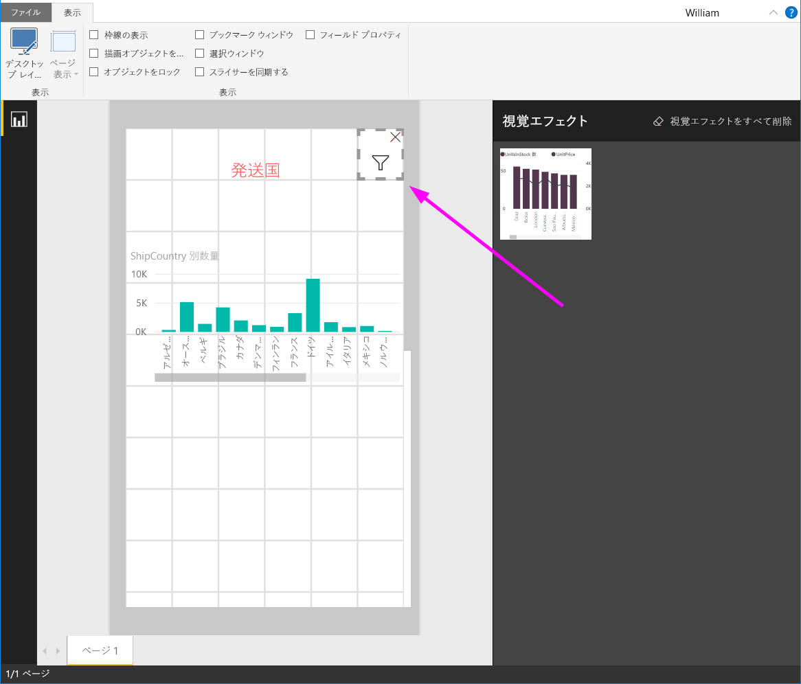

# Power BI でサイズを変更することが可能なレスポンシブ スライサーの作成

レスポンシブ スライサーは、レポート上の領域に合わせてサイズが変わります。 レスポンシブ スライサーでは、異なるサイズに変更したり、水平から正方形や垂直などの異なる図形に変更できます。また、スライサー内の値を変更することで、スライサー自体を並べ替えることができます。 Power BI Desktop と Power BI サービスでは、水平スライサーおよび日付/範囲スライサーをレスポンシブにできます。 日付/範囲スライサーのタッチ領域も向上しているため、指を使用してより簡単に変更できるようになりました。 レスポンシブ スライサーは必要に応じて小さくまたは大きくすることができます。また、Power BI サービスと Power BI モバイル アプリのレポートにちょうど収まるように自動的にサイズ変更することもできます。 

## スライサーの作成

動的スライサーを作成する最初の手順は、基本的なスライサーを作成することです。 

1. **[視覚化]** ウィンドウで **[スライサー]** アイコン  を選択します。
2. フィルターを適用するフィールドを **[フィールド]** にドラッグします。

    

## 水平スライサーに変換する

1. スライサーを選択し、**[視覚化]** ウィンドウで **[書式]** タブを選択します。
2. **[全般]** セクションを展開し、**[方向]** で **[横]** を選択します。

     

1.  より多くの値を表示する場合は、幅を広げます。

     

## スライサーをレスポンシブにして試す

この手順は簡単です。 

1. **[書式]** タブの **[全般]** セクションの **[方向]** の下で、**[レスポンシブ]** を **[オン]** にスライドします。  

    

1. これでレスポンシブ スライサーを試すことができます。 コーナーをドラッグして高さを変えたり、幅を変えたりします。 非常に小さくすると、フィルターのアイコンだけが表示されるようになります。

    

## 電話レポート レイアウトに追加する

Power BI Desktop では、レポートのページごとに電話レイアウトを作成することができます。 ページに電話レイアウトがある場合、携帯電話では縦長ビューで表示されます。 それ以外の場合、横長ビューで表示する必要があります。 

1. **[ビュー]** メニューで **[電話レイアウト]** を選択します。

     ![[電話レイアウト] アイコン、[ビュー] メニュー](media/power-bi-slicer-filter-responsive/power-bi-slicer-filter-responsive-6-phone-layout-button.png)
    
1. 電話レポートに必要なすべてのビジュアルをグリッドにドラッグします。 レスポンシブ スライサーをドラッグするときに、希望のサイズにします。このケースでは、フィルターのアイコンだけです。

    

詳細については、「[Power BI 電話アプリ用に最適化したレポートを作成する](desktop-create-phone-report.md)」をお読みください。

## 時間スライサーまたは範囲スライサーをレスポンシブにする

同じ手順に従って、時間スライサーまたは範囲スライサーをレスポンシブにすることができます。 **[レスポンシブ]** を **[オン]** に設定した後、次のことに注意してください。

- ビジュアルは、キャンバスで許容されるサイズに応じて、入力ボックスの順序を最適化します。 
- データ要素の表示は、スライサーをできるだけ使用できるようにするため、キャンバスで許容されるサイズに基づいて最適化されます。 
- スライダーの新しい丸いハンドルバーは、タッチ操作を最適化します。 
- ビジュアルが小さくなりすぎて役に立たない場合、その場所でビジュアルの種類を表すアイコンになります。 これを操作するには、ダブルタップしてフォーカス モードで開きます。 これにより、機能を失うことなく、レポート ページ上の貴重なスペースを節約できます。

## 次の手順

- [Power BI サービスのスライサー](power-bi-visualization-slicers.md)
- 他にわからないことがある場合は、 [Power BI コミュニティで質問してみてください](http://community.powerbi.com/)。