# レポートとビジュアルのデザインに関するベスト プラクティス
<!-- Shared newnav Include -->
[!INCLUDE [newnavbydefault](./includes/newnavbydefault.md)]

## 概要
このホワイト ペーパーでは、Power BI でレポートをデザインするためのベスト プラクティスについて説明します。 計画から始めて、レポートと、レポートを構成するページおよび個々のビジュアルに適用できる、デザインの原則について説明します。  これらのベスト プラクティスの多くは、ダッシュボードのデザインにも当てはまります。

このホワイト ペーパーを出発点にして、学習したことを実際のレポートや視覚化に適用し、community.powerbi.com で意見交換を続けてください。 BI レポートのデザインと視覚化は今まさに注目されている話題であり、多くのソート リーダー、ブロガー、Web サイトがこのトピックについて広く深く検討しています (最後にいくつか示してあります)。   

> [!NOTE]
> このホワイト ペーパーの推奨事項は、適切なタイミングと場所に適用すべきガイドラインです。 以下で説明するすべての原則には、通常、"規則を破る" 正当な理由があります。
> 
> 

*私たちが情報に圧倒されてしまうのは、それが多すぎるからではなく、それを手なずける方法を知らないためです。*
-- Stephen Few

## 展望と用語
Power BI のレポートは 1 つまたは複数のレポート ページで構成され、すべてのページをまとめたものを総称してレポートと呼びます。 レポートの基本的な要素は、ビジュアル (視覚化とも呼ばれます)、スタンドアロン画像、およびテキスト ボックスです。 個別のデータ ポイントからレポート要素やレポート ページ自体まで、数え切れないほどの書式設定オプションがあります。

以下では、レポートの計画段階から始めて、レポート デザインの基本原則を示した後、ビジュアルのデザインの原則について説明し、最後に個々のビジュアルの種類に対するベスト プラクティスを説明します。

Power BI レポートの作成と使用に関する詳しいガイダンスと解説については、**powerbi.com の [学習]** をご覧ください。

## 最初の視覚化を作成する前に注意する必要のある要件
レポートの作成は、最初のビジュアルを作成する前から始まっています。なぜなら、良いレポートを作るには、計画が必要だからです。  使用するデータのことを理解し、レポートの要件を書き出します。 "どのようなビジネス ニーズがあり、このデータは誰によってどのように使われるのか" ということを自問します。 "このレポートを読む人は、レポートを基にしてどのようなことを決定できることを望んでいるのか" を考えます。

これらの質問の答えを基にしてデザインを進めます。 すべてのレポートにはストーリーがあります。 そのストーリーをビジネス ニーズと一致させる必要があります。 劇的な洞察が得られるようなビジュアルを追加したいと思うかもしれませんが、得られる洞察がビジネス ニーズと一致しないと、レポートを役に立たず、かえって同僚がそのビジュアルによって混乱する可能性さえあります。 また、その決定を下すために必要な情報が、このデータからは得られないことに気付くこともあります。 そのレポートは、必要なものを測定するのに使用できますか?

レポートは、監視、発見、追跡、予測、測定、管理、テストなどに使用できます。 たとえば、ビジネス ニーズが業績を測定する売上レポートである場合は、今期の売上、前期の売上との比較、競合他社との比較、アラートをトリガーするいくつかの KPI などを含むレポートをデザインするでしょう。  おそらく、レポートから詳細な販売数にドリルダウンして、売上に影響する可能性のある店舗閉鎖やサプライ チェーンの問題を確認できるようにします。  また、店舗別、地域別、製品別、季節別などの売上を調べることができるドリルダウンを用意するかもしれません。

レポートの利用者を理解し、利用者の知識レベルに応じた詳細さと複雑さで、わかりやすい用語を使用し、データを提供するように、レポートをデザインします。 利用者の種類が 1 つではない場合はどうすればいいですか? いつでも 1 つのサイズですべてに対応できるわけではありません。専門知識のレベルに基づいてレポートのページを分け、利用者が自分で見分けられるように、各ページに明確なラベルを付けます。 利用者が自分に合わせてページを調整できるようにスライサーを使用するのも 1 つの方法です。 利用者にも計画段階に参加してもらい、利用者のニーズを誤解しないようにします。  やり直しや繰り返しが発生してもいいように用意しておきます。

ビジネス ニーズ、利用者、および含めるメトリックが明らかになったら、次に、ストーリーを伝えるのに適したビジュアルを選択し、可能な限り最も効果的な方法でこれらのビジュアルを提示します。 やらなければならないことは多いので、レポートのデザインに関するいくつかの基本的な原則から始めることにします。

## レポート デザインの原則
レポートのページのスペースは限られており、最も困難な作業の 1 つは、必要なすべての要素をそのスペースに収めながら、情報を簡単に理解できるようにすることです。 そして、"見た目の良さ" の価値を軽視してはいけません。 重要なのは、見た目と使い勝手のバランスを見つけることです。

それでは、レイアウト、明確さ、および見栄えについて見ていきます。

### レイアウト - レポート キャンバス
レポート キャンバスの広さは有限です。  すべての要素がレポートの 1 ページに収まらない場合は、レポートを複数のページに分割します。  レポートのページの構成としては、特定の利用者に合わせたもの (人事、IT、営業、SLT など)、ビジネスに関する特定の質問に合わせたもの (欠陥がダウンタイムに与える影響、マーケティング キャンペーンに対する顧客の反応、など)、ストーリー展開のあるもの (たとえば、1 ページ目は概要を説明するか注目を引く "フック" にする、2 ページ目でデータを示し、3 ページ目でより詳細に分析する) などがあります。  レポート全体が 1 ページに収まれば、それに越したことはありません。 収まらない場合は、論理的にまとまった内容ごとに個別のレポート ページを作成します。  そして、忘れずに、ページには意味のある役に立つ名前を付けます。

美術館に絵を飾ることを考えてみてください。 小さい部屋に 50 枚の絵を飾り、椅子を置き、各壁を別の色で塗るといったことはしないはずです。 学芸員なら、テーマが共通する絵を何枚か選び、入場者が移動したり考えたりするのに十分な間隔を空けて展示し、絵について解説したカードを掲示します。 そして、現代の美術館のほとんどが地味な壁にしているのには理由があるのです。
この記事では、多くの作業を必要とするレポートの例を最初に示します。  デザインのベスト プラクティスと原則を適用するに従い、レポートが改善されていくことがわかります。

**図 1:    多くの作業が必要な見づらいレポート ページ**

上の例には、スペース (レイアウト) に関するデザイン上の問題が多くあります。以下ではそれらについて説明します。

* 配置、順序、および近接の使用
* スペースと並べ替えの不適切な使用
* 乱雑さ

### 配置、順序、近接
レポート要素のレイアウトは、理解に影響を与え、レポート ページ内で読者を誘導します。 要素の配置方法によってストーリーを伝えます。  ストーリーとは、"最初にここを見て、次にここを見る" とか、"これら 3 つの要素は互いに関連している" といったことです。

* ほとんどの文化では、ものを見る順序は左から右、上から下です。 ですから、最も重要な要素を、レポートの左上隅に配置します。 残りのビジュアルは、論理的なナビゲーション、および情報の理解の順序に従って配置します。
* 読者が選択を必要とする要素を、その選択によって影響を受ける視覚化の左側に配置します (スライサーなど)。
* 関連する要素は近付けて配置します。近接しているということは、要素が関連することを意味します。
* 関連性を伝えるもう 1 つの方法は、関連する要素を囲むように境界線または色付きの背景を追加することです。 逆に、レポートの異なるセクションを区別するには区切り線を追加します。
* レポート ページのセクションを視覚的に分割するには、空白を使用します。
* レポートのページが埋まるようにします。 空白部分が多すぎる場合は、視覚化を大きくするか、キャンバスを小さくします。
* レポート要素のサイズは意図を持って設定するようにします。 使用できるスペースを基にして、視覚化のサイズを決定してはなりません。
* 重要な要素は、他の要素より大きくするか、矢印などのビジュアル要素を追加して注意を引くようにします。
* レポート ページの要素は、対称的に揃えるか、または意図を持って非対称的に揃えます。

次に、配置について詳しく説明します。

#### 配置
配置とは、異なるコンポーネントを同じサイズにする必要があるとか、レポートの各行のコンポーネントの数を同じにする必要があるといった意味ではありません。 ナビゲーションと読みやすさの向上に役立つページの構造があるということです。

次に示す更新されたレポートでは、レポートのコンポーネントが左端と右端に配置され、水平方向と垂直方向にも揃えられていることがわかります。 スライサーは、影響を与えるビジュアルの左側にあります。

**図 2:    見づらいレポートがレイアウトの編集によって改善された例**

Power BI には、ビジュアルを配置するためのツールが含まれています。 Power BI Desktop では、複数のビジュアルを選択し、**[ビジュアル ツール]** リボン タブの **[配置]/[整列]** オプションを使用して、ビジュアルの位置を揃えることができます。

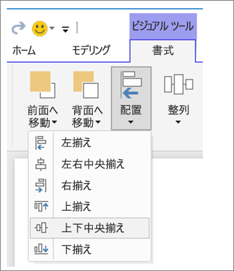

**図 3:    Power BI Desktop でビジュアル配置する**

Power BI オンラインおよび Power BI Desktop では、すべてのビジュアルの書式設定ウィンドウの **[全般]** タブで、ビジュアルのサイズと位置を正確に制御することもできます。

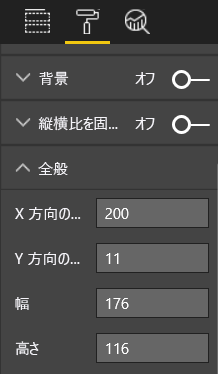

**図 4:    ビジュアルの正確な位置を設定する**

レポート ページの例 (図 2) では、2 つのカードと大きい境界線の **[X 方向の位置]** が 200 に設定されています。

#### スペースに合わせる
スペースを最大限に活用するようにします。  レポートの表示方法がわかっている場合は、それを念頭に置いてデザインします。 空いているスペースを減らし、キャンバスが埋まるようにします。  できる限り、個々のビジュアルにスクロール バーを設ける必要がないようにします。  ビジュアルが窮屈に見えないようにスペースを埋めます。

##### ページのサイズを調整します。
ページのサイズを小さくすることで、ページ全体との対比で個々の要素が大きくなります。 これを行うには、ページですべてのビジュアルの選択を解除して、書式設定ウィンドウの **[ページ サイズ]** タブを使用します。  

ここでは、ページ サイズを 4:3 および 16:9 にしたレポート ページの例を示します。 16:9 の方がレイアウトに適していることに注意してください。 2 番目のビジュアルからスクロール バーを削除する十分な余裕があります。

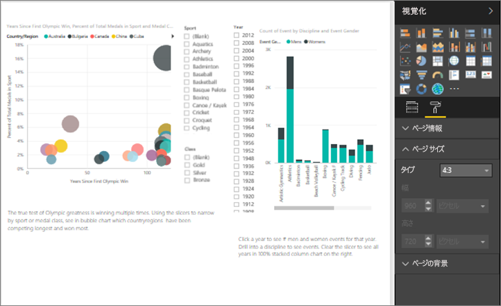

**図 5a:    4:3 のページ サイズにしたレポート**

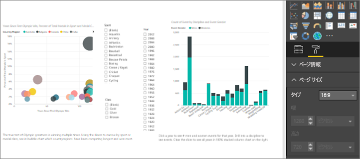

**図 5b:    16:9 のページ サイズ比率にしたレポート**

レポートは、4:3、16:9、またはそれ以外の比率で表示されますか? 小さい画面ですか、大きい画面ですか? それとも、可能なすべての縦横比とサイズの画面に表示されますか?  このことを念頭に置いてデザインします。

このレポート ページの例は、まだ少し見づらいようです。 どのビジュアルも選択せず、ペイントローラー アイコンを選んで、[書式設定] ウィンドウを開きます。 **[ページ サイズ]** を開き、**[高さ]** を 900 に変更します。

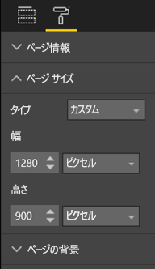

**図 6:    ページの高さを大きくする**

#### 乱雑さを減らす
乱雑なレポート ページは、ひとめ見て理解するのが困難であり、読者が読む気にならなくなる可能性があります。  必要のないレポート要素をすべて取り除きます。 理解やナビゲーションの役に立たない余計なものを追加しないようにします。 レポートのページでは、可能な限り明確に、すばやく、まとめて、情報を伝達する必要があります。

Edward Tufte は、『 *The Visual Display of Quantitative Information* 』の中でこのことを "data to ink ratio" (データとインクの比率) と呼んでいます。  基本的に、絶対に必要でないものはすべて削除します。

煩雑さを除去すると、レポート ページの空白部分が増え、前の「配置、順序、近接」セクションで説明したベスト プラクティスを適用するための領域が多くなります。

ここまでくれば、この例は既に見栄えがよくなっています。 多くの乱雑さを取り除き、要素をグループ化する図形を追加しました。  背景画像を削除し、不要な矢印図形とテキスト ボックスを削除し、1 つのビジュアルをレポートの別のページに移動しました。また、ページのサイズを長くし、余白 (黄色ですが) を増やしました。

**図 7:    見づらいレポートから乱雑さを取り除いた例**

### ひとめでストーリーが伝わるようにする
全体的なテストとして、事前に何も知らされていない人が誰からも説明を受けずにレポートをすばやく理解できることを確認する必要があります。 ひとめ見ただけで、読者がページや各グラフ/表の内容をすばやく理解できるようにする必要があります。   

レポートを見た読者の目を、最初に見て欲しい要素に引きつける必要があります。その後、読者は左から右、上から下へと見ていきます。  テキスト ボックスのラベル、図形、境界線、サイズ、色などの視覚的な手掛かりを追加することで、この動作を変更します。  

#### テキスト ボックス
視覚化のタイトルだけではストーリーを伝えるのに十分ではない場合があります。  テキスト ボックスを追加して、レポートを閲覧する人との意思の疎通を図ります。  テキスト ボックスでは、レポートのページ、ビジュアルのグループ、または個々のビジュアルについて説明できます。 結果を説明したり、ビジュアル、ビジュアル内のコンポーネント、ビジュアル間の関係を正確に定義したりすることができます。 テキスト ボックスを使うと、テキスト ボックス内のさまざまな条件を基に注意を引くことができます。

Power BI サービスの上部メニュー バーから、**[テキスト ボックス]** を選びます (Power BI Desktop では、リボンの **[挿入]** 領域から **[テキスト ボックス]** を選びます)。

**図 8:    テキスト ボックスを追加する**

空のボックスにテキストを入力し、下部にあるコントロールを使ってフォント フェイス、サイズ、配置などを設定します。 ハンドルを使ってボックスのサイズを変更します。

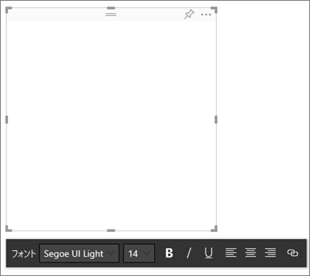

**図 9:    テキスト ボックスの書式を設定する**

ただし、やり過ぎは禁物です。 レポートのテキストが多すぎると、ビジュアルから注意がそれて、ビジュアルの価値が下がります。 レポート ページの理解に大量のテキストが必要であることがわかった場合は、最初からやり直します。  それだけでストーリーをよりよく伝えることができる別のビジュアルを選択できますか? ビジュアルの本来のタイトルを調整してよりわかりやすくできますか?   

#### テキスト
テキスト スタイル ガイドを作成し、レポートのすべてのページに適用します。 選択するフォント フェイス、テキスト サイズ、色は少数にします。  このスタイル ガイドを、テキスト要素だけでなく、視覚化内でのフォントの選択にも適用します (後述の「視覚化の一部であるタイトルとラベル」を参照)。 太字、斜体、大きいフォント サイズ、特定の色などを使用する場合のルールを設定します。  すべて大文字や下線は使わないようにしてください。

#### 図形
図形もナビゲーションと理解に役立ちます。 図形を使って関連のある情報をまとめ、重要なデータを強調し、矢印を使って視線を誘導します。 図形は、最初に見る場所やレポートの解釈方法を読者に理解してもらうのに役立ちます。 デザインの用語では、これを "*コントラスト*" と呼ぶことがよくあります。

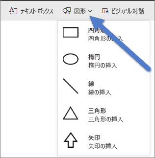

**図 10a:    Power BI サービスの図形**

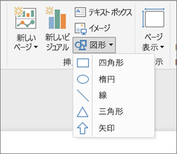

**図 10b:    Power BI Desktop の図形**

この記事のページの例はどのようになったでしょうか。  図 11 は、テキスト フェイス、フォント、色を統一することで明確になり、乱雑さが減少したページです。  左上隅にあるページ タイトルを見ると、ページの内容がわかります。

**図 11: テキスト ガイドラインを適用してタイトルを追加したレポート例**

この例では、読者が最初に見る場所である左上隅に、レポート ページのタイトルを追加しました。 28 のフォント サイズと Segoe Bold のフォントを使って、ページの他の部分より目立たせています。  この記事のテキスト スタイル ガイドでは、背景を使わず、タイトル、凡例、ラベルを黒にするように要求されており、ページの設定可能なすべてのビジュアルにそれを適用してあります (コンボ グラフの軸とラベルは編集できません)。  さらに、次のように設定しています。

* カード: **[カテゴリ ラベル]** を [オフ]、**[タイトル]** を [オン] にし、黒、12 ポイント、中央揃えに設定してあります。
* ビジュアル タイトル: [オン] で、12 ポイントの左揃えに設定してあります。
* スライサー: **[ヘッダー]** を [オフ]、**[タイトル]** を [オン] に設定してあります。 **[項目]** > **[テキスト]** はグレーの 10 ポイントのままにしてあります。
* 散布図および縦棒グラフ: X 軸と Y 軸および X 軸と Y 軸のタイトルのフォントを黒に設定してあります (使う場合)。

#### 色
一貫性を保つのためには色を使用します。  ビジュアル デザインの原則での色については後でさらに説明します。 ここでは、レポートのすばやい理解を妨げないような色を慎重に選ぶことについて触れておきます。  明るい色が多すぎると感覚を刺激します。 このセクションには色と関係のないものもあります。

#### 背景
レポート ページの背景を設定するときは、レポートを邪魔せず、ページの他の色との調和を乱さず、一般に目を痛めないような色を選びます。 一部の色には固有の意味があることを理解してください。  たとえば、米国では、レポートで赤を使うと通常は "悪いこと" と解釈されます。

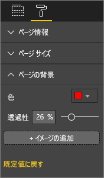

**図 12: レポートの背景を設定する**

芸術作品ではなく機能を備えたレポートを作成しているのです。 レポートの要素が読みやすく目立つような色を選びます。  

Web ページでの色と視覚化の使用の研究では、色の間のコントラストが高いほど理解の速度が速くなるという結果が得られています (Web ページの視覚的検索でのテキストと背景の色の効果および **Web ページの見た目の複雑さと美的特性のユーザーの認知の特定**)。

次のレポート例 (図 20 と 21) には、色のベスト プラクティスをいくつか適用してあります。 最も重要なのは、背景の色を黒に変更したことです。  黄色は明るすぎて目が疲れました。  また、"Count of athlete name by year and class" グラフでは、棒の黄色い部分が黄色の背景にとけ込んで見えなくなっていました。  黒 (または白) の背景を使うことで、コントラストが最大になり、ビジュアルに注目が集まります。

レポート例を改善するために行った他の手順を次に示します。

**ページ タイトル**

テキスト ボックスのフィールドは黒いフォントのみが許可されるため、背景を黒に変更すると、タイトルが見えなくなりました。   これを解決するため、代わりにテキスト ボックスのタイトルを追加します。  テキスト ボックスを選択してテキストを消去した後、[視覚化] タブで **[タイトル]** を選択してオンにします。 矢印を選択して **[タイトル]** のオプションを展開し、**[タイトル テキスト]** フィールドに「**Summer Olympic Games**」と入力して、**[フォントの色]** で白を選択します。

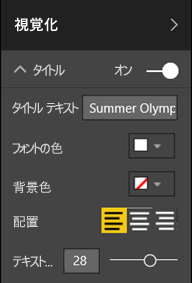

**図 13: ページ タイトルを追加する**

**カード**

カード ビジュアルの場合は、書式設定ウィンドウ (ペイント ローラー アイコン) を開き、**[背景]** を [オン] にします。 透明度 0% の白を選択します。 **[タイトル]** を [オン] にし、**[フォントの色]** を白、**[背景色]** を黒に設定します。

**スライサー**

ここまで、2 つのスライサーは異なる書式設定になっていますが、これはデザイン的に意味がありません。 どちらのスライサーも背景色を水色に変更します。  水色は、ページのカラー パレットに含まれ、塗り分け地図、ツリー マップ、縦棒グラフなどで使われているので、適切な選択です。

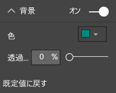

**図 14: スライサーの背景色を変更する**

細くて白い境界線を追加します。

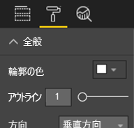

**図 15: スライサーに境界線を追加する**

水色の背景に対してグレーのフォントは見づらいので、**[項目]** の色を白に変更します。

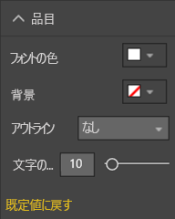

**図 16: スライサーのフォントの色を変更する**

最後に、**[タイトル]** で、**[フォントの色]** を白に変更し、黒の **[背景色]** を追加します。

**図 17: スライサーのタイトルを書式設定する**

**四角の図形**

黒い背景では四角形も見えなくなっていました。  これを修正するには、図形を選択し、**[図形の書式設定]** ウィンドウで **[背景]** を [オン] にします。

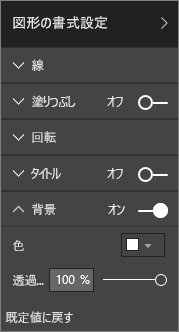

**図 18: 図形の書式を設定する**

**縦棒グラフ、バブル チャート、塗り分け地図、ツリー マップ**

レポート ページの残りのビジュアルに白い背景を追加します。 書式設定ウィンドウで、**[線]** オプションを展開し、**[線の色]** を白に、**[太さ]** 3 に、それぞれ設定します。

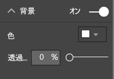

**図 19: 残りの視覚化に白の背景を追加する**

**図 20: 色のベスト プラクティスを適用したレポートの例 (黒い背景)**

**図 21: 色のベスト プラクティスを適用したレポートの例 (白い背景)**
 

### 見栄え
見栄えに関して考慮することの多くは、既に説明しました。配置、色、フォントの選択、乱雑さなどです。  ただし、レポートの全体的な外観に関して説明する価値のあるレポート デザインのベスト プラクティスがいくつかあります。  

レポートの機能は、ビジネス ニーズを満たすことであり、見た目の良さではないことを思い出してください。  しかし、ある程度の美しさは必要であり、第一印象に関しては特にそうです。 Nashville consultant の Tony Bodoh 氏は、"理屈でわかる 0.5 秒前に感情で感じる" と説明しています。  読者は、最初に感情的なレベルでレポート ページに反応し、その後でさらに時間をかけて深く理解します。 ページの見た目がまとまりを欠き、わかりにくく、プロフェッショナルな出来とは言えない場合、読者はページのストーリーに気付かない可能性があります。

TDI ブロガーであり TechTarget の業界アナリストである Wayne Eckerson がうまく例えています。  レポートのデザインは部屋の飾り付けに似ています。  花瓶、ソファー、エンド テーブル、絵などを時間をかけて買いそろえます。  1 つ 1 つを見ても、これらすべての要素を気に入っています。 しかし、個々の選択には意味があっても、全体としてみると、目的が違ったり、主張が競合したりするのです。

次のことに注意してください。

* レポートに共通のテーマまたは外観を作成し、レポートのすべてのページにそれを適用します
* 独立したイメージや他のグラフィックスを使用してストーリーをサポートし、ストーリーを損なわないようにします
* これまでに説明したすべてのベスト プラクティスを適用します。

## ビジュアル デザインの原則
これまでは、レポートのデザインの原則、レポートを簡単に把握できるレポート要素の編成方法を見てきました。  次に、ビジュアル自体のデザインの原則を説明します。  次のセクションでは、個々のビジュアルについて詳しく説明し、一部のよく使われる種類についてはベスト プラクティスを示します。

このセクションでは、これまでの例をしばらく離れて、他の例を使います。  ビジュアル デザインの原則を説明した後、これまでのレポート ページの例に戻って学習した内容を適用します (詳細な手順を説明します)。  

### 計画 - 適切なビジュアルの選択
始める前にレポートを計画することが重要であるのと同様に、各ビジュアルにも計画が必要です。  "このビジュアルでどのようなストーリーを伝えようとしているのか" を考えてください。 その後、ストーリーを伝えるのに最適なビジュアルの種類を選びます。 販売サイクルの進捗は横棒グラフを使って示すことができますが、ウォーターフォール図やじょうごグラフではうまく伝わりません。 これについては、このホワイト ペーパーの最後のセクション「ビジュアルの種類とベスト プラクティス」で説明されている、よく使われる一部の種類についてのベスト プラクティスを参照してください。  最初に選択したビジュアルの種類が最善のオプションではなかったとしても驚く必要はありません。  いろいろなビジュアルの種類を試して、最適なものを見つけてください。

カテゴリ別データと量的データの違いを理解すれば、それぞれのデータの種類に最適なビジュアルの種類がわかります。 量的データはメジャーとも呼ばれ、通常は数値です。 カテゴリ別データはディメンションとも呼ばれ、分類することができます。 これについては、後述の「適切なメジャーを選択する」で詳しく説明します。

レポートの見栄えをよくするだけのために、装飾的または複雑なビジュアルの種類を使用する誘惑に負けないようにします。 必要なのは、ストーリーを伝達するための最も簡単なオプションです。 横棒グラフと折れ線グラフは、すばやく情報を伝達できます。  慣れ親しんでいて簡単であり、ほとんどの読者は容易に解釈できます。  加えて、ほとんどの読者は左から右、上から下へと読み進むので、これらの 2 つのグラフの種類はすばやく目を通して理解できます。

ストーリーを伝えるためにビジュアルにスクロールは必要ですか? できる限り、スクロールは使わないようにします。  フィルターを適用し、階層/ドリルダウンを使ってみて、それでもスクロール バーを除くことができない場合は、別のビジュアルの種類を選択することを考えます。 スクロールを避けられない場合は、垂直スクロールより水平スクロールの方がより許容されます。

ストーリーに最善のビジュアルを選択したとしても、ストーリーを伝えるための補助が必要になる場合があります。  そのときは、ラベル、タイトル、メニュー、色、サイズを利用します。 これらのデザイン要素については、後述する「デザイン要素」セクションで説明します。

### 適切なメジャーを選択する
ビジュアルで伝えるストーリーには説得力がありますか? それは重要なことですか?  ビジュアルを構築するためにビジュアルを構築してはなりません。 データが興味深いストーリーを伝えると思うかもしれませんが、そうではありません。 恐れずに最初からやり直して、より興味深いストーリーを探してください。 または、ストーリーはそれでよくても、別の方法で測定する必要があるのかもしれません。

たとえば、営業マネージャーの成功を測定するものとします。 どのようなメジャーを使いますか?  総売上や総利益、前年の成長、または目標に対する実績で、成功を最善に測定できますか? 販売員の Sally は最大の利益を上げており、販売員別の総利益を横棒グラフで示すと、他の販売員と比較して彼女の成績はまるでロック スターのようです。  しかし、Sally は営業経費も多く (旅費、送料、製造コストなど)、売上を見ただけでは最善のストーリーを伝えられません。

#### 現実を忠実に反映する/現実を歪めない
真実を歪曲して伝えるビジュアルを作成してしまうことがあります。 データ マニアが "不適切な" ビジュアルを配布している Web サイトがあります。 そして、コメントに共通するテーマは、そのようなビジュアルを作成して配布した会社に対する失望です。  それにより、そのような会社は信頼できないというメッセージが広がります。

したがって、現実を意図的に歪曲していないビジュアル、作成者が読者に伝えたいストーリーを伝えるために操作されていないビジュアルを、作成する必要があります。  次に例を示します。

**図 22: 現実が歪曲されているグラフ**

この例では、4 つの企業の間に大きな差があり、CorpB が他の 3 社より大きく成功しているかのように見えます。  しかし、X 軸が 0 から描かれていず、企業間の差は誤差の範囲内かもしれないことに注意してください。  同じデータを X 軸が 0 から始まるグラフにすると次のようになります。

**図 23: 現実的なグラフ**

読者は、普通、X 軸は 0 から始まることを期待し、そう想定します。 0 から始めない場合は、結果を歪曲しないような方法で行い、視覚的な合図またはテキスト ボックスを追加して標準的な方法とは異なることを指摘することを考えます。  

### デザイン要素
種類とメジャーを選択し、ビジュアルを作成した後は、効果が最大になるように表示を微調整します。  このセクションでは次の内容について説明します。

* レイアウト、スペース、サイズ
* テキスト要素: ラベル、注釈、メニュー、タイトル
* 並べ替え
* 視覚的なやり取り
* 色

#### スペースを有効活用するためのビジュアルの調整
複数のグラフをレポートに収める場合は、"データとインクの比率" を最大にすることにより、データのストーリーを目立たせるのに役立ちます。前に説明したように "データとインクの比率" というのは Edward Tufte の造語であり、それが目指しているのは、読者がデータを解釈する能力を損なうことなく、グラフから可能な限り多くの記号を削除することです。

下に示す最初のグラフのセットには、冗長な軸ラベル ("Jan 2014"、"Apr 2014" など) とタイトル ("by Date") があります。 グラフごとのタイトルにも、水平方向に専用のスペースが必要です。 グラフのタイトルを削除し、個別の軸ラベルを有効にすることで、インクを若干減らして、全体的なスペースの利用効率を上げることができます。 上の 2 つのグラフの軸ラベルを削除することで、さらにインクを減らし、データのためのスペースを増やすことができます。

特定の期間を示したい場合は、すべてのグラフの背後に線または四角形を描画し、視線を上下に動かして比較しやすくすることができます。

**図 24: 修正前**

**図 25: 修正後**

**軸のタイトルをオンまたはオフにするには**

ビジュアルを選択してアクティブにし、書式設定ウィンドウを開きます。 **[X 軸]** または **[Y 軸]** のオプションを展開し、**[タイトル]** のスライダーをドラッグしてオンまたはオフにします。

**図 26: 軸のタイトルをオンまたはオフにする**

**軸のラベルをオンまたはオフにするには**

ビジュアルを選択してアクティブにし、書式設定ウィンドウを開きます。 **[X 軸]** および **[Y 軸]** の隣にスライダーがあります。  このスライダーをドラッグして、軸ラベルをオンまたはオフにします。

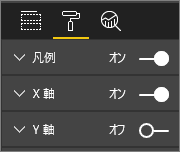

**図27: 軸のラベルをオンまたはオフにする**

> [!TIP]
> Y 軸のラベルをオフにするシナリオの 1 つは、**[データ ラベル]** をオンにした場合です。
> 
> 

**ビジュアルのタイトルを削除するには**

ビジュアルを選択してアクティブにし、書式設定ウィンドウを開きます。 **[タイトル]** のスライダーをオフに設定します。

**図 28: ビジュアルからタイトルを削除する**

読者がレポートをどのように表示するかを考えて、ビジュアルとテキストの大きさと色の濃さが読むのに十分であることを確認します。 ページに比率的に大きいビジュアルがある場合、読者はそれが最も重要であると考える可能性があります。 レポートが乱雑および混乱した見た目にならないように、ビジュアルの間の十分なスペースを設けます。  読者の目を誘導するようにビジュアルを配置します。

**ビジュアルのサイズを変更するには**

ビジュアルを選んでアクティブにします。 ハンドルの 1 つをドラッグしてサイズを調整します。

**図 29: ビジュアルのサイズを変更する**

**ビジュアルを移動するには**

ビジュアルを選んでアクティブにします。 ビジュアルの上部中央にあるグリッパー バーを選んでクリックしたまま、ビジュアルを新しい位置にドラッグします。

**図 30: ビジュアルを移動する**

#### 視覚化の一部であるタイトルとラベル
タイトルとラベルが読みやすく、わかりやすい内容であることを確認します。 タイトルとラベルのテキストは、最適なサイズと、目立つ色 (既定のグレーではなく黒など) にする必要があります。 スタイル ガイドを思い出してください (前記の「テキスト」を参照)。 色とサイズの数を制限します。フォント サイズや色の種類が多すぎると乱雑でわかりにくくなります。  レポート ページのすべてのビジュアルのタイトルには同じサイズと色のフォントを使うことを検討し、レポート ページのすべてのタイトルに同じ配置を選びます。  

**書式設定ウィンドウ**

以下で示す各書式設定の調整について、ペイント ローラー アイコンを選んで書式設定ウィンドウを開きます。

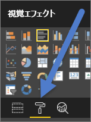

**図 31: 書式設定ウィンドウを開く**

その後、ビジュアル要素を選び、調整して、[オン] に設定します。 ビジュアル要素の例としては、**X 軸**、**Y 軸**、**タイトル**、**データ ラベル**、**凡例**などがあります。 次に示すのは**タイトル**要素の例です。

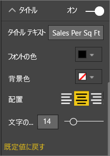

**図 32: ビジュアルのタイトルの書式を設定する**

**テキストのサイズを設定する**

テキストのサイズは、タイトルとデータ ラベルについては調整できますが、X 軸、Y 軸、凡例については調整できません。  データ ラベルについては、**[表示単位]** と **[小数点以下桁数]** の値をいろいろ変えてみて、レポートを表示するのに最適な詳細さのレベルを見つけてください。   

**テキストの配置を設定する**

タイトルの配置の選択肢は、左、右、中央です。  いずれかを選択して、ページ上のすべてのビジュアルに同じ設定を適用します。  

**テキストの位置を設定する**

一部の Y 軸および凡例については、テキストの位置を調整できます。   何を選択した場合でも、ページの他の Y 軸および他のすべての凡例を同じように設定します。

**タイトルとラベルの長さを設定する**

タイトル、軸タイトル、データ ラベル、凡例の長さを調整します。 これらの要素を表示する場合、長さ (およびテキストのサイズ) を調整して、切り捨てられるものがないようにします。 **[タイトル]** と **[凡例]** の場合、設定は **[タイトル テキスト]** であり、ビジュアルに表示される実際のタイトルをここに入力します。 **[X 軸]** と **[Y 軸]** の場合は、設定は **[スタイル]** であり、ドロップダウンから選択します。 **[データ ラベル]** の場合は、設定は **[表示]** と **[Decimal]** です。 **[表示]** ドロップダウンを使って測定の単位を選びます (百万、千、なし、自動など)。**[Decimal]** フィールドを使って、表示する小数点以下の桁数を指定します。

**テキストの色を設定する**

タイトル、軸、データ ラベルについては、テキストの色を調整できます。  

#### 視覚化の一部ではないタイトルとラベル
前に、レポート ページへのテキスト ボックスの追加について説明しました。 視覚化のタイトルだけではストーリーを伝えるのに十分ではない場合があります。  レポートの読者に他の情報を伝えるには、テキスト ボックスを追加します。  
レポートのページが乱雑またはにぎやかになりすぎたりしないように、テキスト ボックスのフォント、サイズ、色、および配置の使用には一貫性を持たせます。 テキスト ボックスのテキストを調整するには、テキスト ボックスを選択して、書式設定メニューを表示します。

**図 33: テキスト ボックスで使用するフォントの書式を設定する**

#### 並べ替え
すばやく洞察を提供するとても簡単な方法は、ビジュアルの並べ替えを設定することです。 たとえば、横棒グラフを棒の値に基づいて昇順または降順に並べ替えると、余分なスペースを使うことなく、重要な情報を増分的にすばやく示すことができます。

グラフを並べ替えるには、グラフの右上にある省略記号 [...] を選び、**[並べ替え]** を選んで、並べ替えるフィールドと向きを選びます。 詳しくは、「[Change how a visual is sorted](power-bi-report-change-sort.md)」 (ビジュアルの並べ替え方法を変更する) をご覧ください。

#### グラフの相互作用
Power BI の最も魅力的な機能の 1 つは、グラフが相互作用する方法を編集する機能です。  既定では、グラフは相互に強調表示されます。データ ポイントを選ぶと、他のグラフの関連するデータが明るくなり、関連のないデータは暗くなります。 この動作をオーバーライドし、グラフを実際のフィルターとして使用して、ページのスペースを節約することができます。 これを行うには、メニュー バーから **[ビジュアル対話]** を選びます。

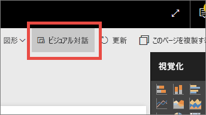

**図 34: ビジュアル対話**

次に、ページ上の各ビジュアルについて、選んだビジュアルを使ってフィルター処理を行うか、強調表示を行うか、または何も行わないかを決めます。 強調表示できないビジュアルもあり、そのようなビジュアルの強調表示コントロールは利用できなくなります。 詳しくは、「[Power BI レポートでの視覚化の相互作用](service-reports-visual-interactions.md)」をご覧ください。

> [!TIP]
> Power BI の経験がない読者にとって、クリックしてレポートと対話するこの機能は、わかりにくい場合があります。 テキスト ボックスを追加し、クリックして他の情報を検索できることを説明します。
> 
> 

#### ビジュアルでの色の使用
前に、レポート全体での色の使用方法を計画することの重要性について説明しました。 このセクションの内容は、重複する部分もありますが、主として個々のビジュアルでの色の使用方法に当てはまります。 同じ原則も適用されます。色を使って、レポートを結び付け、重要なデータを強調し、読者によるビジュアルの理解を向上させます。 色の種類が多すぎると、読者の注意が分散され、どこを見ればよいのかわかりにくくなります。 美しさのために理解を犠牲にしてはなりません。 理解が向上する場合にのみ、色を追加します。

> [!TIP]
> 読者および固有の色のルールについて理解してください。  たとえば、米国では通常、緑は "良い" ことを意味し、赤は "良くない" ことを意味します。
> 
> 

このトピックの内容は次のとおりです。

1. データの色
2. データ ラベルの色
3. カテゴリ別の値の色
4. 数値の色

**色を使って重要なデータを強調する**

色の最も簡単な使い方は、データ ポイントの色を変更することで、それに注目させることです。 この例では、オリンピックが 4 年間隔から夏冬交互の 2 年間隔になったところで色を変えています。

**図 35: 色を使ってストーリーを伝える**

データ ポイントの色は、書式設定ウィンドウの **[データの色]** タブで変更できます。 各データ ポイントを個別にカスタマイズするには、**[すべて表示]** を [オン] に設定します。

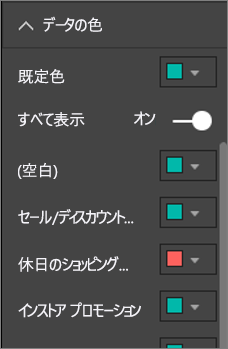

**図 36: データ ポイントの色を設定する**

> [!NOTE]
> Power BI は、既定のテーマをレポートのビジュアルに適用します。  テーマの色は、多様性とコントラストを提供するために選ばれています。 既定のテーマ パレットから変更するには、**[ユーザー設定の色]** を選びます。
> 
> 

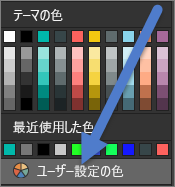

**図 37: ユーザー設定の色を選ぶ**

Power BI Desktop では、2 番目の系列を使って、外れ値または線の一部分を強調表示することもできます。

**図 38: Desktop を使って外れ値をプロットする**

ここで、"Outliers" 系列の値は、8 月の平均気温が 60 度より下がった場合にのみ存在します。 これは、次の式を使って DAX 計算列を作成することにより実現しました。

Outliers = if(Editions[Temp]<60, Editions[Temp], BLANK())

この例では、1952 年、1956 年、2000 年の 3 つの外れ値が存在しました。

**ラベルとタイトルの色**

使用できるすべての書式設定オプションを調べてみると、タイトルと凡例のさまざまな場所に色を追加できることがわかります。 たとえば、データ ラベルや軸タイトルの色を変更できます。 この機能を使うときは注意してください。  一般に、すべてのビジュアルのタイトルには 1 つの色を使います。  このホワイト ペーパーのすべてのガイドラインでそうであるように、常に、"ルールを破る" ことが必要な状況や理由が存在しますが、ルールを破るのは、正当な理由がある場合だけにしてください。

**カテゴリ別の値の色**

通常、系列を持つグラフでは、凡例にカテゴリ別の値が表示されます。 たとえば、次に示す凡例の各色は、国/地域のさまざまなカテゴリを表します。

**図 39: 既定の色の適用**

Power BI で使われる既定の色は、カテゴリ別の値を区別しやすい色分けになるように選択されています。 企業固有の方式などと一致するように色を変更することがありますが、問題になる可能性があります。

**図 40: 1 つの色の異なる色合いとして適用された色**

色を単一にして色の濃さで変化を付けようとすることにより、このビジュアルは、カテゴリ間に順序があるように誤って認識される可能性があります。 暗いバブルは明るいバブルより何段階か高いまたは低いことを暗示します。 通常、この種のカテゴリ別の値には、アルファベット順以外に本質的な順序はありません。
既定の色を変更するには、書式設定ウィンドウを開き、**[データの色]** を選びます。

**数値の色**

何らかの固有の順序があり、数値が含まれるフィールドの場合も、値によってデータ ポイントに色を付けることができます。 これは、データ全体への値の分散を示すのに役立ち、1 つのグラフに 2 つの変数を表示することもできます。 たとえば次のグラフを見ると、メダルの獲得数は中国が最多ですが、オリンピック参加回数は日本やタイの方が多いことがわかります。

**図 41: 値によってデータ ポイントに色を付ける**

このグラフを作成するには、[色の彩度] フィールドに値を追加し、書式設定ウィンドウで色を調整します。

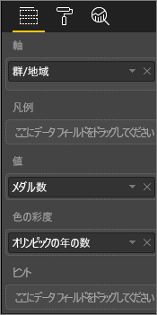

**図 42: [色の彩度] フィールドを追加する**

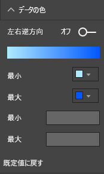

**図 43: 彩度に使われる色を調整する**

色は、中央値からの差異を強調するためにも使用できます。 たとえば、正の値は緑にし、負の値は赤にするといった場合です。 正または負の値に色を割り当てるときは、文化の違いに注意してください。すべての文化で、赤は不良、緑は良を意味しているわけではありません。

**図 44: 色を使って中央値からの差異を強調する**
 

### ビジュアル デザインの原則 – レポート ページの例への適用
これまで説明してきたビジュアルの原則を、サンプルのレポートに適用してみましょう。

適用前

**図 45: レポートの例 (適用前)**

適用後

**図 46: レポートの例 (適用後)**

#### 変更内容
1. スライサー: ページ レベルのフィルターを追加し、金、銀、銅のみを選ぶことで、スライサーからブランクを削除しました。 **[単一選択]** と **[すべて選択]** の **[選択範囲のコントロール]** を [オフ] に変更しました。
2. バブル: 凡例に、画面に収まりきらないほど多くの項目があります。  凡例を削除し、代わりに **[カテゴリ ラベル]** を [オン] にしました。 読者は、バブルをポイントして詳細を表示できます。 タイトルを短くし、自明であるため "by countryregion" を削除しました。 両方の軸のラベルを有効にして、グラフをわかりやすくしました。
3. 塗り分け地図: **[データの色]** を変更して、いっそう目立つようにしました。 **[左右逆方向]** を有効にして、**[最小値]** をピンク、**[最大値]** を赤に設定しました。
4. ツリー マップ: 米国のみに設定されていたフィルターを削除しました。 **[データ ラベル]** を小数点以下 1 桁に設定しました。 ビジュアルは Class フィールドを使っていましたが、これはほぼ常に 33% (金/銀/銅) にあまり役に立ちませんでした。  別のよりと興味深いフィールド (性別) を選択しました。 デザインの水泳競技を青に、陸上競技をグレーに変更しました。
5. 上の縦棒グラフ: タイトルを短くし、データ ラベルを削除し、凡例タイトルをオフにしました。 下のグラフと一致するように、タイトルの単語の順序を変更しました。
6. 下の縦棒グラフ: 上のグラフと一致するように、年の昇順に並べ替えました。 クラスと一致するように色を変更しました。 タイトルを変更しました。 データのためのスペースを増やすため、凡例を無効にしました。 データ ラベルを有効にしました。これは、レポートには表示されません (ビジュアルが小さすぎてラベルを判読できないため) が、ビジュアルをフォーカス モードで開くと表示されます。 [フォーカス モードについて](service-focus-mode.md)はこちらをご覧ください。 **[ヒント]** に "Count of Event (Distinct)" を追加し、積み上げ縦棒グラフをポイントすると、ヒントにその年の競技数も表示されるようにしました。
7. ビジュアル相互作用: 常に総競技数と総種目数が表示されるようにするため、両方のカードの相互作用をオフにしました。

## ビジュアルの種類とベスト プラクティス
Power BI では、多くのビジュアルの種類が既定で提供されています。  これらに加えて、Microsoft および Power BI コミュニティから提供されているカスタム ビジュアルがあり、ビジュアルのオプションの総数はここで説明できないほど多くなっています。 ここでは、最もよく使用される固有のビジュアルの種類について説明します。  

### 折れ線グラフ

折れ線グラフは、時間経過を追ってデータを見るのに優れた手段です。  データを表で見るのでは、人間の目が山、谷、サイクル、パターンを見分ける速さを本当に活用することはできません。  
次の例は、メダルの数と、メダルを獲得した選手の数の傾向を示したものです。  

**図 47: 折れ線グラフ**

#### ベスト プラクティス
* 折れ線グラフで最初に目がいくのは、曲線の形状です。  つまり、時間カテゴリや分布カテゴリなど、曲線が意味のあるものになるように X 軸を選ぶ必要があります。  製品や地理のようなカテゴリ別フィールドを X 軸にすると、曲線の形状が意味のある情報を提供しないので、折れ線グラフは興味を引くものになりません。
* 例のように複数のグラフを上下に配置する場合は、系列間を比較しやすいように X 軸を揃えます。 フィルターを使って、同じ範囲の値が表示されるようにします。  たとえば、日付の範囲を表示する場合、は、同じ日付範囲であることを確認します。  上の例では、どちらのグラフも 1896 ～ 2012 年の範囲です。
* スペースを有効に活用します。  データにとって意味がある場合は、Y 軸の始点と終点を設定して、グラフの上部と下部の空いているスペースを除去し、実際のデータ ポイントに焦点を絞ります。 そのためには、ペイント ローラー アイコンを選んで、書式設定ウィンドウを開きます。 **[Y 軸]** 領域を展開し、**[開始]** ポイントと **[終了]** ポイントを設定します。
  
  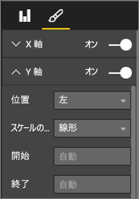
  
  **図 48: 始点と終点を設定する**
* 始点と終点を明示的に設定する理由としてもう 1 つあるのは、同じ Y 軸フィールドを使って、同じページで複数のグラフを比較する場合です。  たとえば、累積的な種目の数を見る場合、イギリスは 1 ～ 70 の範囲で、オーストラリアは1 ～ 12 の範囲なので、2 つの折れ線グラフの Y 軸の範囲は大きく異なります (図 49)。 ひとめで比較するのは困難です。 代わりに、同じ Y 軸の範囲を使うようにグラフを設定します (図 50)。
  
  
  
  **図 49: Y 軸が異なる折れ線グラフ**
  
  
  
  **図 50: Y 軸が一致する折れ線グラフ**

詳細については、次のトピックを参照してください。

* [X 軸と Y 軸をカスタマイズする](power-bi-visualization-customize-x-axis-and-y-axis.md)
* [折れ線グラフと不規則な間隔](http://www.perceptualedge.com/articles/visual_business_intelligence/line_graphs_and_irregular_intervals.pdf)
* [折れ線グラフ 101](http://www.columnfivemedia.com/data-visualization-101-line-charts)

### 横棒/縦棒グラフ

折れ線グラフが時間経過でデータを見るときの標準的なグラフなら、横棒グラフは異なるカテゴリの特定の値を調べるときの標準的なグラフです。  数に基づいて棒を並べ替えると、上位の値と分散を簡単に確認できます。  横棒グラフは長いラベルにもうまく対応します。  

**図 51: 横棒グラフ**

#### ベスト プラクティス
* 値のデータ ラベルを表示します。  これにより、特定の値を識別しやすくなります。 これを行うには、書式設定ウィンドウを開き、**[データ ラベル]** を [オン] に設定します。
  
  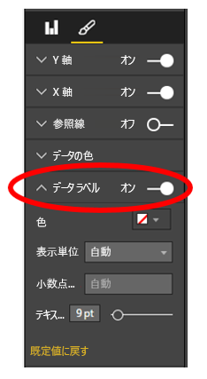
  
  **図 52: データ ラベルを有効にする**
* 上のような横棒グラフは、**特定の一時点において** 1 つのメジャーを多くのメジャーと比較するのにとても役立ちます。  折れ線グラフが時間経過によるトレンドを示したのに対し、横棒グラフは特定時点での 1 つのカテゴリのトレンドを示します。  横棒グラフを見ると、ひとめで、スペインは失業率 (25%) が世界で最悪の国の 1 つであることがわかります。
* 横棒/縦棒グラフ全体が割り当てられたスペースに収まらない場合は、自動的にスクロール バーが追加されます。 可能であり、意味がある場合は、読者が分布の全体像を理解できるよう、グラフ全体が表示されるようにビジュアルとレポートを構成します。  上の例では、世界中の国の数が多いためこれは不可能です。
  
  グラフに含まれる値の数を制限する方法の 1 つは、フィルターを使うことです。 たとえば、失業率が 20% を超える国のみを表示するようにビジュアル レベルのフィルターを追加します。
* 横棒/縦棒グラフは、ドリルダウンする (そして元に戻る) ことができます。  これは、余分なスペースを使わずに 1 つのビジュアルにより多くの情報を詰め込む優れた方法です。  次の例では、地域から国への階層が使われています。  地域のバーをダブルクリックすると、その地域を構成する国にドリルダウンします。  ドリルダウンの詳細については、「[Power BI での視覚化のドリルダウン](power-bi-visualization-drill-down.md)」をご覧ください。
  
  
  
  **図 53: ドリルダウン**

横棒グラフと縦棒グラフの詳細については以下を参照してください。

* [横棒グラフ 101](http://blog.newscred.com/article/data-visualization-101-bar-charts)
* [データ視覚化カタログ: 横棒グラフ](http://www.datavizcatalogue.com/methods/bar_chart.html#.VYV-hY3bLJw)
* [データ視覚化カタログ: 複数セット横棒グラフ](http://www.datavizcatalogue.com/methods/multiset_barchart.html#.VYV_gI3bLJw)

### 積み上げ横棒/縦棒グラフ

横棒または縦棒に異なるカテゴリを積み上げることにより、横棒/縦棒グラフに別のディメンションを追加します。  グラフでは、全体的な傾向 (高さ/長さに基づく) についての情報が提供されるだけでなく、その傾向に対するカテゴリの影響も示されます。 次のグラフからは、上位サッカー チームの収益が 2014 年には 60 億ドル以上に成長していることがわかります。

**図 54: 積み上げ縦棒グラフ**

この積み上げ縦棒グラフでは、収益合計が時間の経過と共に増加していること、そしてコマーシャルと放送のカテゴリが着実に増加して、全体的な収益増加に寄与していることが示されています。  しかし、このグラフでは、3 つのカテゴリのそれぞれが相互に与える影響を簡単に比較できません。 たとえば、コマーシャルの成長と放送または試合日の成長を比較するにはどうすればよいでしすか?  このようなデータに対するさらに良い選択としては、折れ線グラフをこのデータに付随するビジュアルとして使用します。  

**図 55: 折れ線グラフに変換する**

この折れ線グラフを見ると、成長の大きさはコマーシャル、放送、試合日の順であることがわかります。

#### ベスト プラクティス
* 縦棒/横棒グラフと同じように、水平または垂直に表示できます。   長いラベルがある場合は水平が適しており、時系列データがある場合は垂直が適しています。  
* 時間経過と共に変化する傾向や他のパターンを表示する場合は、積み上げ横棒/縦棒グラフは適していません。  折れ線グラフなどの他のグラフの方がはるかに適しています。
* 合計量または合計に対する割合に基づく分布を示すこともできます。  
* 次のことに注意してください。*積み上げ棒グラフのセグメントを比較することは困難です。セグメントが並べて配置されていて、すべて同じ基準から増加する場合は、高さを簡単に比較できますが、相互に積み上げられていると、比較は困難になります。さらに、月ごとの "収益" の変化は簡単にわかりますが、他の "カテゴリ" での "収益" の変化を調べるのはとても困難です* 。  
* 合計して 100 になるパーセンテージを使うときは、100% 積み上げグラフが適切な選択です。  次の例では、チーム別のカテゴリの分布がわかります。  パーセンテージは相対的であり、ひとめでパターンがわかります。 たとえば、エバートンの収益は主に放送によるものである (70% 以上) のに対し、PSG では放送からの収益はわずか 20% です。  横棒グラフを選ぶことで、簡単にチームのラベルを表示でき、収益の種類の影響がわかります。
  
  
  
  **図 56: 積み上げ横棒グラフ**

積み上げグラフの詳細については、以下をご覧ください。

* [データ視覚化カタログ: 積み上げ横棒グラフ](http://www.datavizcatalogue.com/methods/stacked_bar_graph.html#top)
* [100% 積み上げ横棒グラフが役に立つ場合](http://www.perceptualedge.com/blog/?p=2239)

### 横棒/縦棒複合グラフ

Power BI では、縦棒グラフと折れ線グラフを複合グラフに組み合わせることができます。 選択肢は、[折れ線グラフおよび積み上げ縦棒グラフ] と [折れ線グラフおよび集合縦棒グラフ] です。 2 つの異なるビジュアルを 1 つに組み合わせることにより、キャンバスの貴重なスペースを節約できます。

次の 2 つのスクリーンショットは、組み合わせる前と後を示したものです。  最初のページには、ある期間の人口を示す縦棒グラフと、同じ期間の GDP を示す折れ線グラフが、2 つの異なるビジュアルとして含まれます。 これらのグラフは、X 軸 (年) と値 (2002 年から 2012 年まで) が同じなので、複合グラフにするのに適した候補です。  2 つの傾向を 1 つのビジュアルにまとめることで、  データの比較をよりすばやく行うことができます。

新しいレポート ページには、折れ線グラフと積み上げ縦棒グラフが一緒になった単一のビジュアルが含まれます。 折れ線グラフと集合縦棒グラフも同じように簡単に作成できます。  2 つの傾向の間の関係を簡単に探せるようになりました。   2008 年までは人口と GDP は似た傾向をたどっていることがわかります。 しかし、2009 年以降は、人口の増加は平坦になり、GDP は変動が大きくなっています。  

 **図 57: 2 つの異なるグラフの場合**

 **図 58: 1 つの複合グラフの場合**

#### ベスト プラクティス
複合グラフは、両方のビジュアルの少なくとも 1 つの軸が共通である場合に最適です。

軸に注目してください。 複合グラフは簡単に読み取って解釈できますか?  それとも、異なる範囲と値を使用していますか? たとえば、縦棒グラフの Y 軸のスケールが、折れ線グラフの Y 軸のスケールよりはるかに小さい場合、複合グラフにする意味はありません。  たとえば、下部にある 3 番目の線 (水色) に注意してください。

   

   **図 59: 失敗した折れ線グラフ**

同じように、縦棒グラフと折れ線グラフが異なるメジャーを使っていて、共通の軸を作成していない場合、意味のある複合グラフにはできません。  たとえば、ドルと % のような場合です。 読者がグラフを理解するのに役立つように、両方の軸と軸ラベルを設定します。

そのためには、書式設定ウィンドウを開き、**[Y 軸]** を展開して、**[セカンダリの表示]** を [オン] にします。 この設定は見つけにくい場所にあります。**[Y 軸 (棒)]** を展開し、下にスクロールすると **[セカンダリの表示]** が表示されます。 また、[Y 軸 (棒)] の **[タイトル]** と [Y 軸 (折れ線)] の **[タイトル]** を、[オン] に設定します。

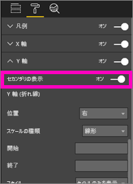

**図 60: セカンダリ軸を表示する**

**図 61: 代わりに複合グラフを作成する**

* 二重軸を活用してください。 値の範囲が異なる複数のメジャーを比較する場合に優れた手段です。 また、2 つのメジャーの間の相関関係を 1 つのビジュアルで示す場合にも適しています。

詳細:

* [Power BI の複合グラフ](power-bi-visualization-combo-chart.md)
* [ビジュアルでの二重スケール軸の危険性](http://www.perceptualedge.com/articles/visual_business_intelligence/dual-scaled_axes.pdf)

### 散布図

同時に表示したい多数の変数がある場合、散布図が全体像を得るのにとても便利な場合があります。  散布図は、2 個 (散布) または 3 個 (バブル) の数量メジャーの間の関係を表示します  散布図には、必ず 2 つの値軸があり、横軸に沿って数値データの 1 つのセットが表示され、縦軸に沿って数値データのもう 1 つのセットが表示されます。 このグラフには x と y の数値が交差する位置に点が表示され、この 2 つの値が 1 つのデータ ポイントに結合されます。 これらのデータ ポイントは、データに応じて、横軸に沿って値が均等に分布したり、不均等に分布したりします。

バブル チャートは、データ ポイントをバブルに置き換えます。バブルのサイズは、データの追加のディメンションを表します。

下に示すバブル チャートは、南アメリカの国別の一人あたり GDP (X 軸) および GDP 合計 (Y 軸) と人口を示したものです。  バブルのサイズは、その国の総人口を表します。 ブラジルは、人口が最も多く (バブルのサイズ)、南アメリカの GDP で最大の割合を占めています (X 軸の最も端)。  しかし、一人あたり GDP については、ウルグアイ、チリ、アルゼンチンがブラジルを上回っています (Y 軸で上位)。

**図 62: バブル チャートで表した南アメリカの GDP と人口**

再生軸を追加すれば、Hans Rosling のように時間経過のあるストーリーを伝えることができます (https://www.youtube.com/watch?v=PbaDBJWCeD4))。 再生軸を追加するには、日時フィールドを **[再生軸]** にドラッグします。

#### ベスト プラクティス
* 散布図とバブル チャートは、ストーリーを伝えるのに優れています。 データを探索しようとするとそれほど有用ではありません。  Stephen Few はこれを次のように説明しています。*この方法が優れているのは、ストーリーを伝えるために使う場合です。バブルが移動して値が変化するグラフで起きていることを Rosling が説明し、見て欲しい場所を指し示すと、情報が生き生きしてきます。ただし、アニメーション化されたバブル チャートは、自力でデータを探索して理解するにはそれほど有効ではありません。Rosling はこの方法をストーリーの発見に使用しているのではなく、既に知られているストーリーを伝えているだけなのです。動き回る複数のバブルに対して一度に注意を払うことは不可能であり、何度もアニメーションを実行して何が起きているのかを理解する必要があります。選択したバブルの痕跡は追加することができ、それによってバブルがたどった完全な経路を確認することは可能ですが、痕跡を使用するバブルが数個より多くなると、バブル チャートはたちまち乱雑になります。基本的に、何を言いたいかというと、探索と分析を目的としてこの情報を表示するには、この方法は最善ではないということです。*
* ストーリーを伝えやすくするには、X 軸と Y 軸にラベルを追加します。  バブル チャートの場合は特に、多くのコンポーネントが再生されるので、ラベルは読者がビジュアルを理解するのに役立ちます。
* データ ラベルを追加して、ビジュアルを容易に解釈できるようにします。  特にバブル チャートでは、凡例に多くの項目があると、似た色を区別するのが難しい場合があります。  上のビジュアルでは、スリナム、コロンビア、エクアドルの凡例の色がとても似ています。
* 散布図を作成したら、X 軸上と Y 軸上のすべての値を集計した 1 つのデータ ポイントのみが表示されていますか? あるいは、1 本の横線または縦線に沿ってすべての値が集計されていますか?  これらの問題を解決するには、**[詳細]** 領域にフィールドを追加し、値をグループ化する方法を Power BI に指示します。 フィールドは、プロットするポイントごとに一意である必要があります。 詳細については、「[チュートリアル: Power BI の散布図とバブル チャート](power-bi-visualization-scatter.md)」を参照してください。

### ツリー マップ グラフ

ツリー マップは、全体を構成する複数のコンポーネントの相対的なサイズの概要を示すのにとても役立ちます。コンポーネントをカテゴリ別にグループ化できる場合は特に有効です。  新しいビジネスを理解しようとするときは常に、主要なコンポーネントのツリー マップを作成すると、全体的な分布を知るのにとても便利な場合があります。

以下に示す最初のグラフでは、ブラジルが南アメリカの GDP の約半分を生み出していて、ベネズエラとアルゼンチンがほぼ同じ規模であることが、すぐにわかります。

広範なコンテキストを見ながら、上位の寄与国の影響を把握したい場合は、カテゴリのメンバー (国) を地域の中に入れ子にしたビジュアルの階層を作成できます。 2 番目のツリー マップでは、最初に地域の相対的なサイズがわかり、それから各地域内で最も影響力の大きい個別の国がわかります。 3 つの大規模な地域 (ヨーロッパ、アジア、北米) があること、そしてそれぞれの地域内での上位の国/地域が簡単にわかります。

ツリー マップの大きな限界は、最上位の 1 つ除き、各長方形を比較する機能が制限されていることです。  概要を見るには適したグラフですが、さまざまなコンポーネントの相対的なサイズをより正確に把握するには、おそらく、縦棒グラフや横棒グラフの方が優れています。
 たとえば、最初のツリー マップでは、GDP 規模のだいたいの順序はわかりますが、国の間の具体的な違いを識別するのは困難です (特に、ラベルの付いていない小さいボックスの場合)。 このデータの場合、単一のグループを比較しているので、横棒グラフまたは縦棒グラフの方が適しているかもしれません。

**図 63: ツリー マップを使用した南アメリカの GDP の比較**

ここで別のデータ レベルとして地域を追加すると、地域別の GDP に対する全体的な寄与と共に、地域内での相対的な影響を確認できます。 累積的ではないメジャー (平均など) でこれを行うと、詳細の合計が集計レベルの実際の値を表さない可能性があることに注意してください。

**図 64: ツリー マップを使用した地域別および国別の GDP**

ツリー マップの詳細については、以下をご覧ください。

* [ツリー マップの概要](http://www.perceptualedge.com/articles/b-eye/treemaps.pdf)
* [データ視覚化カタログ: ツリー マップ](http://www.datavizcatalogue.com/methods/treemap.html#.VYhylI3bL7Y)

### その他のグラフ
#### 円グラフまたはドーナツ グラフ

一般に、横棒/縦棒/折れ線グラフはほとんどの目的に対応します。 円グラフおよびドーナツ グラフは、人間が正しく解釈するには難しいことがわかっており、実際、データが歪曲されることがよくあります。 可能な限り使わないでください。 円グラフの歴史と危険性については、Stephen Few の優れた論文「Save the Pies for Dessert」 (パイはデザートに残しておく) ([www.percetualedge.com/articles/08-21-07.pdf](http://www.perceptualedge.com/articles/08-21-07.pdf)) をご覧ください。

円グラフが有用な例として、部分と全体の関係を比較する場合が説明されています。 ただし、その場合でも、完全に積み上げ横棒グラフより大幅に優れているわけではありません。

その他の興味深い円グラフに関する記事 (およびアニメーション) については、[Darkhorse Analytics のサイト](http://www.darkhorseanalytics.com/blog/salvaging-the-pie)をご覧ください。

#### 放射状ゲージと KPI

放射状ゲージは目標に対する実績を示すのに適したビジュアルと考えられており、エグゼクティブ ダッシュボードではとても一般的です。 ただし、主に 2 つの点で問題があります。 円グラフと同様、180 度の円弧全体または目標のラインと比較した網かけ部分の角度を解釈するのが困難です。 また、1 つのメトリックを表示するのに多くのスペースを使用します。

代わりに単純な KPI ビジュアルを使う方が適しています。

KPI では、値、ステータス、目標、目標との差、トレンドが、同じ大きさのスペースで示されます。 目標が満たされていない場合は緑色が赤に変わり、中間目標に達した場合は黄色で示すことができます。 ゲージより簡単に読んで解釈できます。

詳細については、次のトピックを参照してください。

* [Power BI の放射状ゲージ グラフ](power-bi-visualization-radial-gauge-charts.md)
* [Power BI の KPI](power-bi-visualization-kpi.md)

## まとめ
ここで説明したベスト プラクティスを、自分でテストしてみてください。  そして、あなた自身のベスト プラクティスを教えてください。 推奨事項にとらわれず、"ルールを破る" ために適した理由を見つけてください。  これらについての意見もお待ちしています。  

### 推薦図書
ビジュアル デザインの技法を習得するための優れた書籍が多数あります。 Stephen Few の本『 *Information Dashboard Design* 』は必読です。 彼の他の 2 冊の本『 *Show Me the Numbers* 』と『 *Now You See It* 』ではさらに詳しく解説されています。 Few 等が影響を受けた Edward R. Tufte の本『 *The Visual Display of Quantitative Information* 』はこの分野のクラシックと考えられます。 Tufte は、『 *Visual Explanations* 』、『*Envisioning Information* 』、『 *Beautiful Evidence* 』も書いています。 Andy Kirk の新しい本『*Data Visualization: A Handbook for Data Driven Design* 』も優れた内容です。 他には、Lachlan James、William McKnight、Boris Evelson (Forrester)、Darkhorse Analytics などの著作がお勧めです。

他にわからないことがある場合は、 [Power BI コミュニティを利用してください](http://community.powerbi.com/)。

