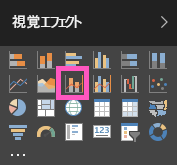

# Power BI での複合グラフ (チュートリアル)
Power BI の複合グラフは、折れ線グラフと縦棒グラフを組み合わせた 1 つの視覚化です。 2 つのグラフを 1 つに組み合わせると、データの比較をよりすばやく行うことができます。

複合グラフには、1 つまたは 2 つの Y 軸を保持できます。

## 複合グラフを使用すべきケース
複合グラフは、次のような場合に最適な選択肢になります。

* 同じ X 軸を持つ折れ線グラフと縦棒グラフがある場合。
* 値の範囲が異なる複数のメジャーを比較する場合。
* 2 つのメジャーの間の相関関係を 1 つの視覚化で示す場合。
* あるメジャーが別のメジャーで定義されているターゲットを満たすかどうかを調べる場合
* キャンバスのスペースを節約する場合。

## 基本的な 1 つの軸の複合グラフを作成する
このビデオでは、売上およびマーケティングのサンプルを使って複合グラフを作成する様子をご覧いただけます。

<iframe width="560" height="315" src="https://www.youtube.com/embed/lnv66cTZ5ho?list=PL1N57mwBHtN0JFoKSR0n-tBkUJHeMP2cP" frameborder="0" allowfullscreen></iframe>

独自の複合グラフを作成するには、Power BI にサインインして、**[データの取得] \> [サンプル] \> [小売りの分析のサンプル]** を選択します。 

1. [小売りの分析のサンプル] ダッシュボードで、 **\[Total Stores] \(総店舗数)** タイルを選び、[小売りの分析のサンプル] レポートを開きます。
2. **[レポートの編集]** を選んで、編集ビューでレポートを開きます。
3. [新しいレポートのページを追加](power-bi-report-add-page.md)します。
4. 今年の売上と粗利益を月単位で表示する縦棒グラフを作成します。
   
    a.  [フィールド] ウィンドウで、**\[Sales] \(売上)** \> **\[This Year Sales] \(今年の売上)** > **[値]** を選択します。
   
    b.  **[Sales]** \> **[Gross Margin This Year]** を **[値]** にドラッグします。
   
    c.  **[Time]** \> **[Fiscal Month]** の順に選択して、**[軸]** に追加します。 
   
    
5. 視覚化の右上隅にある省略記号 [...] を選び、**[並べ替え: FiscalMonth]** を選びます。
6. 縦棒グラフを複合グラフに変換します。 縦棒グラフを選んだ状態で **[視覚化]** ウィンドウから **[折れ線グラフおよび集合縦棒グラフ]** を選びます。
   
    
7. **[フィールド]** ウィンドウで、**[Sales]** \> **[Last Year Sales]** を **[線の値]** バケットにドラッグします。
   
   
   
   複合グラフは次のようになります。
   
   

## 2 つの軸を持つ複合グラフを作成する
このタスクでは、粗利と売上を比較します。

1. 前年の粗利 (%) を月ごとに追跡する新しい折れ線グラフを作成します。  1 月の粗利 (%) は 35% で、4 月には最高値の 45% になり、7 月に下がって 8 月に再びピークに達しました。 前年と本年は同じ売上パターンになるでしょうか?
   
   
2. **[This Year Sales] > [Value]** と **[Last Year Sales]** を折れ線グラフに追加します。 **[GM% Last Year]** (前年の GM%) の目盛が **[Sales]** (売上) の目盛よりかなり小さいため、比較が困難です。      
   
   
3. ビジュアルの読みやすく分かりやすくするため、折れ線グラフを「折れ線グラフおよび積み上げ縦棒グラフ」に変換します。
   
   
4. **[Gross Margin% Last Year]** を **[各棒の値]** から **[線の値]** にドラッグします。 Power BI によって 2 つの軸が作成されるため、各データ セットを異なる縮尺でプロットできます。つまり、左側の測定単位はドルで、右側の測定単位は割合です。
   
       

## タイトルを各軸に追加する
1. ペイント ローラー アイコン  を選び、[書式設定] ウィンドウを開きます。
2. 下矢印を選んで、 **Y 軸** のオプションを展開します。
3. **[Y 軸 (棒)]** で、**[位置]** を **[左]** に、**[タイトル]** を **[オン]** に、**[スタイル]** を **[タイトルのみを表示]**に、**[表示]** を **[百万]** に、それぞれ設定します。
   
   
4. **[Y 軸 (棒)]** では、**[セカンダリの表示]** が **[オン]** に設定されていることも確認します。 これにより、複合グラフの折れ線グラフの部分の書式を設定するためのオプションが表示されます。
   
   
5. **[Y 軸 (折れ線)]** で、**[位置]** は **[右]** にし、**[タイトル]** を **[オン]** にして、**[スタイル]** を **[タイトルのみを表示]** に設定します。
   
   複合グラフに 2 つの軸とそれぞれのタイトルが表示されるようになります。
   
   

ここからは次のことができます。

* [複合グラフをダッシュボード タイルとして追加](service-dashboard-tiles.md)します。
* [レポートを保存](service-report-save.md)します。

## 強調表示とクロス フィルター処理
[フィルター] ウィンドウの使用方法については、「[Power BI でのレポートへのフィルターの追加](power-bi-report-add-filter.md)」をご覧ください。

複合グラフ内の縦棒または折れ線を強調表示すると、レポートのページ上の他の視覚化がクロス フィルター処理されます。逆の場合も同様です。

## 次の手順
[視覚化をレポートに追加する](power-bi-report-add-visualizations-i.md)

[Power BI レポートでの視覚化](power-bi-report-visualizations.md)

[Power BI での視覚化の種類](power-bi-visualization-types-for-reports-and-q-and-a.md)

[Power BI - 基本的な概念](service-basic-concepts.md)

[試してみる (無料)](https://powerbi.com/)

他にわからないことがある場合は、 [Power BI コミュニティを利用してください](http://community.powerbi.com/)。

