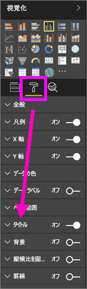
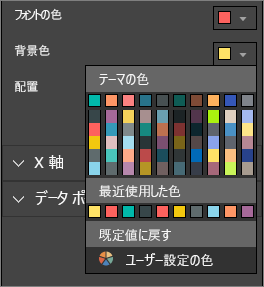
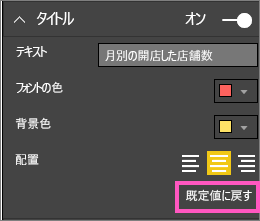
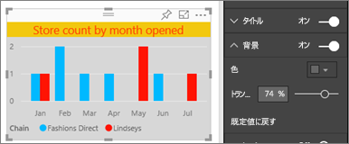
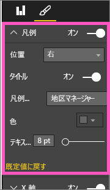
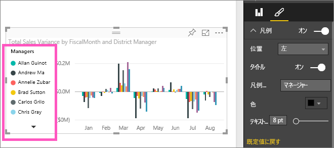

# 視覚化のタイトル、凡例、背景をカスタマイズする (チュートリアル)
このチュートリアルでは、視覚化をカスタマイズする、さまざまな方法について説明します。   視覚化をカスタマイズするオプションはとても多いので、そのすべてを学習する最善の方法は、[書式設定] ウィンドウ (ペイントローラー アイコンを選択) を調べることです。  その手始めとして、この記事では視覚化のタイトル、凡例、背景をカスタマイズする方法を説明します。  

すべての視覚エフェクトをカスタマイズできるわけではありません。[完全なリストを参照](#list)してください。  

Amanda が自分のレポートの視覚エフェクトをカスタマイズする様子をご覧ください (ビデオで 4 分 50 秒まで早送りします)。 その後、ビデオで説明されている手順に従って、ご自分のデータでやってみてください。

<iframe width="560" height="315" src="https://www.youtube.com/embed/IkJda4O7oGs" frameborder="0" allowfullscreen></iframe>

### 前提条件
- Power BI サービスまたは Power BI Desktop
- 小売の分析のサンプル

## レポートの視覚エフェクトのタイトルをカスタマイズする
まず、Power BI サービス (app.powerbi.com) にサインインし、[小売りの分析のサンプル](sample-datasets.md) レポートを[編集ビュー](service-interact-with-a-report-in-editing-view.md)で開きます。

> [!NOTE]
> 視覚エフェクトをダッシュボードにピン留めすると、その視覚エフェクトはダッシュボード タイルになります。  それらのタイル自体も、[新しいタイトルとサブタイトル、ハイパーリンク、およびサイズの変更](service-dashboard-edit-tile.md)でカスタマイズできます。
> 
> 

1. レポートの \[New Stores] \(新しい店舗) ページに移動して、\[Open Store Count by Open Month...] \(開店月別の開店店舗数…) 棒グラフを選択します。
2. [視覚化] ウィンドウで、ペイントローラー アイコンを選んで、書式設定のオプションを表示します。  **[タイトル]** を選んでセクションを展開します。  
   
   
3. スライダーの [オン] または [オフ] を選択して、  **[タイトル]** のオンとオフを切り替えます。 ここでは、 **[オン]**を選択したままにします。  
   
   
4. テキスト フィールドに「 **Store count by month opened** 」(開店した月別の店舗数) と入力して、 **タイトルのテキスト** を変更します。  
5. **[フォント色]** をオレンジに、 **[背景色]** を黄色に変えます。
   
   * ドロップダウンを選択し、 **[テーマの色]**、 **[最近使用した色]**、または **[ユーザー設定の色]**から色を選択します。
   * ドロップダウンを選択して、色ウィンドウを閉じます。  
     
   
   色ウィンドウの **[既定値に戻す]** 選択すると、いつでも既定の色に戻せます。
6. テキスト サイズを 12 に増やします。
7. 最後のカスタマイズでは、グラフのタイトルを視覚エフェクトの中央に配置します。 タイトルの位置は、既定で左揃えに設定されています。  
   
   
    チュートリアルのこの時点では、縦棒グラフの**タイトル**は次のように表示されます。  
    
   
    これまでに実行したタイトルのカスタマイズをすべて元に戻すには、 **[タイトル]**のカスタマイズ ウィンドウの下部にある、 **[既定値に戻す]** を選択します。  
    

## 視覚エフェクトの背景をカスタマイズする
同じ縦棒グラフを選択して、[背景] オプションを展開します。

1. スライダーの [オン] または [オフ] を選択して、背景のオンとオフを切り替えます。 ここでは、 **[オン]**を選択したままにします。
2. 背景色を 74% のグレーに変更します。
   
   * ドロップダウンを選択し、**[テーマの色]**、**[最近使用した色]**、または **[ユーザー設定の色]** からグレーを選択します。
   * 透明度を 74% に変更します。   
     
   
   これまでに実行したタイトルの背景のカスタマイズをすべて元に戻すには、 **[背景]**のカスタマイズ ウィンドウの下部にある **[既定値に戻す]** を選択します。

## 視覚エフェクトの凡例をカスタマイズする
1. **[概要]** レポート ページを開き、「Total Sales Variance by FiscalMonth and District Manager (年度別および地域マネージャー別の総売上差異)」グラフを選択します。
2. [視覚エフェクト] タブで、ペイントブラシのアイコンを選択し、書式設定のオプションを表示します。  
3. **凡例** オプションを展開します。
   
      
4. スライダーの [オン] または [オフ] を選択して、凡例のオンとオフを切り替えます。 ここでは、 **[オン]**を選択したままにします。
5. 凡例を視覚エフェクトの左側に移動します。    
6. **[タイトル]** を **[オン]** に切り替えて凡例にタイトルを追加し、 **[凡例名]** テキスト フィールドに **"Manager"**(マネージャー) と入力します。
   
   
   これまでに実行した凡例のカスタマイズをすべて元に戻すには、 **[凡例]**のカスタマイズ ウィンドウの下部にある **[既定値に戻す]** を選択します。

## カスタマイズ可能な視覚エフェクトの種類
| 視覚エフェクト | タイトル | 背景 | 凡例 |
|:--- |:--- |:--- |:--- |
| 面 |はい |はい |はい |
| 横棒 |はい |はい |はい |
| カード |はい |はい |該当なし |
| 複数の行カード |はい |はい |該当なし |
| 列 |はい |はい |はい |
| 複合 |はい |はい |はい |
| ドーナツ |はい |はい |はい |
| 塗り分け地図 |はい |はい |はい |
| じょうご |はい |はい |該当なし |
| ゲージ |はい |はい |該当なし |
| KPI |はい |はい |該当なし |
| 折れ線 |はい |はい |はい |
| マップ |はい |はい |はい |
| マトリックス |はい |はい |該当なし |
| 円 |はい |はい |はい |
| 散布 |はい |はい |はい |
| スライサー |はい |はい |該当なし |
| テーブル |はい |はい |該当なし |
| テキストボックス |いいえ |はい |該当なし |
| ツリーマップ |はい |はい |はい |
| ウォーターフォール |はい |はい |はい |

## 次の手順
[X 軸と Y 軸のカスタマイズ](power-bi-visualization-customize-x-axis-and-y-axis.md)  
[色と軸のプロパティのカスタマイズ](service-getting-started-with-color-formatting-and-axis-properties.md)  
[Power BI - 基本的な概念](service-basic-concepts.md)  
他にわからないことがある場合は、 [Power BI コミュニティを利用してください](http://community.powerbi.com/)。

