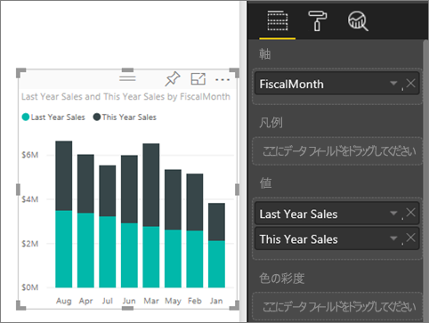
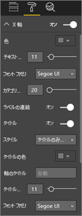
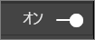
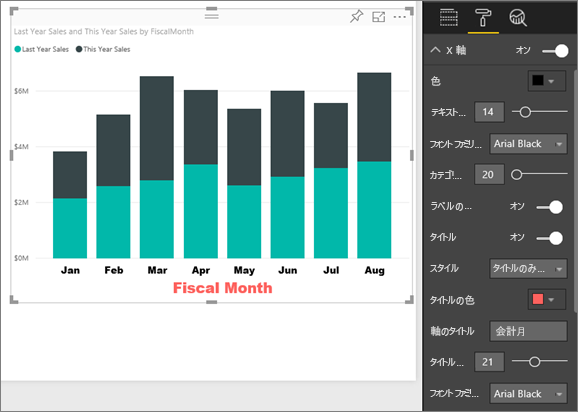
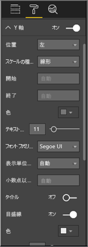
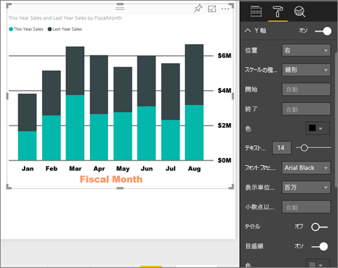
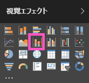
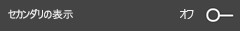
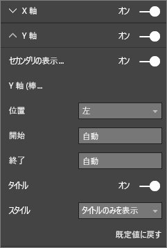

# X 軸と Y 軸のプロパティのカスタマイズ (チュートリアル)
このチュートリアルでは、視覚化に含まれる X 軸と Y 軸をカスタマイズする、さまざまな方法について説明します。 ただし、軸のない視覚化や、カスタマイズできない視覚化もあります。たとえば、円グラフに軸はありません。 カスタマイズのオプションは視覚化によって異なるため、数が多すぎて 1 つの記事では扱いきれません。 そこで、よく使われる軸のカスタマイズをいくつか見ていくほか、Power BI レポート キャンバスで使用する視覚的な書式設定タブについて説明します。  

> [!NOTE]
> このページは、Power BI サービスと Power BI Desktop の両方に適用されます。 これらのカスタマイズは **[書式]** (ペイント ローラ アイコン ) が選択されているときに利用でき、Power BI Desktop でも利用できます。  
> 
> 

Amanda が X 軸と Y 軸をカスタマイズし、ドリルアップとドリルダウンを使用するときにさまざまな方法で連結を制御する手順のデモンストレーションをご覧ください。 その後、ビデオで説明されている手順に従って、ご自分でやってみてください。小売りの分析のサンプルをご利用ください。

<iframe width="560" height="315" src="https://www.youtube.com/embed/9DeAKM4SNJM" frameborder="0" allowfullscreen></iframe>

## レポート内の X 軸の視覚化をカスタマイズする
## 積み上げグラフの視覚化を作成する
Power BI サービスにサインインし、**小売りの分析のサンプル** レポートを[編集ビュー](service-interact-with-a-report-in-editing-view.md)で開きます。 作業を進めるために、[小売りの分析のサンプルに接続](sample-datasets.md)します。

1. 今年の売上と去年の売上の値を会計月ごとに示す、新しい棒グラフを作成します。 
2. 積み上げ縦棒グラフに変換
   
    

## X 軸をカスタマイズする
1. \[Visualizations and Filters] \(視覚化とフィルター) ウィンドウで、**[書式]** (ペイントローラ アイコン ) を選択して、カスタマイズのオプションを表示します。
2. X 軸のオプションを展開します。
   
   
3. スライダーで \[オン] \(または [オフ]) を選択して、X 軸のオンとオフを切り替えます。 ここでは、 **[オン]** を選択したままにします。  X 軸をオフにする理由の 1 つは、データのための領域を増やすことです。
   
    
4. テキストの色、サイズ、フォントを設定します。 この例では、**[色]** を黒、**[テキスト サイズ]** を 14、**[フォント]** を Arial Black に設定しています。  
5. X 軸のタイトルを **[オン]** にして、X 軸の名前 (この例では、**FiscalMonth**) を表示します。  
6. タイトルのテキストの色、サイズ、フォントを設定します。  この例では、**[タイトルの色]** をオレンジに設定し、**[軸のタイトル]** を "**Fiscal Month**" に変更し、**[タイトル テキストのサイズ]** を 21 に設定しています。
7. FiscalMonth で並べ替えるには、グラフの右上隅にある省略記号 [...] を選び、**[並べ替え: FiscalMonth]** を選びます。
   
    これらのカスタマイズをすべて完了すると、棒グラフは次のように表示されるはずです。
   
     

これまでに実行した X 軸のカスタマイズをすべて元に戻すには、**[X 軸]** カスタマイズ ウィンドウの下部にある **[既定値に戻す]** を選びます。

## Y 軸をカスタマイズする
1. Y 軸のオプションを展開します。
   
   
2. スライダーで [オン]\(または [オフ]) を選んで、Y 軸のオンとオフを切り替えます。 ここでは、 **[オン]** を選択したままにします。  X 軸をオフにする理由の 1 つは、データのための領域を増やすことです。
   
    
3. Y 軸の **[位置]** を右側に移動します。
4. テキストの色、サイズ、フォントを設定します。 この例では、**[色]** を黒、**[テキスト サイズ]** を 14、**[フォント]** を Arial Black に設定しています。  
5. **[表示単位]** は百万のままにし、**[小数点以下桁数の値]** をゼロにします。
6. この視覚化の場合、Y 軸にタイトルを表示してもビジュアルがわかりやすくなることはないので、**[タイトル]** はオフのままにします。  
7. グリッド線が目立つように、**[色]** を濃いグレーに変更し、**[Stroke]\(ストローク\)** を 2 に増やします。
   
    これらのカスタマイズをすべて完了すると、棒グラフは次のように表示されるはずです。
   
     

## 2 つの Y 軸を持つ視覚化をカスタマイズする
最初に、店舗数が売上高に与える影響を調べる複合グラフを作成します。  これは、[複合グラフのチュートリアル](power-bi-visualization-combo-chart.md)で作成したグラフと同じものです。 その後、2 つの Y 軸の書式を設定します。

### 2 つの Y 軸を持つグラフを作成する
1. **[Time] > [FiscalMonth]** で **[Sales] > [Gross Margin last year %]** を追跡する新しい折れ線グラフを作成します。 
2. ビジュアルを月別に並べ替えるには、省略記号 (...) をクリックして、**[Sort by Month]** (月別に並べ替え) を選択します。
   
    
3. 1 月の粗利 (%) は 35% で、4 月には最高値の 45% になり、7 月に下がって 8 月に再びピークに達しました。 前年と本年は同じ売上パターンになるでしょうか?
4. **[This Year Sales] > [Value]** と **[Last Year Sales]** を折れ線グラフに追加します。 **[GM% Last Year]** (0M% のグリッド線に沿った青い線) の目盛が **[Sales]** の目盛よりかなり小さいため、比較が困難です。 また、Y 軸のラベルのパーセンテージがおかしくなっています。      
   
   
5. ビジュアルの読みやすく分かりやすくするため、折れ線グラフを「折れ線グラフおよび積み上げ縦棒グラフ」に変換します。
   
   
6. **[Gross Margin% Last Year]** (前年の粗利 (%)) を **[各棒の値]** から **[線の値]** にドラッグします。 上で作成した積み上げ縦棒グラフに***加えて***、折れ線グラフが表示されるようになりました   (上で学んだことを使って、必要に応じて、軸のフォントの色とサイズを設定してください)。
   
   Power BI によって 2 つの軸が作成されるため、各データ セットを異なる縮尺でプロットできます。つまり、左側の測定単位はドルで、右側の測定単位は割合です。
   
   

### 2 番目の Y 軸の書式を設定する
1. **[視覚化]** ウィンドウで、ペイント ローラーのアイコンを選択して、書式設定のオプションを表示します。
2. 下矢印を選択して、Y 軸のオプションを展開します。
3. **[セカンダリを表示]** のオプションが見つかるまで、リストをスクロールします。 **[セカンダリを表示]** を **[オフ]** から **[オン]** に切り替えます。
   
   
   
   
4. (省略可能) 2 つの軸をカスタマイズします。 棒の軸または線の軸の**位置**を切り替えた場合、2 つの軸の左右が切り替わります。
   
   

### 両方の軸にタイトルを追加する
この複雑な視覚化には、軸のタイトルの追加が有用です。  タイトルにより、同僚は視覚化の内容を理解しやすくなります。

1. **「Y 軸 (棒)」** と **「Y 軸 (折れ線)」** の**[タイトル]** を **[オン]** に切り替えます。
2. **[スタイル]** を **[タイトルの表示のみ]** に設定します。
   
   
3. これで、複合グラフに 2 つの軸がともにタイトル付きで表示されます。
   
   

詳しくは、[色の書式設定、ラベル付け、軸のプロパティに関するヒントとテクニック](service-tips-and-tricks-for-color-formatting.md)に関するページをご覧ください。

## 考慮事項とトラブルシューティング
X 軸が日付型としてレポートの所有者別に分類されている場合、**[種類]** オプションが表示され、連続またはカテゴリ別から選択できます。 

## 次の手順
[Power BI レポートでの視覚化](power-bi-report-visualizations.md)についての詳細を参照する

[視覚エフェクトの](power-bi-visualization-customize-title-background-and-legend.md)[タイトル、背景、および凡例のカスタマイズ](power-bi-visualization-customize-title-background-and-legend.md)

[色と軸のプロパティのカスタマイズ](service-getting-started-with-color-formatting-and-axis-properties.md)

[Power BI - 基本的な概念](service-basic-concepts.md)

他にわからないことがある場合は、 [Power BI コミュニティを利用してください](http://community.powerbi.com/)。

