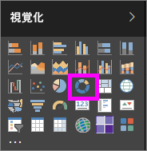
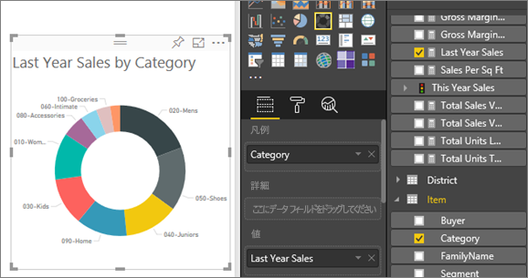

# Power BI のドーナツ グラフ
ドーナツ グラフは、全体に対する部分の関係が示される点で円グラフと似ています。 唯一の違いは、中央が空白で、ラベルまたはアイコン用の領域を確保できることです。

## ドーナツ グラフの作成
以下の手順では、小売りの分析のサンプルを使って、今年の売上をカテゴリ別に表示するドーナツ グラフを作成します。 作業を進めるために、Power BI サービス (app.powerbi.com) または Power BI Desktop の[サンプルをダウンロード](sample-datasets.md)します。

1. [空のレポート ページ](power-bi-report-add-page.md)を開始し、**[SalesStage]** \> **[Sales Stage]** フィールドを選びます。 Power BI サービスを使っている場合は、[編集ビュー](service-interact-with-a-report-in-editing-view.md)でレポートを開いていることを確認します。

2. [フィールド] ウィンドウで、**[Sales]** \> **[Last Year Sales]** を選びます。  
   
3. [視覚化] ウィンドウで、ドーナツ グラフのアイコン  を選んで、横棒グラフをドーナツ グラフに変換します。 **[Last Year Sales]** が **[値]** 領域にない場合は、そこにドラッグします。
     
   

4. **[Item]** \> **[Category]** を選び、それを **[凡例]** 領域に追加します。 
     
    

5. 必要に応じて、[グラフのテキストの色とサイズを調整](power-bi-visualization-customize-title-background-and-legend.md)します。 

## 考慮事項とトラブルシューティング
* ドーナツ グラフの各値の合計は、100% になる必要があります。
* カテゴリが多すぎると、読みにくく分かりにくくなります。
* ドーナツ グラフは、個々のセクションを互いに比較するのではなく、特定のセクションを全体と比較するために最もよく使用されます。 

## 次の手順
[Power BI のレポート](service-reports.md)

[Power BI での視覚化の種類](power-bi-visualization-types-for-reports-and-q-and-a.md)

[Power BI レポートでの視覚化](power-bi-report-visualizations.md)

[Power BI - 基本的な概念](service-basic-concepts.md)

他にわからないことがある場合は、 [Power BI コミュニティを利用してください](http://community.powerbi.com/)。

