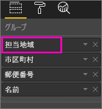
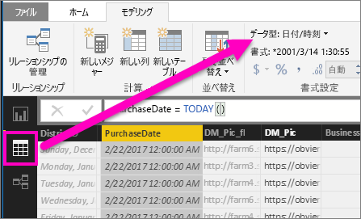

# Power BI での視覚化のドリルダウン
## ドリルダウンには階層が必要
ビジュアルに階層がある場合は、ドリルダウンしてさらに詳細な情報を表示できます。 たとえば、分野、競技、種目で構成された階層でオリンピック メダル数を表示する視覚化があるものとします。 既定では、視覚化には分野 (体操、スキー、水泳など) 別にメダル数が表示されます。 しかし、この視覚化は階層構造になっているので、いずれかのビジュアル要素 (棒、線、バブルなど) を選ぶと、さらに詳細な図が表示されます。 **水泳**要素を選ぶと、競泳、飛び込み、水球のデータが表示されます。  **飛び込み**要素を選ぶと、飛び板飛び込み、高飛び込み、シンクロナイズド ダイビングの各種目に関する詳細が表示されます。

階層を追加できるのは自分が所有するレポートだけであり、他のユーザーから共有されているレポートには追加できません。
どの視覚化に階層が含まれるかわからない場合は、  視覚化をポイントして、次のようなドリル コントロールが上部の隅に表示される場合、その視覚化には階層があります。

    
   

日付は、他とは違う種類の階層です。 視覚化に日付フィールドを追加すると、年、四半期、月、日を含む時間階層が自動的に追加されます。 詳しくは、「[ビジュアルの階層とドリルダウンの動作](guided-learning/visualizations.yml?tutorial-step=18)」または次のビデオをご覧ください。

  <iframe width="560" height="315" src="https://www.youtube.com/embed/MNAaHw4PxzE?list=PL1N57mwBHtN0JFoKSR0n-tBkUJHeMP2cP" frameborder="0" allowfullscreen></iframe>

> [!NOTE]
> Power BI Desktop を使用して階層を作成する方法についての説明は、[階層を作成および追加する方法](https://youtu.be/q8WDUAiTGeU)のビデオをご覧ください。
> 
> 

## ドリルダウンの 2 つの方法
視覚化のドリルダウン (およびドリルアップ) には 2 種類の方法があります。  この記事では、両方について説明します。 どちらの方法でも同じことが実現されるので、お好きな方法を使用してください。

> [!NOTE]
> 先に進む前に、Power BI サービスで [Retail Analysis サンプル](sample-datasets.md)を開き、**Territory**、**City**、**PostalCode**、**Name** (グループ) 別に **Total Units This Year** (値) を表示するツリーマップを作成してください。  
> 
> 

## ドリルダウンの方法 1
この方法では、視覚化自体の上部の隅に表示されるドリル アイコンを使います。

1. Power BI の[読み取りビューまたは編集ビュー](service-reading-view-and-editing-view.md)でレポートを開きます。 階層のある視覚化でなければドリルダウンできません。 
   
   階層は次のアニメーションのように表示されます。  この視覚化には、地域、都市、郵便番号、および都市名で構成された階層があります。 各地域には 1 つ以上の都市があり、各都市には 1 つ以上の郵便番号があります。 リストの先頭が *Territory* なので、既定では、視覚化には地域のデータのみが表示されます。
   
   
2. ドリルダウンを有効にするには、視覚化の右上隅にある矢印アイコンを選択します。 ドリルダウンが有効になると、アイコンが暗転します。 ドリルダウンが有効になっていない場合にビジュアル要素 (棒グラフやバブル チャート) を選ぶと、レポート ページの他のグラフがクロス フィルター処理されます。    
   
   
3. **一度に 1 つのフィールド**をドリルダウンするには、視覚エフェクトで要素の 1 つを選びます。 横棒グラフでは、棒の 1 つをクリックすることを意味します。 ツリーマップでは、**リーフ**の 1 つをクリックすることを意味します。 階層を上下に移動するとタイトルが変わることに注意してください。 このアニメーションでは、"Total Units This Year by Territory"、"Total Units This Year by Territory and City"、"Total Units This Year by Territory, City and PostalCode"、"Total Units This Year by Territory, City, PostalCode, and Name" の順に移動しています。 そして、ドリルダウン後に上位に戻るには、次に示すように、視覚化の左上隅にある **[ドリルアップ]** アイコン  を選びます。
   
   
4. ***すべてのフィールドを一度に***ドリルダウンするには、視覚化の左上隅にある二重矢印を選びます。
   
   
5. ドリルダウン後に上位に戻るには、視覚化の左上隅にある上向き矢印を選択します。
   
   

## ドリルダウンの方法 2
この方法では、Power BI の上部にあるメニュー バーの **[探索]** ドロップダウンを使います。

1. Power BI の[読み取りビューまたは編集ビュー](service-reading-view-and-editing-view.md)でレポートを開きます。 階層のある視覚化でなければドリルダウンできません。 
   
   階層は次の図のように表示されます。  この視覚化には、地域、都市、郵便番号、および都市名で構成された階層があります。 各地域には 1 つ以上の都市があり、各都市には 1 つ以上の郵便番号があります。 リストの先頭が *Territory* なので、既定では、視覚化には地域のデータのみが表示されます。
   
   
2. ドリルダウンを有効にするには、視覚化を選んでアクティブにし、Power BI 上部のメニュー バーから **[探索]** > **[ドリルダウン]** の順に選びます。 視覚化の右上隅にあるドリルダウン アイコンの背景が黒に変わります。   
   
   
3. 有効にした後は、ツリーマップの葉の 1 つを選んで、一度に 1 フィールドだけドリルダウンします。 この例では、**NC** という名前の地域を選び、ノースカロライナ州の本年度の販売総数を都市別に表示します。
   
   
4. すべてのフィールドを一度にドリルダウンするには、**[探索]** > **[次のレベルを表示する]** の順に選びます。
   
   
5. ドリルアップして戻るには、**[探索]** > **[ドリルアップ]** を選びます。
   
   

6. ビジュアルを作成するために使用されているデータを表示するには、**[データを参照]** を選択します。 ビジュアルの下のウィンドウにデータが表示されます。 このウィンドウは、ビジュアルのドリルスルーの実行中に残ります。 詳しくは、「[ビジュアルの作成に使用するデータを確認する](service-reports-show-data.md)」をご覧ください。

## 階層軸と階層グループについて
階層軸と階層グループは、表示するデータの細分性を上げたり下げたりするために使えるメカニズムと考えることができます。 カテゴリとサブカテゴリに編成できるデータは、階層を持つことができます。 これにはもちろん日付と時刻が含まれます。

Power BI で階層を持つ視覚エフェクトを作成するには、1 つ以上のデータ フィールドを選んで **[軸]** ウェルまたは **[グループ]** ウェルに追加し、データ フィールドとして調べるデータを **[値]** ウェルに追加します。 データが階層的かどうかは、視覚エフェクトの左上隅と右上隅に表示されるドリル モード アイコンでわかります。 

基本的には、2 種類の階層データを考えると便利です。
- 日付と時刻のデータ - DateTime データ型のデータ フィールドが存在する場合は、既に階層データがあります。 Power BI は、[DateTime](https://msdn.microsoft.com/library/system.datetime.aspx) 構造に解析できる値を持つすべてのデータ フィールドの階層を自動的に作成します。 **[軸]** または **[グループ]** ウェルに 1 つの DateTime フィールドを追加することだけが必要です。
- カテゴリ データ - データがサブコレクションを持つコレクションから派生している場合、またはそれ以外で共通の値を共有するデータの行がある場合は、階層データです。

Power BI では、1 つまたはすべてのサブセットを展開できます。 データをドリルダウンし、各レベルで 1 つのサブセットを表示するか、各レベルで同時にすべてのサブセットを表示することができます。 たとえば、特定の年をドリルダウンしたり、階層を下りながら各年のすべての結果を表示したりできます。 逆に、同じ方法でをドリルアップできます。

次のセクションでは、最上位のビュー、中間のビュー、最下位のビューからのドリルダウンについて説明します。

### 階層データと時刻データ
この例では、[小売りの分析のサンプル](sample-datasets.md)に従って、**Month** (軸) ごとの **TotalSales** (値) を表示する積み上げ縦棒グラフ視覚エフェクトを作成します。  

軸データ フィールドは **Month** ですが、**[軸]** ウェルには **Year** カテゴリも作成します。 これは、Power BI は読み取るすべての値に対する完全な DateTime 構造を提供するためです。 階層の最上部では、年のデータが表示されます。

ドリルダウン モードをオンにし、グラフの棒をクリックして階層の 1 つ下のレベルに移動します。 使用可能な四半期のデータに対する 3 つの棒が表示されます。 左上のアイコンで **[Expand all down one level of the hierarchy]\(階層の 1 レベル下をすべて展開する\)** を選びます。 同じことをもう一度行って、各月の結果を示す階層の最下位レベルを表示します。

視覚エフェクトとは別に、各レポートにレンダリングされるデータに反映された階層も確認できます。 次の表は、1 つの月またはすべての月からドリルダウンしたレポートでの **[データの表示]** の結果です。 

データは四半期レポートと年レポートで同じですが、**[値]** に指定されている詳細レベルにドリルダウンすると、1 つのレポートがより具体的になって "すべての月" レポートのデータが増えることがわかります。

|展開モード|Year|Quarter|月|日|
| ---|:---:|:---:|:---:|---|
|単一|||||
|すべて|||||

### 階層カテゴリ データ
コレクションとサブコレクションからモデル化されたデータは階層的です。 よい例は場所データです。 列が国、都道府県、市、郵便番号であるデータ ソース内のテーブルを考えてください。 同じ国、都道府県、市を共有するデータは階層的です。

この例は[小売りの分析のサンプル](sample-datasets.md)に従います。 **Total Units This Year** (値) を **Territory**、**City**、**PostalCode**、**Name** (グループ) 別に表示する積み上げ縦棒グラフ視覚エフェクトを作成します。  

ドリルダウン モードをオンにして、左上のアイコンで **[Expand all down one level of the hierarchy]\(階層の 1 レベル下をすべて展開する\)** を 3 回選びます。
階層の最下位レベルにいる必要があり、Territory、City、および Postal Code の結果が表示されます。

視覚エフェクトとは別に、各レポートにレンダリングされるデータに反映された階層も確認できます。 次の表は、1 つのテリトリまたはすべてのテリトリをドリルダウンしたレポートでの **[データの表示]** の結果です。 ドリルダウンすると、1 つのレポートがより具体的になり、"すべてのテリトリ" レポートのデータが増えることがわかります。

| 展開モード|担当地域|市区町村|郵便番号|名前|
| ---|:---:|:---:|:---:|---|
|単一|||||
|すべて|||||

## 考慮事項と制限事項
* 視覚化に日付フィールドを追加しても階層が作成されない場合は、"日付" フィールドが実際には日付として保存されていない可能性があります。 データセットを所有している場合は、Power BI Desktop で *[データ]* ビューを開き、日付を含む列を選んだ後、[モデリング] タブで **[データ型]** を **[日付]** または **[日付/時刻]** に変更します。 他のユーザーからレポートを共有されている場合は、所有者に連絡して変更を頼みます。  
  
  

## 次の手順
[Power BI レポートでの視覚化](power-bi-report-visualizations.md)

[Power BI レポート](service-reports.md)

[Power BI - 基本的な概念](service-basic-concepts.md)

他にわからないことがある場合は、 [Power BI コミュニティを利用してください](http://community.powerbi.com/)。

