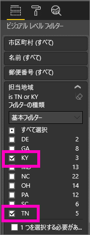
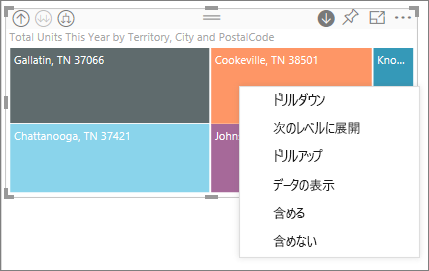
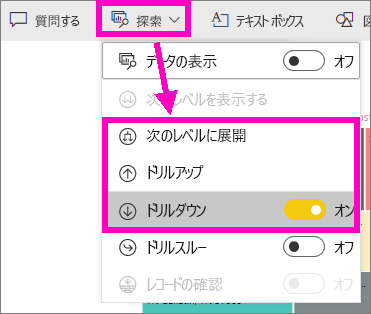
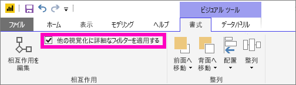
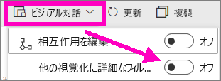

# Power BI での視覚エフェクトのドリル モード

## ドリルには階層が必要
ビジュアルに階層がある場合は、ドリルダウンしてさらに詳細な情報を表示できます。 たとえば、分野、競技、種目で構成された階層でオリンピック メダル数を表示する視覚化があるものとします。 既定では、視覚化には分野 (体操、スキー、水泳など) 別にメダル数が表示されます。 しかし、この視覚化は階層構造になっているので、いずれかのビジュアル要素 (棒、線、バブルなど) を選ぶと、さらに詳細な図が表示されます。 **水泳**要素を選ぶと、競泳、飛び込み、水球のデータが表示されます。  **飛び込み**要素を選ぶと、飛び板飛び込み、高飛び込み、シンクロナイズド ダイビングの各種目に関する詳細が表示されます。

階層を追加できるのは自分が所有するレポートだけであり、他のユーザーから共有されているレポートには追加できません。
どの視覚化に階層が含まれるかわからない場合は、  視覚化をポイントして、次のようなドリル コントロールが上部の隅に表示される場合、その視覚化には階層があります。

    
   

日付は、他とは違う種類の階層です。 視覚化に日付フィールドを追加すると、年、四半期、月、日を含む時間階層が自動的に追加されます。 詳しくは、「[ビジュアルの階層とドリルダウンの動作](guided-learning/visualizations.yml?tutorial-step=18)」または次のビデオをご覧ください。

  <iframe width="560" height="315" src="https://www.youtube.com/embed/MNAaHw4PxzE?list=PL1N57mwBHtN0JFoKSR0n-tBkUJHeMP2cP" frameborder="0" allowfullscreen></iframe>

> [!NOTE]
> Power BI Desktop を使用して階層を作成する方法についての説明は、[階層を作成および追加する方法](https://youtu.be/q8WDUAiTGeU)のビデオをご覧ください。
> 

## 前提条件

1. Power BI サービスまたは Power BI Desktop では、階層のある視覚エフェクトでなければドリルダウンできません。 
   
2. 先に進む前に、[小売りの分析のサンプル](sample-datasets.md)を開き、**Territory**、**City**、**PostalCode**、**Name** (グループ) 別に **Total Units This Year** (値) を表示するツリーマップを作成してください。  ツリーマップには、地域、都市、郵便番号、および都市名で構成された階層があります。 各地域には 1 つ以上の都市があり、各都市には 1 つ以上の郵便番号があります。 リストの先頭が *Territory* なので、既定では、視覚化には地域のデータのみが表示されます。
   
   

2. さまざまなドリル アイコンの動作をまとめて理解しようとするとわかりにくいことがあるので、2 つの小さい地域 **KY** と **TN** だけが表示されるように地域をフィルター処理します。 ツリーマップを選び、**[ビジュアル レベル フィルター]** で **Territory** を展開して、**KY** と **TN** を選びます。

        

   ツリーマップに 2 つの地域だけが表示されるようになります。

   

## ドリル機能にアクセスする 3 つの方法
階層を持つ視覚エフェクトのドリルダウン、ドリルアップ、展開機能にアクセスするには複数のオプションがあります。 この記事では、最初のオプションを使用する方法を示します。 ダウンドリルと展開の基本を理解した後は、3 つの方法はすべて同じことを行うので、他の方法を試して最適なものを選んでください。

- 視覚エフェクトをポイントし、アイコンを表示して使用します。  

    

- 視覚エフェクトを右クリックし、メニューを表示して使用します。
    
    

- Power BI メニュー バーの **[探索]** ボタンを選びます。

   

## ドリルの経路
### ドリルダウン
視覚エフェクトをドリルして移動するには複数の方法があります。 "***ドリルダウン***" は階層内の次のレベルに移動するので、**Territory** レベルを表示している場合は、City レベル、PostalCode レベル、Name レベルの順にドリルダウンできます。 パスの各ステップでは、新しい情報が表示されます。

### 展開

"***展開***" は、現在のビューに新しい階層レベルを追加します。 したがって、**Territory** レベルを見ている場合は、展開して City、PostalCode、Name の詳細をツリーマップに追加できます。 パスの各ステップでは、前のレベルと同じ情報に、次のレベルの新しい情報が追加されます。

一度に 1 つのフィールドをドリルダウンまたは展開するか、すべてのフィールドをドリルダウンまたは展開するかも選択できます。 

## すべてのフィールドを一度にドリルダウンする

1. KY と TN. のデータが表示されているツリーマップの最上位レベルから始めます。 ハンドルの 1 つを選んで右側にドラッグして、ツリーマップの幅を広げます。 

     .

2. ***すべてのフィールドを一度に***ドリルダウンするには、視覚化の左上隅にある二重矢印  を選びます。 ツリーマップにケンタッキーとテネシーの市のデータが表示されます。 

    
   
5. 再度ドリルダウンして階層の PostalCode レベルに移動します。

    

3. ドリルダウン後に上位に戻るには、視覚化の左上隅にある上向き矢印  を選びます。

## 一度に 1 つのフィールドをドリルダウンする
この方法では、視覚エフェクト自体の右上隅に表示されるドリルダウン アイコンを使います。 

1. ドリルダウン アイコンを選んでオンにします 。 "***一度に 1 つのフィールド***" をドリルダウンできるようになります。 
   
   

   ドリルダウンが有効になっていない場合にビジュアル要素 (棒、バブル、リーフなど) を選ぶと、ドリルダウンするのではなく、レポート ページの他のグラフがクロス フィルター処理されます。

2. **TN** の "*リーフ*" を選びます。 ツリーマップに、店舗があるテネシー州のすべての都市が表示されます。 

    

2. ここからは、テネシー州のドリルダウンを続けるか、またはテネシー州の特定の市をドリルダウンするか、または代わりに展開することができます (後の「**全フィールドおよび 1 フィールドを一度に展開する**」を参照してください)。 一度に 1 つのフィールドのドリルダウンを続けます。  **Knoxville, TN** を選びます。 ツリーマップに Knoxville の店舗の PostalCode が表示されます。 

   

    階層を上下に移動するとタイトルが変わることに注意してください。  

## 一度に全フィールドおよび 1 フィールドを展開する
郵便番号のみが表示されるツリーマップではあまり役に立ちません。  そこで、階層内の 1 レベル下を展開します。  

1. ツリーマップをアクティブにして、"*下を展開*" アイコン  を選びます。 ツリーマップに、階層の郵便番号と店舗名の 2 レベルが表示されるようになります。 

    

2. テネシー州の 4 階層レベルのデータすべてを表示するには、ツリーマップの第 2 レベル **Territory および City による Total Units This Year** に達するまでドリルアップ矢印を選びます。 

    

3. ドリルダウンがまだ有効になっていること  を確認し、"*下を展開*" アイコン  を選びます。 ツリーマップに、市と州だけでなく郵便番号も表示されるようになります。 

    

4. "*下を展開*" アイコンをもう一度選び、ツリーマップのテネシー州の 4 階層レベルすべての詳細を表示します。 リーフをポイントするとさらに多くの詳細が表示されます。

   

## 他の視覚化に詳細なフィルターを適用する
ドリル モードで作業するときに、ドリルダウンと展開がページの他の視覚エフェクトにどのような影響を及ぼすかを決定します。 

既定では、ドリルによってレポートの他のビジュアルがフィルター処理されることはありません。 ただし、Power BI Desktop と Power BI サービスでこの機能を有効にすることができます。 

1. Desktop では、**[書式]** タブを選び、**[他の視覚化に詳細なフィルターを適用する]** チェック ボックスをオンにします。

    

2. 階層のビジュアルをドリルダウン (またはドリルアップや展開) すると、ページ上の他のビジュアルがフィルター処理されます。 

    

    

> [!NOTE]
> Power BI サービスでこれを有効にするには、上部のメニュー バーから **[ビジュアル対話] > [他の視覚化に詳細なフィルターを適用する]** を選びます。
>
> 

## 階層軸と階層グループについて
階層軸と階層グループは、表示するデータの細分性を上げたり下げたりするために使えるメカニズムと考えることができます。 カテゴリとサブカテゴリに編成できるデータは、階層を持つことができます。 これにはもちろん日付と時刻が含まれます。

Power BI で階層を持つ視覚エフェクトを作成するには、1 つ以上のデータ フィールドを選んで **[軸]** ウェルまたは **[グループ]** ウェルに追加し、データ フィールドとして調べるデータを **[値]** ウェルに追加します。 データが階層的かどうかは、視覚エフェクトの左上隅と右上隅に表示される "*ドリル モード*" アイコンでわかります。 

基本的には、2 種類の階層データを考えると便利です。
- 日付と時刻のデータ - DateTime データ型のデータ フィールドが存在する場合は、既に階層データがあります。 Power BI は、[DateTime](https://msdn.microsoft.com/library/system.datetime.aspx) 構造に解析できる値を持つすべてのデータ フィールドの階層を自動的に作成します。 **[軸]** または **[グループ]** ウェルに 1 つの DateTime フィールドを追加することだけが必要です。
- カテゴリ データ - データがサブコレクションを持つコレクションから派生している場合、またはそれ以外で共通の値を共有するデータの行がある場合は、階層データです。

Power BI では、1 つまたはすべてのサブセットを展開できます。 データをドリルダウンし、各レベルで 1 つのサブセットを表示するか、各レベルで同時にすべてのサブセットを表示することができます。 たとえば、特定の年をドリルダウンしたり、階層を下りながら各年のすべての結果を表示したりできます。 逆に、同じ方法でをドリルアップできます。

次のセクションでは、最上位のビュー、中間のビュー、最下位のビューからのドリルダウンについて説明します。

### 階層データと時刻データ
この例では、[小売りの分析のサンプル](sample-datasets.md)に従って、**Month** (軸) ごとの **TotalSales** (値) を表示する積み上げ縦棒グラフ視覚エフェクトを作成します。  

軸データ フィールドは **Month** ですが、**[軸]** ウェルには **Year** カテゴリも作成します。 これは、Power BI は読み取るすべての値に対する完全な DateTime 構造を提供するためです。 階層の最上部では、年のデータが表示されます。

ドリルダウン モードをオンにし、グラフの棒をクリックして階層の 1 つ下のレベルに移動します。 使用可能な四半期のデータに対する 3 つの棒が表示されます。 左上のアイコンで **[Expand all down one level of the hierarchy]\(階層の 1 レベル下をすべて展開する\)** を選びます。 同じことをもう一度行って、各月の結果を示す階層の最下位レベルを表示します。

視覚エフェクトとは別に、各レポートにレンダリングされるデータに反映された階層も確認できます。 次の表は、1 つの月またはすべての月からドリルダウンしたレポートでの **[データの表示]** の結果です。 

データは四半期レポートと年レポートで同じですが、**[値]** に指定されている詳細レベルにドリルダウンすると、1 つのレポートがより具体的になって "すべての月" レポートのデータが増えることがわかります。

|展開モード|年|Quarter|月|日|
| ---|:---:|:---:|:---:|---|
|単一|||||
|すべて|||||

### 階層カテゴリ データ
コレクションとサブコレクションからモデル化されたデータは階層的です。 よい例は場所データです。 列が国、都道府県、市、郵便番号であるデータ ソース内のテーブルを考えてください。 同じ国、都道府県、市を共有するデータは階層的です。

この例は[小売りの分析のサンプル](sample-datasets.md)に従います。 **Total Units This Year** (値) を **Territory**、**City**、**PostalCode**、**Name** (グループ) 別に表示する積み上げ縦棒グラフ視覚エフェクトを作成します。  

ドリルダウン モードをオンにして、左上のアイコンで **[Expand all down one level of the hierarchy]\(階層の 1 レベル下をすべて展開する\)** を 3 回選びます。
階層の最下位レベルにいる必要があり、Territory、City、および Postal Code の結果が表示されます。

視覚エフェクトとは別に、各レポートにレンダリングされるデータに反映された階層も確認できます。 次の表は、1 つのテリトリまたはすべてのテリトリをドリルダウンしたレポートでの **[データの表示]** の結果です。 ドリルダウンすると、1 つのレポートがより具体的になり、"すべてのテリトリ" レポートのデータが増えることがわかります。

| 展開モード|担当地域|市区町村|郵便番号|名前|
| ---|:---:|:---:|:---:|---|
|単一|||||
|すべて|||||

## 考慮事項と制限事項
* 視覚化に日付フィールドを追加しても階層が作成されない場合は、"日付" フィールドが実際には日付として保存されていない可能性があります。 データセットを所有している場合は、Power BI Desktop で *[データ]* ビューを開き、日付を含む列を選んだ後、[モデリング] タブで **[データ型]** を **[日付]** または **[日付/時刻]** に変更します。 他のユーザーからレポートを共有されている場合は、所有者に連絡して変更を頼みます。  
  
  

## 次の手順
[Power BI レポートでの視覚化](visuals/power-bi-report-visualizations.md)

[Power BI レポート](service-reports.md)

[Power BI - 基本的な概念](service-basic-concepts.md)

他にわからないことがある場合は、 [Power BI コミュニティを利用してください](http://community.powerbi.com/)。

