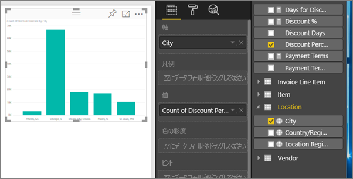
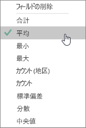
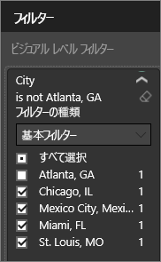
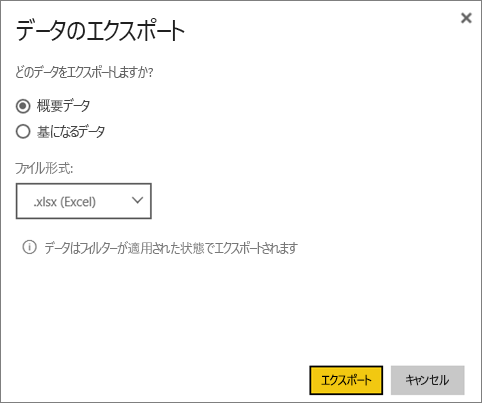

# ビジュアルからデータをエクスポートする
ビジュアルを作成するのに使うデータを確認したい場合は、[Power BI でデータを表示](service-reports-show-data.md)するか、またはデータを Excel に .xlsx または .csv ファイルとしてエクスポートします。   

Watch では、レポート内のビジュアルの 1 つからデータをエクスポートし、それを .xlsx ファイルとして保存し、Excel で開くことができます。 その後、ビデオで説明されている手順に従って、ご自分でやってみてください。

<iframe width="560" height="315" src="https://www.youtube.com/embed/KjheMTGjDXw" frameborder="0" allowfullscreen></iframe>

## Power BI ダッシュボード上のビジュアルから
1. ビジュアルの右上隅にある省略記号を選択します。
   
    
2. **[データをエクスポート]** アイコンを選択します。
   
    
3. データは .csv ファイルにエクスポートされます。 ビジュアルがフィルター処理されている場合は、ダウンロードされるデータもフィルター処理されます。
4. お使いのブラウザーから、ファイルを保存するように求められます。  保存したら、.csv ファイルを Excel で開きます。
   
    

## レポート内のビジュアルから
先に進む前に、[調達の分析サンプル レポート](sample-procurement.md)を[編集ビュー](service-reading-view-and-editing-view.md)で開いてください。 [新しい空のレポート ページを追加](power-bi-report-add-page.md)します。 その後、手順に従って、集計および視覚化レベルのフィルターを追加します。

1. 新しい縦棒グラフを作成します。  フィールド ウィンドウで、**"Location" > "City"** および **"Invoice" > "Discount Percent"** を選びます。   
   
    
2. "**Discount Percent**" の集計を **[カウント]** から **[平均]** に変更します。 値ウェルで、"**Discount Percent**" ("**Count of Discount Percent**" になっているかもしれません) の右側の矢印を選び、**[平均]** を選びます。
   
    
3. "**City**" にフィルターを追加して "**Atlanta**" を除去します。
   
   
   
   これで、データをエクスポートする両方のオプションを試す準備ができました。
4. ビジュアルの右上隅にある省略記号を選択します。 **[データをエクスポート]**を選択します。
   
   
5. 視覚化に集計がある場合 (一例は、 **[カウント]** を *[平均]* 、 **[合計]** 、または *[最小]* に変更した場合)、 **[概要データ]** と **[基になるデータ]** の 2 つのオプションがあります。 集計について理解するには、「[Power BI での集計](service-aggregates.md)」を参照してください。
   
    
6. **[概要データ]** > **[エクスポート]** を選び、.xlsx または .csv を選びます。 データがエクスポートされます。  視覚化にフィルターを適用してある場合、フィルターが適用された状態のデータがエクスポートされます。 **[エクスポート]** を選ぶと、ファイルを保存するように求められます。 保存したら、Excel でファイルを開きます。
   
   **概要データ**: 集計が含まれていない場合、または集計は含まれているが完全な内訳を表示する必要がない場合は、このオプションを選択します。 たとえば、4 つの棒を含む横棒グラフがある場合は、4 行のデータが作成されます。 概要データは、.xlsx および .csv で使用できます。
   
   この例の Excel へのエクスポートでは、都市ごとに 1 つのタイトルが表示されています。 アトランタを除外したので、結果には含まれません。  スプレッドシートの最初の行では、Power BI からデータを抽出するときに使われたフィルターが示されています。
   
   
7. 次に、**[基になるデータ]** > **[エクスポート]** を選び、.xlsx を選んでみてください。 データがエクスポートされます。 視覚化にフィルターを適用してある場合、フィルターが適用された状態のデータがエクスポートされます。 **[エクスポート]** を選ぶと、ファイルを保存するように求められます。 保存したら、Excel でファイルを開きます。
   
   >[!WARNING]
   >基になるデータをエクスポートすることで、ユーザーがすべての詳細データ、つまりすべての列のデータを表示できるようになります。 Power BI サービスの管理者は自分の組織に対してこれをオフにできます。 データセットの所有者であれば、デスクトップまたは Power BI サービスのフィールド リストに表示されないよう、所有権列を "非表示" に設定できます。
   > 
   > 
   
   **基になるデータ**: ビジュアルに集計が含まれていて、基になる詳細をすべて表示したい場合に、このオプションを選択します。 基本的に、*[基になるデータ]* を選ぶと集計は削除されます。 **[エクスポート]** を選択すると、データが .xlsx ファイルにエクスポートされ、ファイルを保存するようにブラウザーから求められます。 保存したら、Excel でファイルを開きます。
   
   この例の Excel エクスポートでは、データセットの 1 つの都市行ごとに 1 つの行が作成され、その 1 つのエントリの割引率が示されます。 つまり、データはフラット化された状態であり、集計されていません。 スプレッドシートの最初の行では、Power BI からデータを抽出するときに使われたフィルターが示されています。  
   
   

## 制限事項と考慮事項
* **Power BI Desktop** および **Power BI サービス**から .csv にエクスポートできる最大行数は 30,000 行です。
* **Power BI サービス**で .xlsx にエクスポートできる最大行数は、Pro ユーザーの場合は 150,000 行、無料版をお使いのユーザーの場合は 30,000 行です。
* DirectQuery を使ってエクスポートできるデータの最大量は 16 MB です。 このため、すべての行をエクスポートできない可能性があります。列の数が多い場合、圧縮が困難なデータの場合、ファイル サイズが大きくなってエクスポートされる行数が減る他の要因がある場合は特にそうです。
* Power BI は、基本的な集計を使うビジュアルでのエクスポートのみをサポートします。 モデルまたはレポート メジャーを使うビジュアルをエクスポートすることはできません。
* 現在、カスタム ビジュアルと R ビジュアルはサポートされていません。
* 共有のダッシュ ボードを使用している、組織外のユーザーはエクスポート データを使用することができません。 
* .csv ファイルに Unicode 文字がある場合は、Excel でテキストが正しく表示されない場合があります。 ただし、メモ帳で開くと問題なく動作します。 Unicode 文字の例としては、通貨記号と外来語があります。 この回避策は、csv を直接開く代わりに、Excel に csv をインポートすることです。 操作の内容:
  
  1. Excel を開く
  2. **[データ]** タブで、**[外部データの取り込み]** > **[テキストから]** の順に選択します。
* Power BI 管理者は、データのエクスポートを無効にできます。

## 次の手順
[Power BI のダッシュボード](service-dashboards.md)  
[Power BI のレポート](service-reports.md)  
[Power BI - 基本的な概念](service-basic-concepts.md)

他にわからないことがある場合は、 [Power BI コミュニティで質問してみてください](http://community.powerbi.com/)。

