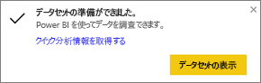
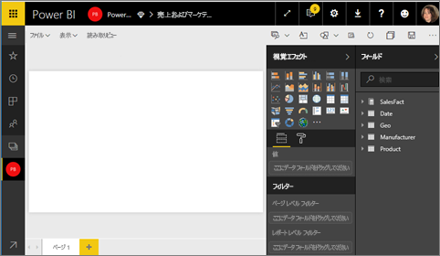
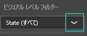
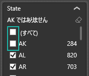
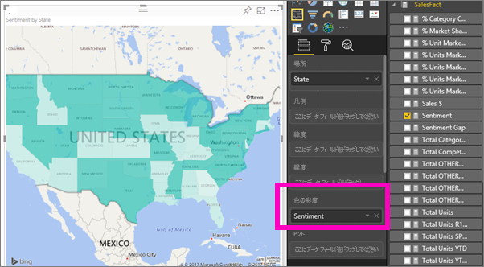
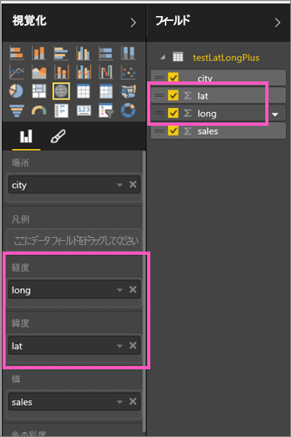

# Power BI の塗り分け地図 (コロプレス)
塗り分け地図では、網掛け、着色またはパターンを使用して、値の違いを割合に応じて、地理的または地域的に表示します。  こうした相対的な違いは、薄い色の網掛け (頻度が低い/量が少ない) から、濃い色の網掛け (頻度が高い/量が多い) を使用して、すぐにわかるように表示されます。    

## Bing への送信内容
Power BI は Bing と統合されており、既定のマップ座標 (ジオコーディングと呼ばれるプロセス) を提供します。 Power BI サービスまたは Power BI Desktop でマップの視覚エフェクトを作成すると、(その視覚エフェクトの作成に使用された) **場所**、**緯度**、および**経度**バケットのデータが Bing に送信されます。

ユーザーまたは管理者は、Bing がジオコーディングに使う URL へのアクセスを許可するように、ファイアウォールを更新することが必要な場合があります。  以下の URL です。
* https://dev.virtualearth.net/REST/V1/Locations
* https://platform.bing.com/geo/spatial/v1/public/Geodata
* https://www.bing.com/api/maps/mapcontrol

Bing に送信されているデータの詳細、およびジオコーディングをより成功させるためのヒントについては、「[マップの視覚エフェクトに関するヒントとテクニック](power-bi-map-tips-and-tricks.md)」をご覧ください。

## 塗り分け地図を使用すべきケース
塗り分け地図は、次の場合に最適な選択になります。

* 量的な情報を地図に表示する。
* 空間的なパターンと関係を示す。
* データが標準化されている。
* 社会経済的なデータを扱っている。
* 特定の地域に関心がある。
* 異なる地理的位置への分散状況を全体的に理解する。

### 前提条件
- Power BI サービスまたは Power BI Desktop
- 売上およびマーケティングのサンプル

まず、このチュートリアルでは Power BI Desktop ではなく Power BI サービスを使います。

## 基本的な塗り分け地図を作成する
このビデオでは、基本的な地図マップを作成し、塗り分け地図に変換する様子をご覧いただけます。

<iframe width="560" height="315" src="https://www.youtube.com/embed/ajTPGNpthcg" frameborder="0" allowfullscreen></iframe>

1. 独自の塗り分け地図を作成するには、Power BI にサインインして **[データの取得] \> [サンプル] \> [売上およびマーケティング] \> [接続]** の順に選択し、[売上およびマーケティングのサンプルをダウンロード](sample-datasets.md)します。
2. 成功メッセージが表示されたら、**[データセットの表示]** を選択します。

   
3. Power BI の空白のレポート キャンバスが[編集ビュー](service-interact-with-a-report-in-editing-view.md)に表示されます。

    
4. フィールド ウィンドウで **[Geo (地理)]** \> **[State]** フィールドを選択します。    

   
5. [グラフを変換](power-bi-report-change-visualization-type.md)して、塗り分け地図にします。 **[State]** も、**[場所]** に含まれるようになったことに注目してください。 Bing 地図は、マップの作成に **[場所]** のフィールドも使用します。  場所には、正しい各種の場所 (国、都道府県、市区町村、郵便番号など) を指定できます。Bing 地図には、世界中の場所に対応する塗り分け地図の輪郭が用意されています。 正しいエントリが [場所] に指定されていないと、Power BI では塗り分け地図を作成できなくなります。  

   
6. 地図にフィルターを適用して、米国本土のみが表示されるようにします。

   a.  [視覚化] ウィンドウの下部にある **[フィルター]** 領域を探します。

   b.  **[State]** にポインターを合わせて、展開シェブロンをクリックします。  
   

   c.  **[すべて]** の横のチェックマークを付けて、**[AK]** の横のチェックマークを外します。

   
7. **[SalesFact]** \> **[センチメント]** を選択して、これも **[色の彩度]** に追加します。 **[色の彩度]** のフィールドも、マップの網掛けの制御に関わります。  
   
8. 塗り分け地図は、緑色で網掛け表示されます。薄い緑色は、センチメント数が低いことを表します。また、濃い緑色は、より多くの肯定的なセンチメントを表します。  ここでは、ワイオミング州 (WY) を強調表示にして、センチメントが非常に良好 (74) であることを確認しています。  
   
9. [レポートを保存](service-report-save.md)します。

## 強調表示とクロス フィルター処理
[フィルター] ウィンドウの使用方法については、「[Power BI でのレポートへのフィルターの追加](power-bi-report-add-filter.md)」をご覧ください。

塗り分け地図で 1 つの場所を強調表示にすると、レポート ページにある他の視覚化がクロスフィルター処理されます。逆の場合も同様です。

確認するには、塗り分け地図をコピーし、*売上およびマーケティング* レポートの **[センチメント]** ページに貼り付けます。

1. 塗り分け地図で、1 つの州を選択します。  これにより、ページ上の他の視覚化が強調表示されます。 たとえば、**テキサス**を選択すると、センチメントが 74 であること、テキサスが中心地区 \#23 にあること、モデレーションおよび利便性のセグメントが売上高のほとんどを占めていることが示されます。   
   
2. 折れ線グラフでは、 **[いいえ]** と **[はい]** の切り替えができます。 これにより、塗り分けマップをフィルター処理して、VanArsdel と VanArsdel の競合他社のセンチメントを示すことができます。  
   

## 考慮事項とトラブルシューティング
地図データは、あいまいになることがあります。  たとえば、パリ (Paris) はフランスにありますが、テキサス州にもパリ (Paris) があります。 地理データは、個別の列 (市区町村名の列、都道府県名の列など) に保存されていると考えられるため、Bing では、どちらがどちらのパリなのかを特定できないことがあります。 データセットに緯度と経度のデータが含まれている場合、Power BI には地図データのあいまいさをなくすために役立つ特別なフィールドが用意されています。 緯度データを格納しているフィールドを [視覚化] \> [緯度] 領域にドラッグします。  経度データについても、同じ操作を実行します。  

Power BI Desktop でデータセットを編集するアクセス許可がある場合は、このビデオでマップのあいまいさに対処する方法をご覧ください。

<iframe width="560" height="315" src="https://www.youtube.com/embed/Co2z9b-s_yM" frameborder="0" allowfullscreen></iframe>

緯度と経度のデータにアクセスできない場合は、[この手順に従ってデータセットを更新](https://support.office.com/article/Maps-in-Power-View-8A9B2AF3-A055-4131-A327-85CC835271F7)してください。

マップの視覚エフェクトについて詳しくは、「[マップの視覚エフェクトに関するヒントとテクニック](power-bi-map-tips-and-tricks.md)」をご覧ください。

## 次の手順
[塗り分け地図をダッシュボード タイルとして追加 (このグラフのビジュアルをピン留め)](service-dashboard-tiles.md)    
 [視覚化をレポートに追加する](power-bi-report-add-visualizations-i.md)  
 [Power BI での視覚化の種類](power-bi-visualization-types-for-reports-and-q-and-a.md)    
 [使用中の視覚化のタイプを変更する](power-bi-report-change-visualization-type.md)      
他にわからないことがある場合は、 [Power BI コミュニティを利用してください](http://community.powerbi.com/)。
