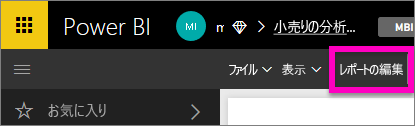
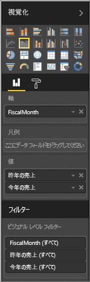
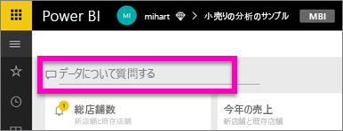
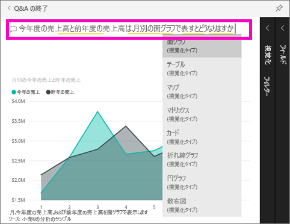

# Power BI Q&A の概要 (チュートリアル)
## チュートリアル: 小売りの分析のサンプルで Power BI Q&A を使用する
自然言語を使用して質問するのが、データから回答を得る最も速い方法である場合があります。  このチュートリアルでは、同じ視覚化を作成するための 2 つの異なる方法、つまり、レポートでビルドする方法と Q&A で質問する方法について説明します。  

## 方法 1: レポート エディターの使用
1. Power BI ワークスペースから、**[データの取得]** \> **[サンプル]** \> **[小売りの分析のサンプル]**  >  **[接続]** を選択します。
   
    
2. ダッシュボードには、「Last Year Sales and This Year Sales (前年度の売上高と今年度の売上高)」の面グラフ タイルがあります。  このタイルを選択します。 
   
   * このタイルが Q&A を使用して作成された場合、タイルを選択すると Q&A が開きます。 
   * しかし、このタイルがレポートで作成された場合は、この視覚化が含まれたページにレポートが表示されます。
3. **[レポートの編集]**を選択して、レポートを編集ビューで開きます。  レポートの所有者でない場合は、編集ビューでレポートを開くオプションはありません。
   
    
4. 面グラフを選択して、 **[フィールド]** ウィンドウで設定を確認します。  レポートの作成者は、これらの 3 つの値 \(**\[時間] > \[FiscalMonth]**、**\[Sales] \(売上) > \[This Year Sales] \(今年の売上高)**、**\[Sales] \(売上) > \[Last Year Sales] \(前年の売上高) > \[Value] \(値)**) を選択して、それらを **\[ビジュアル]** と **\[軸]** に編成して、このグラフを作成しました。
   
    

## 方法 2: Q&A の使用
これと同じデータの折れ線グラフを Q&A を使用して作成するには、次のようにします。

1. 小売りの分析のサンプル ダッシュボードに戻ります。
2. 自然言語を使用して、質問ボックスに次のように入力します。
   
   **今年度の売上高と前年度の売上高は、月別の面グラフで表すとどうなりますか**
   
   質問を入力していくと、Q&A が回答を表示するために最適な視覚化を選択し、質問を変更するにつれ視覚化が動的に変化します。 また、Q&A は、候補機能、オートコンプリート、およびスペルの修正によって質問の形式を整えるようにユーザーを助けます。
   
   質問の入力が完了すると、結果はレポートで確認したのとまったく同じグラフになります。  しかし、この方法で作成した方が速くできます。
   
   
3. レポートの場合と同様に、Q&A 内で、[視覚化]、[フィルター]、[フィールド] ウィンドウにアクセスできます。  これらのウィンドウを開くと、ビジュアルをさらに試したり、変更したりできます。
4. グラフをダッシュボードにピン留めするには、ピン アイコン  を選択します。

## 次の手順
[Q&A で尋ねることができる質問の種類](service-q-and-a.md)

[Power BI での Q&A](service-q-and-a.md)

[データを Power BI Q&A に適合させる方法](service-prepare-data-for-q-and-a.md)

[Q&A のためのブックを準備する](service-prepare-data-for-q-and-a.md)

他にわからないことがある場合は、 [Power BI コミュニティを利用してください](http://community.powerbi.com/)。

