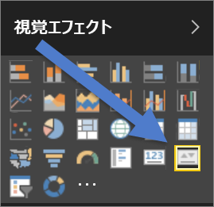
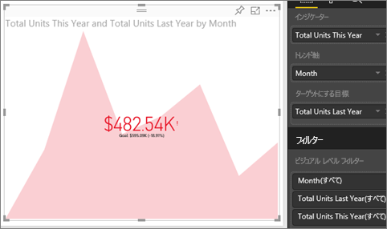

# KPI ビジュアル (チュートリアル)
主要業績評価指標 (KPI) は、測定可能な目標に対する進捗状況を視覚的に伝える方法の 1 つです。 KPI の詳細については、[Microsoft Developer Network](https://msdn.microsoft.com/library/hh272050) を参照してください。

## KPI を使用する場合
KPI は、次のような場合に最適です。

* 進行状況 (目標より進んでいるか遅れているか) を測定する
* 目標までの距離 (どの程度進んで、または遅れているか) を測定する   

## KPI ビジュアルの要件
主要業績評価指標 (KPI) は特定のメジャーに基づいており、現在の値と、定義された対象に対するメトリックの状態を評価するのに役立つよう設計されています。 したがって、KPI ビジュアルには、値に対して評価される*基本*メジャー、*ターゲット*となるメジャーまたは値、およびしきい値または目標が必要です。

> [!NOTE]
> 現時点では、KPI データセットには KPI の目標値が含まれている必要があります。 データセットに目標が含まれていない場合、目標を作成できます。目標が含まれる Excel シートをデータ モデルまたは PBIX ファイルに追加します。
> 
> 

## KPI を作成する方法
先に進むには、Power BI にサインインして、**[データの取得] > [サンプル] > [小売りの分析のサンプル]** を選びます。 売上目標に対する進行状況を測定する KPI を作成します。

Will が単一のメトリック ビジュアル、ゲージ、カード、KPI を作成するところをご覧ください。

<iframe width="560" height="315" src="https://www.youtube.com/embed/xmja6EpqaO0?list=PL1N57mwBHtN0JFoKSR0n-tBkUJHeMP2cP" frameborder="0" allowfullscreen></iframe>

1. **\[Sales] \(売上) > \[Total Units This Year] \(この年の合計単位)** を選択します。  これがインジケーターになります。
2. **\[Time] \(時間) > \[Month] \(月)** を追加します。  これはトレンドを表します。
3. 重要: **月**単位でグラフを並べ替えます。 ビジュアルを KPI に変換すると、並べ替えオプションはなくなります。
4. [視覚化] ウィンドウから [KPI] アイコンを選択して、ビジュアルを KPI に変換します。
   
    
5. 目標を追加します。 昨年の売上を目標として追加します。 **\[Total Units Last Year] \(昨年の合計単位)** を **[ターゲットにする目標]** にドラッグします。
   
    
6. 必要に応じて、ペイント ローラー アイコンを選んで [形式] ウィンドウを開きます。
   
   * **インジケーター** - インジケーターの表示単位と小数点以下の表示桁数を制御します。
   * **トレンド軸** - **[オン]** に設定すると、トレンド軸が KPI ビジュアルの背景として表示されます。  
   * **目標** - **[オン]** に設定すると、ビジュアルに目標、および目標からの距離がパーセンテージとして表示されます。
   * **状態** - 一部の KPI では高い値が*良好な*値と見なされ、別の KPI では低い値が*良好な*値と見なされます。 たとえば、収益と 待機時間を考えることができます。 通常、収益では高い値が良好であり、待機時間では高い値が悪いと見なされます。 この切り替えにより、KPI の動作を選択できます。 状態の選択は、既定では **[高いと良好]** に設定されます。
7. KPI を必要な形式に設定した後は、[ダッシュボードにピン留め](service-dashboard-pin-tile-from-report.md)します。

KPI はモバイル デバイスでも使用できます。これにより、常にビジネスの心臓部とつながっていることができます。

## 考慮事項とトラブルシューティング
* KPI が上記のようにならない場合、月単位で並べ替える必要がある場合もあります。 KPI には並べ替えオプションがないため、ビジュアルを KPI に変換する*前*に月単位で並べ替える必要があります。

## 次の手順
[Power BI のレポート](service-reports.md)

[Power BI レポートでの視覚化](power-bi-report-visualizations.md)

[Power BI - 基本的な概念](service-basic-concepts.md)

他にわからないことがある場合は、 [Power BI コミュニティを利用してください](http://community.powerbi.com/)。

