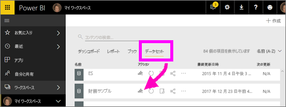
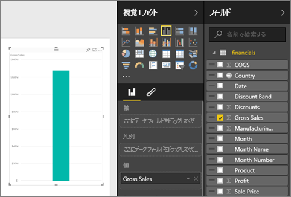
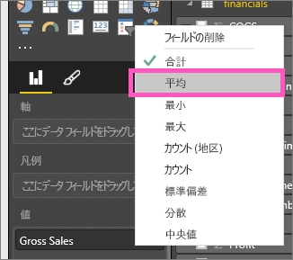
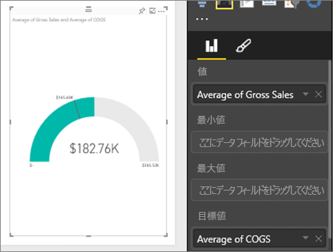
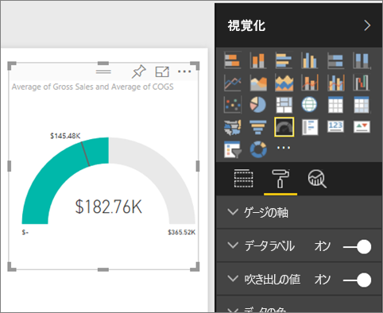
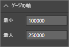
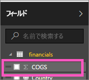
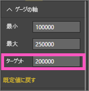

# Power BI の放射状ゲージ グラフ
放射状ゲージ グラフには、1 つの円弧があり、目標/KPI に向けた進行状況を測定した 1 つの値が表示されます。  目標 (ターゲット値) は、線 (指針) で示されます。 その目標への進行状況は、網掛け表示で示されます。  また、進行状況を表す値は、円弧の内側に太字で表示されます。考えられるすべての値は、最小値 (左端の値) から最大値 (右端の値) に向けて、円弧に沿って均等に割り振られます。

次に示す例は、自動車販売店を想定したもので、営業部門の月平均売上の推移を追跡記録しています。 目標は 140 であり、黒色の指針で示されています。  考えられる最小の平均売上は 0 であり、最大売上は 200 に設定しています。  青色の網掛けは、現時点で今月の平均売上が約 120 に達していることを示しています。 幸いなことに、目標に到達するまでに、まだ 1 週間の猶予があります。

## 放射状ゲージを使用すべきケース
次の場合は、放射状ゲージが最適な選択になります。

* 目標向けた進行状況を示す。
* 百分位の測定値を表す (KPI など)。
* 1 つの測定基準の正常性を示す。
* ひとめでわかるように情報を表示する。

### 前提条件
 - Power BI サービスまたは Power BI Desktop
 - 財務データのサンプル Excel ブック: [こちらから直接ダウンロードします](http://go.microsoft.com/fwlink/?LinkID=521962)。

## 基本的な放射状ゲージを作成する
これらの手順では、Power BI サービスを使用します。 作業を進めるために、Power BI にサインインし、財務サンプルの Excel ファイルを開きます。  

Will が単一のメトリック ビジュアル、ゲージ、カード、KPI を作成するところをご覧ください。

<iframe width="560" height="315" src="https://www.youtube.com/embed/xmja6EpqaO0?list=PL1N57mwBHtN0JFoKSR0n-tBkUJHeMP2cP" frameborder="0" allowfullscreen></iframe>

### 手順 1: 財務サンプルの Excel ファイルを開く
1. まだお持ちでない場合は、[サンプルの財務 Excel ファイルをダウンロード](sample-financial-download.md)します。 ファイルを保存した場所を忘れないようにします。

2. **[データの取得] \> [ファイル]** を選択し、ファイルが保存されている場所を選んで、***Power BI サービス***でファイルを開きます。 **[インポート]** を選択します。 [財務サンプル] がデータセットとしてワークスペースに追加されます。

3. **[データセット]** コンテンツ一覧から、**[財務サンプル]** を選択して、探索モードで開きます。

    

### 手順 2: 総売上を追跡するためにゲージを作成する
1. **[フィールド]** ペインで、 **[総売上]** を選択します。
   
   
2. 集計を **[平均]** に変更します。
   
   
3. ゲージ アイコン  を選択して、縦棒グラフをゲージに変換します。
   
   既定では、Power BI は、現在の値 (この例では、総売上の平均) がゲージの中間点に当たると仮定してゲージ グラフを生成します。 平均総売上が 182.76K ドルであるため、開始値 (最小値) は 0 に設定され、終了値 (最大値) は現在の値の 2 倍に設定されます。
   
   

### 手順 3: 対象値を設定する
1. **[COGS]** も **[ターゲット値]** にドラッグします。
2. 集計を **[平均]** に変更します。
   Power BI により、ターゲット値の **145.48K ドル**を示す指針が追加されます。 ターゲットを超えていることに注目してください。
   
   
   
   > [!NOTE]
   > 対象値も手動で入力できます。  下記の「書式設定オプションを使用して、手動で最小値、最大値、目標値を設定する」を参照してください。
   > 
   > 

### 手順 4: 最大値を設定する
手順 2 では、Power BI は [値] フィールドを使用して、自動的に最小値 (開始) と最大値 (終了) を設定していました。  独自に最大値を設定するには、どうすればよいのでしょうか。  可能な最大値として、現在の 2 倍の値を使用するのではなく、データセット内で最大の総売上額を設定することにしましょう。 

1. **[フィールド]** リストから、 **[最大値]** に **[総売上]** もドラッグします。
2. 集計を **[最大値]** に変更します。
   
   
   
   ゲージは、新しい終了値 (総売上 121 万) で再描画されます。
   
   

### 手順 5: レポートを保存する
1. [レポートを保存](service-report-save.md)します。
2. [ゲージ グラフをダッシュボード タイルとして追加](service-dashboard-tiles.md)します。 

## 書式設定オプションを使用して、手動で最小値、最大値、目標値を設定する
1. **[最大値]** に **[総売上]** もドラッグします。
2. ペイント ローラーのアイコンを選んで、[書式設定] ウィンドウを開きます。
   
   
3. **[ゲージの軸]** を展開し、 **[最小]** および **[最大]** の値を入力します。
   
    
4. **COGS**の横にあるチェックマークを外し、現在の目標値を削除します。
   
    
5. **[ゲージの軸]** の下に **[Target]** フィールドが表示されたら、値を入力します。
   
    
6. 必要に応じて、ゲージ グラフの書式設定を続けます。

## 次の手順
[Power BI での視覚化の種類](power-bi-visualization-types-for-reports-and-q-and-a.md)

[視覚化をレポートに追加する](power-bi-report-add-visualizations-i.md)

[視覚化をダッシュボードにピン留めする](service-dashboard-pin-tile-from-report.md)

[Power BI - 基本的な概念](service-basic-concepts.md)

他にわからないことがある場合は、 [Power BI コミュニティを利用してください](http://community.powerbi.com/)。

