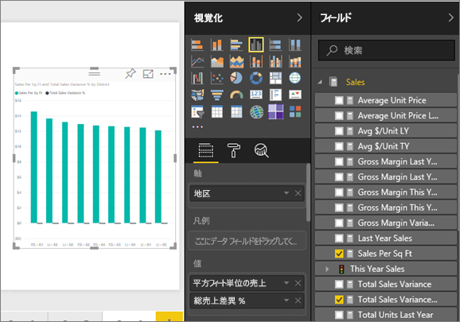
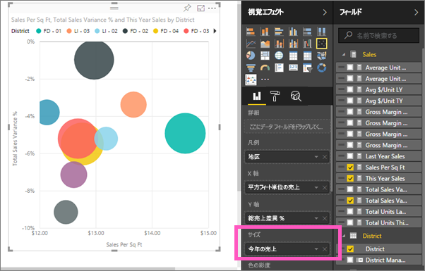
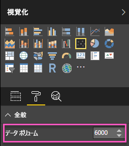
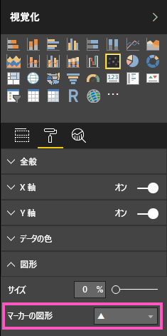
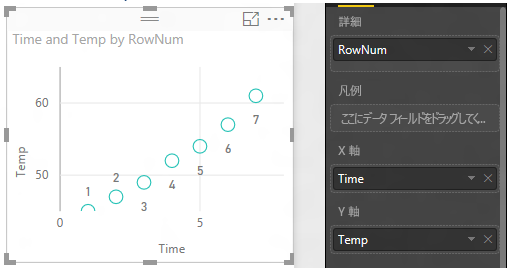
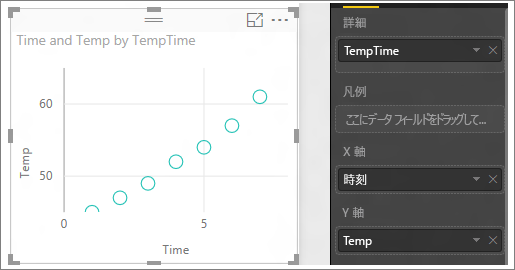

# Power BI の散布図とバブル チャート
散布図には、必ず 2 つの値軸があり、横軸に沿って数値データの 1 つのセットが表示され、縦軸に沿って数値データのもう 1 つのセットが表示されます。 このグラフには x と y の数値が交差する位置に点が表示され、この 2 つの値が 1 つのデータ ポイントに結合されます。 これらのデータ ポイントは、データに応じて、横軸に沿って値が均等に分布したり、不均等に分布したりします。

バブル チャートは、データ ポイントをバブルに置き換えます。バブルの*サイズ*は、データの追加のディメンションを表します。

データ ポイントの数を設定することができます。  

## 散布図とバブル チャートの使い分けについて
### 散布図は、次のような場合に最適な選択肢になります。
* 2 つの **数値** (散布図)、または 3 つの数値 (バブル) の間の関係を示す。
* 2 つのグループの数値を、xy 座標の 1 つの系列としてプロットする。
* 水平軸のスケールを変更する場合に、折れ線グラフの代わりに使用する。    
* 水平軸を対数スケールに変更する。
* ペアまたはグループになった値のセットを含むワークシート データを表示する。 散布図では、2 つの軸のスケールを独立して調整し、グループ化された値についてより多くの情報を引き出すことができます。
* 大きなデータ セットからパターンを表示する。たとえば、線形の傾向や非線形の傾向、クラスター、外れ値を見つけることができます。
* 時間に関係なく、大量のデータ ポイントを比較する。  散布図に含めるデータが多いほど、正確に比較を行うことができます。

### バブル チャートは、次のような場合に最適な選択肢になります。
* それぞれ値のセットを含む 3 つのデータ系列で構成されたデータがある。
* 財務データを表示する。  バブル サイズを変更すると、特定の値を視覚的に強調できます。
* 象限 (四分円) を使用する。

## 散布図を作成する
このビデオで散布図の作成方法を確認した後、以下の手順に従って自分で作成してみてください。

<iframe width="560" height="315" src="https://www.youtube.com/embed/PVcfPoVE3Ys?list=PL1N57mwBHtN0JFoKSR0n-tBkUJHeMP2cP" frameborder="0" allowfullscreen></iframe>

次の手順では、「Retail Analysis Sample」を使用します。 作業を進めるために、Power BI サービス (app.powerbi.com) または Power BI Desktop の[サンプルをダウンロード](sample-datasets.md)します。   

1. 黄色のプラスアイコンを選んで、[空のレポート ページ](power-bi-report-add-page.md)を作成します。
 
2. [フィールド] ウィンドウで、次のフィールドを選びます。
   - **[Sales]** > **[Sales Per Sq Ft]**
   - **[Sales]** > **[Total Sales Variance %]**
   - **[District]** > **[District]**

    

    Power BI サービスを使っている場合は、[編集ビュー](service-interact-with-a-report-in-editing-view.md)でレポートを開いていることを確認します。

3. 散布図に変換します。 [視覚化] ウィンドウで、散布図アイコンを選びます。

   

4. **[District] \(地域)** を **[詳細]** から **[凡例]** にドラッグします。 これで、**Total Sales Variance %** を Y 軸に、**Sales Per Square Feet** を X 軸にプロットした散布図が作成されます。 データ ポイントの色は地区を表しています。

    

次に、3 番目のディメンションを追加してみましょう。

## バブル チャートを作成する

1. **[フィールド]** ウィンドウから、**[Sales]** > **[This Year Sales]** > **[値]** を **[サイズ]** 領域にドラッグします。 データ ポイントは、売り上げ高の値に比例してボリュームに展開します。
   
   

2. バブルの上にマウスを置きます。 バブルのサイズは、 **[This Year Sales]** の値を反映しています。
   
    

3. バブル チャートに表示するデータ ポイントの数を設定するには、**[視覚化]** ウィンドウの **[形式]** セクションで、**[全般]** カードを展開し、**[データ ボリューム]** を調整します。 10,000 までの任意の値に最大データ量を設定できます。 数字が大きくなったら、最初にテストをして、良いパフォーマンスが得られることを確認することをお勧めします。 

     

   > [!NOTE]
   > データ ポイントが多いほど読み込み時間が長くなるので、スケールの上限に制限のあるレポートを発行する場合は、Web とモバイルでレポートをテストし、ユーザーが望むパフォーマンスが得られることを確認する必要があります。 データ ポイントの数が多いときは、異なるフォーム ファクターで結果をテストしてパフォーマンスを確認する必要があります。

4. [視覚化の色、ラベル、タイトル、背景などの書式を設定する](service-getting-started-with-color-formatting-and-axis-properties.md)ことができます。 [アクセシビリティを向上させる](desktop-accessibility.md)には、行ごとにマーカー図形を追加することを検討します。 各線に別のマーカーの図形を使用すると、レポートの使用者は個々の線 (または領域) を区別するのが容易になります。 マーカーの形状を選ぶには、**[図形]** カードを展開し、マーカーの形状を選びます。

      

   マーカーの形をひし形、三角形、または正方形に変更することもできます。

   

## 考慮事項とトラブルシューティング

### **散布図グラフにデータ ポイントが 1 つだけ表示される**
散布図に、X 軸上と Y 軸上のすべての値を集計した 1 つのデータ ポイントのみが表示されていますか?  あるいは、1 本の横線または縦線に沿ってすべての値が集計されていますか?

**[詳細]** 領域にフィールドを追加して、値をグループ化する方法を Power BI に指示してください。 フィールドは、プロットするポイントごとに一意である必要があります。  
たとえば、行番号や ID フィールドを使用すると、このようになります。

または、そのようなデータがない場合は、X と Y の値を連結してポイントごとに一意の値を持つフィールドを作成します。

新しいフィールドを作成するには、[Power BI Desktop クエリ エディターを使ってデータセットにインデックス列を追加します](desktop-add-custom-column.md)。  その後、この列を視覚化の **[詳細]** 領域に追加します。

## 次の手順
 [Power BI での視覚化の種類](power-bi-visualization-types-for-reports-and-q-and-a.md)

[試してみる (無料)](https://powerbi.com/)  

他にわからないことがある場合は、 [Power BI コミュニティを利用してください](http://community.powerbi.com/)。

