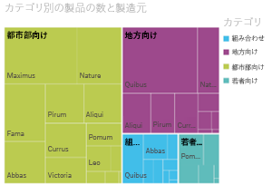
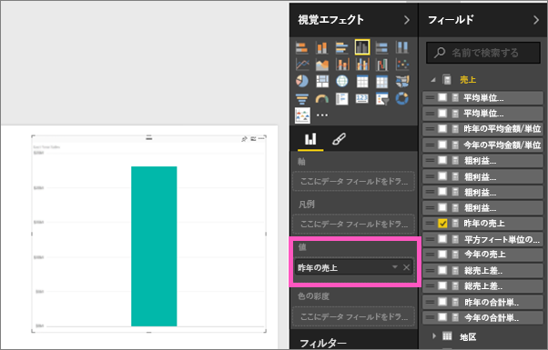
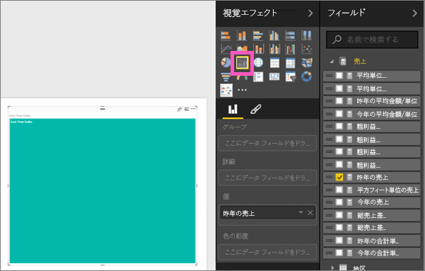
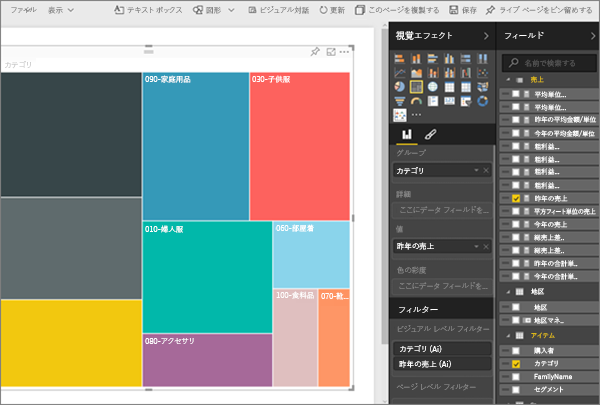
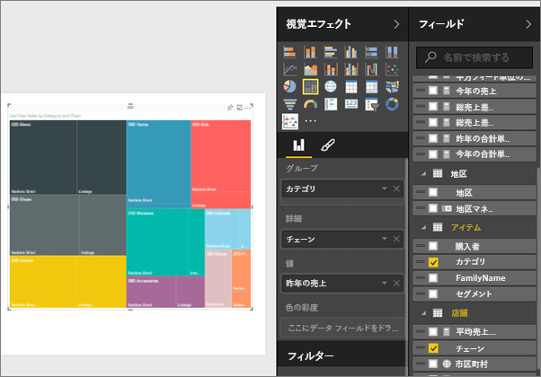
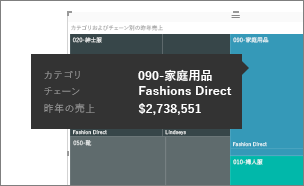
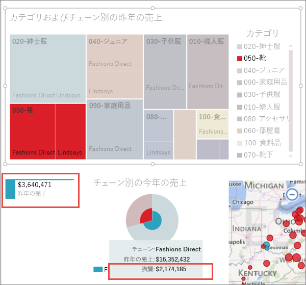

# Power BI のツリーマップ
ツリーマップでは、入れ子になった一連の四角形で階層データが表示されます。  階層の各レベルは、色付きの四角形 (「ブランチ (枝)」) で表され、ブランチには他の四角形 (「リーフ (葉)」) が含まれます。  各四角形内の面積は、測定される量的な値に基づいて割り当てられ、各四角形は大きさの順に左上 (最大) から右下 (最小) に向かって配置されます。

たとえば、売上を分析する場合、最上位レベルの四角形 (ブランチ) を衣料カテゴリの **Urban (都市部向け)**、**Rural (地方向け)**、**Youth (若者向け)**、および **Mix (組み合わせ)** にすることができます。  これらのカテゴリの四角形には、そのカテゴリ内の衣料メーカー用の小さい四角形 (リーフ) が含まれ、これらの小さい四角形は売上数に基づいて大きさが決まり、影が付きます。  上の **Urban** ブランチでは、Maximus の衣料の売上が多く、Natura と Fama の売上はそれよりも少なく、Leo の売上は非常に少なくなっています。  このため、このツリーマップの **Urban** ブランチでは、Maximus の四角形 (左上隅) が一番大きく、Natura と Fama の四角形はそれよりもやや小さく、その他の多数の四角形が残りのすべての衣料の売上を表し、Leo の四角形は非常に小さくなります。  また、各リーフ ノードの大きさと網掛けの比較によって、その他の衣料カテゴリの売上の品目数を比較することもできます。つまり、四角形が大きく網掛けが濃いほど、値は大きいと判断できるのです。

## ツリーマップを使用すべきケース
ツリーマップは、次のような場合に最適な選択肢です。

* 大量の階層データを表示する場合。
* 横棒グラフで多数の値を効果的に処理できない場合。
* 各部分と全体の間の割合を示す場合。
* 階層内のカテゴリの各レベルにわたってメジャーの分布のパターンを示す場合
* サイズと色分けを使用して属性を示す場合。
* パターン、外れ値、最も重要な要因、および例外を見分ける場合。

### 前提条件
 - Power BI サービスまたは Power BI Desktop
 - 小売りの分析のサンプル

## 基本的なツリーマップの作成
ツリーマップの作成例を見たい方は、  このビデオの 2:10 にスキップし、Amanda がツリーマップを作成するところをご覧ください。

<iframe width="560" height="315" src="https://www.youtube.com/embed/IkJda4O7oGs" frameborder="0" allowfullscreen></iframe>

または、独自のツリーマップを作成します。 次の手順では、「Retail Analysis Sample」を使用します。 先に進むには、Power BI サービス (Power BI Desktop ではありません) にサインインして、**[データの取得] \> [サンプル] \> [小売りの分析のサンプル] \> [接続] \> [ダッシュボードに移動]** を選びます。 レポートで視覚エフェクトを作成するには、データセットとレポートの編集アクセス許可が必要です。 Power BI のサンプルは編集できます。 しかし、他のユーザーからレポートの共有を受ける場合、自分で新しい視覚エフェクトを追加することはできません。

1. [Total stores]\(総店舗数\) タイルを選んで、小売りの分析のサンプル レポートを開きます。    
2. [[編集ビュー]](service-interact-with-a-report-in-editing-view.md) を開いて、**[売上高]** > **[Last Years Sales]\(前年の売上高\)** メジャーを選びます。   
      
3. グラフをツリーマップに変換します。  
      
4. **[アイテム]** > **[カテゴリ]** を **[グループ]** にドラッグします。 四角形の大きさが総売上高を反映し、色でカテゴリを表すツリーマップが作成されます。  つまり、カテゴリ別の総売上高の相対的な大きさを視覚的に説明する階層が作成されます。  **\[Mens] \(男性向け)** カテゴリの売上高が最高で、 **\[Hosiery] \(靴下・下着類)** カテゴリの売上高が最低です。   
      
5. **[ストア]** > **\[Chain] \(チェーン)** を **"Details"** にドラッグしてツリーマップを完成させます。 これで、前年の売上高をカテゴリおよびチェーン別に比較できます。   
   
   
   > [!NOTE]
   > [色の彩度] と [詳細] を同時に使用することはできません。
   > 
   > 
5. **[Chain]** (チェーン) エリアにポインターを合わせると、 **[カテゴリ]** のその部分のヒントが表示されます。  たとえば、 **[040 Juniors** ] の四角形内の **[Lindseys]** にポインターを合わせると、Juniors カテゴリの Lindsey の部分のツールヒントが表示されます。  
   
6. [ツリーマップをダッシュボード タイルとして追加 (ビジュアルをピン留め)](service-dashboard-tiles.md) します。 
7. [レポートを保存](service-report-save.md)します。

## 強調表示とクロス フィルター処理
[フィルター] ウィンドウの使用方法については、「[Power BI でのレポートへのフィルターの追加](power-bi-report-add-filter.md)」をご覧ください。

ツリーマップ内の [カテゴリ] または [詳細] を強調表示すると、レポートのページ上の他の視覚エフェクトがクロス強調表示またはクロスフィルター処理されます。逆の場合も同様です。 作業を進めるために、同じページにいくつかのビジュアルを追加するか、既に他のビジュアルを持つレポート ページにツリーマップをコピーして貼り付けます。

1. ツリーマップ上で、カテゴリまたはカテゴリ内のチェーンのいずれかを選択します。  これにより、ページ上の他の視覚化がクロス強調表示されます。 たとえば、 **[050-Shoes]** を選択すると、前年の靴の売上高が 3,640,471 ドルで、その内 [Fashions Direct] から得られた売上高は 2,174,185 ドルであったことが表示されます。  
   

2. **[Last Year Sales by Chain]\(チェーン別の前年売上高\)** 円グラフで、**[Fashions Direct]** スライスを選択し、ツリーマップをクロス フィルター処理します。  
       

3. グラフ相互間のクロスフィルター処理とクロス強調表示を管理するには、「[Power BI レポートでの視覚エフェクトの相互作用](service-reports-visual-interactions.md)」を参照してください。

## 次の手順
[視覚化をダッシュボードにピン留めする](service-dashboard-pin-tile-from-report.md)  
[Power BI - 基本的な概念](service-basic-concepts.md)  

他にわからないことがある場合は、 [Power BI コミュニティを利用してください](http://community.powerbi.com/)。  

