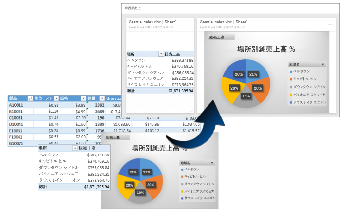
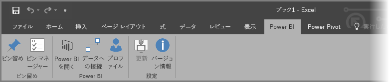
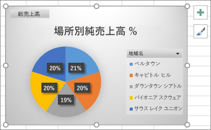
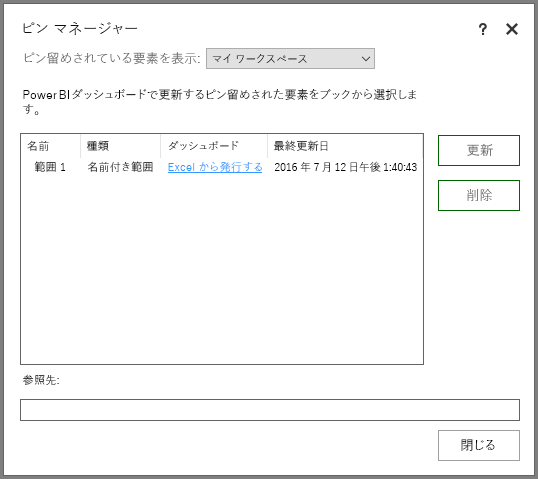
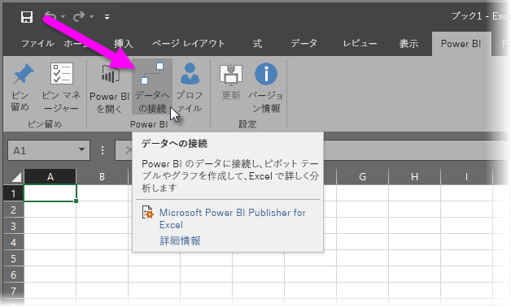
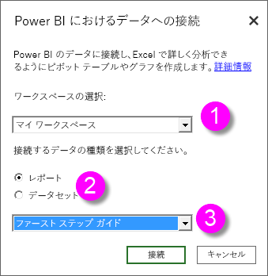
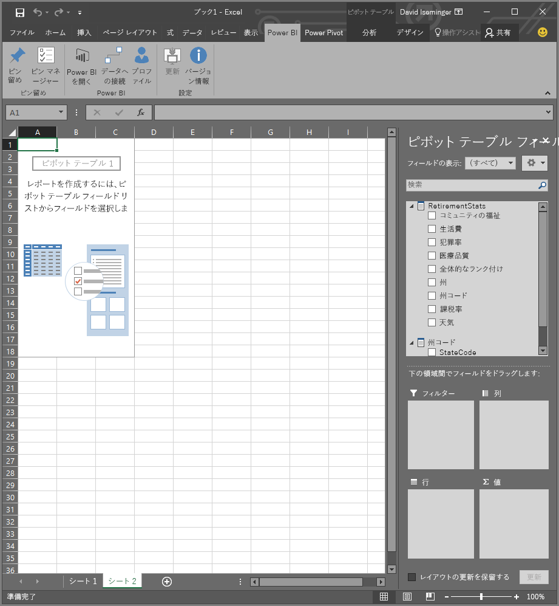

# Power BI Publisher for Excel
**Power BI Publisher for Excel** では、Excel にある最も重要な洞察のスナップショット (ピボットテーブル、グラフ、範囲など) を作成し、Power BI のダッシュボードにピン留めできます。

ピン留めできる内容 Excel ワークシート内のあらゆるものです。 単純なシートやテーブルのセル範囲はもちろん、ピボットテーブルやピボットグラフ、図、イメージ、テキストを選択できます。

ただし、3D マップと、Power View シートにある視覚化はピン留めできません。 この他、ピン留めしてもしょうがないものかもしれませんが、スライサーまたはタイムラインのフィルターなどの一部の要素もピン留めできます。

Excel から要素をピン留めすると、Power BI で、新規または既存のダッシュボードに新しいタイルが追加されます。 新しいタイルはスナップショットであるため、動的ではありませんが、それでも更新する方法はあります。 たとえば、既にピン留めしたピボットテーブルまたはグラフに変更を加えた場合、Power BI のダッシュボードのタイルは自動的には更新されません。ただし、**ピン マネージャー**を使用すれば、ピン留めした要素を更新できます。 **ピン マネージャー**の詳細については、以下のセクションを参照してください。

## ダウンロードとインストール
Power BI Publisher for Excel は、ダウンロードして Microsoft Excel 2007 以降のデスクトップ バージョンにインストールできるアドインです。

[Power BI Publisher for Excel をダウンロードする](http://go.microsoft.com/fwlink/?LinkId=715729)

Publisher をインストールすると、Excel に新しく **[Power BI]** リボンが表示されます。このリボンでは、Power BI のサインイン (またはサインアウト)、ダッシュボードへの要素のピン留め、既にピン留めした要素の管理を行うことができます。

**Power BI Publisher for Excel** アドインは既定では有効になっていますが、何らかの理由で Excel に [Power BI] リボン タブが表示されていない場合は、有効にする必要があります。 **[ファイル]** > **[オプション]** > **[アドイン]** > **[COM アドイン]** の順にクリックします。**[Microsoft Power BI Publisher for Excel]** を選択します。

## 範囲をダッシュボードにピン留めする
ワークシートから任意のセル範囲を選択し、その範囲のスナップショットを Power BI 内の既存または新規のダッシュボードにピン留めできます。 同じスナップショットを複数のダッシュボードにピン留めすることもできます。

作業を開始するには、Power BI にサインインしていることを確認する必要があります。

1. Excel の **[Power BI]** リボン タブから、**[プロファイル]** を選択します。 既に Power BI にサインインしている場合は、現在サインインに使用されているアカウントを示すダイアログが表示されます。 そのアカウントを使用する場合は、そのまま次の一連の手順に進み、範囲をピン留めしてください。 別の Power BI アカウントを使用する場合は、*[サインアウト]* を選択します。 サインインしていない場合は、次の手順 (手順 2) に進みます。
   
   
2. サインインしていない場合は、Excel の **[Power BI]** リボン タブから **[プロファイル]** を選択したときに表示される **[サインイン]** リンクを選択し、**[Power BI に接続]** ダイアログで使用する Power BI アカウントの電子メール アドレスを入力してから、**[サインイン]** を選択します。
   
   

サインインしたら、次の手順に従って範囲をダッシュボードにピン留めします。

1. Excel で、**[Power BI]** リボン タブを選択して、**[ピン留めする]** リボン ボタンを表示します。
2. Excel ブックから範囲を選択します。
3. **[Power BI]** リボンの **[ピン留めする]** ボタンをクリックして、**[ダッシュボードにピン留め]** ダイアログを表示します。 まだ Power BI にサインインしていない場合は、サインインするように促されます。 **[ワークスペース]** ドロップダウン リストからワークスペースを選択します。 自分のダッシュボードにピン留めする場合は、**[マイ ワークスペース]** が選択されていることを確認します。 グループのワークスペースのダッシュボードにピン留めする場合は、ドロップダウン リストからグループを選択します。
4. *既存のダッシュボード*にピン留めするか、*新しいダッシュボード*を作成するかを選択します。
5. 選択したものをダッシュボードにピン留めする場合は、**[OK]** をクリックします。
6. **[ダッシュボードにピン留めする]** で、ワークスペースの既存のダッシュボードを選択するか、新しいダッシュボードを作成し、**[OK]** ボタンをクリックします。
   
   

## グラフをダッシュボードにピン留めする
グラフをクリックしてから、[ピン留めする]  をクリックします。

## ピン留めした要素を管理する
**ピン マネージャー**では、Power BI にピン留めした要素に関連付けられたタイルを更新する (最新の情報に更新する) ことができます。 また、Power BI のダッシュボードに既にピン留めした要素のピン留めを除去することもできます。

ダッシュボードのタイルを更新するには、**ピン マネージャー**で 1 つ以上の要素を選択してから **[更新]** を選択します。

Excel 内のピン留めした要素と、ダッシュボードにある関連付けられたタイルとの間のマッピングを削除するには、**[削除]** を選択します。 **[削除]** を選択しても、Excel のワークシートから要素が削除されたり、関連付けられたタイルがダッシュボードから削除されることは*ありません*。 両者を留めるピン (*マッピング*) が削除されます。 削除された要素は、**ピン マネージャー**に表示されなくなります。 その要素を再びピン留めすると、新しいタイルとして表示されます。

ピン留めした要素 (タイル) をダッシュボードから削除するには、Power BI で操作する必要があります。 削除するタイルで、**[メニューを開く]** アイコン  を選択してから、**[タイルの削除]**  を選択します。

## Power BI におけるデータへの接続
**Power BI Publisher for Excel** の 2016 年 7 月のリリース (上記にリンクされている現行リリースを含む) 以降では、Power BI サービスでデータに直接接続し、Excel でピボットテーブルとピボットグラフを使用して、そのデータを分析することができます。 この機能では、Power BI データと Excel を一緒に使用して、自分にとって最も重要なデータを簡単に分析することができます。

改善点は以下のとおりです。

* Power BI でのデータへの接続に必要なドライバーはすべてリリースごとに自動的に更新されるため、ユーザーが自分でドライバーをインストールしたり、管理する必要はありません。
* 接続を作成するために .odc ファイルをダウンロードする必要はなくなりました。使用するレポートまたはデータセットを選択すれば、**Power BI Publisher for Excel** が自動的に接続を作成します。
* 同じブック内に複数の接続とピボットテーブルを作成できるようになりました。
* **Power BI Publisher for Excel** に固有のエラーが改善されました。既定の Excel メッセージは使用しません。

### Excel での Power BI データへの接続方法
**Power BI Publisher for Excel** を使用して Power BI に接続するには、以下の簡単な手順に従います。

1. Power BI にサインインしていることを確認します。 サインイン (または別のアカウントでのサインイン) 方法を説明する手順は、この記事に前述したとおりです。
2. 使用するアカウントで Power BI にサインインしたら、Excel の **[Power BI]** リボン タブから **[データに接続]** を選択します。
   
   
3. Excel は HTTPS 接続を使用して Power BI に接続し、**[Power BI のデータに接続]** ダイアログを表示します。ここでは、データの選択元となる*ワークスペース* (下記図の 1) や接続する*データの種類* (**レポート**または**データセット**) (2) を選択できます。また、接続*可能なレポートまたはデータセット*を選択できるドロップダウン (3) が示されます。
   
   
4. 項目を選択し、**[Power BI のデータに接続]** ダイアログで **[接続]** を選択すると、Excel ではピボットテーブルが準備され、**[ピボットテーブル フィールド]** ウィンドウが表示されます。ここで、接続されている Power BI データからフィールドを選択し、データの分析に役立つテーブルまたはグラフを作成できます。
   
   

Power BI にデータがない場合、Excel はそれを検知し、サンプル データを作成して接続してみるよう提案します。

**Power BI Publisher for Excel** のこのリリースで考慮すべきいくつかの点を以下に示します。

* **共有データ** - 共有されていても Power BI に直接表示されないデータは、**[データに接続]** では使用できません。
* **SSAS オンプレミス** - 選択したデータセットがオンプレミスの SQL Server Analysis Services (SSAS) からのもので、Power BI のデータセットが DirectQuery を使用してデータにアクセスした場合、**Power BI Publisher for Excel** はオンプレミス ネットワーク接続でそのデータに接続し、Power BI を介してデータに接続*しません*。 そのため、このようなデータセットへの接続を試みるユーザーは、オンプレミス ネットワークに接続する必要があります。このユーザーは、データが格納されている Analysis Services インスタンスで採用されている認証方法を使用して、そのデータへのアクセスが認証されます。
* **必要なドライバー** - **Power BI Publisher for Excel** は、この機能を使用するために必要なドライバーをすべて自動的にインストールします。 自動的にインストールされるドライバーには、Analysis Services 用の Excel OLE DB ドライバーが含まれます。このドライバーがユーザーによって (あるいは何らかの理由で) 削除されると、Power BI データへの接続は機能しません。
* **データセットにはメジャーが必要** - Excel がメジャーをピボットテーブルの値として扱い、正しくデータを分析するには、データセットでモデル メジャーが定義されている必要があります。 詳しくは、「[メジャー](desktop-measures.md)」をご覧ください。
* **グループのサポート** - 指定されたグループ外のユーザーと共有されているデータセットはサポートされず、接続することはできません。
* **無料サブスクリプションと Pro サブスクリプション** - グループに関連付けられたアクティビティは Power BI の無料ユーザーについてはサポートされず、グループと共有されているデータセットまたはレポートはワークスペースに表示されません。
* **共有レポートまたはデータセット** - 共有されているレポートまたはデータセットには接続できません。
* **データ モデルではなくテーブルを使用** - Excel から (データ モデルなしで) テーブルのみをインポートすることによって作成されたレポートは、現時点ではサポートされていず、接続することはできません。

説得力のあるグラフやデータ範囲などの他のビジュアルを作成したら、この記事の前述のとおり、Power BI でそれらをダッシュボードに簡単にピン留めできるようになります。

## 関連記事
Excel と Power BI を同時に使用して両方を最大限に活用できるさまざまな方法があります。 詳しくは、次の各記事をご覧ください。

* [Excel で分析](service-analyze-in-excel.md)
* [Excel で分析に関するトラブルシューティング](desktop-troubleshooting-analyze-in-excel.md)

