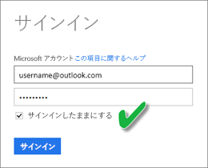

# OneDrive または SharePoint Online の .CSV ファイルから作成されたデータセットを更新する
## 使用する利点
OneDrive または SharePoint Online 上の .csv ファイルに接続すると、Power BI でデータセットが作成されます。 .csv ファイルのデータが Power BI のデータセットにインポートされます。 Power BI が自動的にファイルに接続し、Power BI のデータセットのすべての変更を更新します。 OneDrive または SharePoint Online で .csv ファイルを編集して保存すると、その変更内容が通常は 1 時間以内に Power BI に表示されます。 データセットに基づく Power BI の視覚化も自動的に更新されます。

ファイルが OneDrive for Business または SharePoint Online の共有フォルダーにある場合、他のユーザーが同じファイルを作業することができます。 保存されると、行われたすべての変更が通常は 1 時間以内に Power BI で自動的に更新されます。

多くの組織は、データベースに対してデータのクエリ処理を自動的に実行するプロセスを実行します。このプロセスは毎日 .csv ファイルに保存されます。 ファイルを OneDrive または SharePoint Online に保存して、毎日名前の異なる新しいファイルを作成するのではなく、同じファイルを毎日上書きしている場合は、Power BI で該当するファイルに接続することができます。 ファイルに接続されたデータセットは、OneDrive または SharePoint Online 上のファイルを更新した後すぐに同期されます。 データセットに基づく視覚化も自動的に更新されます。

## サポートされている機能
コンマ区切り値ファイルは単純なテキスト ファイルであるため、外部データ ソースおよびレポートへの接続はサポートされていません。 コンマ区切りファイルから作成されたデータセットの更新をスケジュールすることはできません。 ただし、ファイルが OneDrive または SharePoint Online 上にあるときは、Power BI が 1 時間ごとにファイルに対する変更とデータセットを自動的に同期します。

## OneDrive と OneDrive for Business。 違いは何ですか?
個人用の OneDrive と OneDrive for Business の両方がある場合は、Power BI に接続するすべてのファイルを OneDrive for Business に保存することをおすすめします。 これは、サインインのために 2 種類のアカウントを使用する可能性があるためです。

Power BI へのサインインに使用するアカウントが OneDrive for Business へのサインインに使用するアカウントと同じであることが多いため、Power BI での OneDrive for Business への接続は通常シームレスです。 ただし、個人用の OneDrive では、ほとんどの場合異なる [Microsoft アカウント](http://www.microsoft.com/account/default.aspx)を使用してサインインします。

Microsoft アカウントにサインインしたら、必ず [サインアウトしない] を選択してください。 これで、Power BI のデータセットと更新が同期されます。

Microsoft アカウントの資格情報が変更されている可能性があるために Power BI のデータセットと同期できない OneDrive の .csv ファイルに変更を行う場合は、そのファイルに接続して、個人用の OneDrive から再度インポートする必要があります。

## 問題が発生した場合
OneDrive 上の .csv ファイル内のデータを変更しても、その変更が Power BI に反映されない場合、最も可能性の高い原因は Power BI が OneDrive に接続できないことです。 ファイルに接続し、もう一度インポートしてみてください。 サインインを求められた場合は、必ず **[サインアウトしない]**を選択します。

## 次の手順
[更新の問題をトラブルシューティングするためのツール](service-gateway-onprem-tshoot.md)
[更新のシナリオのトラブルシューティング](refresh-troubleshooting-refresh-scenarios.md)

他にわからないことがある場合は、 [Power BI コミュニティで質問してみてください](https://community.powerbi.com/)。

