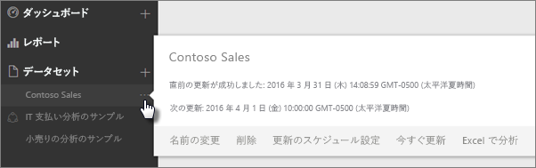
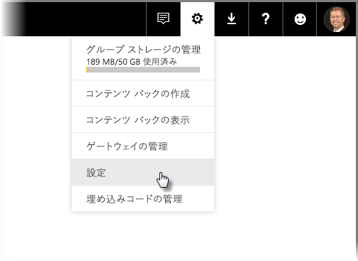
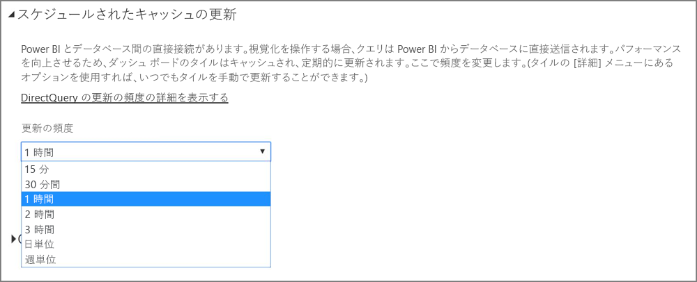

# Power BI でのデータの更新
必ず最新のデータを取得することは、多くの場合、正しい意思決定をする上で重要です。 お客様は既に、Power BI の [データの取得] を使ってデータに接続してアップロードしたり、レポートとダッシュボードを作成したりしたことがあるでしょう。 ここで、データが本当に最新のもので、最も意味のあるものかを確認することができます。

多くの場合は、まったく何もする必要はありません。 Salesforce や Marketo コンテンツ パックのデータのような一部のデータは自動的に更新されます。 接続がライブ接続または DirectQuery を利用している場合は、データは最新状態に更新されます。 しかし、外部のオンラインやオンプレミスのデータ ソースに接続する Excel ブックや Power BI Desktop ファイルを使用するようなその他のケースでは、手動で更新するか、更新スケジュールを設定して、Power BI がレポートとダッシュボードでデータを最新の情報に更新できるようにする必要があります。

この記事は、その他いくつかの記事と共に、Power BI でのデータ更新の実際のしくみ、更新スケジュールを設定する必要があるかどうか、データを正常に更新するために適用すべき項目について説明することを意図しています。

## データ更新について
更新をセットアップする前に、更新するものと、データを取得する場所を理解することが重要です。

*データ ソース* はレポートとダッシュボードでデータを探索し実際に取得する場所です。 たとえば、Google アナリティクスや QuickBooks のようなオンライン サービス、Azure SQL Database のようなクラウド上のデータベース、またはお客様の組織にあるローカル コンピューターやサーバー上のデータベースやファイルなどです。 データ ソースの種類によって、データ ソースからのデータの更新方法が決まります。 各種のデータ ソースの更新については、後述の[「更新できるもの」](#what-can-be-refreshed)セクションで説明します。

*データセット*は、[データの取得] を使用してコンテンツ パックやファイルに接続し、データをアップロードするときや、ライブ データ ソースに接続するときに、Power BI で自動的に作成されます。 Power BI Desktop と Excel 2016 では、Power BI サービスにファイルを発行することもできます。これは [データの取得] の使用と同様です。

いずれの場合も、データセットは、Power BI サービスの [マイ ワークスペース] または [グループ] コンテナーで作成され、表示されます。 データセットの**省略記号 (...)** を選択すると、レポートでのデータの探索、設定の編集、更新の設定を行うことができます。

データセットでは、1 つ以上のデータ ソースからデータを取得できます。 たとえば、Power BI Desktop を使用して組織内の SQL データベースからデータを取得でき、OData フィードからオンラインで他のデータを取得できます。 次に、Power BI へファイルを発行する際、1 つのデータセットが作成されますが、これには SQL データベースと OData フィードの両方のデータ ソースが含まれます。

データセットには、データ ソース、データ ソースの資格情報に関する情報が含まれ、ほとんどの場合、データ ソースからコピーされたデータのサブセットが含まれます。 レポートとダッシュボードで視覚エフェクトを作成する場合は、データセット内にデータを表示します。Azure SQL Database のようなライブ接続の場合、データセットではデータ ソースから表示されるデータが定義されます。 Analysis Services へのライブ接続の場合、データセットの定義は、Analysis Services から直接取得されます。

> "*データを更新するときには、データ ソースから Power BI に格納されているデータセット内のデータが更新されます。この更新は完全更新であり、増分更新ではありません。*"
> 
> 

データセットでデータを更新するときは常に、[今すぐ更新] の使用または更新スケジュールの設定のいずれかを行うと、Power BI はデータセット内の情報を使用して、データセットに定義されたデータ ソースに接続し、更新されたデータのクエリを実行してから、更新されたデータをデータセットに読み込みます。 データに基づいたレポートやダッシュボードの視覚化は自動的に更新されます。

先に進む前に理解しておくことが非常に重要な点はほかにもあります。

> "*データセットの更新頻度や、ライブ データの表示頻度に関係なく、最初に最新の状態にする必要があるものはデータ ソースにあるデータです。*"
> 
> 

ほとんどの組織では、データを 1 日 1 回、通常は夜間に処理します。 オンプレミス データベースに接続する Power BI Desktop ファイルから作成されたデータセットの更新をスケジュールする場合や、IT 部門が SQL データベースで夜間に 1 回処理を実行する場合は、スケジュールされた更新を 1 日 1 回実行するように設定する必要があります。 たとえば、データベースでの処理が行われた後、お客様が仕事を始める前などです。 もちろん、これが当てはまらない場合もあります。 Power BI には、頻繁に更新したりリアルタイムに更新したりする、データ ソースに接続する多数の方法があります。

## 更新の種類
Power BI 内で発生する更新には、主に 4 種類あります。 パッケージの更新、モデル/データの更新、タイルの更新、視覚的なコンテナーの更新です。

### パッケージの更新
これは、Power BI サービスと OneDrive または SharePoint Online 間で、Power BI Desktop または Excel のファイルを同期します。 この機能では、元のデータ ソースからデータを取り込みません。 Power BI のデータセットは、OneDrive または SharePoint Online 内のファイルの内容でのみ更新されます。

### モデル/データの更新
これは、元のデータ ソースのデータによって、Power BI サービス内でデータセットを更新する機能です。 スケジュールされた更新と今すぐ更新のどちらかの方法で実行できます。 この機能を使うには、オンプレミスのデータ ソース用にゲートウェイが必要です。

### タイルの更新
タイルの更新では、データの変更後、ダッシュボードでタイルのビジュアルのキャッシュを更新します。 これは、約 15 分ごとに実行されます。 ダッシュボードの右上で**省略記号 (...)** を選択し、**[ダッシュボード タイルの更新]** を選択して、強制的にタイルを更新することもできます。

一般的なタイル更新エラーについて詳しくは、「[タイルのエラーのトラブルシューティング](refresh-troubleshooting-tile-errors.md)」をご覧ください。

### 視覚的なコンテナーの更新
視覚的なコンテナーを更新すると、データの変更後、レポート内で、キャッシュされたレポートのビジュアルが更新されます。

## 更新できるもの
Power BI では、通常、[データの取得] を使用して、ローカル ドライブ、OneDrive または SharePoint Online にあるファイルからデータをインポートしたり、Power BI Desktop からレポートを発行したり、組織内のクラウド上のデータベースに直接接続したりします。 Power BI では、ほとんどすべてのデータを更新することができますが、更新の必要があるかどうかは、データセットを作成した方法とデータセットの接続先のデータ ソースに依存します。 これらのそれぞれでデータを更新するしくみを見てみましょう。

先に進む前に、理解すべき重要な定義がいくつかあります。

**自動更新**  - データセットを定期的に更新するために必要なユーザー構成はありません。 データ更新の設定は、Power BI が構成します。 オンライン サービス プロバイダーの場合、更新は通常 1 日 1 回発生します。 OneDrive から読み込まれたファイルの場合、外部データ ソース以外のデータであれば、自動更新は約 1 時間ごとに発生します。 さまざまな更新のスケジュール設定と手動更新を構成できますが、行う必要がない場合があります。

**ユーザー構成による手動更新またはスケジュールされた更新** – これは、[今すぐ更新] を使用して手動でデータセットを更新したり、データセットの設定で [更新のスケジュール設定] を使用して更新のスケジュールを設定することを意味します。 この種類の更新は、外部のオンラインやオンプレミスのデータ ソースに接続する Power BI Desktop ファイルと Excel ブックに必要です。

> [!NOTE]
> スケジュールされた更新の時間を構成した場合、更新の開始前に最大 1 時間の遅延が発生することがあります。
> 
> 

**ライブ/DirectQuery** – これは、Power BI とデータ ソース間のライブ接続があることを意味します。 オンプレミスのデータ ソースの場合、管理者は、エンタープライズ ゲートウェイ内にデータ ソースを構成する必要がありますが、ユーザーによる操作は必要ありません。

> [!NOTE]
> パフォーマンスの向上を目的として、DirectQuery を使用してデータが接続されているダッシュボードは自動的に更新されます。 タイルの **[詳細]** メニューを使用すれば、いつでもタイルを手動で更新することができます。
> 
> 

## ローカル ファイル、および OneDrive または SharePoint Online 上のファイル
データの更新は、外部のオンラインやオンプレミスのデータ ソースに接続する Power BI Desktop ファイルと Excel ブックでサポートされています。 データの更新では、Power BI サービス内のデータセットのデータのみ更新されます。 ローカル ファイルは更新されません。

ファイルを OneDrive または SharePoint Online に保持したまま Power BI から接続することで、大きな柔軟性が得られます。 しかし、その柔軟性は、最も理解が困難なものの 1 つにもなっています。 OneDrive または SharePoint Online に格納されたファイルに対するスケジュールされた更新は、パッケージの更新とは異なります。 詳しくは、「[更新の種類](#types-of-refresh)」セクションをご覧ください。

### Power BI Desktop ファイル
| **データ ソース** | **自動更新** | **ユーザー構成による手動更新またはスケジュールされた更新** | **ゲートウェイが必要** |
| --- | --- | --- | --- |
| [データの取得]\(リボン上) を使用して、一覧表示されたすべてのオンラインのデータ ソースに接続してデータのクエリを実行する。 |いいえ |はい |いいえ (下記参照) |
| [データの取得] を使用して、Analysis Services データベースにライブで接続して探索する。 |はい |いいえ |はい |
| [データの取得] を使用して、サポートされているオンプレミスの DirectQuery データ ソースに接続して探索する。 |はい |いいえ |はい |
| [データの取得] を使用して、Azure SQL Database、Azure SQL Data Warehouse、Azure HDInsight Spark に接続してデータのクエリを実行する。 |はい |はい |いいえ |
| [データの取得] を使用して、Hadoop ファイル (HDFS) と Microsoft Exchange を除く一覧表示されたすべてのオンプレミスのデータ ソースに接続してデータのクエリを実行する。 |いいえ |はい |はい |

> [!NOTE]
> [**Web.Page**](https://msdn.microsoft.com/library/mt260924.aspx) 関数を使用している場合、2016 年 11 月 18 日より後にデータセットまたはレポートの再発行を行った場合にゲートウェイが必要です。
> 
> 

詳しくは、「[OneDrive の Power BI Desktop ファイルから作成されたデータセットを更新する](refresh-desktop-file-onedrive.md)」をご覧ください。

### Excel ブック
| **データ ソース** | **自動更新** | **ユーザー構成による手動更新またはスケジュールされた更新** | **ゲートウェイが必要** |
| --- | --- | --- | --- |
| ワークシート内のデータのテーブルが Excel のデータ モデルに読み込まれない。 |はい、1 時間ごと *(OneDrive、SharePoint Online のみ)* |手動のみ *(OneDrive、SharePoint Online のみ)* |いいえ |
| ワークシート内のデータのテーブルが、Excel のデータ モデル内のテーブルにリンクされている (リンク テーブル)。 |はい、1 時間ごと *(OneDrive、SharePoint Online のみ)* |手動のみ *(OneDrive、SharePoint Online のみ)* |いいえ |
| Power Query* を使用して、一覧表示されたすべてのオンライン データ ソースに接続してデータのクエリを実行し、データを Excel のデータ モデルに読み込む。 |いいえ |はい |いいえ |
| Power Query* を使用して、Hadoop ファイル (HDFS) と Microsoft Exchange を除く一覧表示されたすべてのオンプレミスのデータ ソースに接続してデータのクエリを実行し、Excel のデータ モデルにデータを読み込む。 |いいえ |はい |はい |
| Power Pivot を使用して、一覧表示されたすべてのオンライン データ ソースに接続してデータのクエリを実行し、データを Excel のデータ モデルに読み込む。 |いいえ |はい |いいえ |
| Power Pivot を使用して、一覧表示されたすべてのオンプレミス データ ソースに接続してデータのクエリを実行し、データを Excel のデータ モデルに読み込む。 |いいえ |はい |はい |

*\*Power Query は、Excel 2016 では [データの取得と変換] として知られています。*

詳しくは、「[OneDrive の Excel ブックから作成されたデータセットを更新する](refresh-excel-file-onedrive.md)」をご覧ください。

### OneDrive または SharePoint Online 上のコンマ区切り値 (.csv) ファイル
| **データ ソース** | **自動更新** | **ユーザー構成による手動更新またはスケジュールされた更新** | **ゲートウェイが必要** |
| --- | --- | --- | --- |
| 単純なコンマ区切り値 |はい (1 時間ごと) |手動のみ |いいえ |

詳しくは、「[OneDrive のコンマ区切り値 (.csv) ファイルから作成されたデータセットを更新する](refresh-csv-file-onedrive.md)」をご覧ください。

## コンテンツ パック
Power BI には 2 種類のコンテンツ パックがあります。

**オンライン サービスのコンテンツ パック**: (Adobe Analytics、Salesforce、Dynamics CRM Online など)。 オンライン サービスから作成されたデータセットは 1 日に 1 回自動的に更新されます。 必要がない場合もありますが、手動更新や更新スケジュールの設定を行えます。 オンライン サービスはクラウド内で提供されるため、ゲートウェイは必要ありません。

**組織のコンテンツ パック**: お客様の組織内のユーザーによって作成され、共有されます。 コンテンツ パックの使用者は、更新スケジュールの設定や手動更新を行えません。 コンテンツ パックの作成者だけが、コンテンツ パックでデータセットの更新を設定できます。 更新の設定は、データセットで継承されます。

### オンライン サービスのコンテンツ パック
| **データ ソース** | **自動更新** | **ユーザー構成による手動更新またはスケジュールされた更新** | **ゲートウェイが必要** |
| --- | --- | --- | --- |
| [データの取得] &gt; [サービス] のオンライン サービス |はい |はい |いいえ |

### 組織のコンテンツ パック
組織のコンテンツ パックに含まれるデータセットに対する更新機能は、データセットによって異なります。 上で説明したローカル ファイル、OneDrive、または SharePoint Online と関連する情報をご覧ください。

詳しくは、[組織のコンテンツ パックの概要](service-organizational-content-pack-introduction.md)のページをご覧ください。

## オンプレミスのデータ ソースへのライブ接続と DirectQuery
オンプレミス データ ゲートウェイを使用して、Power BI からオンプレミスのデータ ソースにクエリを発行できます。 視覚化を操作する場合、クエリは Power BI からデータベースに直接送信されます。 更新されたデータは返され、視覚化が更新されます。 Power BI とデータベース間の直接接続があるため、更新スケジュールの設定を行う必要はありません。

DirectQuery とは異なり、ライブ接続を使って SQL Server Analysis Services (SSAS) のデータ ソースに接続するときは、レポートの読み込みであっても、SSAS ソースへのライブ接続をキャッシュに対して実行できます。 この動作では、レポートの読み込みのパフォーマンスが向上します。 **[更新]** ボタンを使うことで、SSAS データ ソースに最新のデータを要求できます。 SSAS データ ソースの所有者は、データセットのキャッシュ更新頻度のスケジュールを構成して、必要なときに最新のレポートを入手できます。 

オンプレミス データ ゲートウェイを使用してデータ ソースを構成する場合に、スケジュールされた更新オプションとして、データ ソースを使用できます。 これは、パーソナル ゲートウェイを使用する代わりになります。

> [!NOTE]
> データセットは、ライブ接続または DirectQuery 接続に対して構成されている場合、約 1 時間ごとまたはデータとの対話が発生したときに更新されます。 *更新頻度*は、Power BI サービスの *[スケジュールされたキャッシュの更新]* オプションで、手動で調整できます。
> 
> 

| **データ ソース** | **Live/DirectQuery** | **ユーザー構成による手動更新またはスケジュールされた更新** | **ゲートウェイが必要** |
| --- | --- | --- | --- |
| Analysis Services 表形式 |はい |はい |はい |
| Analysis Services 多次元 |はい |はい |はい |
| SQL Server |はい |はい |はい |
| SAP HANA |はい |はい |はい |
| Oracle |はい |はい |はい |
| Teradata |はい |はい |はい |

詳細については、「[オンプレミス データ ゲートウェイ](service-gateway-onprem.md)」をご覧ください。

## クラウド内のデータベース
DirectQuery では、Power BI とクラウド内のデータベース間のライブ接続があります。 視覚化を操作する場合、クエリは Power BI からデータベースに直接送信されます。 更新されたデータは返され、視覚化が更新されます。 さらに、Power BI サービスとデータ ソースの両方がクラウド内にあるため、Personal Gateway は不要です。

視覚化にユーザー操作がない場合、データは約 1 時間ごとに自動的に更新されます。 その更新頻度は *[スケジュールされたキャッシュの更新]* オプションを使用して変更できます。その後、更新頻度を設定します。

頻度を設定するには、Power BI サービスの右上隅にある**歯車**アイコンを選択し、**[設定]** を選択します。

**[設定]** ページが表示されたら、そこで頻度を調整するデータセットを選択することができます。 そのページの上部にある **[データセット]** タブを選択します。

データセットを選択すると、右側のウィンドウに、そのデータセットの一連のオプションが表示されます。 DirectQuery/ライブ接続については、次の図のように、関連付けられているドロップダウン メニューを使用して、更新頻度を 15 分間隔から毎週まで設定することができます。

| **データ ソース** | **Live/DirectQuery** | **ユーザー構成による手動更新またはスケジュールされた更新** | **ゲートウェイが必要** |
| --- | --- | --- | --- |
| SQL Azure Data Warehouse |はい |はい |いいえ |
| Spark on HDInsight |はい |はい |いいえ |

詳しくは、「[Azure と Power BI](service-azure-and-power-bi.md)」をご覧ください。

## リアルタイム ダッシュボード
リアルタイム ダッシュボードでは、Microsoft Power BI REST API または Microsoft Stream Analytics を使用して、データを必ず最新の状態にします。 リアル タイム ダッシュボードは、ユーザーが更新を構成する必要がないため、この記事の範囲外です。

| **データ ソース** | **自動** | **ユーザー構成による手動更新またはスケジュールされた更新** | **ゲートウェイが必要** |
| --- | --- | --- | --- |
| Power BI Rest API または Microsoft Stream Analytics を使用して開発されたカスタムのアプリ |はい (ライブ ストリーミング) |いいえ |いいえ |

詳しくは、[Power BI でのリアルタイム ダッシュボードの作成](https://msdn.microsoft.com/library/mt267603.aspx)に関するページをご覧ください。

## スケジュールされた更新の構成
スケジュールされた更新を構成する方法については、「[スケジュールされた更新の構成](refresh-scheduled-refresh.md)」をご覧ください。

## 一般的なデータ更新のシナリオ
場合によっては、使用例を見ることが Power BI におけるデータの更新に関して学ぶもっとも良い方法です。 より一般的なデータ更新のシナリオのいくつかを次に示します。

### データのテーブルを含む Excel ブック
複数のデータのテーブルを含む Excel ブックがありますが、その中で Excel のデータ モデルに読み込まれているものはありません。 [データの取得] を使用して、ブックのファイルをローカル ドライブから Power BI に読み込み、ダッシュボードを作成します。 しかし、ここでローカル ドライブにあるブックのテーブルのいくつかに変更が加えられました。そのため、Power BI のダッシュボードを新しいデータに更新する必要があります。

残念ながら、更新はこのシナリオではサポートされません。 ダッシュボードのデータセットを更新するには、ブックを再度アップロードする必要があります。 しかし、非常に優れたソリューションがあります。ブックのファイルを OneDrive または SharePoint Online に配置するのです。

OneDrive 上のファイルに接続すると、レポートとダッシュボードは、ファイルのとおりにデータを表示します。 この場合は、Excel ブックです。 Power BI は、ファイルが更新されているかどうかを約 1 時間ごとに確認します。 (OneDrive または SharePoint Online に保存された) ブックが変更されている場合、変更内容は 1 時間以内にダッシュボードとレポートに反映されます。 更新を設定する必要はまったくありません。 ただし、Power BI で更新をすぐに確認する必要がある場合は、[今すぐ更新] を使用してデータセットを手動で更新できます。

詳細については、「[Excel data in Power BI](service-excel-workbook-files.md)」(Power BI の Excel データ) または「[OneDrive の Excel ブックから作成されたデータセットを更新する](refresh-excel-file-onedrive.md)」をご覧ください。

### Excel ブックは、社内の SQL データベースに接続します。
SalesReport.xlsx という名前の Excel ブックがローカル コンピューターにあるとします。 Excel の Power Query を使用して、社内のサーバーにある SQL データベースに接続し、データ モデルに読み込まれた売上データに対してクエリを実行しました。 毎朝ブックを開き、[更新] をクリックしてピボットテーブルを更新しています。

ここで、Power BI にある売上データを探索したいと思い、[データの取得] を使用して、ローカル ドライブから SalesReport.xlsx ブックに接続してアップロードします。

この場合、手動で SalesReport.xlsx データセット内のデータを手動で更新したり、更新スケジュールを設定したりできます。 実際、データは社内の SQL データベースから取得しているため、ゲートウェイをダウンロードしてインストールする必要があります。 ゲートウェイをインストールして構成したら、SalesReport データセットの設定に移動し、データ ソースにサインインする必要があります。これを行う必要があるのは 1 回のみです。 続いて、Power BI が自動的に SQL データベースに接続して更新されたデータを取得するように、更新スケジュールをセットアップします。 レポートとダッシュ ボードも自動的に更新されます。

> [!NOTE]
> Power BI サービス内のデータセットのデータのみ更新されます。 ローカル ファイルは、この更新の一環としては更新されません。
> 
> 

詳細については、[Power BI での Excel データ](service-excel-workbook-files.md)に関するページのほか、「[Power BI Gateway - Personal](personal-gateway.md)」、「[オンプレミス データ ゲートウェイ](service-gateway-onprem.md)」、「[ローカル ドライブの Excel ブックから作成されたデータセットを更新する](refresh-excel-file-local-drive.md)」をご覧ください。

### OData フィードのデータを含む Power BI Desktop ファイル
この場合は、Power BI Desktop の [データの取得] を使用して、OData フィードに接続して国勢調査データインポートします。  Power BI Desktop に複数のレポートを作成してから、ファイルに "WACensus” という名前を付けて、会社内の共有に保存します。 続いて、ファイルを Power BI サービスに発行します。

この場合は、手動で WACensus データセット内のデータを更新したり、更新スケジュールを設定したりできます。 データ ソース内のデータが OData フィードからオンラインで取得したものであるため、ゲートウェイをインストールする必要はありませんが、WACensus データセットの設定に移動し、OData のデータ ソースにサインインする必要があります。 続いて、Power BI が自動的に OData フィードに接続して更新されたデータを取得するように、更新スケジュールを設定します。 レポートとダッシュ ボードも自動的に更新されます。

詳しくは、「[Power BI Desktop からの発行](desktop-upload-desktop-files.md)」、「[ローカル ドライブの Power BI Desktop ファイルから作成されたデータセットを更新する](refresh-desktop-file-local-drive.md)」、「[OneDrive の Power BI Desktop ファイルから作成されたデータセットを更新する](refresh-desktop-file-onedrive.md)」をご覧ください。

### 組織内の別のユーザーのコンテンツ パックを共有する
組織のコンテンツ パックに接続しています。 コンテンツ パックには、ダッシュ ボード、いくつかのレポート、データセットが含まれています。

このシナリオでは、データセットの更新を設定することはできません。 コンテンツ パックを作成したデータ アナリストには、使用されるデータ ソースに応じてデータセットが確実に更新されるようにする責任があります。

コンテンツ パックのダッシュボードとレポートが更新されない場合は、コンテンツ パックを作成したデータ アナリストに問い合わせてください。

詳しくは、[組織のコンテンツ パックの概要](service-organizational-content-pack-introduction.md)のページ、「[Power BI での組織のコンテンツ パックの処理](service-organizational-content-pack-copy-refresh-access.md)」をご覧ください。

### Salesforce などのオンライン サービス プロバイダーからのコンテンツ パック
Power BI で [データの取得] を使用して、Salesforce などのオンライン サービス プロバイダーに接続してデータをインポートしました。 ここではあまりすることはありません。 Salesforce データセットは 1 日 1 回更新するように自動的にスケジュールが設定されます。 

ほとんどのオンライン サービス プロバイダーと同様、Salesforce は 1 日 1 回、通常は夜間にデータを更新します。 Salesforce のデータセットを手動で更新したり、更新のスケジュールを設定したりできますが、これは必要ありません。Power BI がデータセットを自動的に更新し、レポートとダッシュ ボードも更新されるためです。

詳しくは、「[Power BI 用の Salesforce コンテンツ パック](service-connect-to-salesforce.md)」をご覧ください。

## トラブルシューティング
問題が生じた場合は通常、Power BI がデータ ソースにサインインできないか、データセットがオンプレミスのデータ ソースに接続している場合にゲートウェイがオフラインになっているためです。 Power BI がデータ ソースにサインインできることを確認してください。 データ ソースへのサインインに使用するパスワードが変更された場合、または Power BI がデータ ソースからサインアウトした場合は、必ず [データ ソースの資格情報] で再度データ ソースへのサインインを試行してください。

トラブルシューティングについて詳しくは、「[更新の問題をトラブルシューティングするためのツール](service-gateway-onprem-tshoot.md)」と「[更新に関するトラブルシューティング シナリオ](refresh-troubleshooting-refresh-scenarios.md)」をご覧ください。

## 次の手順
[更新の問題をトラブルシューティングするためのツール](service-gateway-onprem-tshoot.md)  
[更新に関するトラブルシューティング シナリオ](refresh-troubleshooting-refresh-scenarios.md)  
[Power BI Gateway - Personal](personal-gateway.md)  
[オンプレミス データ ゲートウェイ](service-gateway-onprem.md)  

他にわからないことがある場合は、 [Power BI コミュニティで質問してみてください](http://community.powerbi.com/)。

