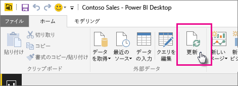

# ローカル ドライブの Power BI Desktop ファイルから作成されたデータセットを更新する
## サポートされている機能
Power BI では、[データの取得]/[クエリ エディター] を使って次のいずれかのデータ ソースに接続してデータを読み込んでいるローカル ドライブがある場合、そのローカル ドライブからインポートされた Power BI Desktop ファイルから作成したデータセットについては、[今すぐ更新] と [更新のスケジュール設定] をサポートしています。

### Power BI Gateway - Personal
* Power BI Desktop の [データの取得] および [クエリ エディター] に表示されるすべてのオンライン データ ソース。
* Hadoop ファイル (HDFS) と Microsoft Exchange を除く、Power BI Desktop の [データの取得] および [クエリ エディター] に表示されるすべてのオンプレミスのデータ ソース。

<!-- Refresh Data sources-->
[!INCLUDE [refresh-datasources](./includes/refresh-datasources.md)]

> [!NOTE]
> Power BI からオンプレミスのデータ ソースに接続し、そのデータセットを更新するには、ゲートウェイをインストールして実行する必要があります。
> 
> 

[ホーム] リボンの [更新] を選択して、1 回限りの手動更新を Power BI Desktop で実行することができます。 ここで [更新] を選択すると、*ファイルの*モデル内のデータが、元のデータ ソースの更新されたデータで更新されます。 このような更新はすべて Power BI Desktop アプリケーション自体から発生しているため、Power BI の手動またはスケジュールされた更新とは異なります。この違いを理解することが重要です。

ローカル ドライブから Power BI Desktop ファイルをインポートすると、データとモデルに関するその他の情報が Power BI のデータセットに読み込まれます。 Power BI サービス (Power BI Desktop ではない) では、データセットは Power BI サービスのレポートの基準となるため、Power BI でデータセットを更新する必要があります。 データ ソースは外部であるため、**[今すぐ更新]** を使用してデータセットを手動で更新するか、または **[更新のスケジュール設定]** を使用して更新スケジュールを設定することができます。

データセットを更新すると、Power BI はローカル ドライブのファイルに接続して更新されたデータのクエリを実行しません。 Power BI はデータセットの情報を使用してデータ ソースに直接接続し、更新されたデータのクエリを実行してから、データセットに読み込みます。

> [!NOTE]
> データセットのこの更新データは、ローカル ドライブ上のファイルに再度同期されることはありません。
> 
> 

## 更新のスケジュール方法
更新スケジュールを設定する際、Power BI はデータセットの接続情報と資格情報を使用して直接データ ソースに接続し、データの更新がないかを問い合わせ、更新されたデータをデータセットに読み込みます。 Power BI サービスのデータセットに基づくレポートおよびダッシュボードのすべての視覚エフェクトも更新されます。

更新のスケジュールを設定する方法について詳しくは、「[スケジュールされた更新の構成](refresh-scheduled-refresh.md)」をご覧ください。

## 問題が発生した場合
問題が生じた場合は通常、Power BI がデータ ソースにサインインできないか、データセットがオンプレミスのデータ ソースに接続している場合にゲートウェイがオフラインになっているためです。 Power BI がデータ ソースにサインインできることを確認してください。 データ ソースへのサインインに使用するパスワードが変更された場合、または Power BI がデータ ソースからサインアウトした場合は、必ず [データ ソースの資格情報] で再度データ ソースへのサインインを試行してください。

**[更新が失敗したらメールで通知する]** はオンのままにしてください。 スケジュールの更新が失敗した場合、すぐに通知されます。

## トラブルシューティング
期待どおりにデータが更新されないことがあります。 通常、これはゲートウェイに関係する問題です。 ツールと既知の問題については、ゲートウェイに関するトラブルシューティングの記事を参照してください。

[オンプレミス データ ゲートウェイのトラブルシューティング](service-gateway-onprem-tshoot.md)

[Power BI Gateway - Personal のトラブルシューティング](service-admin-troubleshooting-power-bi-personal-gateway.md)

他にわからないことがある場合は、 [Power BI コミュニティで質問してみてください](http://community.powerbi.com/)。

