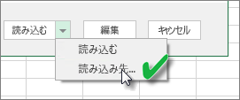
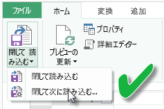

# ローカル ドライブの Excel ブックから作成されたデータセットを更新する
## サポートされている機能
Power BI では、次のいずれかのデータ ソースに接続してデータを読み込むために Power Query (Excel 2016 の [データの取得と変換]) または Power Pivot を使って次のいずれかのデータ ソースに接続して Excel データ モデルにデータを読み込んでいるローカル ドライブがある場合、そのローカル ドライブからインポートされた Excel ブックから作成したデータセットについては、[今すぐ更新] および [更新のスケジュール設定] をサポートしています。  

### Power BI Gateway - Personal
* Power Query に表示されるすべてのオンライン データ ソース
* Hadoop ファイル (HDFS) と Microsoft Exchange を除く、Power Query に表示されるすべてのオンプレミスのデータ ソース
* Power Pivot に表示されるすべてのオンライン データ ソース\*
* Hadoop ファイル (HDFS) と Microsoft Exchange を除く、Power Pivot に表示されるすべてのオンプレミスのデータ ソース

<!-- Refresh Data sources-->
[!INCLUDE [refresh-datasources](./includes/refresh-datasources.md)]

> **注:**  
> 
> * Power BI からオンプレミスのデータ ソースに接続し、そのデータセットを更新するには、ゲートウェイをインストールして実行する必要があります。
> * Excel 2013 を使用する場合は、Power Query が最新のバージョンに更新されていることを確認してください。
> * データがワークシートまたはリンク テーブルのみに存在するローカル ドライブからインポートされた Excel ブックの更新はサポートされていません。 ワークシート データが OneDrive から格納およびインポートされた場合のみ、更新はサポートされています。 詳しくは、「[OneDrive または SharePoint Online の Excel ブックから作成されたデータセットを更新する](refresh-excel-file-onedrive.md)」をご覧ください。
> * ローカル ドライブからインポートされた Excel ブックから作成したデータセットを更新する場合は、データ ソースから問い合わせられたデータのみが更新されます。 新しいメジャーの作成や列名の変更など、Excel または Power Pivot のデータ モデルの構造を変更する場合、それらの変更は、データセットにはコピーされません。 そのような変更を加えた場合は、ブックを再度アップロードまたは再発行する必要があります。 定期的に変更するブックの構造を、再度アップロードせずに Power BI のデータセットに反映したい場合、OneDrive 上にブックを配置することを検討してください。 Power BI では、OneDrive に格納および OneDrive からインポートしたブックの構造およびワークシート データはいずれも自動的に更新します。
> 
> 

## Excel データ モデルにデータが読み込まれたことを確認する方法
データ ソースへの接続に Power Query (Excel 2016 の [データの取得と変換]) を使用する場合、データの読み込み先にはいくつかのオプションがあります。 データ モデルにデータを読み込むには、 **[読み込み先]** ダイアログ ボックスで **[このデータをデータ モデルに追加する]** オプションを選択する必要があります。

> [!NOTE]
> ここでは、Excel 2016 での画像を示します。
> 
> 

**[ナビゲーター]** で **[読み込み先...]** をクリックします。  
    

または、ナビゲーターの **[編集]** をクリックすると、クエリ エディターが開きます。 そこで **[閉じて次に読み込む...]** をクリックします。  
    

その後 **[読み込み先]** で **[このデータをデータ モデルに追加する]** を選択します。  
    

### Power Pivot での [外部データの取り込み] の使用
問題はありません。 Power Pivot を使用してオンプレミスまたはオンライン データ ソースに接続し、データを問い合わせる場合、データは自動的にデータ モデルに読み込まれます。

## 更新のスケジュール方法
更新スケジュールを設定する際、Power BI はデータセットの接続情報と資格情報を使用して直接データ ソースに接続し、データの更新がないかを問い合わせ、更新されたデータをデータセットに読み込みます。 Power BI サービスのデータセットに基づくレポートおよびダッシュボードのすべての視覚エフェクトも更新されます。

更新のスケジュールを設定する方法について詳しくは、「[スケジュールされた更新の構成](refresh-scheduled-refresh.md)」をご覧ください。

## 問題が発生した場合
問題が生じた場合は通常、Power BI がデータ ソースにサインインできないか、データセットがオンプレミスのデータ ソースに接続している場合にゲートウェイがオフラインになっているためです。 Power BI がデータ ソースにサインインできることを確認してください。 データ ソースへのサインインに使用するパスワードが変更された場合、または Power BI がデータ ソースからサインアウトした場合は、必ず [データ ソースの資格情報] で再度データ ソースへのサインインを試行してください。

**[更新が失敗したらメールで通知する]** はオンのままにしてください。 スケジュールの更新が失敗した場合、すぐに通知されます。

>[!IMPORTANT]
>Power Pivot に接続されている、問い合わせ先の OData フィードでは更新はサポートされていません。 データ ソースとして OData フィードを使用する場合は、Power Query を使用してください。

## トラブルシューティング
期待どおりにデータが更新されないことがあります。 通常、これはゲートウェイに関係する問題です。 ツールと既知の問題については、ゲートウェイに関するトラブルシューティングの記事を参照してください。

[オンプレミス データ ゲートウェイのトラブルシューティング](service-gateway-onprem-tshoot.md)

[Power BI Gateway - Personal のトラブルシューティング](service-admin-troubleshooting-power-bi-personal-gateway.md)

## 次の手順
他にわからないことがある場合は、 [Power BI コミュニティを利用してください](http://community.powerbi.com/)。

