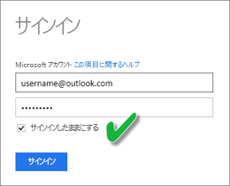
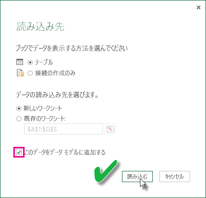

# OneDrive または SharePoint Online の Excel ブックから作成されたデータセットを更新する
ローカル コンピューターに、または OneDrive for Business や SharePoint Online のようなクラウド ストレージに、Excel ブックをインポートできます。 Excel ファイル用にクラウド ストレージを使用する利点を紹介します。 Power BI に Excel ファイルをインポートする方法の詳細については、「[Excel ブック ファイルからデータを取得する](service-excel-workbook-files.md)」を参照してください。

## 使用する利点
OneDrive または SharePoint Online からのファイルのインポートは、Excel で実行している作業と Power BI サービスとの同期を確実に維持するための優れた方法です。 ファイルのモデルに読み込んだすべてのデータがデータセットにインポートされ、ファイルに作成されたすべてのレポートが Power BI のレポートに読み込まれます。 OneDrive または SharePoint Online のファイルに新しいメジャーの追加、列名の変更、視覚エフェクトの編集といった変更を行って保存すると、その内容が通常は 1 時間以内に Power BI でも更新されます。

個人用の OneDrive から Excel ブックをインポートする場合、ワークシート内の表や Excel データ モデルに読み込まれるデータとデータ モデルの構造などのすべてのデータは、Power BI の新しいデータセットにインポートされます。 Power View のすべてのビジュアル表示はレポートで再作成されます。 Power BI は、更新があるかどうかを確認するために、OneDrive または SharePoint Online 上のブックに約 1 時間おきに自動的に接続します。 ブックに変更がある場合、Power BI は Power BI サービス内のデータセットおよびレポートを更新します。

Power BI サービス内のデータセットを更新することができます。 手動でデータセットを更新したり、更新をスケジュールしたりする場合、Power BI では外部ソースに直接接続し、データセットに読み込むデータ更新があるかどうかの問い合わせを行います。 Power BI 内でデータセットを更新しても、OneDrive または SharePoint Online のブックのデータは更新されません。 

## サポートされている機能
Power BI では、[データの取得]/[クエリ エディター] を使って次のいずれかのデータ ソースに接続してデータを読み込んでいるローカル ドライブがある場合、そのローカル ドライブからインポートされた Power BI Desktop ファイルから作成したデータセットについては、[今すぐ更新] と [更新のスケジュール設定] をサポートしています。  

### Power BI Gateway - Personal
* Power BI Desktop の [データの取得] および [クエリ エディター] に表示されるすべてのオンライン データ ソース。
* Hadoop ファイル (HDFS) と Microsoft Exchange を除く、Power BI Desktop の [データの取得] および [クエリ エディター] に表示されるすべてのオンプレミスのデータ ソース。

<!-- Refresh Data sources-->
[!INCLUDE [refresh-datasources](./includes/refresh-datasources.md)]

> [!NOTE]
> Power BI からオンプレミスのデータ ソースに接続し、そのデータセットを更新するには、ゲートウェイをインストールして実行する必要があります。
> 
> 

## OneDrive と OneDrive for Business。 違いは何ですか?
個人用の OneDrive と OneDrive for Business の両方がある場合は、Power BI にインポートするすべてのファイルを OneDrive for Business に保存することをおすすめします。 これは、サインインのために 2 種類のアカウントを使用する可能性があるためです。

Power BI へのサインインに使用するアカウントが OneDrive for Business へのサインインに使用するアカウントと同じであることが多いため、Power BI での OneDrive for Business への接続は通常シームレスです。 ただし、個人用の OneDrive では、ほとんどの場合異なる [Microsoft アカウント](https://account.microsoft.com)を使用してサインインします。

Microsoft アカウントにサインインしたら、必ず [サインアウトしない] を選択してください。 これで、Power BI が Power BI Desktop のファイルに行ったすべての変更を Power BI のデータセットに同期できるようになります。  
    

Microsoft アカウントの資格情報が変更されている可能性があるために Power BI のデータセットまたはレポートと同期できない OneDrive のファイルに変更を行う場合は、そのファイルに接続して、個人用の OneDrive から再度インポートする必要があります。

## Excel ファイルに接続するためのオプション
OneDrive for Business または SharePoint Online 内の Excel ブックに接続した場合、ブック内のものを Power BI に取り込む方法が 2 つあります。

[**Excel データを Power BI にインポートする**](service-excel-workbook-files.md#import-or-connect-to-an-excel-workbook-from-power-bi) – OneDrive for Business または SharePoint Online から Excel ブックをインポートすると、上で説明したとおりに機能します。

[**Power BI で Excel に接続し、管理し、表示する**](service-excel-workbook-files.md#one-excel-workbook--two-ways-to-use-it) – このオプションを使用した場合、OneDrive for Business または SharePoint Online 上のブックへの直接の接続が Power BI から作成されます。

この方法で Excel ブックを接続した場合、データセットは Power BI には作成されません。 ただし、このブックは Power BI サービスの [レポート] の下で、名前の横の Excel アイコンと共に表示されます。 Excel Online の場合とは異なり、Power BI からブックに接続した場合、ブックが Excel データ モデルにデータを読み込む外部データ ソースに接続されていると、更新スケジュールを設定できます。

この方法で更新スケジュールを設定した場合の唯一の違いは、Power BI のデータセットではなく、OneDrive または SharePoint Online のブックのデータ モデルのデータが更新されるという点です。

## Excel データ モデルにデータが読み込まれたことを確認する方法
データ ソースへの接続に Power Query (Excel 2016 の [データの取得と変換]) を使用する場合、データの読み込み先にはいくつかのオプションがあります。 データ モデルにデータを読み込むには、 **[読み込み先]** ダイアログ ボックスで **[このデータをデータ モデルに追加する]** オプションを選択する必要があります。

> [!NOTE]
> ここでは、Excel 2016 での画像を示します。
> 
> 

**[ナビゲーター]** で **[読み込み先...]** をクリックします。  
    

または、ナビゲーターの **[編集]** をクリックすると、クエリ エディターが開きます。 そこで **[閉じて次に読み込む...]** をクリックします。  
    

その後 **[読み込み先]** で **[このデータをデータ モデルに追加する]** を選択します。  
    

### Power Pivot での [外部データの取り込み] の使用
問題はありません。 Power Pivot を使用してオンプレミスまたはオンライン データ ソースに接続し、データを問い合わせる場合、データは自動的にデータ モデルに読み込まれます。

## 更新のスケジュール方法
更新スケジュールを設定する際、Power BI はデータセットの接続情報と資格情報を使用して直接データ ソースに接続し、データの更新がないかを問い合わせ、更新されたデータをデータセットに読み込みます。 Power BI サービスのデータセットに基づくレポートおよびダッシュボードのすべての視覚エフェクトも更新されます。

更新のスケジュールを設定する方法について詳しくは、「[スケジュールされた更新の構成](refresh-scheduled-refresh.md)」をご覧ください。

## 問題が発生した場合
問題が生じた場合は通常、Power BI がデータ ソースにサインインできないか、データセットがオンプレミスのデータ ソースに接続している場合にゲートウェイがオフラインになっているためです。 Power BI がデータ ソースにサインインできることを確認してください。 データ ソースへのサインインに使用するパスワードが変更された場合、または Power BI がデータ ソースからサインアウトした場合は、必ず [データ ソースの資格情報] で再度データ ソースへのサインインを試行してください。

**[更新が失敗したらメールで通知する]** はオンのままにしてください。 スケジュールの更新が失敗した場合、すぐに通知されます。

## 重要な注意事項
\*Power Pivot に接続されている、問い合わせ先の OData フィードでは更新はサポートされていません。 データ ソースとして OData フィードを使用する場合は、Power Query を使用してください。

## トラブルシューティング
期待どおりにデータが更新されないことがあります。 通常、これはゲートウェイに関係する問題です。 ツールと既知の問題については、ゲートウェイに関するトラブルシューティングの記事を参照してください。

[オンプレミス データ ゲートウェイのトラブルシューティング](service-gateway-onprem-tshoot.md)

[Power BI Gateway - Personal のトラブルシューティング](service-admin-troubleshooting-power-bi-personal-gateway.md)

他にわからないことがある場合は、 [Power BI コミュニティを利用してください](http://community.powerbi.com/)。

