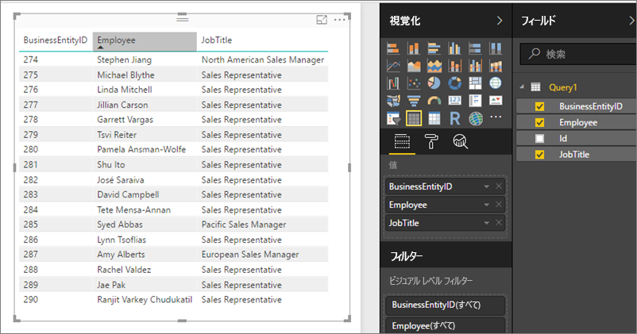

# Power BI Report Server で OData フィードとして共有データセットにアクセスする
OData フィードを使って Power BI Desktop から共有データセットにアクセスできます。

1. OData フィード URL では、OData ソースに接続します。
   
    
2. Power BI Desktop にデータを取り込んだ後は、クエリ エディターを使って変更できます。
   
    
3. レポートの設計でデータを使えるようになりました。
   
    

オープン型の列を有効にして、ニーズに合わせて Power Query で列を適切に書式設定できるように、**[詳細オプション]** を使ってください。

詳細については、「[Power BI Desktop で OData フィードに接続する](../desktop-connect-odata.md)」をご覧ください。

他にわからないことがある場合は、 [Power BI コミュニティで質問してみてください](https://community.powerbi.com/)。

