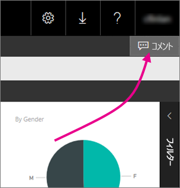

# レポート サーバーのレポートにコメントを追加する - Power BI Report Server
レポート サーバーの Web ポータル内で、Power BI レポートなどのレポートにコメントを追加することができます。 コメントはレポートと共に保存され、適切なアクセス許可を持つすべてのユーザーがレポートのコメントを表示できます。 詳細については、下記の「[アクセス許可](#permissions)」セクションを参照してください。

## コメントの追加または表示
1. レポート サーバーでページ分割されたレポートまたは Power BI レポートを開きます。
2. 右上の **[コメント]** を選択します。
   
    
   
    既存のコメントがあれば、[コメント] ウィンドウに表示されます。
3. コメントを入力し、**[コメントを投稿]** を選択します。
   
    ![[コメントを投稿]](media/add-comments/report-server-web-portal-comments-pane.png)
   
    このコメントは、以前のコメントと共に Web ポータルのウィンドウに表示されます。 Power BI モバイル アプリのレポートには表示されません。
   
   > [!TIP]
   > ご存知でしたか。 [Power BI モバイル アプリで Power BI レポートにコメントを追加](../consumer/mobile/mobile-annotate-and-share-a-tile-from-the-mobile-apps.md)し、コメント付きのレポートを他のユーザーと共有できます。
   > 
   > 

## アクセス許可
アクセス許可に応じて、次のように使用できる機能が決まります。

* コメントを表示できない。
* すべてのコメントを表示できる。また、自分のコメントの投稿、編集、および削除を実行できる。
* すべてのコメントを表示できる。自分のコメントの投稿、編集、および削除を実行できる。さらに他のユーザーのコメントを削除できる。

## 次の手順
* [Power BI Report Server とは](get-started.md)  

他にわからないことがある場合は、 [Power BI コミュニティで質問してみてください](https://community.powerbi.com/)。

