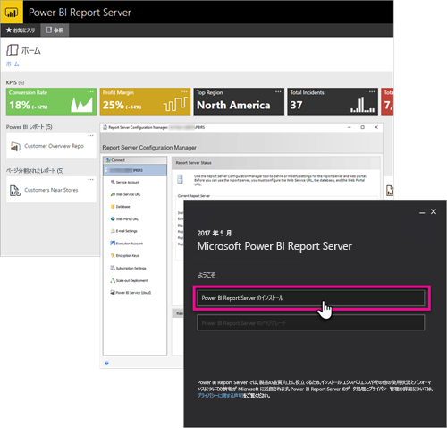

# 管理者向けハンドブックの概要、Power BI レポート サーバー
Power BI レポート サーバーの管理者向けハンドブックへようこそ。Power BI レポート サーバーは、Power BI レポート、モバイル レポート、およびページ分割されたレポートを格納および管理するためのオンプレミスの場所です。

このハンドブックは、Power BI レポート サーバーの計画、展開、および管理の概念を理解するのに役立ちます。

## インストールと移行
Power BI レポート サーバーの使用を開始するには、インストールする必要があります。 このタスクを処理できるようにするための情報を提供します。

Power BI レポート サーバーのインストール、アップグレードまたは移行を開始する前に、レポート サーバーの[システム要件](system-requirements.md)をご覧ください。

### インストール
新しい Power BI レポート サーバーを展開する場合は、次のドキュメントが役立ちます。 すぐに始める場合は、クイックスタートが利用できます。 または、インストールに関するドキュメントで詳細を確認できます。

* [クイックスタート: Power BI レポート サーバーをインストールする](quickstart-install-report-server.md)
* [Power BI レポート サーバーのインストール](install-report-server.md)

### 移行
SQL Server Reporting Services の一括アップグレードはありません。 Power BI Report Server にする既存の SQL Server Reporting Services インスタンスがある場合は、それを移行する必要があります。 移行を実行する理由は他にもあります。 詳細については、移行のドキュメントを確認してください。

[レポート サーバー インストールの移行](migrate-report-server.md)

## レポート サーバーを構成する
レポート サーバーを構成する際には、多数のオプションがあります。 SSL を使用するか、 電子メール サーバーを構成しているか、 Power BI サービスを統合して視覚エフェクトをピン留めするかなどです。

構成の大部分は、Report Server の構成マネージャー内で行われます。 詳細については、[構成マネージャー](https://docs.microsoft.com/sql/reporting-services/install-windows/reporting-services-configuration-manager-native-mode)のドキュメントで確認してください。

## セキュリティ
セキュリティと保護は、すべての組織にとって重要です。 認証、承認、役割およびアクセス許可については、[セキュリティ](https://docs.microsoft.com/sql/reporting-services/security/reporting-services-security-and-protection) ドキュメントで学ぶことができます。

## 次の手順
[クイックスタート: Power BI レポート サーバーをインストールする](quickstart-install-report-server.md)  
[レポート サーバーのプロダクト キーを検索する方法](find-product-key.md)  
[Power BI レポート サーバー向けに最適化された Power BI Desktop のインストール](install-powerbi-desktop.md)  
[レポート ビルダーをインストールする](https://docs.microsoft.com/sql/reporting-services/install-windows/install-report-builder)  
[SQL Server Data Tools (SSDT) のダウンロード](http://go.microsoft.com/fwlink/?LinkID=616714)

他にわからないことがある場合は、 [Power BI コミュニティで質問してみてください](https://community.powerbi.com/)。

