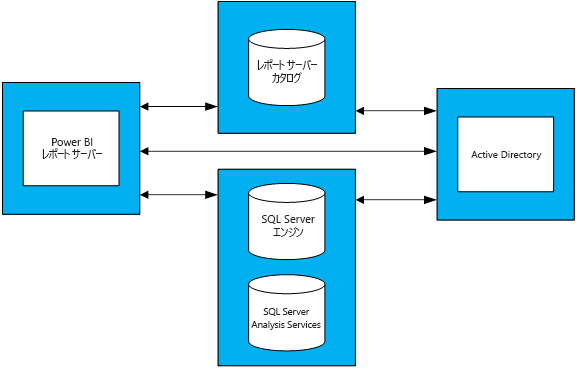

# Power BI Report Server のキャパシティ プランニング ガイダンス
Power BI Report Server はセルフ サービスの BI およびエンタープライズ レポート ソリューションであり、ユーザーはファイアウォールの内側のオンプレミスに展開できます。 Power BI Desktop の対話型レポート機能と、SQL Server Reporting Services のオンプレミスのサーバー プラットフォームが組み合わされています。 企業では分析とレポートが大量に使用され、さらに増え続けており、エンタープライズ ユーザー ベースへの拡張に必要なハードウェア インフラストラクチャやソフトウェア ライセンスの予算が問題になる場合があります。 このホワイト ペーパーでは、Report Server に対して実行されたさまざまなワークロードの多数のロード テストの結果を示して、Power BI Report Server のキャパシティ プランニングに関するガイダンスを提供します。 レポート、クエリ、使用のパターンは組織によって大きく異なりますが、ここで示す結果と、実際に使われたテストおよび実行方法の詳細な説明は、Power BI Report Server の展開の早期計画プロセスで参考になります。

## 概要
2 種類のワークロードを Power BI Report Server に対して実行しました。各ワークロードは、異なる種類のレポートの表示と、さまざまな Web ポータル操作の実行で構成されています。 

* "Power BI レポートの処理量が多い" ワークロードで最も頻繁に実行された操作 (つまり、実行時間の 60% を占めた操作) は、Power BI レポートの表示でした。
* "ページ分割されたレポートの処理量が多い" ワークロードで最も頻繁に実行された操作は、ページ分割されたレポートの表示でした。

4 サーバー トポロジの Power BI Report Server を使い、同時にレポート サーバーにアクセスするユーザーは全体の 5% 以下であると想定すると、Power BI Report Server が 99% 以上の信頼性で処理できるユーザーの最大数は次の表のようになります。 

| ワークロード | 8 コア/32 GB RAM | 16 コア/64 GB RAM |
| --- | --- | --- |
| **Power BI レポートの処理量が多い** (> 60%) |1,000 ユーザー |3,000 ユーザー |
| **ページ分割された (RDL) レポートの処理量が多い** (> 60%) |2,000 ユーザー |3,200 ユーザー |

各実行で最も負荷がかかったリソースは CPU でした。 このため、メモリやハード ディスク領域の量を増やすより、Power BI Report Server のコアの数を増やす方がシステムの信頼性の向上につながります。 

## テスト方法
テストに使われたトポロジは、ベンダー固有の物理ハードウェアではなく Microsoft Azure Virtual Machines に基づくものでした。 すべてのマシンは米国リージョンにホストされていました。 これは、オンプレミスとパブリック クラウド両方のハードウェア仮想化の一般的な傾向を反映したものです。 

### Power BI Report Server のトポロジ
Power BI Report Server の展開は、次の仮想マシンで構成されていました。

* Active Directory ドメイン コントローラー: これは、SQL Server データベース エンジン、SQL Server Analysis Services、および Power BI Report Server が安全にすべての要求を認証するために必要でした。
* SQL Server データベース エンジンと SQL Server Analysis Services: ここには、レポートが表示されるときに使われるすべてのデータベースが格納されました。
* Power BI Report Server
* Power BI Report Server データベース。 Report Server データベースは、SQL Server データベース エンジンとメモリ、CPU、ネットワーク、およびディスク リソースを競合することがないように、Power BI Report Server とは別のマシンでホストされていました。

トポロジで使われた各仮想マシンの詳細な構成については、「付録 1.1 Power BI Report Server のトポロジ」および「付録 1.2 Power BI Report Server の仮想マシンの構成」をご覧ください。

### テスト
ロード テストの実行で使われたテストは、[Reporting Services LoadTest](https://github.com/Microsoft/Reporting-Services-LoadTest) という名前の GitHub プロジェクトで誰でも入手できます。 このツールでは、SQL Server Reporting Services と Power BI Report Server のパフォーマンス、信頼性、スケーラビリティ、および回復性の特性を調べることができます。 このプロジェクトは、テスト ケースの 4 つのグループで構成されます。

* Power BI レポートの表示をシミュレートするテスト
* モバイル レポートの表示をシミュレートするテスト
* 大小のページ分割されたレポートの表示をシミュレートするテスト 
* さまざまな種類の Web ポータル操作の実行をシミュレートするテスト 

すべてのテストは、エンド ツー エンドの操作 (レポートの表示、新しいデータ ソースの作成など) を実行するように作成されました。 操作は、(API によって) レポート サーバーに 1 つまたは複数の Web 要求を行うことによって実現します。 実際には、これらのエンド ツー エンド操作を行うためにユーザーはいくつかの中間操作を実行することが必要な場合があります。 たとえば、レポートを表示するには、ユーザーは Web ポータルにアクセスしてレポートがあるフォルダーに移動し、レポートをクリックして表示する必要があります。 テストではエンド ツー エンドのタスクの完了に必要なすべての操作は実行されませんが、それでも、Power BI Report Server で発生する負荷はだいたいわかります。 GitHub プロジェクトを調べることで、使われているさまざまな種類のレポートおよび実行されているさまざまな操作について詳しく知ることができます。

### ワークロード
テストで使われているワークロード プロファイルには、Power BI レポートの処理量が多いものとページ分割されたレポートの処理量が多いものの 2 種類があります。 次の表では、Report Server に対して実行される要求の分布について説明します。

| Activity | Power BI レポートの処理量が多い、実行の頻度 | ページ分割されたレポートの処理量が多い、実行の頻度 |
| --- | --- | --- |
| **Power BI レポートの表示** |60% |10% |
| **ページ分割された (RDL) レポートの表示** |30% |60% |
| **モバイル レポートの表示** |5% |20% |
| **Web ポータルの操作** |5% |10% |

### ユーザー ロード
各テストは、2 つのワークロードのいずれかで指定された頻度に基づいて実行されました。 テストは、Report Server への 20 個の同時ユーザー要求で開始しました。 その後、信頼性が目標の 99% を下回るまで、ユーザー ロードを段階的に増やしました。

## 結果
### 同時ユーザーの容量
前述のように、テストは Report Server に対して 20 個の同時ユーザー要求を行うことで開始されました。 その後、すべての要求の 1% が失敗するようになるまで、同時ユーザーの数を徐々に増やしました。 次の表は、ピーク負荷において失敗率 1% 未満でサーバーが処理できる同時ユーザー要求の数を示したものです。

| ワークロード | 8 コア/32 GB | 16 コア/64 GB |
| --- | --- | --- |
| **Power BI レポートの処理量が多い** |同時ユーザー50 人 |同時ユーザー150 人 |
| **ページ分割されたレポートの処理量が多い** |同時ユーザー100 人 |同時ユーザー160 人 |

### ユーザーの合計容量
Microsoft の運用環境には Power BI Report Server が展開されており、複数のチームがそれを使っています。 この環境の実際の使用状況を分析すると、特定の時点 (毎日のピーク負荷時でも) の同時ユーザー数は、総ユーザー ベースの 5% を超えないことがわかります。 この 5% という同時ユーザー数の割合をベンチマークとして使い、Power BI Report Server が 99% の信頼性で処理できるユーザー ベースの総数を推定しました。

| ワークロード | 8 コア/32 GB | 16 コア/64 GB |
| --- | --- | --- |
| **Power BI レポートの処理量が多い** |1,000 ユーザー |3,000 ユーザー |
| **ページ分割されたレポートの処理量が多い** |2,000 ユーザー |3,200 ユーザー |

### 結果の表示
レポートを選択して、ロード テストの結果を表示します。

| ワークロード | 8 コア/32 GB | 16 コア/64 GB |
| --- | --- | --- |
| **Power BI レポートの処理量が多い** |[表示 - 8 コア](https://msit.powerbi.com/view?r=eyJrIjoiMDhhNGY4NGQtNGRhYy00Yzk4LTk2MzAtYzFlNWI5NjBkMGFiIiwidCI6IjcyZjk4OGJmLTg2ZjEtNDFhZi05MWFiLTJkN2NkMDExZGI0NyIsImMiOjV9) |[表示 - 16 コア](https://msit.powerbi.com/view?r=eyJrIjoiNDBiODk1OGUtYTAyOC00MzVhLThmZmYtNzVjNTFjNzMwYzkwIiwidCI6IjcyZjk4OGJmLTg2ZjEtNDFhZi05MWFiLTJkN2NkMDExZGI0NyIsImMiOjV9) |
| **ページ分割されたレポートの処理量が多い** |[表示 - 8 コア](https://msit.powerbi.com/view?r=eyJrIjoiNDFiZWYzMTktZGIxNS00MzcwLThjODQtMmJkMGRiZWEzNjhlIiwidCI6IjcyZjk4OGJmLTg2ZjEtNDFhZi05MWFiLTJkN2NkMDExZGI0NyIsImMiOjV9) |[表示 - 16 コア](https://msit.powerbi.com/view?r=eyJrIjoiOTU0YjJkYTgtNDg4Yy00NzlhLWIwMGYtMzg4YWI2MjNmOTZjIiwidCI6IjcyZjk4OGJmLTg2ZjEtNDFhZi05MWFiLTJkN2NkMDExZGI0NyIsImMiOjV9) |

<iframe width="640" height="360" src="https://msit.powerbi.com/view?r=eyJrIjoiMDhhNGY4NGQtNGRhYy00Yzk4LTk2MzAtYzFlNWI5NjBkMGFiIiwidCI6IjcyZjk4OGJmLTg2ZjEtNDFhZi05MWFiLTJkN2NkMDExZGI0NyIsImMiOjV9" frameborder="0" allowFullScreen="true"></iframe>

<iframe width="640" height="360" src="https://msit.powerbi.com/view?r=eyJrIjoiNDBiODk1OGUtYTAyOC00MzVhLThmZmYtNzVjNTFjNzMwYzkwIiwidCI6IjcyZjk4OGJmLTg2ZjEtNDFhZi05MWFiLTJkN2NkMDExZGI0NyIsImMiOjV9" frameborder="0" allowFullScreen="true"></iframe>

<iframe width="640" height="360" src="https://msit.powerbi.com/view?r=eyJrIjoiNDFiZWYzMTktZGIxNS00MzcwLThjODQtMmJkMGRiZWEzNjhlIiwidCI6IjcyZjk4OGJmLTg2ZjEtNDFhZi05MWFiLTJkN2NkMDExZGI0NyIsImMiOjV9" frameborder="0" allowFullScreen="true"></iframe>

<iframe width="640" height="360" src="https://msit.powerbi.com/view?r=eyJrIjoiOTU0YjJkYTgtNDg4Yy00NzlhLWIwMGYtMzg4YWI2MjNmOTZjIiwidCI6IjcyZjk4OGJmLTg2ZjEtNDFhZi05MWFiLTJkN2NkMDExZGI0NyIsImMiOjV9" frameborder="0" allowFullScreen="true"></iframe>

## まとめ
各ロード テストの実行で、Power BI Report Server マシンのピーク負荷時に最も負荷がかかるリソースは CPU でした。 このため、最初に増やす必要があるリソースはコアの数です。 または、トポロジに Power BI Report Server をホストするサーバーを追加することによるスケールアウトも検討できます。

このホワイト ペーパーで示した結果は、特定のデータ セットを使う特定のレポート セットを特定の方法で繰り返すことにより得られたものです。 参考としては役に立ちますが、実際の使用状況は Power BI Report Server の実際のレポート、クエリ、使用パターン、および展開に依存することに留意してください。

## 付録
### 1 トポロジ
**1.1 Power BI Report Server のトポロジ**

異なる構成での Power BI Report Server の動作にのみ注目するため、各マシンの種類 (Power BI Report Server をホストしているマシンを除きます) の VM の構成は固定にしました。 各マシンを、Premium Storage ディスクを使う第 2 世代 (v2) D シリーズ マシンに従ってプロビジョニングしました。 各 VM サイズについて詳しくは、「汎用」セクション (https://azure.microsoft.com/en-us/pricing/details/virtual-machines/windows/) を参照してください。

| 仮想マシンの種類 | プロセッサ | メモリ | Azure VM のサイズ |
| --- | --- | --- | --- |
| **Active Directory ドメイン コントローラー** |2 コア |7 GB |Standard_DS2_v2 |
| **SQL Server データベース エンジンと Analysis Services** |16 コア |56 GB |Standard_DS5_v2 |
| **SQL Server データベース** |16 コア |56 GB |Standard_DS5_v2 |

**1.2 Power BI Report Server の仮想マシンの構成** 

Power BI Report Server をホストする仮想マシンには、異なる構成のプロセッサとメモリを使いました。 他の VM とは異なり、このマシンは、Premium Storage ディスクを使う第 3 世代 (v3) D シリーズ マシンに従ってプロビジョニングしました。 この VM サイズについて詳しくは、「汎用」セクション (https://azure.microsoft.com/en-us/pricing/details/virtual-machines/windows/) を参照してください。

| 仮想マシン | プロセッサ | メモリ | Azure VM のサイズ |
| --- | --- | --- | --- |
| **Power BI Report Server (小)** |8 コア |32 GB |Standard_D8S_v3 |
| **Power BI Report Server (大)** |16 コア |64 GB |vStandard_D16S_v3 |

### 2 LoadTest ツールの実行
Power BI Report Server のオンプレミスの展開または Microsoft Azure の展開に対して Reporting Services LoadTest ツールを実行する場合は、以下の手順のようにします。

1. GitHub から Reporting Services LoadTest プロジェクトを複製します (https://github.com/Microsoft/Reporting-Services-LoadTest)。
2. プロジェクト ディレクトリで、RSLoadTests.sln という名前のソリューション ファイルを探します。 Visual Studio 2015 以降でこのファイルを開きます。
3. Power BI Report Server のオンプレミスの展開または Microsoft Azure での展開のどちらに対してこのツールを実行するかを決定します。 独自の展開に対して実行する場合は、手順 5 に進みます。
4. https://github.com/Microsoft/Reporting-Services-LoadTest#create-a-sql-server-reporting-services-load-environment-in-azure の指示に従って、Azure に Power BI Report Server 環境を作成します。
5. 環境のデプロイが完了したら、https://github.com/Microsoft/Reporting-Services-LoadTest#load-test-execution の指示に従って、テストを実行します。

他にわからないことがある場合は、 [Power BI コミュニティで質問してみてください](https://community.powerbi.com/)。

