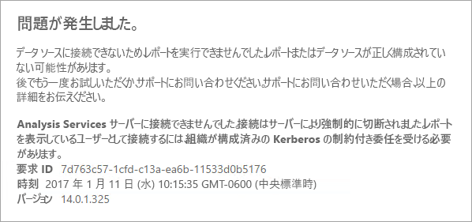
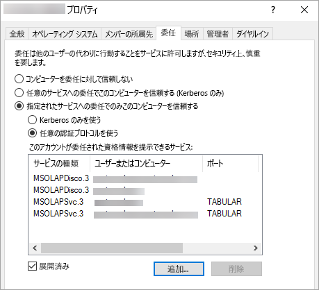

# <a name="configure-kerberos-to-use-power-bi-reports"></a>Power BI レポートを使用するために Kerberos を構成する
<iframe width="640" height="360" src="https://www.youtube.com/embed/vCH8Fa3OpQ0?showinfo=0" frameborder="0" allowfullscreen></iframe>

分散環境用の Power BI レポートで使用されるデータ ソースに対して Kerberos 認証を使うようにレポート サーバーを構成する方法を説明します。

Power BI レポート サーバーには、Power BI レポートをホストする機能があります。 レポート サーバーでは多くのデータ ソースがサポートされています。 この記事では SQL Server Analysis Services に特に注目しますが、同じ概念を SQL Server などの他のデータ ソースにも適用できます。

Power BI レポート サーバー、SQL Server、Analysis Services を 1 台のコンピューターにインストールでき、特に何も構成しなくてもすべて動作するはずです。 これは、テスト環境に最適です。 これらのサービスを異なるコンピューターにインストールした場合 (分散環境と呼ばれます)、エラーが発生する可能性があります。 この環境では、Kerberos 認証を使う必要があります。 この環境を実装するために必要な構成があります。 

具体的には、制約付き委任を構成する必要があります。 環境に Kerberos が構成されていても、制約付き委任は構成されていない可能性があります。

## <a name="error-running-report"></a>エラー実行レポート
レポート サーバーが正しく構成されていない場合、次のエラーが表示されることがあります。

    Something went wrong.

    We couldn’t run the report because we couldn’t connect to its data source. The report or data source might not be configured correctly. 

技術的な詳細には、次のメッセージが表示されます。

    We couldn’t connect to the Analysis Services server. The server forcibly closed the connection. To connect as the user viewing the report, your organization must have configured Kerberos constrained delegation.



## <a name="configuring-kerberos-constrained-delegation"></a>Kerberos の制約付き委任を構成する
Kerberos の制約付き委任が機能するために、構成する必要のある項目がいくつかあります。 これには、サービス アカウントでのサービス プリンシパル名 (SPN) と委任の設定が含まれます。

> [!NOTE]
> SPN および委任の設定を構成するには、ドメイン管理者である必要があります。
> 
> 

次のものを構成または検証する必要があります。

1. レポート サーバー構成内の認証の種類。
2. レポート サーバー サービス アカウントの SPN。
3. Analysis Services サービスの SPN。
4. Analysis Services コンピューター上の SQL Browser サービスの SPN。 これは名前付きインスタンスの場合のみです。
5. レポート サーバー サービス アカウントでの委任の設定。

## <a name="authentication-type-within-report-server-configuration"></a>レポート サーバー構成内の認証の種類
Kerberos の制約付き委任に対応するように、レポート サーバーの認証の種類を構成する必要があります。 これは、**rsreportserver.config** ファイルで行います。 このファイルの既定の場所は `C:\Program Files\Microsoft Power BI Report Server\PBIRS\ReportServer` です。

rsreportserver.config ファイルで、**Authentication/AuthenticationTypes** セクションを探します。

RSWindowsNegotiate が認証の種類の一覧の先頭にあることを確認します。 次に表示例を示します。

```
<AuthenticationTypes>
    <RSWindowsNegotiate/>
    <RSWindowsNTLM/>
</AuthenticationTypes>
```

構成ファイルを変更した場合、レポート サーバーをいったん停止して開始し直し、変更を有効にする必要があります。

詳細については、「[Configure Windows Authentication on the Report Server](https://docs.microsoft.com/sql/reporting-services/security/configure-windows-authentication-on-the-report-server)」(レポート サーバーで Windows 認証を構成する) をご覧ください。

## <a name="spns-for-the-report-server-service-account"></a>レポート サーバー サービス アカウントの SPN
次に、レポート サーバーで有効な SPN を使用できることを確認する必要があります。 これは、レポート サーバー用に構成されているサービス アカウントに基づきます。

### <a name="virtual-service-account-or-network-service"></a>仮想サービス アカウントまたはネットワーク サービス
レポート サーバーが仮想サービス アカウントまたはネットワーク サービス アカウント用に構成されている場合は、何もする必要はありません。 これらは、コンピューター アカウントのコンテキスト内にあります。 コンピューター アカウントには、既定で HOST SPN があります。 これらは HTTP サービスをカバーし、レポート サーバーによって使われます。

コンピューター アカウントと異なる仮想サーバー名を使っている場合は、HOST エントリはユーザーをカバーせず、仮想サーバー ホスト名の SPN を手動で追加する必要があります。

### <a name="domain-user-account"></a>ドメイン ユーザー アカウント
レポート サーバーがドメイン ユーザー アカウントを使うように構成されている場合は、そのアカウントで HTTP SPN を手動で作成する必要があります。 これを行うには、Windows に付属する setspn ツールを使います。

> [!NOTE]
> SPN を作成するには、ドメイン管理者の権限が必要です。
> 
> 

SPN を 2 つ作成することをお勧めします。 1 つには NetBIOS 名を使い、もう 1 つには完全修飾ドメイン名 (FQDN) を使います。 SPN の形式は次のとおりです。

    <Service>/<Host>:<port>

Power BI レポート サーバーは、HTTP のサービスを使います。 HTTP SPN の場合はポートを記述しません。 ここで使うサービスは HTTP です。 SPN のホストは、URL で使う名前になります。 通常、これはコンピューターの名前です。 ロード バランサーの背後にいる場合、これは仮想名でもかまいません。

> [!NOTE]
> ブラウザーのアドレス バーに入力する内容を見て URL を確認できます。または、レポート サーバーの構成マネージャーの [Web ポータル URL] タブを見ることができます。
> 
> 

コンピューター名が ContosoRS の場合、SPN は次のようになります。

| SPN の種類 | SPN |
| --- | --- |
| 完全修飾ドメイン名 (FQDN) |HTTP/ContosoRS.contoso.com |
| NetBIOS |HTTP/ContosoRS |

### <a name="location-of-spn"></a>SPN の場所
それでは、SPN をどこに置きますか。 SPN は、サービス アカウントに使っているどのようなものにも配置されます。 仮想サービス アカウントまたはネットワーク サービスを使っている場合、これがコンピューター アカウントになります。 ただし、前に仮想 URL に対してのみこれを行う必要があると説明しました。 レポート サーバー サービス アカウントにドメイン ユーザーを使っている場合は、そのドメイン ユーザー アカウントに SPN を配置します。

たとえば、ネットワーク サービス アカウントを使っていてコンピューター名が ContosoRS である場合、SPN を ContosoRS に置きます。

RSService のドメイン ユーザー アカウントを使っている場合は、RSService に SPN を置きます。

### <a name="using-setspn-to-add-the-spn"></a>SetSPN を使用して SPN を追加する
SetSPN ツールを使って SPN を追加できます。 コンピューター アカウントとドメイン ユーザー アカウントでは前と同じ例に従います。

コンピューター アカウントへの SPN の配置は (FQDN SPN と NetBIOS SPN の両方)、contosoreports という仮想 URL を使う場合は次のようになります。

      Setspn -a HTTP/contosoreports.contoso.com ContosoRS
      Setspn -a HTTP/contosoreports ContosoRS

ドメイン ユーザー アカウントへの SPN の配置は (FQDN SPN と NetBIOS SPN の両方)、SPN のホストに対するコンピューター名を使う場合は次のようになります。

      Setspn -a HTTP/ContosoRS.contoso.com RSService
      Setspn -a HTTP/ContosoRS RSService

## <a name="spns-for-the-analysis-services-service"></a>Analysis Services サービスの SPN
Analysis Services の SPN は、Power BI レポート サーバーと似ています。 名前付きインスタンスがある場合は、SPN の形式が少し異なります。

Analysis Services の場合は、MSOLAPSvc.3 のサービスを使います。 SPN でポートの場所のインスタンス名を指定します。 SPN のホスト部分は、コンピューター名またはクラスターの仮想名です。

Analysis Services の SPN の例は次のようになります。

| タイプ | 書式 |
| --- | --- |
| 既定のインスタンス |MSOLAPSvc.3/ContosoAS.contoso.com<br>MSOLAPSvc.3/ContosoAS |
| 名前付きインスタンス |MSOLAPSvc.3/ContosoAS.contoso.com:INSTANCENAME<br>MSOLAPSvc.3/ContosoAS:INSTANCENAME |

SPN の配置も、Power BI レポート サーバーの場合と似ています。 サービス アカウントに基づきます。  ローカル システムまたはネットワーク サービスを使っている場合は、コンピューター アカウントのコンテキストになります。 Analysis Services インスタンスのドメイン ユーザー アカウントを使っている場合は、ドメイン ユーザー アカウントに SPN を配置します。

### <a name="using-setspn-to-add-the-spn"></a>SetSPN を使用して SPN を追加する
SetSPN ツールを使って SPN を追加できます。 この例では、コンピューター名は ContosoAS になります。

コンピューター アカウントへの SPN の配置は (FQDN SPN と NetBIOS SPN の両方)、次のようになります。

    Setspn -a MSOLAPSvc.3/ContosoAS.contoso.com ContosoAS
    Setspn -a MSOLAPSvc.3/ContosoAS ContosoAS

ドメイン ユーザー アカウントへの SPN の配置は (FQDN SPN と NetBIOS SPN の両方)、次のようになります。

    Setspn -a MSOLAPSvc.3/ContosoAS.contoso.com OLAPService
    Setspn -a MSOLAPSvc.3/ContosoAS OLAPService

## <a name="spns-for-the-sql-browser-service"></a>SQL Browser サービスの SPN
Analysis Services の名前付きインスタンスがある場合は、Browser サービスの SPN も必要です。 これは、Analysis Services に固有です。

SQL Browser の SPN は、Power BI レポート サーバーと似ています。

SQL Browser の場合は、MSOLAPDisco.3 のサービスを使います。 SPN でポートの場所のインスタンス名を指定します。 SPN のホスト部分は、コンピューター名またはクラスターの仮想名です。
インスタンス名またはポートを指定する必要はありません。

Analysis Services の SPN の例は次のようになります。

    MSOLAPDisco.3/ContosoAS.contoso.com
    MSOLAPDisco.3/ContosoAS

SPN の配置も、Power BI レポート サーバーの場合と似ています。 ここでの違いは、SQL Browser は常にローカル システム アカウントで実行することです。 これは、SPN は常にコンピューター アカウントになることを意味します。 

### <a name="using-setspn-to-add-the-spn"></a>SetSPN を使用して SPN を追加する
SetSPN ツールを使って SPN を追加できます。 この例では、コンピューター名は ContosoAS になります。

コンピューター アカウントへの SPN の配置は (FQDN SPN と NetBIOS SPN の両方)、次のようになります。

    Setspn -a MSOLAPDisco.3/ContosoAS.contoso.com ContosoAS
    Setspn -a MSOLAPDisco.3/ContosoAS ContosoAS

詳細については、「[An SPN for the SQL Server Browser service is required](https://support.microsoft.com/kb/950599)」(SQL Server Browser サービスの SPN が必要である) をご覧ください。

## <a name="delegation-settings-on-the-report-server-service-account"></a>レポート サーバー サービス アカウントでの委任の設定
構成する必要がある最後の部分は、レポート サーバー サービス アカウントでの委任の設定です。 この手順を実行するには別のツールを使います。 このドキュメントでは、Active Directory ユーザーとコンピューターを使います。

最初に、Active Directory ユーザーとコンピューターでレポート サーバー サービス アカウントのプロパティに移動する必要があります。 これは、コンピューター アカウント (仮想サービス アカウントまたはネットワーク サービスを使った場合) またはドメイン ユーザー アカウントです。

プロトコル遷移のある制約付き委任を構成します。 制約付き委任では、委任先のサービスを明示的に指定する必要があります。 Analysis Services サービス SPN と SQL Browser SPN の両方を、Power BI レポート サーバーが委任できるリストに追加します。

1. レポート サーバー サービス アカウントを右クリックし、**[プロパティ]** を選択します。
2. **[委任]** タブを選びます。
3. **[指定されたサービスへの委任でのみこのコンピューターを信頼する]** をオンにします。
4. **[任意の認証プロトコルを使う]** をオンにします。
5. **[このアカウントが委任された資格情報を提示できるサービス]** で **[追加]** を選択します。
6. 新しいダイアログで、**[ユーザーまたはコンピューター]** を選択します。
7. Analysis Services サービスのサービス アカウントを入力し、**[OK]** を選択します。
8. 作成した SPN を選択します。 `MSOLAPSvc.3` で始まるものです。 FQDN と NetBIOS 両方の SPN を追加した場合は、両方とも選択します。 1 つだけしか表示されない場合があります。
9. **[OK]** を選択します。  リストに SPN が表示されます。
10. 必要に応じて、**[展開済み]** を選択してリストの FQDN SPN と NetBIOS SPN を両方表示できます。
11. **[追加]** を再び選択します。 今度は SQL Browser の SPN を追加します。
12. 新しいダイアログで、**[ユーザーまたはコンピューター]** を選択します。
13. SQL Browser サービスが存在するコンピューターのコンピューター名を入力し、**[OK]** を選択します。
14. 作成した SPN を選択します。 `MSOLAPDisco.3` で始まるものです。 FQDN と NetBIOS 両方の SPN を追加した場合は、両方とも選択します。 1 つだけしか表示されない場合があります。
15. **[OK]** を選択します。 **[展開済み]** をオンにした場合、ダイアログの表示は次のようになります。
    
    
16. **[OK]** を選択します。
17. Power BI レポート サーバーを再起動します。

## <a name="running-a-power-bi-report"></a>Power BI レポートの実行
以上の構成をすべて行うと、レポートが正しく表示されるはずです。 


この構成は Kerberos を使用するほとんどの場合に動作しますが、環境によっては構成が異なる場合があります。 レポートがまだ読み込まれない場合は、ドメイン管理者に連絡してさらに詳しく調査するか、サポートにお問い合わせください。

## <a name="next-steps"></a>次の手順
[管理者の概要](admin-handbook-overview.md)  
[Power BI レポート サーバーのインストール](install-report-server.md)  

他にわからないことがある場合は、 [Power BI コミュニティで質問してみてください](https://community.powerbi.com/)。

