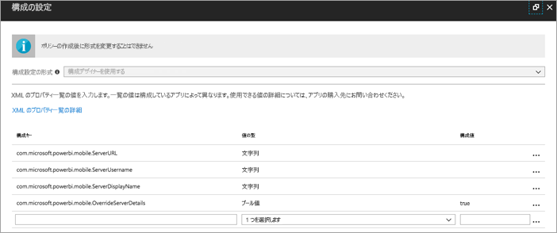
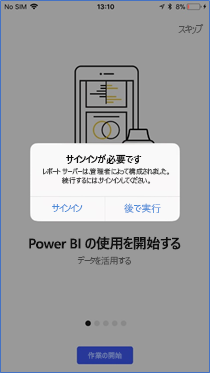
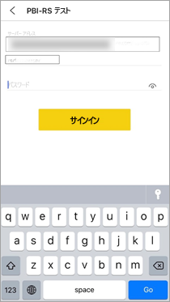

# リモートでレポート サーバーへの Power BI iOS モバイル アプリのアクセスを構成する

この記事では、組織の MDM ツールを使用して、レポート サーバーへの Power BI iOS モバイル アプリのアクセスを構成する方法について説明します。 これを設定するために、IT 管理者は、アプリにプッシュする必要な情報でアプリ構成ポリシーを作成します。 

 レポート サーバー接続が既に構成されているため、Power BI iOS モバイル アプリのユーザーは組織のレポート サーバーにより簡単に接続できます。 

## MDM ツールでアプリ構成ポリシーを作成する 

管理者として、Microsoft Intune でアプリ構成ポリシーを作成するために従う手順を以下に示します。 他の MDM ツールでは、アプリ構成ポリシーの作成の手順とエクスペリエンスが異なる場合があります。 

1. MDM ツールを接続します。 
2. 新しいアプリ構成ポリシーを作成して名前を付けます。 
3. このアプリ構成ポリシーを配布するユーザーを選択します。 
4. キーと値のペアを作成します。 

次の表でペアについて詳しく説明します。

|キー  |種類  |説明  |
|---------|---------|---------|
| com.microsoft.powerbi.mobile.ServerURL | 文字列 | レポート サーバー URL   先頭は http/https である必要があります |
| com.microsoft.powerbi.mobile.ServerUsername | 文字列 | (省略可能)   サーバーの接続に使用するユーザー名。   存在しない場合、アプリで、ユーザーに接続用のユーザー名の入力を求めるメッセージが表示されます。| 
| com.microsoft.powerbi.mobile.ServerDisplayName | 文字列 | (省略可能)   既定値は "Report server" です   サーバーを表すためにアプリで使用されるフレンドリ名 | 
| com.microsoft.powerbi.mobile.OverrideServerDetails | ブール値 | 既定値は True です  “True” に設定されている場合、モバイル デバイスに既にあるレポート サーバーのすべての定義がオーバーライドされます。 既に構成されているサーバーは、削除されます。   また、オーバーライドを True に設定すると、ユーザーはその構成を削除できなくなります。   "False" に設定すると、既存の設定はそのままで、プッシュされた値が追加されます。   同じサーバー URL がモバイル アプリに既に構成されている場合、アプリはその構成をそのままにします。 アプリは、同じサーバーへの再認証をユーザーに求めません。 |

Intune を使用して構成ポリシーを設定する例を以下に示します。

## レポート サーバーに接続しているエンドユーザー

 配布リスト用にアプリの構成ポリシーを発行したとします。 その配布リストのユーザーとデバイスが iOS モバイル アプリを起動した場合、次のようなエクスペリエンスがあります。 

1. レポート サーバーでモバイル アプリが構成されていることを示すメッセージを確認し、**[サインイン]** をタップします。

    

2.  **[サーバーに接続]** ページには、レポート サーバーの詳細が既に入力されています。 **[接続]** をタップします。

    

3. 認証するためのパスワードを入力してから **[サインイン]** をタップします。 

    

これで、レポート サーバーに格納されている KPI および Power BI レポートを表示して操作できるようになりました。

## 次の手順
[管理者の概要](admin-handbook-overview.md)  
[Power BI レポート サーバーのインストール](install-report-server.md)  

他にわからないことがある場合は、 [Power BI コミュニティで質問してみてください](https://community.powerbi.com/)。

