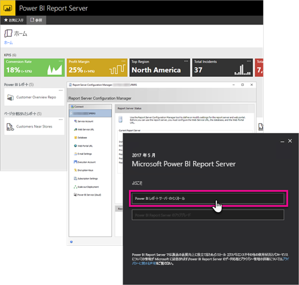

# 開発者向けハンドブックの概要、Power BI レポート サーバー
Power BI レポート サーバーの開発者向けハンドブックへようこそ。Power BI レポート サーバーは、Power BI レポート、モバイル レポート、およびページ分割されたレポートを格納および管理するためのオンプレミスの場所です。

このハンドブックでは、開発者として Power BI レポート サーバーを使用するためのオプションについて主に説明します。

## 埋め込み
クエリ文字列パラメーター `?rs:Embed=true` を URL に追加することで、Power BI レポート サーバー内の任意のレポートを iFrame 内に埋め込むことができます。 これは、Power BI レポートと、その他のレポートの種類でも機能します。

### レポート ビューアー コントロール
ページ分割されたレポートには、レポート ビューアー コントロールが利用できます。 これにより、.NET Windows 内または Web アプリケーション内にコントロールを配置できます。 詳細については、「[Get started with the Report Viewer Control](https://docs.microsoft.com/sql/reporting-services/application-integration/integrating-reporting-services-using-reportviewer-controls-get-started)」 (レポート ビューアー コントロールを使ってみる) を参照してください。

## API
Power BI レポート サーバーと対話する複数の API オプションがあります。 これには次のものが含まれます。

* [REST API](rest-api.md)
* [URL アクセス](https://docs.microsoft.com/sql/reporting-services/url-access-ssrs)
* [WMI プロバイダー](https://docs.microsoft.com/sql/reporting-services/wmi-provider-library-reference/reporting-services-wmi-provider-library-reference-ssrs)

オープン ソースの [PowerShell ユーティリティ](https://github.com/Microsoft/ReportingServicesTools)を使用してレポート サーバーを管理することもできます。

> [!NOTE]
> 現在、PowerShell ユーティリティでは、Power BI Desktop ファイル (.pbix) をサポートしていません。
> 
> 

## カスタム拡張機能
拡張ライブラリは、Power BI レポート サーバーに含まれるクラス、インターフェイス、および値型のセットです。 このライブラリは、システム機能へのアクセスを提供し、Microsoft .NET Framework アプリケーションを使用して Power BI レポート サーバー コンポーネントを拡張するための基盤となるように設計されています。

構築可能な拡張機能には複数の種類があります。

* データ処理拡張機能
* 配信拡張機能
* ページ分割されたレポートの表示拡張機能
* セキュリティ拡張機能

拡張ライブラリの詳細については、[こちら](https://docs.microsoft.com/sql/reporting-services/extensions/reporting-services-extension-library)を参照してください。

## 次の手順
[レポート ビューアー コントロールを使ってみる](https://docs.microsoft.com/sql/reporting-services/application-integration/integrating-reporting-services-using-reportviewer-controls-get-started)  
[Web サービスと .NET Framework を使用してアプリケーションを構築する](https://docs.microsoft.com/sql/reporting-services/report-server-web-service/net-framework/building-applications-using-the-web-service-and-the-net-framework)  
[URL アクセス](https://docs.microsoft.com/sql/reporting-services/url-access-ssrs)  
[拡張ライブラリ](https://docs.microsoft.com/sql/reporting-services/extensions/reporting-services-extension-library)  
[WMI プロバイダー](https://docs.microsoft.com/sql/reporting-services/wmi-provider-library-reference/reporting-services-wmi-provider-library-reference-ssrs)

他にわからないことがある場合は、 [Power BI コミュニティで質問してみてください](https://community.powerbi.com/)。

