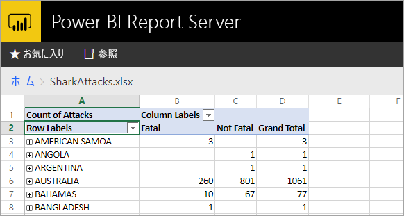
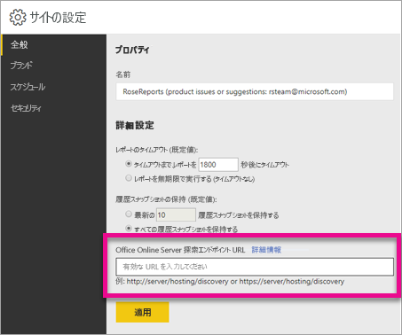

# <a name="configure-your-report-server-to-host-excel-workbooks-using-office-online-server-oos"></a>Office Online Server (OOS) を利用し、Excel ブックをホストするようにレポート サーバーを構成する
Web ポータルで Power BI レポートを表示することに加え、Power BI Report Server は [Office Online Server](https://docs.microsoft.com/officeonlineserver/office-online-server-overview) (OOS) を使用して Excel ブックをホストすることができます。 レポート サーバーで一元的に、セルフサービスの Microsoft BI コンテンツの公開と表示を行うことができます。



## <a name="prepare-server-to-run-office-online-server"></a>Office Online Server を実行するサーバーを用意する
Office Online Server を実行するサーバーで以下の手順を実行します。 このサーバーは、Windows Server 2012 R2 または Windows Server 2016 である必要があります。 Windows Server 2016 には、2017 年 4 月以降の Office Online Server が必要です。

### <a name="install-prerequisite-software-for-office-online-server"></a>Office Online Server の前提条件ソフトウェアをインストールする
1. Windows PowerShell プロンプトを管理者として開き、このコマンドを実行し、必須のロールとサービスをインストールします。
   
    **Windows Server 2012 R2:**
   
    ```
    Add-WindowsFeature Web-Server,Web-Mgmt-Tools,Web-Mgmt-Console,Web-WebServer,Web-Common-Http,Web-Default-Doc,Web-Static-Content,Web-Performance,Web-Stat-Compression,Web-Dyn-Compression,Web-Security,Web-Filtering,Web-Windows-Auth,Web-App-Dev,Web-Net-Ext45,Web-Asp-Net45,Web-ISAPI-Ext,Web-ISAPI-Filter,Web-Includes,InkandHandwritingServices,NET-Framework-Features,NET-Framework-Core,NET-HTTP-Activation,NET-Non-HTTP-Activ,NET-WCF-HTTP-Activation45,Windows-Identity-Foundation,Server-Media-Foundation
    ```
   
    **Windows Server 2016:**
   
    ```
    Add-WindowsFeature Web-Server,Web-Mgmt-Tools,Web-Mgmt-Console,Web-WebServer,Web-Common-Http,Web-Default-Doc,Web-Static-Content,Web-Performance,Web-Stat-Compression,Web-Dyn-Compression,Web-Security,Web-Filtering,Web-Windows-Auth,Web-App-Dev,Web-Net-Ext45,Web-Asp-Net45,Web-ISAPI-Ext,Web-ISAPI-Filter,Web-Includes,NET-Framework-Features,NET-Framework-45-Features,NET-Framework-Core,NET-Framework-45-Core,NET-HTTP-Activation,NET-Non-HTTP-Activ,NET-WCF-HTTP-Activation45,Windows-Identity-Foundation,Server-Media-Foundation
    ```
   
    サーバーの再起動を求められたら再起動します。
2. 次のソフトウェアをインストールします。
   
   * [.NET Framework 4.5.2](https://go.microsoft.com/fwlink/p/?LinkId=510096)
   * [Visual Studio 2013 向け Visual C++ 再頒布可能パッケージ](https://www.microsoft.com/download/details.aspx?id=40784)
   * [Visual Studio 2015 の Visual C++ 再頒布可能パッケージ](https://go.microsoft.com/fwlink/p/?LinkId=620071)
   * [Microsoft.IdentityModel.Extention.dll](https://go.microsoft.com/fwlink/p/?LinkId=620072)

### <a name="install-office-online-server"></a>Office Online Server をインストールする
外部データ アクセスを活用する Excel Online 機能を使用する場合 (Power Pivot など)、そのユーザーや、Windows ベースの認証でアクセスする予定の外部データ ソースと同じ Active Directory フォレストに Office Online Server を置く必要があります。

1. [ボリューム ライセンス サービス センター (VLSC)](http://go.microsoft.com/fwlink/p/?LinkId=256561) から Office Online Server をダウンロードします。 ダウンロードは、VLSC ポータルの Office 製品の下にあります。 開発目的の場合、MSDN サブスクライバー ダウンロードから OOS をダウンロードできます。
2. Setup.exe を実行します。
3. **[マイクロソフト ソフトウェア ライセンス条項をお読みください]** ページで、**[「マイクロソフト ソフトウェア ライセンス条項」に同意します]** を選択し、**[続行]** を選択します。
4. **[ファイルの場所を選択してください]** ページで、Office Online Server ファイルをインストールするフォルダーを選択し (例: *C:\Program Files\Microsoft Office Web Apps*)、**[今すぐインストール]** を選択します。 指定したフォルダーが存在しない場合、自動的に作成されます。
   
    Office Online Server はシステム ドライブにインストールすることが推奨されます。
5. Office Online Server のインストールが完了したら、**[閉じる]** を選択します。

### <a name="install-language-packs-for-office-web-apps-server-optional"></a>Office Web Apps Server の言語パックをインストールする (任意)
Office Online Server 言語パックを利用すれば、Web ベースの Office ファイルを複数の言語で表示できます。

言語パックをインストールするには、次の手順を実行します。

1. [Microsoft ダウンロード センター](http://go.microsoft.com/fwlink/p/?LinkId=798136)から Office Online Server 言語パックをダウンロードします。
2. **wacserverlanguagepack.exe** を実行します。
3. Office Online Server 言語パック ウィザードの **[マイクロソフト ソフトウェア ライセンス条項をお読みください]** ページで、**[「マイクロソフト ソフトウェア ライセンス条項」に同意します]** を選択し、**[続行]** を選択します。
4. Office Online Server のインストールが完了したら、**[閉じる]** を選択します。

## <a name="deploy-office-online-server"></a>Office Online Server を展開する
### <a name="create-the-office-online-server-farm-https"></a>Office Online Server ファーム (HTTPS) を作成する
次の例のように、New-OfficeWebAppsFarm コマンドを使用し、1 台のサーバーから構成される Office Online Server ファームを新規作成します。

```
New-OfficeWebAppsFarm -InternalUrl "https://server.contoso.com" -ExternalUrl "https://wacweb01.contoso.com" -CertificateName "OfficeWebApps Certificate"
```

**パラメーター**

* **–InternalURL** は、Office Online Server を実行するサーバーの完全修飾ドメイン名 (FQDN) です。たとえば、http://servername.contoso.com のようになります。
* **–ExternalURL** は、インターネットでアクセスできる FQDN です。
* **–CertificateName** は、証明書のフレンドリ名です。

### <a name="create-the-office-online-server-farm-http"></a>Office Online Server ファーム (HTTP) を作成する
次の例のように、New-OfficeWebAppsFarm コマンドを使用し、1 台のサーバーから構成される Office Online Server ファームを新規作成します。

```
New-OfficeWebAppsFarm -InternalURL "http://servername" -AllowHttp
```

**パラメーター**

* **–InternalURL** は、Office Online Server を実行するサーバーの名前です。たとえば、http://servername のようになります。
* **–AllowHttp** は、HTTP を使用するようにファームを構成します。

### <a name="verify-that-the-office-online-server-farm-was-created-successfully"></a>Office Online Server ファームが作成されたことを確認する
ファームが作成されると、ファームに関する詳細が Windows PowerShell プロンプトに表示されます。 Office Online Server がインストールされ、正しく構成されていることを確認するには、次の例のように、Web ブラウザーを利用し、Office Online Server 検出 URL にアクセスします。 検出 URL は、Office Online Server ファームを構成したときに指定した *InternalUrl* パラメーターです。たとえば、*/hosting/discovery* などが後ろに続きます。

```
<InternalUrl>/hosting/discovery
```

Office Online Server が正常に動作すると、Web ブラウザーに Web Application Open Platform Interface Protocol (WOPI) 検出 XML ファイルが表示されます。 そのファイルの最初の数行は次のようになります。

```
<?xml version="1.0" encoding="utf-8" ?> 
- <wopi-discovery>
- <net-zone name="internal-http">
- <app name="Excel" favIconUrl="<InternalUrl>/x/_layouts/images/FavIcon_Excel.ico" checkLicense="true">
<action name="view" ext="ods" default="true" urlsrc="<InternalUrl>/x/_layouts/xlviewerinternal.aspx?<ui=UI_LLCC&><rs=DC_LLCC&>" /> 
<action name="view" ext="xls" default="true" urlsrc="<InternalUrl>/x/_layouts/xlviewerinternal.aspx?<ui=UI_LLCC&><rs=DC_LLCC&>" /> 
<action name="view" ext="xlsb" default="true" urlsrc="<InternalUrl>/x/_layouts/xlviewerinternal.aspx?<ui=UI_LLCC&><rs=DC_LLCC&>" /> 
<action name="view" ext="xlsm" default="true" urlsrc="<InternalUrl>/x/_layouts/xlviewerinternal.aspx?<ui=UI_LLCC&><rs=DC_LLCC&>" /> 
```

### <a name="configure-excel-workbook-maximum-size"></a>Excel ブックの最大サイズを構成する
Power BI Report Server では、すべてのファイルにおいて、最大ファイル サイズは 100 MB となります。 それとの同期を維持するには、OOS でこれを手動設定する必要があります。

```
Set-OfficeWebAppsFarm -ExcelWorkbookSizeMax 100
```

## <a name="using-effectiveusername-with-analysis-services"></a>Analysis Services で EffectiveUserName を使用する
Analysis Services にライブ接続するには、Excel ブック内の接続で EffectiveUserName を利用します。 OOS で EffectiveUserName を利用するには、Analysis Services インスタンスの管理者として OOS サーバーのコンピューター アカウントを追加する必要があります。 これを行うには、Management Studio for SQL Server 2016 以降が必要です。

現在のところ、埋め込み Analysis Services 接続のみが Excel ブック内でサポートされています。 ユーザーのアカウントには、Analysis Services に接続するためのアクセス許可を与える必要があります。ユーザーはプロキシ機能を利用できないためです。

OOS サーバーで次の PowerShell コマンドを実行します。

```
Set-OfficeWebAppsFarm -ExcelUseEffectiveUserName:$true
Set-OfficeWebAppsFarm -ExcelAllowExternalData:$true
Set-OfficeWebAppsFarm -ExcelWarnOnDataRefresh:$false
```

## <a name="configure-a-power-pivot-instance-for-data-models"></a>データ モデルの Power Pivot インスタンスを構成する
Analysis Services Power Pivot モード インスタンスをインストールすると、Power Pivot を使用している Excel ブックを操作できます。 インスタンス名が *POWERPIVOT* であることを確認します。 Analysis Services Power Pivot モード インスタンスのために、管理者として OOS サーバーのコンピューター アカウントを追加します。 これを行うには、Management Studio for SQL Server 2016 以降が必要です。

OOS で Power Pivot モード インスタンスを使用するには、次のコマンドを実行します。

```
New-OfficeWebAppsExcelBIServer -ServerId <server_name>\POWERPIVOT
```

外部データをまだ許可していない場合、上記の Analysis Services 手順から、次のコマンドを実行します。

```
Set-OfficeWebAppsFarm -ExcelAllowExternalData:$true
```

### <a name="firewall-considerations"></a>ファイアウォールに関する考慮事項
ファイアウォールの問題を回避するために、ポート 2382 とポート 2383 を開く必要があります。 また、Power Pivot インスタンスのために、アプリケーション ファイアウォール ポリシーとして、*msmdsrv.exe* を追加できます。

## <a name="configure-power-bi-report-server-to-use-the-oos-server"></a>OOS サーバーを使用するように Power BI Report Server を構成する
**[サイト設定]** の **[全般]** ページで、OOS 検出 URL を入力します。 OOS 検出 URL は OOS サーバーの展開時に使用された *InternalUrl* であり、後ろに */hosting/discovery* が続きます。 たとえば、HTTP の場合、`http://servername/hosting/discovery` のようになります。 HTTPS の場合は、`https://server.contoso.com/hosting/discovery` のようになります。

**[サイト設定]** に移動するには、右上にある**歯車アイコン**を選択し、**[サイト設定]** を選択します。

**システム管理者**ロールを持つユーザーだけに Office Online Server 検出 URL 設定が表示されます。



検出 URL を入力したら、**[適用]** を選択します。Web ポータル内で Excel ブックを選択すると、Web 内でブックが表示されるはずです。

## <a name="limitations-and-considerations"></a>制限事項と考慮事項
* Power BI Report Server 内で Excel ブックを表示する機能は現在、プレビュー段階です。
* ブックの閲覧のみが許可されます。

## <a name="next-steps"></a>次の手順
[管理者の概要](admin-handbook-overview.md)  
[Power BI レポート サーバーのインストール](install-report-server.md)  
[レポート ビルダーをインストールする](https://docs.microsoft.com/sql/reporting-services/install-windows/install-report-builder)  
[SQL Server Data Tools (SSDT) のダウンロード](http://go.microsoft.com/fwlink/?LinkID=616714)

他にわからないことがある場合は、 [Power BI コミュニティで質問してみてください](https://community.powerbi.com/)。

