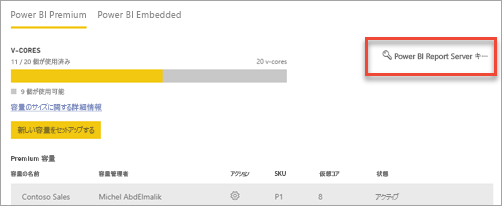
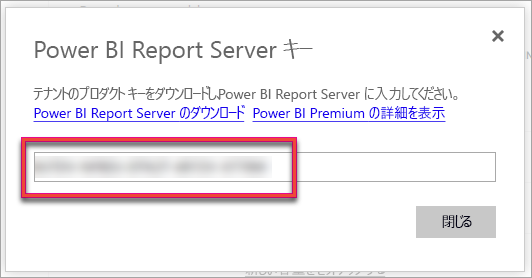
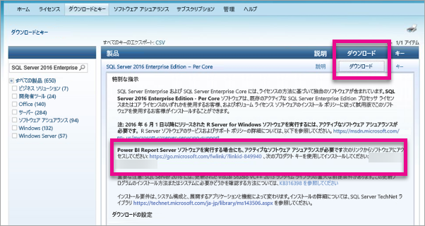

# How to find your report server product key (レポート サーバーのプロダクト キーを検索する方法)
運用環境にインストールするのに必要な Power BI レポート サーバー プロダクト キーの検索方法について説明します。

<iframe width="640" height="360" src="https://www.youtube.com/embed/6CQnf-NGtpU?rel=0&amp;showinfo=0" frameborder="0" allowfullscreen></iframe>

Power BI Report Server をダウンロードして、SQL Server Enterprise Software Assurance 契約を結ぶことも、 Power BI Premium を購入することもできます。 運用環境へのサーバーのインストールを希望する場合は、プロダクト キーが必要です。 プロダクト キーはどこにありますか? 

プロダクト キーは 2 つの場所のいずれかに置かれ、何を購入したかで決まります。

## Power BI Premium を購入した場合
Power BI Premium を購入した場合は、Power BI 管理者ポータルの **[容量の設定]** タブで、Power BI Report Server のプロダクト キーにアクセスできます。 これが可能なのは、グローバル管理者、または Power BI サービス管理者ロールが割り当てられているユーザーのみです。

**[Power BI Report Server キー]** を選択すると、プロダクト キーを含むダイアログが表示されます。 これをコピーして、インストールで使用することができます。

## Software Assurance 契約を購入した場合
SQL Server Enterprise SA 契約がある場合は、[ボリューム ライセンス サービス センター](https://www.microsoft.com/Licensing/servicecenter/)からプロダクト キーを取得できます。 SQL Server の最新バージョンについては、最新のサービス パックを確認してください。 表示されない場合は、最新の SQL Server バージョンの RTM リリースを確認してください。

> [!NOTE]
> ダウンロード セクションを確認する必要があります。 キー セクションではありません。
> 
> 

## 次の手順
[Power BI レポート サーバーのインストール](install-report-server.md)  
[Power BI レポート サーバー向けに最適化された Power BI Desktop のインストール](install-powerbi-desktop.md)  
[レポート ビルダーをインストールする](https://docs.microsoft.com/sql/reporting-services/install-windows/install-report-builder)  
[SQL Server Data Tools (SSDT) のダウンロード](http://go.microsoft.com/fwlink/?LinkID=616714)

他にわからないことがある場合は、 [Power BI コミュニティで質問してみてください](https://community.powerbi.com/)。

