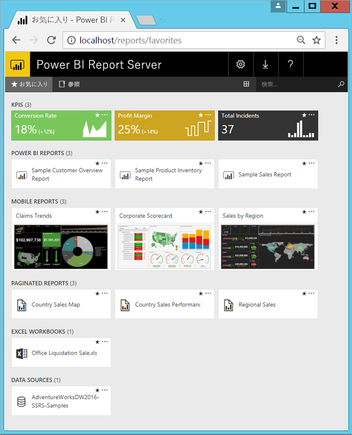

# Power BI Report Server とは

Power BI Report Server は Web ポータルのあるオンプレミス レポート サーバーです。その Web ポータルでレポートや KPI を表示し、管理します。 Power BI レポート、ページ分割されたレポート、モバイル レポート、KPI を作成するためのツールを備えています。 ユーザーは、さまざまな方法でレポートにアクセスできます。Web ブラウザーやモバイル デバイスで表示したり、受信ボックスのメールとして表示したりすることができます。

## Power BI Report Server の比較 
Power BI Report Server は、SQL Server Reporting Services と Power BI オンライン サービスの両方に似ていますが、さまざまな相違点があります。 Power BI Report Server は、Power BI サービスのように Power BI レポートをホスト (します。PBIX) Excel ファイル、およびページ分割されたレポート (します。RDL)。 Reporting Services と同様には、Power BI Report Server は、オンプレミスでは。 Power BI Report Server の機能は Reporting Services のスーパー セット: Reporting Services で実行できるすべてで実行できる Power BI Report Server では、サポートと共に Power BI のレポート。 詳細については、「[Comparing Power BI Report Server and the Power BI service](compare-report-server-service.md)」(Power BI Report Server と Power BI サービスの比較) を参照してください。

## Power BI Report Server のライセンス
Power BI Report Server は、次の 2 種類のライセンスによって利用できます:[Power BI Premium](../service-premium-what-is.md) とソフトウェア アシュアランス付きの [SQL Server Enterprise Edition](https://www.microsoft.com/sql-server/sql-server-2017-editions)。 Power BI Premium ライセンスがあれば、クラウドとオンプレミスを混在させたハイブリッド デプロイを作成できます。  

> [!NOTE]
> Power BI Premium の場合、Power BI Report Server は P SKU のみに含まれます。 EM SKU には含まれません。

## Web ポータル
Power BI Report Server のエントリ ポイントは、最新のブラウザーで表示できる安全な Web ポータルです。 ここで、すべてのレポートと KPI にアクセスします。 Web ポータル上のコンテンツは、従来のフォルダー階層で構成されています。 フォルダーでは、コンテンツは次の種類にグループ化されています:Power BI レポート、モバイル レポート、ページ分割されたレポート、KPI、Excel ブック。 共有データセットと共有データ ソースはそれぞれの専用フォルダーにあり、レポートの構成要素として使用されます。 お気に入りにタグを付けると、1 つのフォルダーで表示されます。 また、KPI は Web ポータルで直接作成します。 

アクセス許可によっては、Web ポータルのコンテンツを管理できます。 レポート処理をスケジュールし、オンデマンドでレポートにアクセスし、発行したレポートにサブスクライブすることができます。 独自のカスタム [ブランド](https://docs.microsoft.com/sql/reporting-services/branding-the-web-portal)を Web ポータルに適用することもできます。 

詳細については、[Power BI Report Server Web ポータル](https://docs.microsoft.com/sql/reporting-services/web-portal-ssrs-native-mode)に関するページを参照してください。

## Power BI レポート
Report Server 用に最適化された Power BI Desktop のバージョンで Power BI レポート (.PBIX) を作成します。 次に、自分の環境の Web ポータルでレポートを発行して表示します。

Power BI レポートは、データ モデルのマルチパースペクティブ表示で、視覚化によってデータ モデルからのさまざまな発見や洞察を表します。  レポートでは、単独の視覚化を使用することも、各ページでさまざまな視覚化を使用することもできます。 ロールによっては、他のユーザーの代わりに、レポートの閲覧やレポートの探索だけでなく、レポートの作成も実行することができます。

について[Microsoft Power BI Desktop をインストールする](install-powerbi-desktop.md)します。

## ページ分割されたレポート
ページ分割されたレポート (.RDL) は、視覚化されたドキュメント スタイルのレポートです。必要に応じてテーブルを水平方向と垂直方向に展開してすべてのデータを表示したり、複数のページにデータを連続表示したりすることができます。 これは、PDF や Word などでの印刷に最適化された固定レイアウトの完璧なピクセルのドキュメントを生成するのに適しています。 

使用して、改ページ調整されたレポートを作成する[レポート ビルダー](https://docs.microsoft.com/sql/reporting-services/report-builder/report-builder-in-sql-server-2016)またはレポート デザイナーで[SQL Server Data Tools (SSDT)](https://docs.microsoft.com/sql/reporting-services/tools/reporting-services-in-sql-server-data-tools-ssdt)します。

## Reporting Services のモバイル レポート
モバイル レポートはオンプレミス データに接続し、さまざまなデバイスとさまざまな保持方法に対応してレイアウトが調整されます。 モバイル レポートは SQL Server Mobile Report Publisher を使用して作成します。

詳細については、[Reporting Services のモバイル レポート](https://docs.microsoft.com/sql/reporting-services/mobile-reports/create-mobile-reports-with-sql-server-mobile-report-publisher)に関するページを参照してください。 

## Report Server のプログラミング機能
Power BI Report Server のプログラミング機能を利用すると、レポートを拡張してカスタマイズしたり、API を使用してデータとレポート処理をカスタム アプリケーションに統合または拡張したりできます。

詳細は、「[Report Server developer documentation](https://docs.microsoft.com/sql/reporting-services/reporting-services-developer-documentation)」 (Report Server の開発者向けドキュメント) をご覧ください。

## 次の手順
[Power BI レポート サーバーのインストール](install-report-server.md)  
[レポート ビルダーのダウンロード](https://www.microsoft.com/download/details.aspx?id=53613)  

他にわからないことがある場合は、 [Power BI コミュニティで質問してみてください](https://community.powerbi.com/)。

