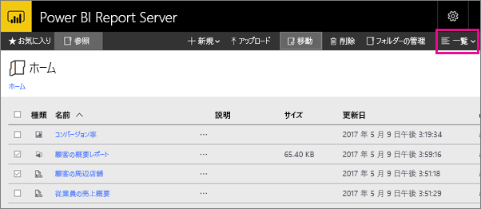

# Power BI Report Server Web ポータルのナビゲーション
Power BI レポート サーバー Web ポータルは、Power BI レポート、モバイル レポート、およびページ分割されたレポート、および KPI を表示、格納、および管理するためのオンプレミスの場所です。

どの最新ブラウザーでも Web ポータルを表示できます。 Web ポータルでは、レポートと KPI がフォルダーに整理されて表示され、それらをお気に入りとしてマークすることができます。 ポータルには Excel ブックを格納することもできます。 Web ポータルからレポートを作成するために必要なツールを起動できます。

* Power BI Desktop で作成された **Power BI レポート**: それらを Web ポータルおよび Power BI モバイル アプリで表示します。
* Report Builder で作成された**ページ分割されたレポート**: 印刷用に最適化された現代的な外観の固定レイアウトのドキュメント。
* **KPI**: Web ポータルで正常に作成されました。

Web ポータルでは、レポート サーバー フォルダーを参照したり、特定のレポートを検索したりできます。 レポートとその全般的なプロパティを表示し、レポート履歴でキャプチャされているレポートの過去のコピーを表示できます。 アクセス許可に応じて、電子メールの受信トレイ フォルダーまたはファイル システム上の共有フォルダーに配信するためのレポートをサブスクライブできる必要もあります。

## Web ポータルのタスク
Web ポータルを使用すると、次のようなさまざまなタスクを実行できます。

* レポートを表示、検索、印刷、およびサブスクライブする。
* フォルダー階層を作成、保護、および管理して、サーバー上のアイテムを整理する。
* レポート実行プロパティ、レポート履歴、およびレポート パラメーターを構成する。
* 共有スケジュールと共有データ ソースを作成し、スケジュールとデータ ソースの接続をより管理しやすくする。
* データ ドリブン サブスクリプションを作成し、大きい受信者一覧にレポートを展開する。
* リンクされたレポートを作成し、さまざまな方法や異なる目的で既存のレポートを再利用する。
* Power BI Desktop (レポート サーバー)、Report Builder、Mobile Report Publisher などの一般的なツールをダウンロードして開く。
* [KPI を作成する](https://docs.microsoft.com/sql/reporting-services/working-with-kpis-in-reporting-services)。
* フィードバックや機能要求を送信する。
* [Web ポータルをブランド化する](https://docs.microsoft.com/sql/reporting-services/branding-the-web-portal)
* [KPI の使用](https://docs.microsoft.com/sql/reporting-services/working-with-kpis-in-reporting-services)
* [共有データセットの操作](https://docs.microsoft.com/sql/reporting-services/work-with-shared-datasets-web-portal)

## Web ポータルのロールとアクセス許可
Web ポータルは、ブラウザーで実行されている Web アプリケーションです。 Web ポータルを起動したときに表示されるページ、リンク、オプションは、レポート サーバー上で持っているアクセス許可によって異なります。 完全なアクセス許可を持つロールに割り当てられた場合は、レポート サーバーを管理するためのアプリケーションのメニューとページの完全なセットにアクセスすることができます。 レポートを表示および実行するアクセス許可を持つロールに割り当てられた場合は、それらのアクティビティに必要なメニューとページのみ表示されます。 異なるロールをさまざまなレポート サーバーに対して割り当てられることもあれば、1 つのレポート サーバー上のさまざまなレポートやフォルダーに対して割り当てられることもあります。

## Web ポータルを起動する
1. Web ブラウザーを開きます。
   
    [サポートされる Web ブラウザーとバージョン](browser-support.md)のリストが表示されます。
2. アドレス バーに、Web ポータルの URL を入力します。
   
    既定の URL は *http://<コンピューター名>/reports* です。
   
    レポート サーバーは、特定のポートを使用するように構成される可能性があります。 たとえば、 *http://<コンピューター名>:80/reports*または*http://<コンピューター名>:8080/reports* のようになります。
   
    Web ポータル グループ項目が以下のカテゴリに分類されます。
   
   * KPI
   * モバイル レポート
   * ページ分割されたレポート
   * Power BI Desktop レポート
   * Excel ブック
   * データセット
   * データ ソース
   * リソース

## Power BI Desktop レポート (.pbix ファイル) を作成および編集する
Web ポータルで Power BI Desktop レポートに対するアクセス許可を表示、アップロード、作成、整理、および管理することができます。

### Power BI Desktop レポートを作成する
1. **[新規]** > **[Power BI レポート]** を選択します。
   
    
   
    Power BI Desktop アプリが開きます。
   
    
2. Power BI レポートを作成します。 詳細については、「[クイックスタート: Power BI レポート](quickstart-create-powerbi-report.md)」を参照してください。
3. レポート サーバーにレポートをアップロードします。

### 既存の Power BI Desktop レポートを編集する
1. レポート タイルの右上にある省略記号 (**…**) を選択し、**[Power BI Desktop で編集する]** を選択します。
   
    
   
    Power BI Desktop アプリが開きます。
2. 変更を行い、保存します。(方法?)

## ページ分割されたレポート (.rdl ファイル) を作成および編集する
Web ポータルでページ分割されたレポートに対するアクセス許可を表示、アップロード、作成、整理、および管理することができます。

### ページ分割されたレポートを作成する
1. **[新規]** > **[ページ分割されたレポート]** を選択します。
   
    レポート ビルダーのアプリケーションが開きます。
   
    
2. ページ分割されたレポートを作成します。 詳細については、「[クイックスタート: ページ分割されたレポート](quickstart-create-paginated-report.md)」を参照してください。
3. レポート サーバーにレポートをアップロードします。

### 既存のページ分割されたレポートを編集する
1. レポートのタイルの右上隅にある省略記号 (...) を選択し、**[レポート ビルダーでの編集]** を選択します。
   
    
   
    レポート ビルダーのアプリケーションが開きます。
2. 変更を行い、保存します。

## 既存の Excel ブックをアップロードおよび整理する
Power BI Desktop レポートおよび Excel ブックに対するアクセス許可をアップロード、整理、および管理することができます。 これらは Web ポータルで一緒にグループ化されます。

ブックは、他のリソース ファイルと同様に Power BI レポート サーバー内に格納されます。 ブックのいずれかを選択すると、ローカルのデスクトップにダウンロードされます。 レポート サーバーに再度アップロードすることで、行った変更を保存することができます。

## Web ポータルで項目を管理する
Power BI レポート サーバーでは、Web ポータルに格納する項目を細かく制御することができます。 たとえば、個々のページ分割されたレポートのサブスクリプション、キャッシュ、スナップショット、およびセキュリティを設定することができます。

1. 項目の右上隅にある省略記号 (...) を選択し、**[管理]** を選択します。
   
    ![[管理] を選択](media/getting-around/report-server-web-portal-manage-ellipsis.png)
2. プロパティまたは設定するその他の機能を選択します。
   
    ![[プロパティ] を選択](media/getting-around/report-server-web-portal-manage-properties.png)
3. **[適用]**を選びます。

[Web ポータルでサブスクリプションの使用](https://docs.microsoft.com/sql/reporting-services/working-with-subscriptions-web-portal)の詳細を参照してください。

## お気に入りのレポートと KPI をタグ付けする
お気に入りに登録するレポートおよび KPI をタグ付けすることができます。 それらはすべて 1 つの [お気に入り] フォルダーに集められるので、Web ポータルと Power BI モバイル アプリの両方で簡単に見つけることができます。 

1. お気に入りに登録する KPI またはモバイル レポートの右上にある省略記号 (**[...]**) を選択して、**[お気に入りに追加]** を選択します。
   
    
2. お気に入りにした KPI やモバイル レポートまたは他のお気に入りを Web ポータルの [お気に入り] ページで表示するには、Web ポータルの **[お気に入り]** を選択します。
   
    ![[お気に入り] を表示](media/getting-around/report-server-web-portal-favorites.png)
   
    これで、Power BI モバイル アプリで、Power BI サービスからのお気に入りのダッシュボードと共にこれらのお気に入りが表示されます。
   
    

## Web ポータルで項目の表示/非表示を切り替える
Web ポータル内の項目を非表示にすることができ、非表示の項目を表示することもできます。

### 項目を非表示にする
1. 項目の右上隅にある省略記号 (...) を選択し、**[管理]** を選択します。
   
    ![[管理] を選択](media/getting-around/report-server-web-portal-manage-ellipsis.png)
2. **[この項目を非表示にする]** を選択します。
   
    ![[非表示] を選択](media/getting-around/report-server-web-portal-hide-property.png)
3. **[適用]**を選びます。

### 非表示の項目を表示する
1. 右上隅の **[タイル]** (または **[リスト]**) を選択し、**[非表示項目の表示]** を選択します。
   
    項目が表示されます。 グレー表示されますが、開いて編集することもできます。
   
    

## 項目を検索する
検索チームを入力すると、アクセスできるすべてのものが表示されます。 結果は、KPI、レポート、データセット、およびその他の項目に分類されます。 結果を操作し、それらをお気に入りに登録することができます。  

## リスト ビューの項目を移動または削除する
規定では、Web ポータルのコンテンツはタイル ビューで表示されます。

リスト ビューに切り替えると、複数の項目を同時に簡単に移動または削除できます。 

1. **[タイル]** > **[リスト]** を選択します。
   
    
2. 項目を選択し、**[移動]** または **[削除]** を選択します。

## 次の手順
[ユーザー向けハンドブック](user-handbook-overview.md)  
[クイックスタート: ページ分割されたレポート](quickstart-create-paginated-report.md)  
[クイックスタート: Power BI レポート](quickstart-create-powerbi-report.md)

他にわからないことがある場合は、 [Power BI コミュニティで質問してみてください](https://community.powerbi.com/)。

